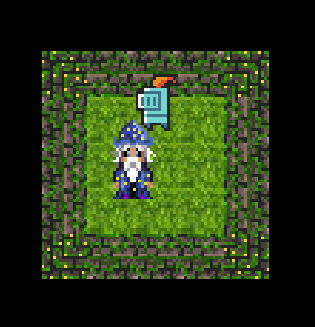
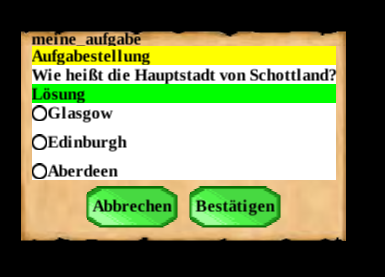

<h1 align="center">Dungeon</h1>

Das Dungeon ist ein mehrdimensionales Projekt zur Gamifizierung von Studieninhalten. 

Mit dem Dungeon-Framework kann Java erlernt werden, indem ein eigenes RPG programmiert wird. 

Im Dungeon-Projekt "Learning by Questing" können klassische Übungsaufgaben in das Spiel geladen und spielerisch gelöst werden. 

Das Blockly-Dungeon richtet sich an komplette Neueinsteiger und dient zur Visualisierung einfacher Algorithmen.

## Dungeon-Framework

Dieses Java-Framework, das auf libGDX basiert, ermöglicht die einfache Entwicklung eines 2D-Rollenspiels im Stil von Rogue. Es eignet sich besonders gut für Programmieranfänger, da es komplexe Aufgaben wie die Generierung von Leveln und das Zeichnen sowie Animieren von Figuren abstrahiert. Dadurch kann sich der Anwender auf die Java-Programmierung konzentrieren.

Das Framework befindet sich im Projekt [`game`](./game).

Die [Dokumentation](./game/doc/) und der [Quickstart](./game/doc/quickstart.md) sollten einen schnellen Einstieg ermöglichen.

## Learning by Questing

Das Framework bietet die Möglichkeit, durch die Integration von Quests zu lernen. Quests sind dabei typische Übungsaufgaben aus dem Studienkontext. Diese Aufgaben werden in einer einfachen, eigenen Sprache definiert, ohne dass die Lehrenden selbst Spielmechaniken programmieren müssen. Das Framework wandelt die definierten Aufgaben automatisch in verschiedene Spielszenarien um und ermöglicht so das Erstellen von individuellen Lernpfaden.

Das Dungeon befindet sich im Projekt [`dungeon`](dungeon).

Die [Dokumentation](dungeon/doc/readme.md) und der [Quickstart](dungeon/doc/quickstart.md) sollten einen schnellen Einstieg ermöglichen.

*   [Starterkit und Demo](https://github.com/Programmiermethoden/Dungeon-StarterKit)

## Low Code: Blockly-Dungeon
Dieser Teil des Projekts nutzt Googles Blockly, um eine grafische Low-Code-Benutzeroberfläche zu generieren. Über eine Webschnittstelle (lokal) kann die Spielfigur im Dungeon gesteuert werden, wodurch auch Anwender ohne tiefgreifende Programmierkenntnisse am Erlebnis teilhaben können.

Das Blockly-Dungeon befindet sich im Projekt [`blockly`](./blockly).
Die [Dokumentation](./blockly/doc) sollte einen schnellen Einstieg ermöglichen.

## Requirements

-   Java SE Development Kit 17.0.x LTS

## Contributing

Questions, bug reports, feature requests and pull requests are very welcome.
Please be sure to read the [contributor guidelines](CONTRIBUTING.md) before
opening a new issue.

## Language

This project is intended as teaching material for German-language university
courses and is therefore aimed at German-speaking students. Please keep in
mind that the English documentation may therefore not be available or may be
slightly out of date. If you have any questions, problems or suggestions, please
feel free to contact us in English or German.

## Credits

This project is funded by [Stiftung für Innovation in der Hochschullehre](https://stiftung-hochschullehre.de)
(["Freiraum 2022"](https://stiftung-hochschullehre.de/foerderung/freiraum2022/)).

The [assets](doc/wiki/assets-im-dungeon.md) in [`game/assets/`](game/assets/) are a mix from free resources:

*   Textures and animations:
    *   https://0x72.itch.io/16x16-dungeon-tileset (CC0 1.0)
    *   https://0x72.itch.io/dungeontileset-ii (CC0 1.0)
*   Music and soundeffects: 
    *   https://alkakrab.itch.io/free-12-tracks-pixel-rpg-game-music-pack (CC0 1.0)
    *   https://opengameart.org/content/50-rpg-sound-effects (CC0 1.0)
    *   https://opengameart.org/content/hurt-death-sound-effect-for-character (CC0 1.0)
    *   https://opengameart.org/content/80-cc0-creture-sfx-2 (CC0 1.0)

---

## License

This [work](https://github.com/Programmiermethoden/Dungeon) by
[André Matutat](https://github.com/AMatutat),
[Malte Reinsch](https://github.com/malt-r),
[Carsten Gips](https://github.com/cagix), and
[contributors](https://github.com/Programmiermethoden/Dungeon/graphs/contributors)
is licensed under [MIT](LICENSE.md).

All files in [`doc/publication/`](doc/publication/) are licensed under [CC BY-SA 4.0](LICENSE-PAPER.md).

All files in [`game/assets/`](game/assets/) are licensed under [CC0 1.0](LICENSE-ASSETS.md).

