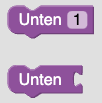
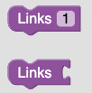
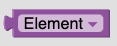
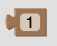
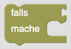
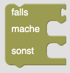

# Blöcke und Funktionen

## Inhaltsverzeichnis

- [Blöcke und Funktionen](#blöcke-und-funktionen)
  - [Inhaltsverzeichnis](#inhaltsverzeichnis)
  - [Kategorien](#kategorien)
    - [Start](#start)
    - [Bewegung](#bewegung)
      - [Oben](#oben)
      - [Unten](#unten)
      - [Links](#links)
      - [Rechts](#rechts)
      - [Variablen Block](#variablen-block)
    - [Variablen erstellen](#variablen-erstellen)
      - [Variablen erstellen "Button"](#variablen-erstellen-button)
      - [setze Variable auf](#setze-variable-auf)
      - [Variablen Nummer](#variablen-nummer)
    - [Schleife](#schleife)
      - [wiederhole x mal](#wiederhole-x-mal)
      - [Schleifen Nummer](#schleifen-nummer)
    - [Bedingung](#bedingung)
      - [boolescher Wert](#boolescher-wert)
      - [nahe Wand](#nahe-wand)
      - [Wand oben](#wand-oben)
      - [Wand unten](#wand-unten)
      - [Wand links](#wand-links)
      - [Wand rechts](#wand-rechts)
      - [falls mache](#falls-mache)
      - [falls mache sonst](#falls-mache-sonst)
    - [Skills](#skills)
      - [Feuerball oben](#feuerball-oben)
      - [Feuerball unten](#feuerball-unten)
      - [Feuerball links](#feuerball-links)
      - [Feuerball rechts](#feuerball-rechts)

## Kategorien

### Start

Der Startblock dient als Einstiegspunkt für das Programm. Alle Blöcke, welche nicht mit dem Startblock verbunden sind, werden ausgegraut und können nicht ausgeführt werden (ausgenommen Variablenzuweisung).

### Bewegung

Die Bewegungsblöcke dienen dazu, den Charakter zu bewegen. Die Bewegung erfolgt immer um die zugewiesene Einheit in die angegebene Richtung.

#### Oben

Bewege den Charakter um die angegebene Einheit nach oben.

#### Unten

Bewege den Charakter um die angegebene Einheit nach unten.

#### Links

Bewege den Charakter um die angegebene Einheit nach links.

#### Rechts

Bewege den Charakter um die angegebene Einheit nach rechts.

#### Variablen Block

Der Variablen Block dient dazu, die Anzahl der Einheiten zu bestimmen, um die der Charakter bewegt werden soll. Die Anzahl der Einheiten wird aus der Variablen ausgelesen, welche dem Block zugewiesen ist. Der Block kann zusätzlich dazu verwendet werden, die Wiederholungen einer Schleife festzulegen.

### Variablen erstellen

#### Variablen erstellen "Button"

Der Variablen erstellen Block dient dazu, eine neue Variable zu erstellen. Der Name der Variable wird im Block angegeben. Er muss eindeutig sein, darf also nicht bereits von einer anderen Variable verwendet werden.

#### setze Variable auf

Der setze Variable auf Block dient dazu, den Wert einer Variable zu ändern. Der Wert wird über einen [Variablen Nummer Block](#variablen-nummer) angegeben. Der Block sollte immer oberhalb des Startblocks platziert werden, um eine korrekte Ausgabe zu gewährleisten.

#### Variablen Nummer

Der Variablen Nummer Block dient dazu, den Wert einer Variable festzulegen.

### Schleife

#### wiederhole x mal

Der wiederhole x-mal Block dient dazu, eine bestimmte Anzahl an Blöcken zu wiederholen. Die Anzahl der Wiederholungen wird im Block mithilfe des [Schleifen Nummer Block](#schleifen-nummer) angegeben.

#### Schleifen Nummer

Der Schleifen Nummer Block dient dazu, die Anzahl der Wiederholungen für den [wiederhole x-mal Block](#wiederhole-x-mal) festzulegen. Er kann ebenfalls dazu genutzt werden, die Anzahl der Bewegungen des Charakters festzulegen.

### Bedingung

#### boolescher Wert

Der boolesche Wert Block dient dazu, einen booleschen Wert festzulegen. Der Wert kann entweder wahr oder falsch sein.

#### nahe Wand

Der nahe Wand Block dient dazu, zu überprüfen, ob der Charakter sich in der Nähe einer Wand befindet. Der Wert kann entweder wahr oder falsch sein.

#### Wand oben

Der Wand oben Block dient dazu, zu überprüfen, ob sich oberhalb des Charakters eine Wand befindet. Der Wert kann entweder wahr oder falsch sein.

#### Wand unten

Der Wand unten Block dient dazu, zu überprüfen, ob sich unterhalb des Charakters eine Wand befindet. Der Wert kann entweder wahr oder falsch sein.

#### Wand links

Der Wand links Block dient dazu, zu überprüfen, ob sich links des Charakters eine Wand befindet. Der Wert kann entweder wahr oder falsch sein.

#### Wand rechts

Der Wand rechts Block dient dazu, zu überprüfen, ob sich rechts des Charakters eine Wand befindet. Der Wert kann entweder wahr oder falsch sein.

#### falls mache

Der falls mache Block dient dazu, einen Block auszuführen, falls der angegebene boolesche Wert wahr ist.

#### falls mache sonst

Der falls mache sonst Block dient dazu, einen Block auszuführen, falls der angegebene boolesche Wert wahr ist. Andernfalls wird der sonst Abschnitt des Blocks ausgeführt.

### Skills

<!-- #### Interagieren

Der Interagieren-Block dient dazu, mit einem Objekt in der nahen Umgebung zu interagieren. Hierbei könnte es sich beispielsweise um eine Truhe oder ein Item handeln. -->

#### Feuerball oben

Der Feuerball oben Block dient dazu, einen Feuerball in die angegebene Richtung zu schießen.

#### Feuerball unten

Der Feuerball unten Block dient dazu, einen Feuerball in die angegebene Richtung zu schießen.

#### Feuerball links

Der Feuerball links Block dient dazu, einen Feuerball in die angegebene Richtung zu schießen.

#### Feuerball rechts

Der Feuerball rechts Block dient dazu, einen Feuerball in die angegebene Richtung zu schießen.
