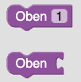

# Blöcke und Funktionen

## Kategorien

### Start

Der Startblock dient als Einstiegspunkt für das Programm. Alle Blöcke, welche nicht mit dem Startblock verbunden sind, werden ausgegraut und können nicht ausgeführt werden.

### Bewegung

Die Bewegungsblöcke dienen dazu, den Charakter zu bewegen. Die Bewegung erfolgt immer um die zugewiesene Einheit in die angegebene Richtung.

#### Oben

Bewege den Charakter um die angegebene Einheit nach oben.

#### Unten

Bewege den Charakter um die angegebene Einheit nach unten.

#### Links

Bewege den Charakter um die angegebene Einheit nach links.

#### Rechts

Bewege den Charakter um die angegebene Einheit nach rechts.

#### Variablen Block

Der Variablen Block dient dazu, die Anzahl der Einheiten zu bestimmen, um die der Charakter bewegt werden soll.
Die Anzahl der Einheiten wird aus der Variablen ausgelesen, welche dem Block zugewiesen ist. Der Block kann zusätzlich
dazu verwendet werden, die Wiederholungen einer Schleife festzulegen.

### Variablen erstellen

#### Variablen erstellen "Button"

Der Variablen erstellen Block dient dazu, eine neue Variable zu erstellen. Der Name der Variable wird im Block angegeben. Er muss eindeutig sein,
darf also nicht bereits von einer anderen Variable verwendet werden. Dieser Button wird außerdem genutzt, um einen Namen für eine Funktion anzulegen.

#### setze Variable auf

Der "setze Variable auf" Block dient dazu, den Wert einer Variable zu ändern. Der Wert wird über einen [Variablen Nummer Block](#variablen-nummer)
angegeben oder es kann eine Expression genutzt werden, um einen berechneten Wert zuzuweisen.

#### Variablen Nummer

Der Variablen Nummer Block dient dazu, den Wert einer Variable festzulegen. Außerdem kann er in einer Expression oder einer booleschen Bedingung verwendet werden.

#### Expressions

Der Expression-Block kann genutzt werden, um einer Variable einen berechneten Wert zuzuweisen. Ein Expression-Block kann nicht verschachtelt werden.

### Arrays

#### Arrays erstellen

Mithilfe des "Array erstellen" Blocks, kann ein neues Array angelegt werden. Dafür muss zuvor eine Variable über den
"Variable erstellen" Button angelegt werden. Anschließend kann die erstellte Variable in dem "Array erstellen" Block
ausgewählt werden. In dem Feld "mit der Größe" kann die Größe des Arrays festgelegt werden. Ein Array hat mindestens
eine Größe von 1 und eine maximale Größe von 10.

#### Arrays modifizieren

Mit dem "Array modifizieren" Block, kann der Wert eines Feldes in einem Array geändert werden. Dazu wird in dem Block der
Variablenname des Arrays ausgewählt.

In dem nächsten Eingabe-Feld kann der Wert definiert werden, welcher in dem Array
gespeichert werden soll. Der Wert kann über einen [Variablen Nummer Block](#variablen-nummer), einen [Expression-Block](#expressions)
oder einen [Variablen-Block](#variablen-block) festgelegt werden.

In dem letzten Eingabe-Feld muss der Index des Array-Feldes eingetragen werden, welches modifiziert
werden soll. Der Index kann über einen [Variablen Nummer Block](#variablen-nummer), einen [Expression-Block](#expressions)
oder einen [Variablen-Block](#variablen-block) festgelegt werden.

#### Zugriff auf Array Felder

Mit dem "Array-Feld auslesen" Block, kann der Wert eines Array-Feldes ausgelesen werden. Dazu wird im ersten Schritt der
Variablenname des Arrays in dem Dropdown ausgewählt. Als Nächstes wird der Index spezifiziert, welcher ausgelesen werden
soll. Der Index kann über einen [Variablen Nummer Block](#variablen-nummer), einen [Expression-Block](#expressions)
oder einen [Variablen-Block](#variablen-block) festgelegt werden.

#### Länge eines Arrays

Mit dem "Array Länge" Block, kann man sich die Länge eines Arrays holen. Dazu muss in dem Dropdown der Variablenname des
Arrays ausgewählt werden.

### Schleifen

#### Zählschleifen - "wiederhole x-mal"

Der wiederhole x-mal Block dient dazu, eine bestimmte Anzahl an Blöcken zu wiederholen. Die Anzahl der Wiederholungen
wird im Block mithilfe des [Schleifen Nummer Block](#schleifen-nummer) oder einem [Variablen-Block](#variablen-block)
angegeben.

Es ist möglich mehrere Zählschleifen zu verschachteln oder If-Abfragen und While-Schleifen innerhalb einer Zählschleife
zu benutzen.

#### Schleifen Nummer

Der Schleifen Nummer Block dient dazu, die Anzahl der Wiederholungen für den [wiederhole x-mal Block](#wiederhole-x-mal)
festzulegen. Er kann ebenfalls dazu genutzt werden, die Anzahl der Bewegungen des Charakters festzulegen.

#### While-Schleifen - "wiederhole solange"

Der While-Schleifen Block kann verwendet werden, um einen Block von Anweisungen auszuführen, solange die Bedingung der
Schleife erfüllt ist. Die Bedingung der Schleife wird über einen Bedingung-Block definiert. Dieser wird als erstes
Eingabe-Feld erwartet, siehe Kapitel [Bedingung](#bedingung). In dem Eingabe-Feld "mache" kann eine Reihe von weiteren
Anweisungen eingefügt werden, welche ausgeführt werden so lange die Bedingung der While-Schleife erfüllt ist.

Es ist möglich mehrere While-Schleifen zu verschachteln oder If-Abfragen und Zählschleifen innerhalb einer
While-Schleife zu benutzen.

### Bedingung

#### boolescher Wert

Der boolesche Wert Block dient dazu, einen booleschen Wert festzulegen. Der Wert kann entweder wahr oder falsch sein.

#### Negation

Der Negation-Block dient dazu, einen booleschen Wert zu invertieren. Aus einem booleschen Block, welcher das Ergebnis
"wahr" liefert wird der Wert "falsch" wenn der Negation-Block verwendet wird und andersherum. Als Eingabe-Feld wird ein
Bedingung-Block erwartet, also einer der Blöcke aus diesem Kapitel.

Es ist möglich mehrere Negation-Blöcke zu verschachteln.

#### Vergleichsoperatoren

Der Vergleichsoperator-Block dient dazu, zwei Zahlen zu vergleichen.
Als Eingabe-Felder werden zwei Zahlen-Werte erwartet, welche entweder über einen [Variablen Nummer Block](#variablen-nummer)
oder einen [Variablen-Block](#variablen-block) definiert werden können. Außerdem kann in einem Dropdown der gewünschte
Vergleichsoperator ausgewählt werden:
- **gleich**: Wenn die beiden Zahlen den gleichen Wert haben, wird der Wert "wahr" zurückgegeben. Andernfalls "falsch".
- **ungleich**: Wenn die beiden Zahlen nicht den gleichen Wert haben, wird der Wert "wahr" zurückgegeben. Andernfalls "falsch".
- **größer**: Wenn die linke Zahl größer als die rechte Zahl ist, wird der Wert "wahr" zurückgegeben. Andernfalls "falsch".
- **größer gleich**: Wenn die linke Zahl größer als die rechte Zahl ist oder die beiden Zahlen den gleichen Wert haben,
wird der Wert "wahr" zurückgegeben. Andernfalls "falsch".
- **kleiner**: Wenn die linke Zahl kleiner als die rechte Zahl ist, wird der Wert "wahr" zurückgegeben. Andernfalls "falsch".
- **kleiner gleich**: Wenn die linke Zahl kleiner als die rechte Zahl ist oder die beiden Zahlen den gleichen Wert
haben, wird der Wert "wahr" zurückgegeben. Andernfalls "falsch".

Es ist möglich mehrere Vergleichsoperator-Blöcke zu verschachteln.

#### Logische Operatoren

Der "Logischer Operator"-Block dient dazu, zu überprüfen, ob entweder zwei boolesche Werte "wahr" sind oder ob mindestens
einer der beiden Werte "wahr" ist. Als Eingabe-Felder werden zwei Bedingung-Blöcke erwartet, es kann also ein beliebiger
Block aus diesem Kapitel verwendet werden. Es stehen die folgenden logischen Operatoren zur Verfügung:
- **und**: Wenn beiden boolesche Werte den Wert "wahr" haben, wird der Wert "wahr" zurückgegeben. Andernfalls "falsch".
- **oder**: Wenn mindestens einer der beiden boolesche Werte den Wert "wahr" hat, wird der Wert "wahr" zurückgegeben.
Andernfalls "falsch".

Es ist möglich mehrere "Logischer Operator"-Blöcke zu verschachteln.

#### nahe Wand

Der "nahe Wand" Block dient dazu, zu überprüfen, ob der Charakter sich in der Nähe einer Wand befindet. Der Wert kann entweder wahr oder falsch sein.

#### Wand oben

Der "Wand oben" Block dient dazu, zu überprüfen, ob sich oberhalb des Charakters eine Wand befindet. Der Wert kann entweder wahr oder falsch sein.

#### Wand unten

Der "Wand unten" Block dient dazu, zu überprüfen, ob sich unterhalb des Charakters eine Wand befindet. Der Wert kann entweder wahr oder falsch sein.

#### Wand links

Der "Wand links" Block dient dazu, zu überprüfen, ob sich links des Charakters eine Wand befindet. Der Wert kann entweder wahr oder falsch sein.

#### Wand rechts

Der "Wand rechts" Block dient dazu, zu überprüfen, ob sich rechts des Charakters eine Wand befindet. Der Wert kann entweder wahr oder falsch sein.

#### If-Abfragen - "falls mache"

Der "falls mache" Block dient dazu, einen Block auszuführen, falls der angegebene boolesche Wert wahr ist. Als erstes
Eingabe-Feld wird einer der obigen Blöcke aus diesem Kapitel erwartet. Dieser Block entspricht der Bedingung der If-Abfrage.
Bei dem nächsten Eingabe-Feld "mache", kann eine Reihe von Anweisungen hinzugefügt werden, welche nur ausgeführt werden,
wenn die Bedingung der If-Abfrage erfüllt ist.

Es ist möglich mehrere If-Abfragen zu verschachteln oder While-Schleifen und Zählschleifen innerhalb einer If-Abfrage
zu benutzen.

#### If-Else-Anweisung - "falls mache sonst"

Der "falls mache sonst" Block dient dazu, einen Block auszuführen, falls der angegebene boolesche Wert wahr ist.
Andernfalls wird der sonst Abschnitt des Blocks ausgeführt.
Als erstes Eingabe-Feld wird einer der obigen Blöcke aus diesem Kapitel erwartet, der "falls mache"-Block ist davon
ausgeschlossen. Der Block an dem Eingabe-Feld "falls" entspricht der Bedingung der If-Else-Anweisung.
Bei dem nächsten Eingabe-Feld "mache", kann eine Reihe von Anweisungen hinzugefügt werden, welche nur ausgeführt werden,
wenn die Bedingung der If-Else-Anweisung erfüllt ist.
Zuletzt können bei dem Eingabe-Feld "sonst" eine Reihe von Anweisungen hinzugefügt werden, welche nur ausgeführt werden,
wenn die Bedingung der If-Else-Anweisung **nicht** erfüllt ist.

Es ist möglich mehrere If-Else-Anweisungen zu verschachteln oder While-Schleifen und Zählschleifen innerhalb einer
If-Else-Anweisung zu benutzen. Es können auch normale If-Abfragen innerhalb einer If-Else-Anweisung verwendet werden.

### Skills

<!-- #### Interagieren

Der Interagieren-Block dient dazu, mit einem Objekt in der nahen Umgebung zu interagieren. Hierbei könnte es sich beispielsweise um eine Truhe oder ein Item handeln. -->

#### Feuerball oben

Der Feuerball oben Block dient dazu, einen Feuerball in die angegebene Richtung zu schießen.

#### Feuerball unten

Der Feuerball unten Block dient dazu, einen Feuerball in die angegebene Richtung zu schießen.

#### Feuerball links

Der Feuerball links Block dient dazu, einen Feuerball in die angegebene Richtung zu schießen.

#### Feuerball rechts

Der Feuerball rechts Block dient dazu, einen Feuerball in die angegebene Richtung zu schießen.

### Funktionen

#### Funktion definieren

Der "Funktion definieren"-Block dient dazu, eine neue Funktion zu definieren. Als erstes Eingabe-Feld muss der
Funktionsname aus einem Dropdown ausgewählt werden. Bei der Erstellung einer neuen Funktion wird automatisch ein
Funktionsname zugewiesen. Entweder kann über das Dropdown einer anderer Name ausgewählt werden, oder der automatisch
erstellte Funktionsname kann in dem Dropdown über den Menüpunkt "Variable umbenennen ..." umbenannt werden. Bei dem
zweiten Eingabe-Feld "mache", kann eine Reihe von Anweisungen hinzugefügt werden, welche ausgeführt werden sollen,
wenn die Funktion aufgerufen wird. Die zugewiesenen Anweisungen werden während der Funktionsdefinition noch **nicht**
ausgeführt.

Es ist möglich in einer Funktionsdefinition While-Schleifen, Zählschleifen und If-Abfragen zu verwenden.

#### Funktion aufrufen

Der "Funktion aufrufen"-Block dient dazu, eine Funktion, welche zuvor definiert wurde, auszuführen. Dabei werden alle
Anweisungen, welche bei dem Eingabe-Feld "mache" des ["Funktion definieren"-Blocks](#funktion-definieren) hinzugefügt
wurden, ausgeführt. Als Eingabe benötigt der "Funktion aufrufen"-Block einen [Variablen-Block](#variablen-block)
erwartet, in dem der passende Funktionsname aus dem Dropdown ausgewählt wurde.
