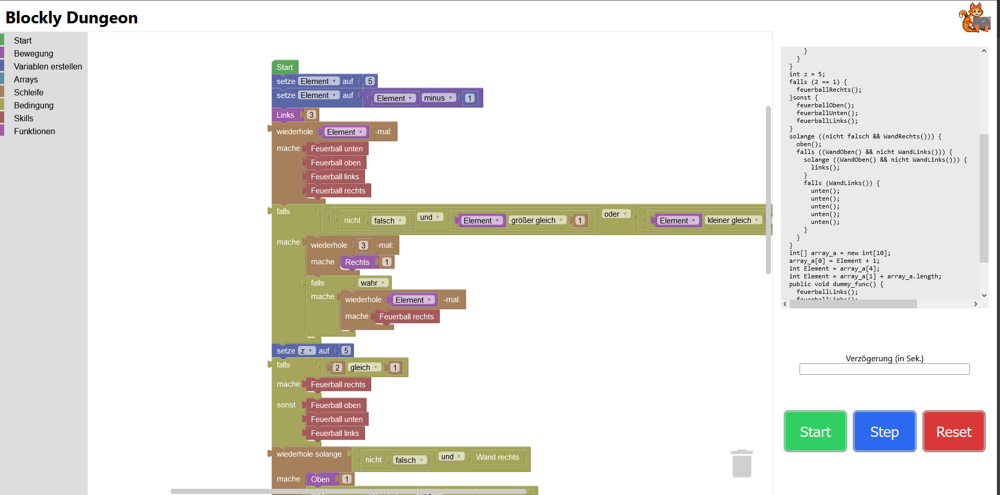

# Verwendung

## Grundlagen

1. **Benutzeroberfläche:** Über einen Webbrowser kann die Applikation aufgerufen werden (`http://localhost:5173/`).
Auf der linken Seite wird die Toolbox mit den Code-Blöcken angezeigt. In der Mitte wird der Programmierbereich dargestellt,
indem die Blöcke platziert werden können und auf der rechten Seite wird der Code angezeigt, der aus den Blöcken generiert wird.
2. **Drag-and-Drop Programmierung:** Ziehen Sie Code-Blöcke aus der Toolbox in den Programmierbereich, um Aktionen festzulegen.
Verbinden Sie die Blöcke in der richtigen Reihenfolge, um die gewünschte Logik zu erstellen.
3. **Aktionen ausführen:** Nachdem die Blöcke platziert wurden, kann durch Drücken des `Start`-Buttons der Code ausgeführt
werden und der `Dungeon-Charakter` wird entsprechend der Logik bewegt. Der `Start`-Button sorgt dafür, dass der gesamte
Programmcode ausgeführt wird. Während der Ausführung wird der aktuell ausgeführte Block hervorgehoben. Außerdem kann
in dem Eingabe-Feld `Verzögerung (in Sek.)` eine Verzögerung nach jedem Schritt mitgegeben werden. Der Wert muss in
Sekunden angegeben werden.
4. **Programm unterbrechen**: Durch Drücken des `Reset`-Buttons wird der `Dungeon-Charakter` an seine Startposition zurückgesetzt. Außerdem wird die
aktuelle Ausführung des Programmcodes unterbrochen.
5. **Programm Schritt-für-Schritt ausführen**: Mithilfe des `Step`-Buttons ist es möglich, das Programm Schritt-für-Schritt
durchzugehen. Es wird immer der aktuell ausgeführte Schritt hervorgehoben.

## Fortgeschrittene Nutzung

1. **Bedingungen und Schleifen:** Damit komplexere Logik erstellt werden kann, können Bedingungen und Schleifen
verwendet werden. Bedingungen werden mit dem `falls-mache`-Block erstellt und Schleifen entweder mit dem
`wiederhole x-mal`-Block oder dem `wiederhole solange`-Block.
2. **Variablen verwenden:** Um Werte zu speichern, können Variablen verwendet werden. Variablen können mit dem
`Variable erstellen`-Button erstellt werden. Der Wert einer Variable kann mit dem `VARIABLEN_NAMEN`-Block abgerufen werden.
3. **Arrays erstellen:** Wenn Sie mehrere Zahlen-Werte in einer Liste speichern möchten, können Sie Arrays verwenden.
Sie können ein Array mit einer Größe von bis zu 10 Feldern erstellen. Die Werte im Array können modifiziert und ausgelesen
werden. Zudem haben Sie die Möglichkeit sich die Länge eines Arrays ausgeben zu lassen.
3. **Funktion verwenden:** Um eine Abfolge von Anweisungen mehrmals wiederverwendung zu können, können Funktionen definiert
werden. Dazu kann der `Funktion definieren`-Block genutzt werden. Eine definierte Funktion kann dann mit dem
`Funktion aufrufen`-Block im Programmcode an verschiedenen Stellen ausgeführt werden.
3. **Fehlerbehebung und Debugging:** Wenn etwas nicht wie erwartet funktioniert, nutzen Sie die Debugging-Tools vom
Webbrowser, um Fehler zu finden. Laufzeitfehler werden in der Form eines Dialogs im Webbrowser angezeigt und die Ausführung
des Programms wird gestoppt, sobald ein Laufzeitfehler auftritt. Mehr Informationen sind im Abschnitt
[Fehlerbehebung](troubleshooting.md) zu finden.
