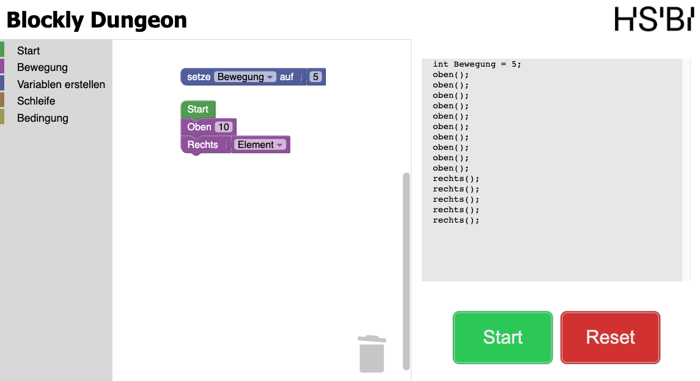
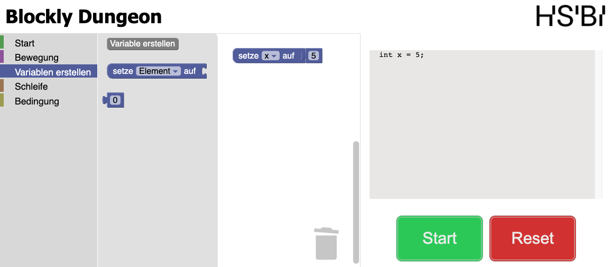
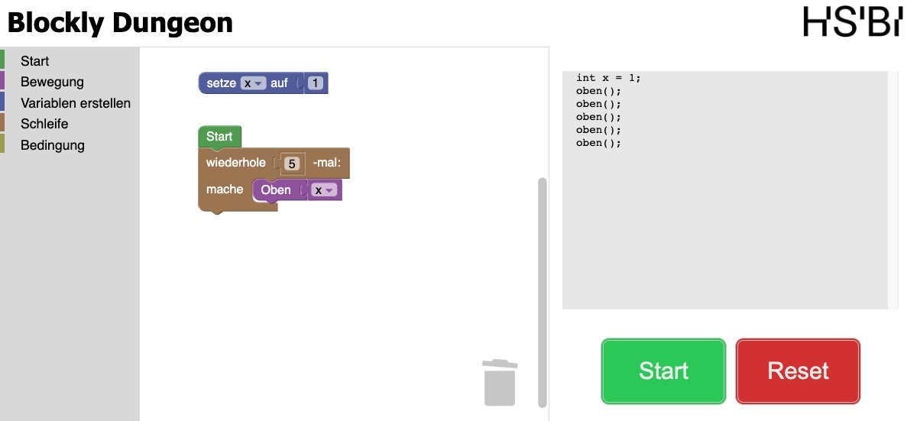
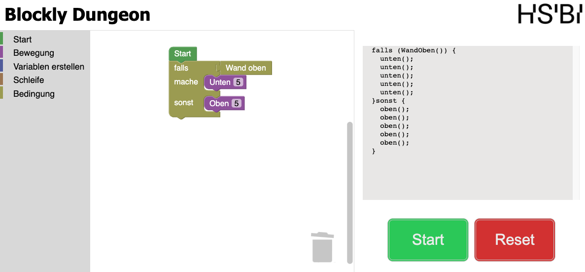
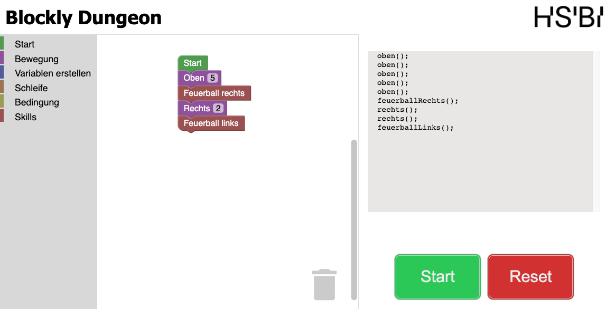
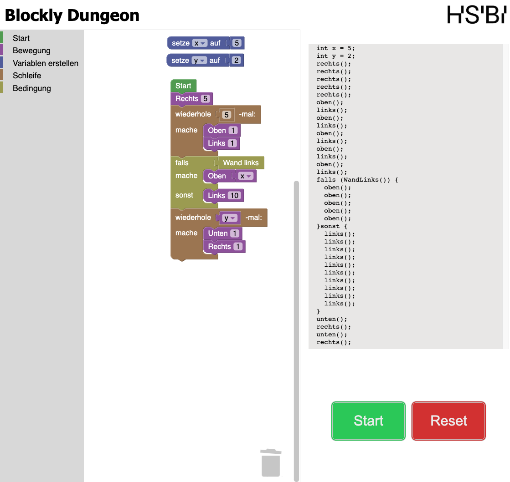

# Beispiele

## Inhaltsverzeichnis

- [Beispiele](#beispiele)
  - [Inhaltsverzeichnis](#inhaltsverzeichnis)
  - [Charakter bewegen](#charakter-bewegen)
  - [Variablen erstellen und zuweisen](#variablen-erstellen-und-zuweisen)
  - [Blöcke durch Verwendung einer Schleife mehrfach ausführen](#blöcke-durch-verwendung-einer-schleife-mehrfach-ausführen)
  - [Bedingungen verwenden](#bedingungen-verwenden)
  - [Charakter Skills verwenden](#charakter-skills-verwenden)
  - [Komplexeres Beispiel](#komplexeres-beispiel)

## Charakter bewegen

Der Charakter lässt sich durch die verschiedenen Blöcke, in der Kategorie `Bewegung`, bewegen. Dafür müssen die Blöcke in der gewünschten Reihenfolge in den Editor gezogen werden. Die Anzahl der Einheiten, die sich ein Charakter bewegt, kann durch die Zahl im Block verändert werden oder durch eine Variable, welche dem Block zugewiesen wird. Die folgende Abbildung zeigt ein Beispiel, indem sich der Charakter um 10 Einheiten nach oben bewegt und anschließend um 5 Einheiten nach rechts. Die Bewegung nach oben wird durch die Zahl 10 im Block festgelegt. Für die Bewegung nach rechts wird eine Variable verwendet, welche den Wert 5 zugewiesen bekommen hat.

## Variablen erstellen und zuweisen

In der Kategorie `Variablen erstellen` können Variablen erstellt werden und ihnen ein Wert zugewiesen werden. Mit einem Klick auf den Button `Variable erstellen` öffnet sich ein Fenster, in dem der Name der Variable festgelegt wird. Anschließend kann mit dem `setze "VARIABLENNAMEN" auf Block` der Variable ein Wert zugewiesen werden. In dem Block können alle zuvor erstellten Variablen über einen Reiter ausgewählt werden. Die folgende Abbildung zeigt ein Beispiel, indem eine Variable mit dem Namen `x` erstellt wird und ihr der Wert 5 zugewiesen wird.

Die Variablen sollten, wenn möglich oberhalb des Startblocks erstellt werden, damit die generierte Codeausgabe übersichtlicher ist. Auswirkungen auf die Ausführung des Programms hat die Position der Variablen nicht.

## Blöcke durch Verwendung einer Schleife mehrfach ausführen

Durch den `wiederhole x -mal: Block` können Blöcke mehrfach ausgeführt werden. Die Anzahl der Wiederholungen kann durch die Zahl im Block verändert werden oder durch eine Variable, welche dem Block zugewiesen wird. Die folgende Abbildung zeigt ein Beispiel, indem sich der Charakter mithilfe einer Schleife 5 Einheiten nach oben bewegt. Die Anzahl der Wiederholungen wird durch die Zahl 5 im Block festgelegt. Für die Bewegung nach oben wird eine Variable verwendet, welche den Wert 1 zugewiesen bekommen hat.

## Bedingungen verwenden

Durch Bedingungen kann der Programmablauf gesteuert werden. Verschiedene Bedingungen wie zum Beispiel das Abfragen, ob sich eine Wand in der Nähe befindet, lassen sich in der Kategorie `Bedingung` finden. Die folgende Abbildung zeigt ein Beispiel, indem sich der Charakter mithilfe einer Bedingung 5 Einheiten nach unten bewegt, wenn sich oberhalb des Charakters eine Wand befindet. Stimmt die Bedingung nicht, bewegt sich der Charakter 5 Einheiten nach oben.

## Charakter Skills verwenden

Die Charakter Skills können in der Kategorie `Skills` gefunden werden. Skills können verwendet werden, um Feuerbälle zu schießen. Die folgende Abbildung zeigt ein Beispiel, indem der Charakter sich 5 Einheiten nach oben bewegt, danach einen Feuerball nach rechts schießt, sich weitere 2 Einheiten nach rechts bewegt und anschließend einen Feuerball nach links schießt.

## Komplexeres Beispiel

Das folgende Beispiel zeigt, wie die zuvor genannten Blöcke kombiniert werden können.

Zuerst werden zwei Variablen x und y erstellt und ihnen die Werte 5 und 2 zugewiesen. Danach wird ein Startblock erstellt, an dem der restliche Programmcode angehängt wird. Der Charakter beginnt damit, sich 5 Einheiten nach rechts zu bewegen. Anschließend wird eine Schleife verwendet, die 5-mal ausgeführt wird. In der Schleife bewegt sich der Charakter 1 Einheit nach oben und 1 Einheit nach links. Nach der Schleife wird eine Bedingung abgefragt, ob sich links vom Charakter eine Wand befindet. Stimmt die Bedingung, bewegt sich der Charakter 5 Einheiten nach oben. Stimmt die Bedingung nicht, bewegt sich der Charakter 10 Einheiten nach links. Danach wird erneut eine Schleife verwendet, die 2-mal ausgeführt wird, diesmal wird für die Anzahl der Durchläufe die Variable y verwendet. In der Schleife bewegt sich der Charakter 1 Einheit nach unten und 1 Einheit nach rechts.

