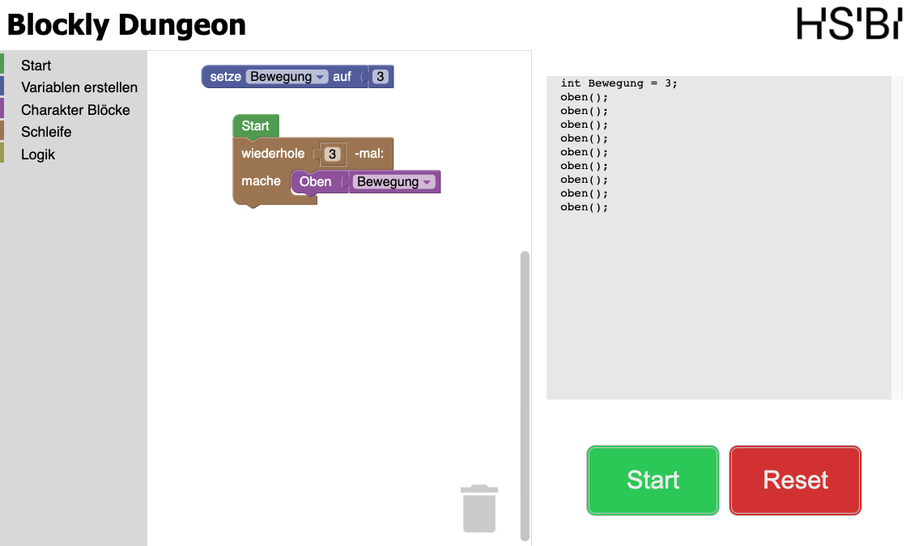

# Verwendung

## Inhaltsverzeichnis

- [Verwendung](#verwendung)
  - [Inhaltsverzeichnis](#inhaltsverzeichnis)
  - [Grundlagen](#grundlagen)
  - [Fortgeschrittene Nutzung](#fortgeschrittene-nutzung)

## Grundlagen

1. **Benutzeroberfläche:** Über einen Webbrowser kann die Applikation aufgerufen werden (`http://localhost:5173/`). Auf der linken Seite wird die Toolbox mit den Code-Blöcken angezeigt. In der Mitte wird der Programmierbereich dargestellt, indem die Blöcke platziert werden können und auf der rechten Seite wird der Code angezeigt, der aus den Blöcken generiert wird.
2. **Drag-and-Drop Programmierung:** Ziehen Sie Code-Blöcke aus der Toolbox in den Programmierbereich, um Aktionen festzulegen. Verbinden Sie die Blöcke in der richtigen Reihenfolge, um die gewünschte Logik zu erstellen.
3. **Aktionen ausführen:** Nachdem die Blöcke platziert wurden, kann durch Drücken des Start-Buttons der Code ausgeführt werden und der `Dungeon-Charakter` wird entsprechend der Logik bewegt. Durch Drücken des Reset-Buttons wird der `Dungeon-Charakter` an seine Startposition zurückgesetzt.

## Fortgeschrittene Nutzung

1. **Bedingungen und Schleifen:** Damit komplexere Logik erstellt werden kann, können Bedingungen und Schleifen verwendet werden. Bedingungen werden mit dem `falls-mache`-Block erstellt und Schleifen mit dem `wiederhole x-mal` Block.
2. **Variablen verwenden:** Um Werte zu speichern, können Variablen verwendet werden. Variablen können mit dem `Variable erstellen`-Button erstellt werden. Der Wert einer Variable kann mit dem `VARIABLEN_NAMEN`-Block abgerufen werden.
3. **Fehlerbehebung und Debugging:** Wenn etwas nicht wie erwartet funktioniert, nutzen Sie die Debugging-Tools vom Webbrowser, um Fehler zu finden. Fehler der Applikation werden in der jeweiligen Konsole des Browsers angezeigt. Mehr Informationen sind im Abschnitt [Fehlerbehebung](troubleshooting.md) zu finden.
