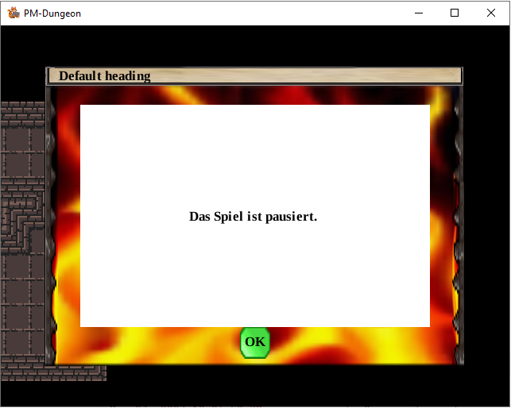
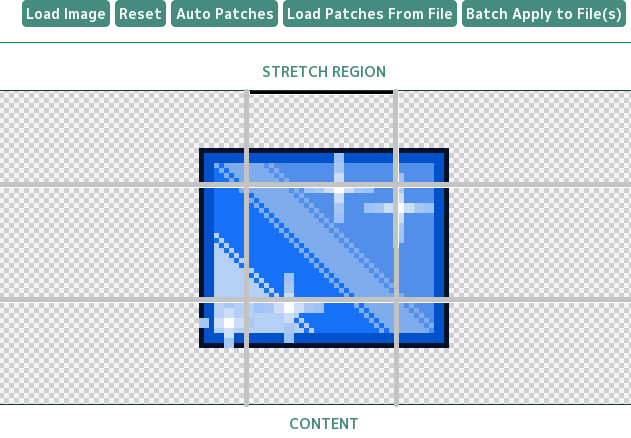
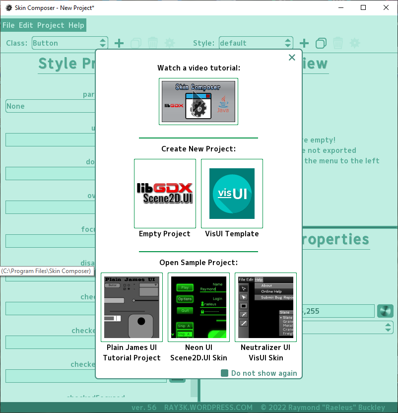
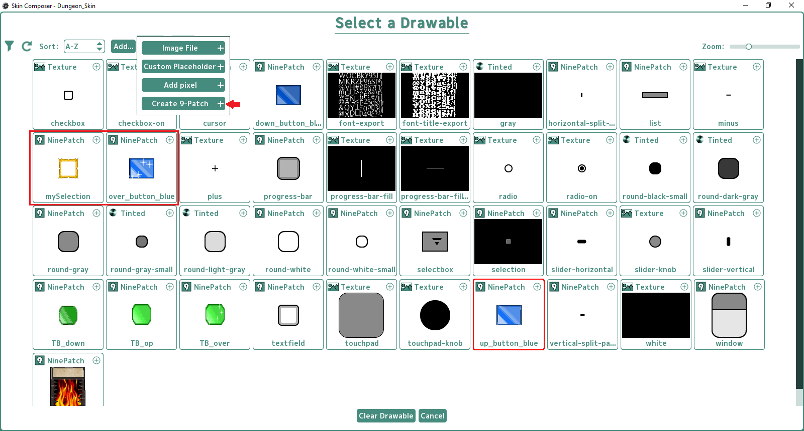

Zur Darstellung der Inhalte für das Spiel wird mithilfe der Widgets aus der `libgdx` und des `scene2d.ui`-Pakets ein Dialog erstellt. Der Dialog wurde dafür erstellt um Inhalte auf dem Spielbildschirm anzeigen zu können, sowie das Spiel und alle seine Systeme, ausgenommen von `DrawSystem` pausieren zu können. Mit dem Klick auf den Button „Ok“ kann das Spiel fortgesetzt werden indem alle Systeme wieder aktiviert werden.



## Wichtige Klassen die verwendet werden

`TextDialog`
Enthällt Constructor, welcher unmittelbar den Dialog inklusive aller seiner Elemente erstellt .

```java
public final class TextDialog extends Dialog {
    protected void result(final Object object) {
        if (object.toString() == btnID) {
            enable = false;
            UITools.deleteDialogue();
        }
    }
}
```

Wenn der einzige Button des Dialoges (z.B „Ok“) gedrückt wird, wird der Dialog vom Stage genommen und alle Systeme neu gestartet. Das Dialog- Objekt wird entsorgt.

`ResponsiveDialogue`
Erstellt ein Dialog- Objekt, formatiert und gibt den Dialog an den `ScreenController` weiter, damit der Dialog auf dem Bildschirm angezeigt werden kann.

```java
public class ResponsiveDialogue<T extends Actor> extends ScreenController<T> {
    private static void generateTextDialogue(String... arrayOfMessages) {
        searchIndexOfResponsiveDialogInController(null);

        if (indexForDialogueInController == -1 && Game.controller != null && Game.systems != null) {
            Game.controller.add(
                    new ResponsiveDialogue(
                            new SpriteBatch(),
                            new Skin(Gdx.files.internal(Constants.SKIN_FOR_DIALOG)),
                            Color.WHITE,
                            arrayOfMessages));

            Game.systems.forEach(ECS_System::stop);
        }
    }
}
```
`UITools`
Formatierung der Hauptmeldung (Inhalt der im Label angezeigt wird) und steuert die Erstellung eines Dialog- Objektes abhängig von einem Ereigniss.
Siehe Funktion:

```java
public class UITools {
    public static void showInfoText(String... arrayOfMessages) {
        formatStringForDialogWindow(arrayOfMessages);
        setDialogIndexInController(-1);
        generateDialogue(arrayOfMessages);
    }
}
```

Der Funktion `showInfoText` kann ein beliebig langer Textinhalt sowie die Benennung für einen Button (optional) und ein Dialog (Dialogtitel) (optional) übergeben werden, sonst erfolgt die Verwendung der Default- Werte.

## Was sind Widgets?

Das scene2d.ui-Paket von libgdx bietet allgemeine Benutzeroberflächen-Widgets und andere Klassen, um Benutzeroberflächen erstellen zu können.
Widgets sind Komponenten, die in ein graphischen Fenstersystems eingebunden sind, welches diese zur Interaktion mit dem Anwender oder anderen Widgets des Fenstersystems nutzen. Dazu zählen zum Beispiel: Dialog, Label, Button, Slider, CheckBox etc.

## Was ist ein Dialog?

Dialog ist ein Fenster mit einer Inhaltstabelle und einer darunter liegenden Schaltflächentabelle. Dem Dialog kann alles hinzugefügt werden, aber es werden bequeme Methoden bereitgestellt, um der Inhaltstabelle eine Beschriftung und der Schaltflächentabelle Schaltflächen hinzuzufügen.
Die Größe und Position der untergeordneten UI-Widgets wird durch das übergeordnete Widget festgelegt.
Bei den meisten scene2d.ui-Layouts wird eine Tabelle verwendet, welche dem Stage entspricht. Alle anderen Widgets werden in den Zeilen einer dieser Tabelle platziert und können so innerhalb des Dialoges an bestimmten Positionen dargestellt werden.

```java
public final class TextDialog extends Dialog {
    public TextDialog(Skin skin, String outputMsg, String buttonMsg, String title) {
        Label labelContent = new Label(outputMsg, skin);
        labelContent.setAlignment(Align.left);
        labelContent.setColor(Color.WHITE);

        Table scrollTable = new Table();
        scrollTable.add(labelContent);
        scrollTable.row();
    }
}
```

## Skin

libGDX besitzt die Klasse `Skins`, diese kann zur Speicherung von Bildressourcen (Texturen, Schriftarten, etc.) verwendet werden, um damit das Aussehen der UI-Elemente definieren zu können. Neben der Bereitstellung der Texturbereiche, welche von den Widgets benötigt werden, können auch UI-Widget-Stile gespeichert werden, die später das Aussehen der Widgets bestimmen können. Die Ressourcen (Farben, Bilder, Schriftart), welche die Widgets benötigen, bezeichnet man als „Stil“. Jedes Widget definiert eine eigene statische Mitgliedsklasse mit Konstruktoren zum setzen von Basis Styles, welche durch die setStyle Methode zur Stilveränderung verwendet werden können.
Zur Darstellung und Formatierung der einzelnen Widgets können auch Skin-Dateien von libGDX verwendet werden.<br>
**ACHTUNG:** Die default- Skins von libGDX können ausschließlich nur zu Testzwecken verwendet werden und dürfen nicht in das Projekt eingefügt werden.<br>
Die Skins können unter folgendem Link gefunden werden.<br>
https://github.com/libgdx/libgdx/tree/master/extensions/gdx-tools/assets
Im Package `assets` gibt es ein Package `skin` dort können folgende Skin Dateien eingefügt werden:
`default.fnt`
Formatierung des Schriftzuges. Durch das Programm `Hiero` können eigene Schriftzüge mit Größe und Art dargestellt werden. Es wird automatisch eine `fnt`-Datei generiert, welche der Struktur der `default.png`entspricht.
`default.png`
Abbildung des Schriftzuges.
`uiskin.png`
Es handelt sich um um eine Vielzahl von Widget Elementen sowie dem verwendeten Schriftzug. Der Vorteil der Kombination all dieser Elemente ist, dass weniger Dateien geladen werden müssen, was die Leistung des Spiels verbessert.
`uiskin.atlas`
Die Atlas-Datei ist ein Mapping aller unserer Bilder, die zusammen in unserem uiskin.png gepackt wurden.
`uiskin.json`
Die JSON-Datei wird verwendet , um eine schnelle und einfache Möglichkeit zu schaffen die Assets zu verwenden ohne, das diese manuell mit den spezifischen Stilen verbunden werden müssen.

In der Klasse `Constants` wird der Pfad der json-Datei angegeben, damit die Widgets entsprechend Dargestellt werden können.

```java
public final class Constants {
    /** set Path to libgdx default Skins */
    public static final String SKIN_FOR_DIALOG = "skin/uiskin.json";
}
```

In der Klasse `UITools` erfolgt die Erstellung des Dialogs welche die Skins aus der `uiskin.json` verwendet. Der Inhalt des Dialoges wird mit weißer Schriftfarbe dargestellt (Text, Button Beschriftungen und Label).


## Was ist ein 9-Patch (auch 9-Slicing)?

Bei dem 9-Patch handelt es sich um ein Bild, welches mit einem 3×3-Gitter in 9 Teile gesplittet wird, welche verwendet werden können, um ein skalierbares Bild zu erstellen.
Durch die Einteilung des Gitters werden dadurch 4 Ecken, 4 Ränder und ein Mittelbild. Die Ecken bleiben dabei Konstant, die Ränder links und rechts werden vertikal gestreckt die Ränder oben und unten können horizontal gestreckt werden. In der mittleren Fläche lässt sich dann der gewünschte Inhalt Darstellen, der durch seine Größe das Element automatisch skaliert,.



Um 9-Patches erstellen zu können, werden einige Editoren wie der ´NinePatchEditor´ oder der Scin Composer von libgdx vorgeschlagen. Hier wurde der ´Scin Composer´ verwendet um die im Spiel verwendeten Skins zu erstellen.

### Welche Möglichkeiten gibt es ein 9-Patch zu erstellen

#### Manuelle Methode

In ´Libgdx´ gibt es die Möglichkeit ein 9-Patch mithilfe der Klasse `NinePatch` zu speichern. Die Klasse nimmt ein Bild sowie vier Ganzzahlige Angaben an, welche die Breite für die linke- und rechte Seite sowie für oben und unten übernehmen soll.
Mit der Angabe dieser Werte ist eine Erstellung eines Objektes mit 9 Feldern möglich.
Das 9-Patch kann dann direkt in die Anwendung geladen werden. Das Bild wird geöffnet und definiert das 9 Patch unter Verwendung der vier Ganzzahlen.
Nachteilig ist, das für jedes GUI-Element, was sich der Größe seines Inhaltes dynamisch anpassen soll, jeweils ein separates Bild in den Code hinzugefügt werden muss, was schnell zu viel Code und der Verlust der Übersichtlichkeit führen kann.

#### Erstelung mithilfe des Skin Composers

Eine bessere und Übersichtliche Methode bietet die Erstellung von Skins mithilfe des `Skin Composer` von Libgdx.
Mit diesem Tool hat man die Möglichkeit eigene Prototypen für ein 2D-Layout zu erstellen und dabei die einzelnen Elemente des neuen Skin direkt testen zu können, bevor er in das eigentliche Spiel implementiert wird. Das Layout wird gespeichert und kann jederzeit beliebig verändert werden.



Der `Skin Composer` bietet schon vordefinierte Elemente, die als Basis für die Erstellung der eigenen Elemente verwendet werden können. Um das aussehen der Widgets zu ändern benötigt man Bilder, sowie einen `Font` (Schriftart), mit der Texte und Überschriften in der jeweiligen GUI dargestellt werden können.



Über die Option `Create 9-Patch` hat man die Möglichkeit ein Bild in das tool zu laden, das Padding als auch den Content bereich festzulegen und die Vorschau für Text, Bild, etc. zu testen um eine Vorstellung zu bekommen, wie das Element dargestellt wird.
Dieser Editor kann JSON- oder Java-Dateien exportieren, die dann direkt im Spiel geladen werden können.
