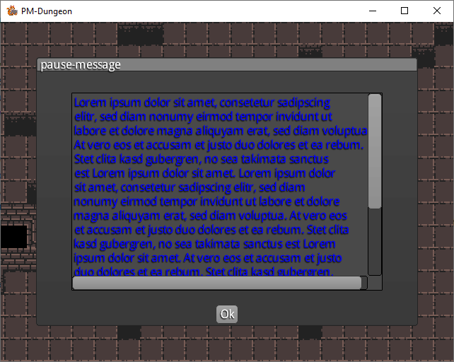

### Formatierung verschiedener Inhalte der Widgets

Die Klasse `UITools` enthällt die Funktion, welche das Dialog-Objekt formatiert und erstellt.
Die Funktion `showInfoText` erhällt `infoMsg` (Inhalt des Textes der im label ausgegeben wird) und
`arrayOfMessages` (weitere Messeges, von denen die erste Beschriftung die des Buttons ist).
```java
public static TextDialog showInfoText(String infoMsg, String... arrayOfMessages )
```
Aus `infoMsg` werden zuerst alle carriage return ASCI-Zeichen entfernt und durch Leerzeichen ersetzt.
Damit die Ausgabe des `infoMsg` passend zum Dialog-Fester ist, soll die neue Satzlänge definiert werden.
Entsprechend dieser Satzlänge werden carriage return ASCI-Zeichen hinzugefügt.
```java
for (String word : words) {
sumLength += word.length();
formatedMsg =  formatedMsg + word + " ";

            if(sumLength > maxRowLength) {
                formatedMsg += "\n";
                sumLength =0;
            }
        }
```
Für die Darstellung des Dialoges und anderer Widget- Elemente werden Skins (siehe Package game -> skin) mit vordefiniertem Ausssehen verwendet.
Es wird ein Dialogfeld erzeugt und entsprechend an die Fensterbreite/ Fensterhöhe und Ausrichtung (center) angepasst.
Zürückgeliefert wird der fertige Dialog.

---------------------------------------------------
Klasse `TextDialog` ist der Bauplan des Dialoges mit einem Label zum ausgeben von Texten, einer waagerechten und senkrechten Scrollbar
sowie einem Button.



Objekte werden entsprechend der dem Constructor übergebenen Parameter erzeugt.
```java
    * @param title Titel des Dialoges
    * @param buttonMsg text für den Button
    * @param skin Skin für den Dialog(Style der Elemente)
    * @param msg Inhalt der im scrollbaren Label dargestellt wird
    * @param flagOutputDefaultMsg ausgabe einer Default message, wenn kein Text zum Ausgeben vorhanden ist*/

public TextDialog(String title, String buttonMsg, Skin skin, String msg, boolean flagOutputDefaultMsg)
```
Damit das Label mit dem Textinhalt die Scroll Bars, sowie der Button korrekt im Dialog platziert werden können, werden Tabellenzeilen verwendet.
Zunächst wird ein Label erzeugt:
```java
Label gamelog = new Label(msg, skin);
        gamelog.setAlignment(Align.left);
        gamelog.setColor(Color.BLUE);
```
der einer Tabellenzeile zugewiesen wird:
```java
Table scrollTable = new Table();
        scrollTable.add(gamelog);
        scrollTable.row();
```
Diese Tabellenzeile wird in den Constructor der `ScrollPane` übergeben:
```java
ScrollPane scroller = new ScrollPane(scrollTable, skin);
        scroller.setFadeScrollBars(false);
        scroller.setScrollbarsVisible(true);
```
Es entsteht eine neue Tabelle, welche den `scroller` als erste Zeile bekommt:
```java
 Table table = new Table();
        table.setFillParent(true);
        table.add(scroller).size(Constants.WINDOW_WIDTH -200, Constants.WINDOW_HEIGHT -200);
        this.addActor(table);
```
als zweite Zeile dieser Tabelle wird ein Button zugewiesen:
```java
button(buttonMsg, "confirm exit" );
```
Wenn der Button des Dialoges getätigt wird wird folgende funktion aufgerufen:
```java
   protected void result(final Object object)
    {
    if( object.toString() == "confirm exit" )
    result = Visibility.NOT_VISIBLE;
    }
```
in dieser Funktion wird geprüft ob die Bezeichnung des gedrückten Buttons mit einer Aktivität übereinstimmt. In
diesem Fall besteht die Aktivität darin, dass ein Marker `NOT_VISIBLE` für die unsichtbarkeit des Dialoges gesetzt wird.
Variable `result` bekommt die Werte aus `enum Visibility`:

```java
public enum Visibility
{
    VISIBLE, NOT_VISIBLE
}
```

------------------------------------
Klasse `PauseMenu` erstellt den Dialog, um das Spiel zu pausieren.
Die Klasse soll als member variable `TextDialog` erhalten (referenz aus TextDialog).
Im Constructor mit der Signatur `public PauseMenu(SpriteBatch batch)` wird zunächst eine Textmeldung und
ein Objekt aus der Klasse UITolls erstellt:
```java
UITools tool = new UITools();
dialog = tool.showInfoText( pauseMsg );
```

Funktion `showInfoText` liefert ein fertigen Textdialog zurück, welcher zunächst als "visible" markiert wird und danach die Sichtbarkeit
aller Dialog-Elemente mit der Funktion `hideMenu()` ausgeschaltet werden.
```java
Funktion public boolean isPaused() {
if(!dialog.getResult())
{
hideMenu();
return false;
}
showMenu();
return true;
}
```
`showMenu()` macht Elemente des Dialoges sichtbar oder `hideMenu()` unsichtbar, abhängig davon ob der Dialog als sichtbar oder unsichtbar markiert ist.

----------------------------------------
### Interakton der beschriebenen Klassen

Die Interaktion zwishen den erwähnten Klassen entsteht in der Klasse `Game.java`.
Die Klasse `Game.java` enthällt eine Referenz auf die Klasse `PauseMenu pauseMenu`. In der Funktion `setup()` wird zunächst ein Objekt des
`pauseMenu = new PauseMenu()` erzeugt, welcher als sichtbar markiert und unsichtbar gemacht wird.
In der Funktion `public void render(float delta)`, welche die Game-Loop beinhaltet, wird `frame()` als Unterfunktion aufgerufen.
In der Funktion `frame()` wird geprüft ob die "Taste P" für Pause gedrückt wurde und abhängig davon erfolgt der Aufruf der Funktion `togglePause()`.
```java
if (Gdx.input.isKeyJustPressed(Input.Keys.P))
togglePause();
```
`togglePause()` schaltet alle Systeme aus und der Dialog wird inklusiv aller seiner Elemente sichtbar.
```java
public static void togglePause() {
    if (systems != null) {
        systems.forEach(ECS_System::notRun);
    }
    if (pauseMenu != null) {
        pauseMenu.isPaused();
    }
}
```
Wird der Button des Dialoges gedrückt erfolgt der Aufruf der `mustBeHidden()` Funktion, dabei werden alle Systeme aktiviert und
das Objekt von PauseMenu neu erzeugt `pauseMenu = new PauseMenu()`.
Neuerzeugung ist notwendig , da der dialog zerstört wird, wenn Button gedrückt wird.
```java
if(pauseMenu.mustBeHidden()) {
if (systems != null) {
systems.forEach(ECS_System::allRun);
}
pauseMenu = new PauseMenu();
controller.add(pauseMenu);
}
```
