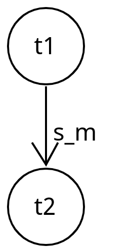
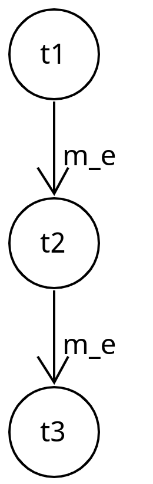

---
title:"Petri Netze zur Aufgabenverschachtelung"
---

TODO:
- Wie sieht die Nutzereingabe aus
- Wie wird die die Nutzereingabe in ein Petri-Netz überführt
- Welche Beziehungen zwischen Aufgaben gibt es und welche Petri-Netz Struktur wird für diese Beziehungen erzeugt?
- Welche Schnittstellen hat das Petri-Netz zum Rest des Dungeons?

## Ziel

Mithilfe von Petri-Netzen sollen die Beziehungen zwischen Aufgaben modelliert und gesteuert werden.
Es soll möglich sein bedingte Folgeaufgaben und Teilaufgaben zu definieren. Diese Beziehungen haben einen Einfluss
darauf, unter welchen Bedingungen bestimmte Aufgaben bearbeitet werden können.

Die Aufgabenbeziehungen sollen von DSL-Nutzenden konfiguriert werden können. Hierfür wird die eingebettete dot-Syntax
verwendet, um die Abhängigkeiten in einem Graph darzustellen.

## Aufgabenabhängigkeiten

Eine Aufgabe kann folgende Zustände haben:

- **inaktiv**: die Aufgabe wird den Studierenden nicht angezeigt und die mit der Aufgabe verknüpften
  Entitäten zeigen in einer definierten Form an, dass die entsprechende Aufgabe noch nicht
  aktiviert wurde oder sind nicht interagierbar
- **aktiv ohne Bearbeitung**: die Aufgabe wird den Studierenden im Questlog angezeigt, die verknüpften
  Entitäten verhalten sich wie bei **inaktiv**, alle Teilaufgaben der Aufgabe werden ebenfalls aktiviert
- **aktiv mit Bearbeitung**: die Aufgabe wird den Studierenden im Questlog angezeigt, mit den verknüpften
  Entitäten kann interagiert werden, um eine Antwort auf die Aufgabe zu geben
- **fertig bearbeitet**: Die Studierenden haben eine Antwort für eine Aufgabe abgegeben, hat Feedback darüber bekommen
  und die Aufgabe wird nicht mehr im Questlog angezeigt

Folgende Abhängigkeiten zwischen zwei Aufgaben $t_1$ und $t_2$ sind möglich:

**Erforderliche Teilaufgabe**

Für $t_2$ muss eine Antwort abgegeben werden, bevor $t_1$ abgeschlossen werden kann;
$t_1$ wird zuerst aktiviert und bleibt aktiv, während $t_2$ bearbeitet wird.

**Optionale Teilaufgabe**

Für $t_2$ muss nicht zwingend eine Antwort gegeben werden, bevor $t_1$ abgeschlossen werden kann.
Eine gegebene Antwort für $t_2$ könnte aber bspw. Bonus-Punkte geben.

**Aufgabensequenz**

Für $t_1$ muss eine Antwort abgegeben werden, bevor $t_2$ aktiv wird. $t_1$ ist vollständig abgeschlossen (und daher inaktiv),
während $t_2$ aktiv ist. Die **gesamte Aufgabensequenz** gilt erst als abgeschlossen, wenn die letzte Aufgabe der Sequenz
abgeschlossen ist.

Für eine Sequenz aus mehreren Aufgaben könnte dies so aussehen:

**Bedingte Folgeaufgabe**

Gegeben sei eine dritte Aufgabe $t_3$.

Abhängig davon, ob die gegebene Antwort für $t_1$ korrekt oder falsch (oder zu einem gewissen Prozentsatz korrekt) ist,
muss entweder $t_2$ oder $t_3$ bearbeitet werden.

Im folgenden Beispiel muss $t_2$ bearbeitet werden, wenn $t_1$ falsch beantwortet wird, und $t_3$ muss beantwortet werden,
falls $t_1$ richtig beantwortet wird.

**Kombination der Beziehungen**

Die vorgestellten Beziehungen können beliebig kombiniert werden:

TODO.

