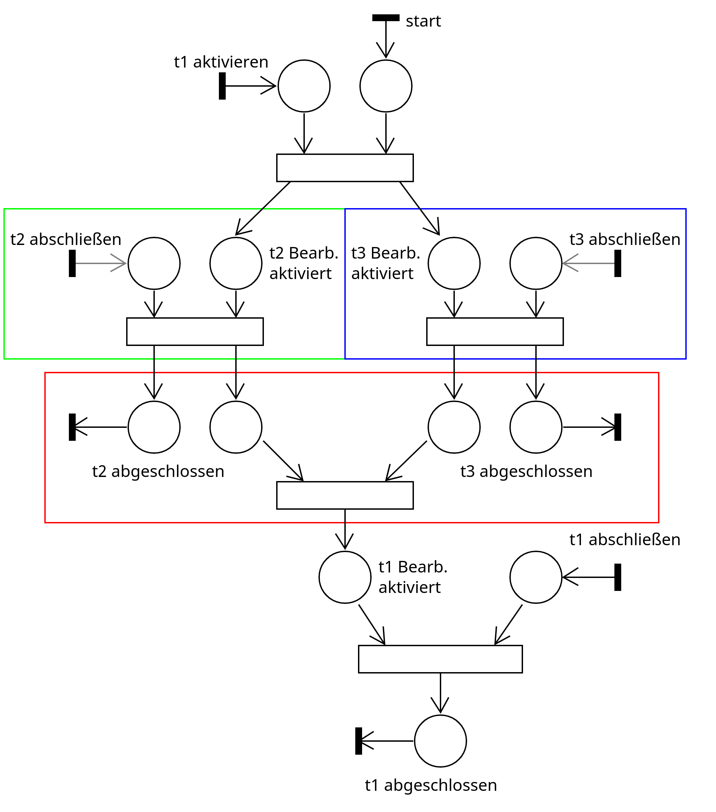

TODO:
- Wie sieht die Nutzereingabe aus
- Wie wird die die Nutzereingabe in ein Petri-Netz überführt
- Welche Beziehungen zwischen Aufgaben gibt es und welche Petri-Netz Struktur wird für diese Beziehungen erzeugt?
- Welche Schnittstellen hat das Petri-Netz zum Rest des Dungeons?

## Ziel

Mithilfe von Petri-Netzen sollen die Beziehungen zwischen Aufgaben modelliert und gesteuert werden.
Es soll möglich sein, bedingte Folgeaufgaben und Teilaufgaben zu definieren. Diese Beziehungen haben einen Einfluss
darauf, unter welchen Bedingungen bestimmte Aufgaben bearbeitet werden können.

Die Aufgabenbeziehungen sollen per DSL-Eingabe konfigurierbar sein. Hierfür wird die eingebettete dot-Syntax
verwendet, um die Abhängigkeiten in einem Graph darzustellen.
Aus diesem Graph erzeugt der DSL-Interpreter ein Petri-Netz, welches zur Spiellaufzeit interpretiert wird.

## Aufgabenabhängigkeiten

Eine Aufgabe kann folgende Zustände haben:

- **inaktiv**: die Aufgabe wird den Studierenden nicht angezeigt und die mit der Aufgabe verknüpften
  Entitäten zeigen in einer definierten Form an, dass die entsprechende Aufgabe noch nicht
  aktiviert wurde oder sind nicht interagierbar
- **aktiv ohne Bearbeitung**: die Aufgabe wird den Studierenden im Questlog angezeigt, die verknüpften
  Entitäten verhalten sich wie bei **inaktiv**, alle Teilaufgaben der Aufgabe werden ebenfalls aktiviert
- **aktiv mit Bearbeitung**: die Aufgabe wird den Studierenden im Questlog angezeigt, mit den verknüpften
  Entitäten kann interagiert werden, um eine Antwort auf die Aufgabe zu geben
- **fertig bearbeitet**: Die Studierenden haben eine Antwort für eine Aufgabe abgegeben, hat Feedback darüber bekommen
  und die Aufgabe wird nicht mehr im Questlog angezeigt

### Aspekte bezüglich der Übersetzung des Abhängigkeitsgraphen in ein Petri-Netz

Zur Übersetzung des Abhängigkeitsgraphen in ein Petri-Netz sind folgende Aspekte zu beachten:
- Die Stellen des Netzes sollen zur Modellierung des Zustands der Aufgaben genutzt werden
- Das Petri-Netz soll allein durch die Belegung der Stellen Transitionen ausführen

Hieraus resultieren folgende Designentscheidungen:
- Für jede Aufgabe existiert eine Stelle, die (falls markiert) angibt, ob die Aufgabe aktuell zur Bearbeitung
  freigeschaltet ist
- Für jede Aufgabe existiert eine Stelle, die (falls markiert) angibt, ob die Aufgabe abgeschlossen ist
- Es muss eine Schnittstelle zum Dungeon / zur DSL vorgesehen werden, über die dem Petri-Netz mitgeteilt
  werden kann, dass eine Aufgabe bearbeitet wurde. Diese Information wird nicht vom Petri-Netz selbst abgefragt,
  sondern vom Dungeon / der DSL an das Petri-Netz übermittelt, da dieser Prozess eng mit dem konkreten Szenario
  verknüpft ist, welches in der DSL definiert ist.


### Erforderliche Teilaufgabe


Für $t_2$ muss eine Antwort abgegeben werden, bevor $t_1$ abgeschlossen werden kann;
$t_1$ wird zuerst aktiviert und bleibt aktiv, während $t_2$ bearbeitet wird.

Kürzel: "subtask_mandatory"/"st_m"

Eingabe:
```
task_dependency t {
  t1 -> t2 [type="st_m"]
}
```

Das erzeugte Petri-Netz für diese Beziehung sieht wie folgt aus:


Die Transitionen, die von links und rechts in das Petri-Netz übergehen (z.B. "t1 aktivieren", "t2 abschließen"),
sind die Schnittstellen zum Dungeon / zur DSL.

Der Zustand einer Aufgabe (z.B. $t_1$) kann aus der Kombination der Stellen "t1 Bearb. aktiviert" und "t1 abgeschlossen"
hergeleitet werden. In den Transitionen können Aktionen ausgeführt werden, wie z.B. eine Aufgabe im Questlog anzuzeigen,
oder sie aus dem Questlog zu löschen. Der Zustand **aktiv ohne Bearbeitung** wird daher nicht explizit im Petri-Netz
modelliert.

Es folgt:

- Stelle "t1 Bearb. aktiviert" und "t1 abgeschlossen" sind beide **nicht markiert** = Zustand **inaktiv**
- Stelle "t1 Bearb. aktiviert" ist **markiert** und "t1 abgeschlossen" ist **nicht markiert** = Zustand **aktiv mit Bearbeitung**
- Stelle "t1 Bearb. aktiviert" ist **nicht markiert** und "t1 abgeschlossen" ist **markiert** = Zustand **fertig bearbeitet**

Eine Aufgabe kann mehrere erforderliche Teilaufgaben haben, wie im folgenden Graph dargestellt:


Das entsprechende Petri-Netz sieht so aus:



Der grün markierte Bereich dient zur Behandlung von $t_2$, der blau markierte Bereich dient zur Behandlung von $t_3$.
Weitere Teilaufgaben würden auf der gleichen Ebene mit der gleichen Petri-Netz-Struktur hinzugefügt werden.
Der rot markierte Bereich dient zur Überprüfung, ob beide Teilaufgaben abgeschlossen sind, bevor die Bearbeitung von $t_1$
freigeschaltet wird. Die Transition in diesem Bereich konsumiert jeweils ein Token von den Stellen "t2 abgeschlossen" und
"t3 abgeschlossen", daher werden diese Stellen jeweils mit 2 Tokens markiert (wie an deren eingehenden Kanten durch "+2"
markiert).

### Optionale Teilaufgabe


Für $t_2$ muss nicht zwingend eine Antwort gegeben werden, bevor $t_1$ abgeschlossen werden kann.
Eine gegebene Antwort für $t_2$ könnte aber bspw. Bonus-Punkte geben.

Kürzel: "subtask_optional"/"st_o"

Eingabe:
```
task_dependency t {
  t1 -> t2 [type="st_o"]
}
```

Das Petri-Netz für die Abhängigkeit sieht wie folgt aus:


Entscheidend ist, dass es die Fertigstellung von $t_2$ keine Auswirkung auf den Zustand von $t_1$ hat. Andersherum
beendet die Fertigstellung von $t_1$ auch $t_2$, sodass anschließend keine Antwort mehr für $t_2$ abgegeben werden kann.

### Aufgabensequenz


Für $t_1$ muss eine Antwort abgegeben werden, bevor $t_2$ aktiv wird. $t_1$ ist vollständig abgeschlossen (und daher inaktiv),
während $t_2$ aktiv ist. Die **gesamte Aufgabensequenz** gilt erst als abgeschlossen, wenn die letzte Aufgabe der Sequenz
abgeschlossen ist.

Kürzel: "sequence"/"s"

Eingabe:
```
task_dependency t {
  t1 -> t2 [type="s"]
}
```

Das Petri-Netz für die oben abgebildete Abhängigkeit sieht wie folgt aus:


Für eine Sequenz aus mehreren Aufgaben könnte dies so aussehen:


Eingabe:
```
task_dependency t {
  t1 -> t2 -> t3 [type="s"]
}
```

### Bedingte Folgeaufgabe

Gegeben sei eine dritte Aufgabe $t_3$.

Abhängig davon, ob die gegebene Antwort für $t_1$ korrekt oder falsch (oder zu einem gewissen Prozentsatz korrekt) ist,
muss entweder $t_2$ oder $t_3$ bearbeitet werden.

Im folgenden Beispiel muss $t_2$ bearbeitet werden, wenn $t_1$ falsch beantwortet wird, und $t_3$ muss beantwortet werden,
falls $t_1$ richtig beantwortet wird.


Kürzel: "conditional_false"/"c_f" und "conditional_correct"/"c_c"

Eingabe:
```
task_dependency t {
  t1 -> t2 [type="c_f"]
  t1 -> t3 [type="c_c"]
}
```

Das Petri-Netz für die oben abgebildete Abhängigkeit sieht wie folgt aus:


### Kombination der Beziehungen

Die vorgestellten Beziehungen können beliebig kombiniert werden, wie in folgendem Beispiel:


Es sei besonders auf die folgenden Beziehungen hingewiesen:

- $t_1$ hat die Beziehung **erforderliche Teilaufgabe** zu $t_2$, wobei $t_2$ eine **Aufgabensequenz** mit $t_3$ bildet
- $t_3$ hat zwei **erforderliche Teilaufgaben** $t_4$ und $t_5$

Diese Beziehungen haben den Effekt, dass erst $t_2$, dann $t_4$ und $t_5$ (als Teilaufgaben von $t_3$) und anschließend
$t_3$ bearbeitet werden müssen, bevor der linke Zweig unter $t_1$ als abgeschlossen gilt.

