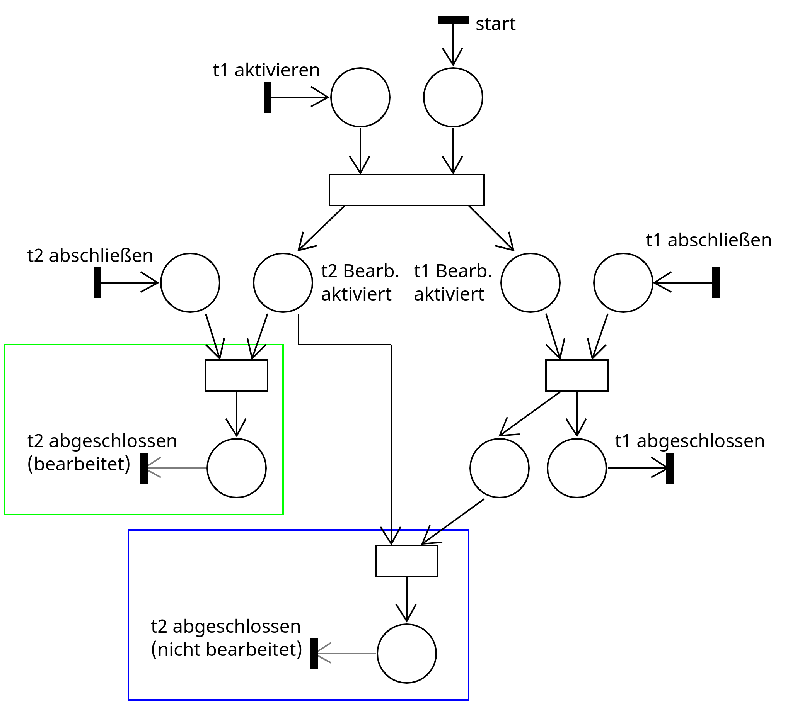
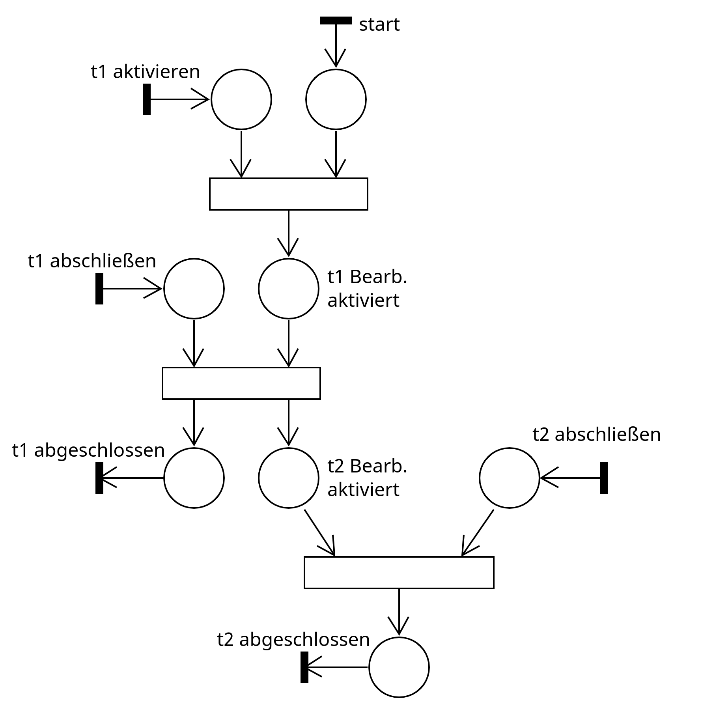

## Ziel

Mithilfe von Petri-Netzen sollen die Beziehungen zwischen Aufgaben modelliert und gesteuert
werden. Es soll möglich sein, bedingte Folgeaufgaben und Teilaufgaben zu definieren. Diese
Beziehungen haben einen Einfluss darauf, unter welchen Bedingungen bestimmte Aufgaben
bearbeitet werden können.

Die Aufgabenbeziehungen sollen per DSL-Eingabe konfigurierbar sein. Hierfür wird die
eingebettete dot-Syntax verwendet, um die Abhängigkeiten in einem Graph darzustellen. Aus
diesem Graph erzeugt der DSL-Interpreter ein Petri-Netz, welches zur Spiellaufzeit
interpretiert wird.

## Aufgabenabhängigkeiten

Eine Aufgabe kann folgende Zustände haben:

- **inaktiv**: die Aufgabe wird den Studierenden nicht angezeigt und die mit der Aufgabe
  verknüpften Entitäten zeigen in einer definierten Form an, dass die entsprechende Aufgabe
  noch nicht aktiviert wurde oder sind nicht interagierbar
- **aktiv ohne Bearbeitung**: die Aufgabe wird den Studierenden im Questlog angezeigt, die
  verknüpften Entitäten verhalten sich wie bei **inaktiv**, alle Teilaufgaben der Aufgabe
  werden ebenfalls aktiviert
- **aktiv mit Bearbeitung**: die Aufgabe wird den Studierenden im Questlog angezeigt, mit
  den verknüpften Entitäten kann interagiert werden, um eine Antwort auf die Aufgabe zu
  geben
- **fertig bearbeitet**: Die Studierenden haben eine Antwort für eine Aufgabe abgegeben, hat
  Feedback darüber bekommen und die Aufgabe wird nicht mehr im Questlog angezeigt

### Aspekte bezüglich der Übersetzung des Abhängigkeitsgraphen in ein Petri-Netz

Zur Übersetzung des Abhängigkeitsgraphen in ein Petri-Netz sind folgende Aspekte zu
beachten:

- Die Stellen des Netzes sollen zur Modellierung des Zustands der Aufgaben genutzt werden
- Das Petri-Netz soll allein durch die Belegung der Stellen Transitionen ausführen

Hieraus resultieren folgende Designentscheidungen:

1.  Für jede Aufgabe existiert eine Stelle, die (falls markiert) angibt, ob die Aufgabe
    aktuell zur Bearbeitung freigeschaltet ist
2.  Für jede Aufgabe existiert eine Ausgangstransition, über die das Dungeon-System abfragen
    kann, ob eine Aufgabe abgeschlossen ist
3.  Es muss eine Schnittstelle zum Dungeon / zur DSL vorgesehen werden, über die dem
    Petri-Netz mitgeteilt werden kann, dass eine Aufgabe bearbeitet wurde. Diese Information
    wird nicht vom Petri-Netz selbst abgefragt, sondern vom Dungeon / der DSL an das
    Petri-Netz übermittelt, da dieser Prozess eng mit dem konkreten Szenario verknüpft ist,
    welches in der DSL definiert ist.

Die Stellen, die durch 1. und 2. definiert werden, sollen vom Dungeon genutzt werden können,
um den Zustand der Aufgaben aus dem Petri-Netz auszulesen.

### Erforderliche Teilaufgabe

Gegeben seien zwei (Teil-) Aufgaben $t_1$ und $t_2$.

Für $t_2$ muss eine Antwort abgegeben werden, bevor $t_1$ abgeschlossen werden kann; $t_1$
wird zuerst aktiviert und bleibt aktiv, während $t_2$ bearbeitet wird.

Kürzel: “subtask_mandatory”/“st_m”

DSL-Eingabe:
```
task_dependency t {
  t1 -> t2 [type="st_m"]
}
```

Das erzeugte Petri-Netz für diese Beziehung sieht wie folgt aus:


Die Transitionen, die von links und rechts in das Petri-Netz übergehen (z.B. “t1
aktivieren”, “t2 abschließen”), sind die Schnittstellen zum Dungeon / zur DSL, die dem
Petri-Netz mitteilen, dass eine Aufgabe aktiviert wurde.

Die Transitionen, die aus dem Petri-Netz herausgehen, sind die Schnittstellen über die der
Dungeon / die DSL abfragt, ob eine Aufgabe abgeschlossen ist.

Der Zustand einer Aufgabe (z.B. $t_1$) kann aus der Kombination der Stellen “t1 Bearb.
aktiviert” und “t1 abgeschlossen” hergeleitet werden. In den Transitionen können Aktionen
ausgeführt werden, wie z.B. eine Aufgabe im Questlog anzuzeigen, oder sie aus dem Questlog
zu löschen. Der Zustand **aktiv ohne Bearbeitung** wird daher nicht explizit im Petri-Netz
modelliert.

Es folgt:

- Stelle “t1 Bearb. aktiviert” und “t1 abgeschlossen” sind beide **nicht markiert** =
  Zustand **inaktiv**
- Stelle “t1 Bearb. aktiviert” ist **markiert** und “t1 abgeschlossen” ist **nicht
  markiert** = Zustand **aktiv mit Bearbeitung**
- Stelle “t1 Bearb. aktiviert” ist **nicht markiert** und “t1 abgeschlossen” ist
  **markiert** = Zustand **fertig bearbeitet**

Eine Aufgabe kann mehrere erforderliche Teilaufgaben haben, z.B. können wie
in folgender DSL-Eingabe $t_2$ **und** $t_3$ von $t_1$ abhängig sein:

```
task_dependency t {
  t1 -> t2 [type="st_m"]
  t1 -> t3 [type="st_m"]
}
```

Das entsprechende Petri-Netz sieht so aus:


Der grün markierte Bereich dient zur Behandlung von $t_2$, der blau markierte Bereich dient
zur Behandlung von $t_3$. Weitere Teilaufgaben würden auf der gleichen Ebene mit der
gleichen Petri-Netz-Struktur hinzugefügt werden. Der rot markierte Bereich dient zur
Überprüfung, ob beide Teilaufgaben abgeschlossen sind, bevor die Bearbeitung von $t_1$
freigeschaltet wird.

### Optionale Teilaufgabe

Gegeben seien zwei (Teil-) Aufgaben $t_1$ und $t_2$.

Für $t_2$ muss nicht zwingend eine Antwort gegeben werden, bevor $t_1$ abgeschlossen werden
kann. Eine gegebene Antwort für $t_2$ könnte aber bspw. Bonus-Punkte geben.

Kürzel: “subtask_optional”/“st_o”

DSL-Eingabe:
```
task_dependency t {
  t1 -> t2 [type="st_o"]
}
```

Das Petri-Netz für die Abhängigkeit sieht wie folgt aus:



Entscheidend ist, dass es die Fertigstellung von $t_2$ keine Auswirkung auf den Zustand von
$t_1$ hat. Andersherum beendet die Fertigstellung von $t_1$ auch $t_2$, sodass anschließend
keine Antwort mehr für $t_2$ abgegeben werden kann.

Beim Abschließen einer optionalen Teilaufgabe werden zwei Fälle unterschieden:

1.  Die Aufgabe $t_2$ wurde durch die aktive Bearbeitung durch die Studierenden
    abgeschlossen (markiert durch den grünen Kasten)
2.  Die Aufgabe $t_2$ wurde nicht durch dir aktive Bearbeitung durch die Studierenden
    abgeschlossen, sondern durch das Abschließen von $t_1$ (markiert durch den blauen
    Kasten)

### Aufgabensequenz

Gegeben seien zwei (Teil-) Aufgaben $t_1$ und $t_2$.

Für $t_1$ muss eine Antwort abgegeben werden, bevor $t_2$ aktiv wird. $t_1$ ist vollständig
abgeschlossen (und daher inaktiv), während $t_2$ aktiv ist. Die **gesamte Aufgabensequenz**
gilt erst als abgeschlossen, wenn die letzte Aufgabe der Sequenz abgeschlossen ist.

Kürzel: “sequence”/“s”

DSL-Eingabe:
```
task_dependency t {
  t1 -> t2 [type="s"]
}
```

Das Petri-Netz für die oben beschriebene Abhängigkeit sieht wie folgt aus:



Für eine Sequenz aus mehreren Aufgaben könnte die DSL-Eingabe so aussehen:

```
task_dependency t {
  t1 -> t2 -> t3 [type="s"]
}
```

### Bedingte Folgeaufgabe

Gegeben seien drei (Teil-) Aufgaben $t_1$, $t_2$ und $t_3$.

Abhängig davon, ob die gegebene Antwort für $t_1$ korrekt oder falsch (oder zu einem
gewissen Prozentsatz korrekt) ist, muss entweder $t_2$ oder $t_3$ bearbeitet werden.

Im folgenden Beispiel muss $t_2$ bearbeitet werden, wenn $t_1$ falsch beantwortet wird, und
$t_3$ muss beantwortet werden, falls $t_1$ richtig beantwortet wird.

Kürzel: “conditional_false”/“c_f” und “conditional_correct”/“c_c”

DSL-Eingabe:
```
task_dependency t {
  t1 -> t2 [type="c_f"]
  t1 -> t3 [type="c_c"]
}
```

Das Petri-Netz für die oben beschriebene Abhängigkeit sieht wie folgt aus: 

Die Stelle mit der ausgehenden Transition “t2 oder t3 abgeschlossen” (am unteren Bildrand)
dient dazu, die Information, dass **eine** der alternativen Folgeaufgaben bearbeitet wurde,
in einer Stelle zu vereinigen.

### Kombination der Beziehungen

Die vorgestellten Beziehungen können beliebig kombiniert werden, wie in folgender
beispielhaften DSl-Eingabe:

```
task_dependency t {
  t1 -> t2 [type="st_m"]

  // linker Zweig unter t1
  t2 -> t3 [type="s_m"]
  t3 -> t4 [type="st_m"]
  t3 -> t5 [type="st_m"]

  // rechter Zweig unter t1
  t1 -> t6 [type="st_m"]
  t1 -> t7 [type="c_f"]
  t1 -> t8 [type="c_c"]
}
```

Es gelten folgende Beziehungen:

1.  $t_1$ hat die **erforderlichen Teilaufgaben** $t_2$ und $t_6$
2.  $t_2$ bildet eine **Aufgabensequenz** mit $t_3$
3.  $t_3$ hat zwei **erforderliche Teilaufgaben** $t_4$ und $t_5$
4.  $t_6$ hat die **bedingten Folgeaufgaben** $t_7$ und $t_8$

Die Beziehungen **2.** und **3.** haben den Effekt, dass erst $t_2$, dann $t_4$ und $t_5$
(als Teilaufgaben von $t_3$) und anschließend $t_3$ bearbeitet werden müssen, bevor der
linke Zweig unter $t_1$ als abgeschlossen gilt.

Das entsprechende Petri-Netz sieht wie folgt aus:


