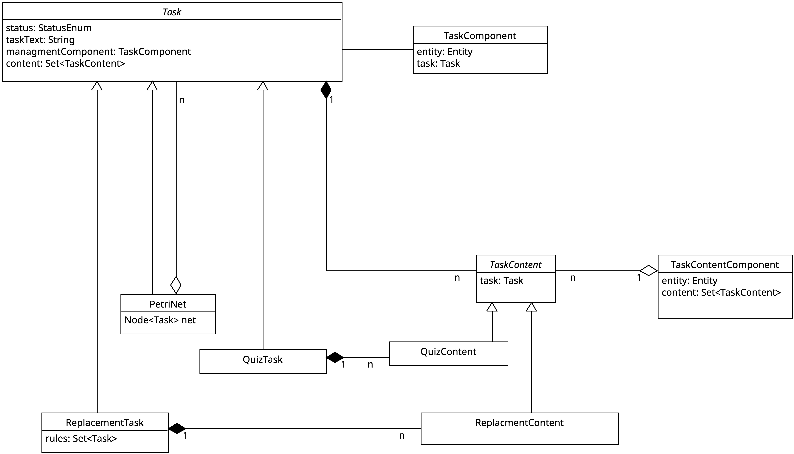

## Ziel

Mithilfe von Callbacks können in der DSL Methoden definiert werden, die beim Auftreten bestimmter Events im Spiel ausgelöst werden. 
Diese Event-Handler-Methoden sollen genutzt werden, um z.B. die vom Spieler abgegebene Lösung für eine Quest aus dem Spiel zurück an die DSL zu übergeben, um dort die Lösung zu bewerten und ggf. über native Funktionen im Dungeon spielerische Konsequenzen auszulösen.

## Von der Quest zur Entität und wieder zurück 

*Anmerkung:* Das Konzept ist noch WiP und hier wird lediglich der aktuelle Stand festgehalten. 

Das Diagramm zeigt, wie eine Quest im Spiel implementiert ist und wie diese mit der Entität verbunden wird. 

Jeder Aufgabentyp im Spiel wird als abstrakte `Quest` definiert. Von dort werden die konkreten Questtypen wie `QuizQuestionQuest` oder `ReplacementQuest` abgeleitet. 

Jede Quest speichert eine Menge an `QuestContent`-Objekten ab. Das können z.B. die Fragestellung oder die Antwortmöglichkeiten für eine Quizfrage sein.

Eine in der DSL definierte Aufgabenstellung erzeugt beim Laden ein entsprechendes `Quest`-Objekt mit zugehörigen `QuestContent`-Objekten.

Aus den jeweiligen `QuestContent`-Objekten werden dann `TaskReferenceComponent`s erstellt und an Entitäten im Dungeon angehängt. Ob jedes Content-Objekt ein eigenes Component ist oder auch mehrere Content-Objekte in einem Component zusammengefasst werden können, ist noch nicht ganz klar. 
Das Component hilft dabei, eine Entität als "Quest-relevant" zu markieren, und zusätzlich kann von der Entität über das `TaskReferenceComponent` auf die eigentliche `Quest` zugegriffen werden.

Die Entitäten werden dann nach Szenario um weitere Components ergänzt (z.B. dem `InteractionComponent`).

In einigen Components können durch das umgesetzte Strategy-Pattern die Callback-Methoden aus der DSL angebunden werden. 
Ein Parameter jeder Callback-Methode ist die Entität, welche das Component speichert. So kann über den Parameter der Callback-Methode auf die Entität, darüber auf das `TaskReferenceComponent` und so auf die `Quest` und die `QuestContent`-Objekte zugegriffen werden.