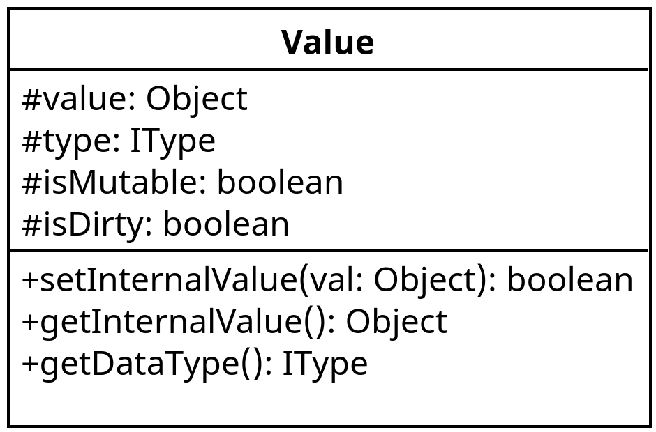

# Überblick: Wie funktioniert die Interpretation allgemein

# `MemorySpace`s und `Value`s

Der `DSLInterpreter` muss zur Interpretation eines DSL Programms Ausdrücke evaluieren und die evaluierten Werte
speichern. Dies gilt bspw. auch für die Member einer `quest_config`-Definition.

Zur Darstellung eines "Werts" nutzt der `DSLInterpreter` die `Value`-Klasse:

Im Wesentlichen stellt ein Value also eine Kombination aus einem "Wert", dem `value` Object und einem Datentyp,
dem `type` dar.
`isMutable` dient dazu, das Setzen des internen Werts zu blockieren, was Beispielsweise für ein statisches `Value.NULL`
Objekt genutzt wird. `isDirty` zeigt an, ob der Wert des `Value`s per `setInternalValue()` explizit durch das
DSL-Program gesetzt wurde.

`Value`-Instanzen können nur einen einzelnen Wert speichern. Um auch aus mehreren benannten Werten zusammengesetzte
Konstrukte, wie bspw. eine `quest_config`-Definition speichern zu können, wird das `IMemorySpace`-Interface verwendet.

Ein `IMemorySpace` bietet die Möglichkeit, mittels `bindValue()` ein `Value`-Objekt mit einem Namen zu assoziieren.
Die `resolve()`-Methode wird genutzt, um einen Namen in dem `IMemorySpace` aufzulösen.
`IMemorySpace`s können hierarchisch aufgebaut sein, sodass die Auflösung eines Namens auch im Eltern-`IMemorySpace`
erfolgen kann.

# Funktionsaufrufe

# Welche Klassen (neben `DSLInterpreter`) sind beteiligt?

# Typinstanziierung
