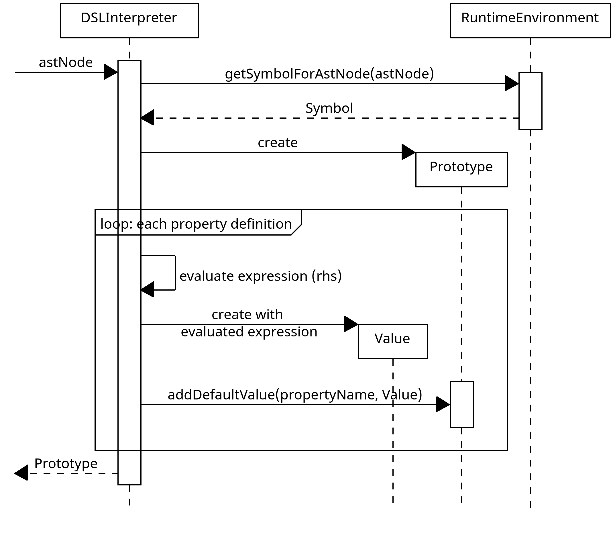
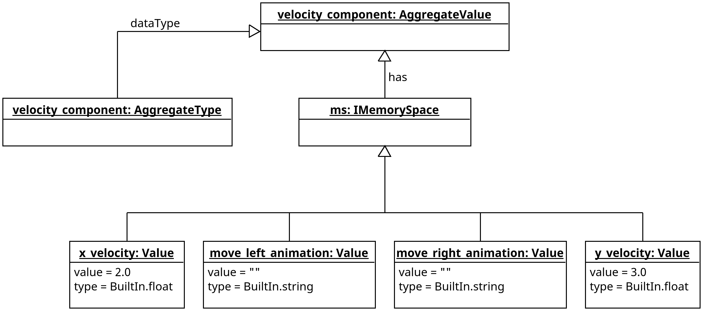

## Überblick: Wie funktioniert die Interpretation allgemein

Der `DSLInterpreter` muss zur Interpretation eines DSL Programms Ausdrücke evaluieren und die evaluierten Werte
speichern. Dies gilt bspw. auch für die Member einer `quest_config`-Definition.

Die Schritte, welche anschließend während der Interpretation vom `DSLInterpreter` ausgeführt
werden, sind im folgenden Diagram dargestellt:

{width="50%"}

Die Interpretations-Pipeline ist in zwei Phasen aufgeteilt, die Laufzeitinitialisierung und die Interpretation.

### Laufzeitinitialisierung

Zuerst lädt der `DSLInterpreter` die Symbol- und Typinformationen aus der übergebenen `IEnvironment`-Instanz
in ein `RuntimeEnvironment`.
Anschließend wird ein globaler `MemorySpace` erzeugt, welcher das Laufzeit-Äquivalent zu einem `Scope` darstellt.
In diesem globalen `MemorySpace` werden globale Definitonen von Funktionen und Objekten (bspw. von `quest_config`)
als `Value` gebunden (für weiter Informationen siehe [Value und MemorySpace](#value-und-imemoryspace--)).

### Interpretation

Der erste Schritt der Interpretation (nach der Initialisierung) ist das Erzeugen von Prototypen für
`game_object`-Definitionen.

**Erzeugung von Prototypen**

Ein "Prototyp" ist eine Kombination aus einem `AggregateType` und vom Nutzer
per DSL konfigurierten Defaultwerten. Ein Beispiel für eine `game_object`-Definition:

```
game_object my_obj {
    velocity_component {
        x_velocity: 2.0,
        y_velocity: 3.0
    },
    animation_component {
        idle_left: "path/to/frames",
        idle_right: "path/to/frames"
    }
}
```

Aus dieser Definition erstellt der `DSLInterpreter` einen Prototypen, in dem bspw. die Werte für die konfigurierten Member
`x_velocity` und `y_velocity` gespeichert werden. Aus so einem Prototyp kann wie aus einem Datentyp eine Instanz
erstellt werden. In der Instanz eines Prototyps sind die konfigurierten Defaultwerte gesetzt. Dem folgenden
Objektdiagramm können die beteiligten Instanzen für das obere Beispiel entnommen werden:


Wie zu erkennen ist, wird für jede Komponenten-Definition auch ein `Prototype` erzeugt,
der jedoch nur im `Prototype` der `game_object`-Definition existiert. Der `Prototype` einer
Komponenten-Definition enthält die per DSL konfigurierten Defaultwerte der Komponente.

Die Erzeugung der Prototypen ist im folgenden Sequenzdiagramm dargestellt:

{width="50%"}

In den Typdefinitionen, die vom `RuntimeEnvironment` für `getTypes` zurückgegeben werden, sind auch die
`game_object`-Definition enthalten.

Die referenzierte Sequenz `createComponentPrototype` ist im Folgenden dargestellt:

{width="50%"}

**Evaluierung von Ausdrücken**

Um Prototypen zu erzeugen, müssen die rechtsseitigen Ausdrücke einer Eigenschaftszuweisung (z.B.
`x_velocity: 2.0`) evaluiert werden.
Im obigen Beispiel handelt es sich bei diesen Ausdrücken um triviale Dezimalzahlen, es könnte sich allerdings bei
rechtsseitigen Ausdrücken auch um Funktionsaufrufe, Verweise auf globale Objekte, etc. handeln (vgl. für
gültige Ausdrücke hierzu [Ausdrücke](sprachkonzepte.md#ausdrücke)).

Der `DSLInterpreter` ist ein [Tree-Walk-Interpreter](https://craftinginterpreters.com/a-tree-walk-interpreter.html),
läuft also über den AST und führt für jeden so besuchten Knoten Operationen aus. Für alle Knoten, die Teil eines
Ausdrucks sein können, erzeugt der Interpreter eine `Value`-Instanz, die den Wert des besuchten Knotens enthält.

Für `NumNode` wird bspw. einfach der Wert des AST-Knotens in ein `Value` verpackt:
```java
public Object visit(NumNode node) {
    return new Value(BuiltInType.intType, node.getValue());
}
```

Für einen `GameObjectDefinition`-Knoten, der Teil eines Ausdrucks ist, ist dieses Vorgehen deutlich komplexer und wird
unter [Typinstanziierung](#typinstanziierung) genauer erläutert. Allerdings wird auch für diesen Fall ein `Value`-Objekt
zurückgegeben.

**Anmerkung:**

Die im Folgenden beschriebenen Aspekte bzgl. `quest_config` als zentralem Übergabepunkt von DSL -> Dungeon sind WIP
und können sich daher noch grundlegend ändern (siehe hierzu [Issue #195](https://github.com/Programmiermethoden/Dungeon/issues/195)).

Der zentrale Übergabepunkt zwischen dem DSL Programm und dem Dungeon-Framework wird durch die
`quest_config`-Definition gebildet. Daher sucht der `DSLInterpreter` im nächsten Schritt die erste `quest_config`-Definition
aus einem DSL Programm heraus und evaluiert alle Eigenschaftszuweisungen. Hierdurch werden nur Objekte und Definitionen
evaluiert, die in Eigenschaftszuweisungen dieser `quest_config`-Definition referenziert werden.

Abschließend erzeugt der `DSLInterpreter` eine `QuestConfig`-Instanz und gibt diese an das Dungeon-Framework zurück.
Die `QuestConfig`-Instanz enthält alle Informationen für das Dungeon-Framework, um ein Dungeonlevel mit spezifizierten
Entitäten (als `game_object`-Definition) zu erzeugen.

**Wann und wie interpretiert der Interpreter?**

Die Evaluierung der `quest_config`-Definition ist die **einzige** Art der Interpretation, die der `DSLInterperter`
standardmäßig durchführt.
Es ist aktuell kein **eigenständiger** DSL-Loop oder ähnliches vorgesehen, der parallel bzw. mit dem Gameloop des Dungeons
mitläuft und kontinuierlich Teile des DSL-Programms ausführt.
Die weitere Tätigkeit des `DSLInterpreter`s beschränkt sich auf die Interpretation der Event-Handler DSL-Funktionen, die
mit Entitäten verknüpft wurden (siehe dazu [Funktionsaufrufe](#funktionsaufrufe)).

## `Value` und `IMemorySpace`

Die `Value`-Klasse wird verwendet um alle Werte und Objekte zu verwalten, die vom `DSLInterpreter`
während der Interpretation erzeugt und referenziert werden. Im Folgenden Diagram sind die wichtigsten
Methoden und Eigenschaften der `Value`-Klasse dargestellt.

{width="50%"}

Im Wesentlichen stellt ein Value eine Kombination aus einem "Wert", dem `value` Object, und einem Datentyp, dem `type` dar.
`isMutable` dient dazu, das Setzen des internen Werts zu blockieren, was Beispielsweise für ein statisches `Value.NULL`
Objekt genutzt wird. Das `isDirty`-Flag zeigt an, ob der Wert des `Value`s per `setInternalValue()` explizit durch das
DSL-Program gesetzt wurde. Dieses Flag wird in der [Typeinstanziierung](#typinstanziierung) verwendet.

`Value`-Instanzen können nur einen einzelnen Wert speichern. Um auch aus mehreren benannten Werten zusammengesetzte
Konstrukte, wie bspw. eine `quest_config`-Definition speichern zu können, wird das `IMemorySpace`-Interface verwendet.
Die Assoziation einer `Value`-Instanz in einem `IMemorySpace` mit einem Namen wird als "Binden" (engl.: binding) bezeichnet.
Im Folgenden sind die wichtigsten Methoden des `IMemorySpace`-Interface abgebildet:

{width="50%"}

Ein `IMemorySpace` bietet die Möglichkeit, mittels `bindValue()` ein `Value`-Objekt mit einem Namen zu assoziieren.
Die `resolve()`-Methode wird genutzt, um einen Namen in dem `IMemorySpace` aufzulösen.
`IMemorySpace`s können hierarchisch aufgebaut sein, sodass die Auflösung eines Namens auch im Eltern-`IMemorySpace`
erfolgen kann.

Ein `AggregateValue` hat einen `MemorySpace`, indem seine Member gespeichert werden. Wird beispielsweise der
Komponentenprototyp von `velocity_component` aus obigem [Beispiel](#interpretation) instanziiert, sieht der
erzeugte `AggregateValue` wie folgt aus:

{width="50%"}

In der `AggregateValue`-Instanz sind neben den konfigurierten Defaultwerten aus dem `Prototype` auch `Value`-Instanzen
für alle anderen Member des `AggregateType` enthalten, der dem `AggregateValue` zugrunde liegt.
Wie die Typinstanziierung genau abläuft, wird im folgenden Kapitel erläutert.

## Typinstanziierung

TODO:
- DSLInterpreter-Seite (Instanziierung von DSL-Typen als DSL-Value)
- TypeInstantiator-Seite (Instanziierung von DSL-Typen als Java-Objekt (bspw. `Entity`, `Component`s))
- Was ist die Rolle von `EncapsulatedObject`

## Funktionsaufrufe

TODO:
- wie funktionieren Funktionsaufrufe allgemein?
- wie funktionieren native Funktionen?
- wie werden user defined funktionen behandelt?
- wie funktioniert die Funktionsschnittstelle für Event-Handler DSL-Funktionen, die der Dungeon aufrufen kann
- Wie funktionieren die Builder-Funktionen, um Tasks zu definieren?

## Welche Klassen (neben `DSLInterpreter`) sind beteiligt?

