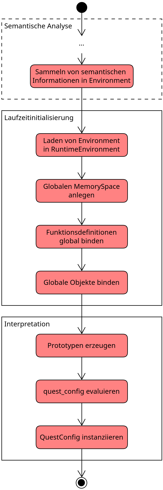
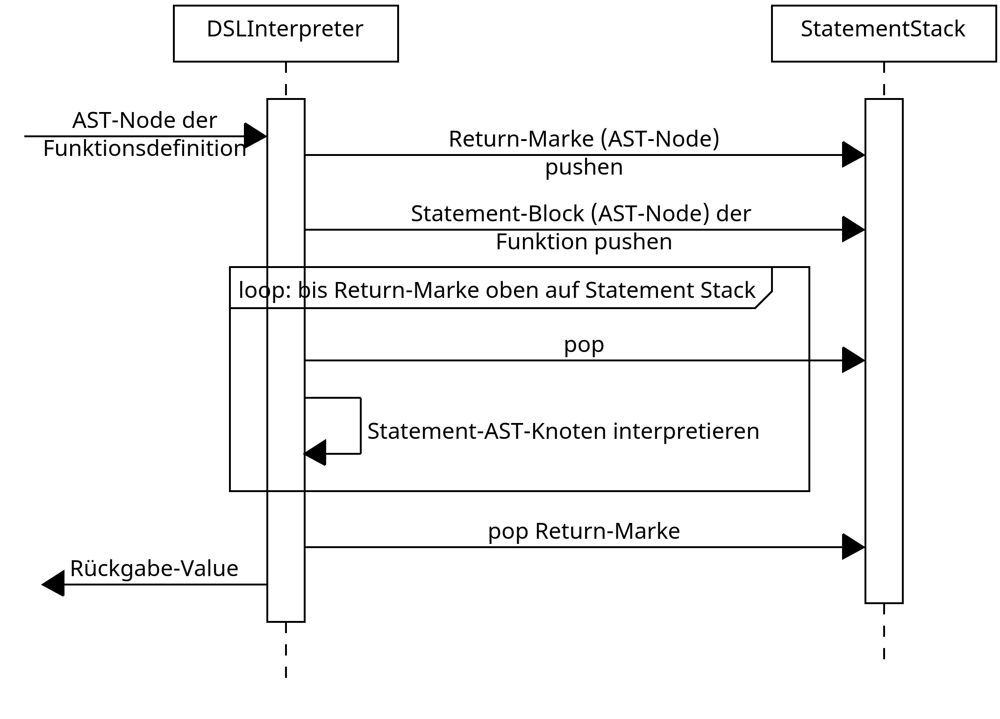

## Überblick: Wie funktioniert die Interpretation allgemein

Der `DSLInterpreter` muss zur Interpretation eines DSL Programms Ausdrücke evaluieren und
die evaluierten Werte speichern. Dies gilt bspw. auch für die Member einer
`quest_config`-Definition.

Die Schritte, welche anschließend während der Interpretation vom `DSLInterpreter` ausgeführt
werden, sind im folgenden Diagram dargestellt:

{width="50%"}

Die Interpretations-Pipeline ist in zwei Phasen aufgeteilt, die Laufzeitinitialisierung und
die Interpretation. Der Interpretation ist die Phase der semantischen Analyse vorgelagert,
welche sämtliche semantischen Informationen (Typinformationen, Scopes, Symboltabellen, etc.)
in einer `IEnvironment`-Instanz sammelt.

**NOTE**: Die Evaluierung der `quest_config`-Definition ist die **einzige** Art der
Interpretation, die der `DSLInterperter` standardmäßig durchführt. Der Interpreter für
Laufzeit-Petri-Netze wird hier konzeptionell getrennt vom `DSLInterpreter` betrachtet. Es
ist aktuell kein **eigenständiger** DSL-Loop vorgesehen, der parallel bzw. mit dem Gameloop
des Dungeons mitläuft und kontinuierlich Teile des DSL-Programms ausführt. Die weitere
Tätigkeit des `DSLInterpreter`s beschränkt sich auf die Interpretation der Event-Handler
DSL-Funktionen, die mit Entitäten verknüpft wurden (siehe dazu
[Funktionsaufrufe](#funktionsaufrufe)). Die hier abgebildete Pipeline (insbesondere die
“Interpretation”-Phase) stellt noch nicht dar, wie Funktionsaufrufe (z.B. als Handler für
Events aus der Dungeon-Laufzeit) und Laufzeit-Petri-Netze behandelt werden. Es ist noch
nicht abschließend geklärt, wie die Laufzeit-Petri-Netze interpretiert werden und wie die
Interaktion des `DSLInterpreter`s mit diesem Petri-Netz-Interpreter aussieht.

Issues hierzu:

- [Funktionsschnittstelle - PR
\#97](https://github.com/Programmiermethoden/Dungeon/issues/97)
- [Konzept zur Interpretation von Petri-Netzen zur Laufzeit - PR
\#707](https://github.com/Programmiermethoden/Dungeon/issues/707)

### Laufzeitinitialisierung

Zuerst lädt der `DSLInterpreter` die Symbol- und Typinformationen aus der übergebenen
`IEnvironment`-Instanz in ein `RuntimeEnvironment`. Anschließend wird ein globaler
`MemorySpace` erzeugt, welcher das **Laufzeit-Äquivalent** zu einem `Scope` darstellt. In
diesem globalen `MemorySpace` werden globale Definitionen von Funktionen und Objekten (bspw.
von `quest_config`) als `Value` gebunden (für weiter Informationen siehe [Value und
MemorySpace](#value-und-imemoryspace)).

`IEnvironment` bildet statische semantische Informationen ab (z.B. “welche Member hat ein
Datentyp”), während ein `RuntimeEnvironment` dafür zuständig ist, konkreten Instanzen von
Datentypen und die Werte, welche in den Membern enthalten sind, zu speichern. Diese
Informationen ändern sich dynamisch während der Programmlaufzeit.

### Interpretation

**Erzeugung von Prototypen**

Der erste Schritt der Interpretation (nach der Initialisierung) ist das Erzeugen von
Prototypen für `entity_type`-Definitionen.

Ein “Prototyp” ist eine Kombination aus einem `AggregateType` und vom Nutzer per DSL
konfigurierten Defaultwerten. Ein Beispiel für eine `entity_type`-Definition:


```
entity_type my_obj {
    velocity_component {
        x_velocity: 2.0,
        y_velocity: 3.0
    },
    animation_component {
        idle_left: "path/to/frames",
        idle_right: "path/to/frames"
    }
}
```


Aus dieser Definition erstellt der `DSLInterpreter` einen Prototypen, in dem bspw. die Werte
für die konfigurierten Member `x_velocity` und `y_velocity` gespeichert werden. Aus so einem
Prototyp kann wie aus einem Datentyp eine Instanz erstellt werden. In der Instanz eines
Prototyps sind die konfigurierten Defaultwerte gesetzt. Dem folgenden Objektdiagramm können
die beteiligten Instanzen für das obere Beispiel entnommen werden:

Wie zu erkennen ist, wird für jede Komponenten-Definition auch ein `Prototype` erzeugt, der
jedoch nur im `Prototype` der `entity_type`-Definition existiert. Der `Prototype` einer
Komponenten-Definition enthält die per DSL konfigurierten Defaultwerte der Komponente.

Die Erzeugung der Prototypen ist im folgenden Sequenzdiagramm dargestellt:

{width="50%"}

In den Typdefinitionen, die vom `RuntimeEnvironment` für `getTypes` zurückgegeben werden,
sind auch die `entity_type`-Definition enthalten.

Die referenzierte Sequenz `createComponentPrototype` ist im Folgenden dargestellt:

{width="50%"}

**Evaluierung von Ausdrücken**

Um Prototypen zu erzeugen, müssen die rechtsseitigen Ausdrücke einer Eigenschaftszuweisung
(z.B. `x_velocity: 2.0`) evaluiert werden. Im obigen Beispiel handelt es sich bei diesen
Ausdrücken um triviale Dezimalzahlen, es könnte sich allerdings bei rechtsseitigen
Ausdrücken auch um Funktionsaufrufe, Verweise auf globale Objekte, etc. handeln (vgl. für
gültige Ausdrücke hierzu [Ausdrücke](sprachkonzepte.md#ausdrücke)).

Der `DSLInterpreter` ist ein
[Tree-Walk-Interpreter](https://craftinginterpreters.com/a-tree-walk-interpreter.html),
läuft also über den AST und führt für jeden so besuchten Knoten Operationen aus. Für alle
Knoten, die Teil eines Ausdrucks sein können, erzeugt der Interpreter eine `Value`-Instanz,
die den Wert des besuchten Knotens enthält.

Für `NumNode` wird bspw. einfach der Wert des AST-Knotens in ein `Value` verpackt:
```java
public Object visit(NumNode node) {
    return new Value(BuiltInType.intType, node.getValue());
}
```

Für einen `GameObjectDefinition`-Knoten, der Teil eines Ausdrucks ist, ist dieses Vorgehen
deutlich komplexer und wird unter [Typinstanziierung](#typinstanziierung) genauer erläutert.
Allerdings wird auch für diesen Fall ein `Value`-Objekt zurückgegeben.

**Anmerkung:**

Die im Folgenden beschriebenen Aspekte bzgl. `quest_config` als zentralem Übergabepunkt von
DSL -> Dungeon sind WIP und können sich daher noch grundlegend ändern (siehe hierzu [Issue
\#195](https://github.com/Programmiermethoden/Dungeon/issues/195)).

Der zentrale Übergabepunkt zwischen dem DSL Programm und dem Dungeon-Framework wird durch
die `quest_config`-Definition gebildet. Daher sucht der `DSLInterpreter` im nächsten Schritt
die erste `quest_config`-Definition aus einem DSL Programm heraus und evaluiert alle
Eigenschaftszuweisungen. Hierdurch werden nur Objekte und Definitionen evaluiert, die in
Eigenschaftszuweisungen dieser `quest_config`-Definition referenziert werden.

Abschließend erzeugt der `DSLInterpreter` eine `QuestConfig`-Instanz und gibt diese an das
Dungeon-Framework zurück. Die `QuestConfig`-Instanz enthält alle Informationen für das
Dungeon-Framework, um ein Dungeonlevel mit spezifizierten Entitäten (als
`entity_type`-Definition) zu erzeugen.

## `Value` und `IMemorySpace`

Die `Value`-Klasse wird verwendet um alle Werte und Objekte zu verwalten, die vom
`DSLInterpreter` während der Interpretation erzeugt und referenziert werden. Im Folgenden
Diagram sind die wichtigsten Methoden und Eigenschaften der `Value`-Klasse dargestellt.

{width="50%"}

Im Wesentlichen stellt ein Value eine Kombination aus einem “Wert”, dem `value` Object, und
einem Datentyp, dem `type` dar. `isMutable` dient dazu, das Setzen des internen Werts zu
blockieren, was Beispielsweise für ein statisches `Value.NULL` Objekt genutzt wird. Das
`isDirty`-Flag zeigt an, ob der Wert des `Value`s per `setInternalValue()` explizit durch
das DSL-Program gesetzt wurde. Dieses Flag wird in der
[Typeinstanziierung](#typinstanziierung) verwendet.

`Value`-Instanzen können nur einen einzelnen Wert speichern. Um auch aus mehreren benannten
Werten zusammengesetzte Konstrukte, wie bspw. eine `quest_config`-Definition speichern zu
können, wird das `IMemorySpace`-Interface verwendet. Die Assoziation einer `Value`-Instanz
in einem `IMemorySpace` mit einem Namen wird als “Binden” (engl.: binding) bezeichnet. Im
Folgenden sind die wichtigsten Methoden des `IMemorySpace`-Interface abgebildet:

{width="50%"}

Ein `IMemorySpace` bietet die Möglichkeit, mittels `bindValue()` ein `Value`-Objekt mit
einem Namen zu assoziieren. Die `resolve()`-Methode wird genutzt, um einen Namen in dem
`IMemorySpace` aufzulösen. `IMemorySpace`s können hierarchisch aufgebaut sein, sodass die
Auflösung eines Namens auch im Eltern-`IMemorySpace` erfolgen kann.

Ein `AggregateValue` hat einen `MemorySpace`, indem seine Member gespeichert werden. Wird
beispielsweise der Komponentenprototyp von `velocity_component` aus obigem
[Beispiel](#interpretation) instanziiert, sieht der erzeugte `AggregateValue` wie folgt aus:

{width="50%"}

In der `AggregateValue`-Instanz sind neben den konfigurierten Defaultwerten aus dem
`Prototype` auch `Value`-Instanzen für alle anderen Member des `AggregateType` enthalten,
der dem `AggregateValue` zugrunde liegt. Wie die Typinstanziierung genau abläuft, wird im
folgenden Kapitel erläutert.

## Typinstanziierung

Der Begriff “Typinstanziierung” beschreibt zwei Prozesse:

1.  Die Erstellung einer neuen `AggregateValue`-Instanz für einen DSL-Datentyp. In diesem
    Fall “lebt” die Instanz allein im DSL-Kontext, in der Regel in einem `IMemorySpace`.
    Dieser Fall wird vom `DSLInterpreter` realisiert.
2.  Die Erstellung einer neuen Instanz einer Java-Klasse, aus der per `DSLType`-Annotation
    ein DSL-Datentyp erstellt wurde (siehe [Typebuilding](typebuilding.md). So erstellte
    Instanzen existieren nicht nur im DSL-Kontext, sondern werden auch im Dungeon-Framework
    weiter verwendet. Dieser Fall wird vom `TypeInstantiator` realisiert.

### Instanziierung von `Prototype`/`AggregateType` als `AggregateValue`

Im Folgenden Sequenzdiagramm ist der Ablauf zur Instanziierung eines `Prototype` als
`AggregateValue` dargestellt.


Wie zu erkennen ist, werden die im `Prototype` per DSL definierten Defaultwerte in die neue
`AggregateValue`-Instanz übernommen. Für alle Member des `Prototype`, für die kein
expliziter Defaultwert per DSL definiert ist, erzeugt der DSL eine `Value`-Instanz, die den
Defaultwert für den Datentyp des Members. Die Instanziierung von `Prototype`s ist rekursiv,
falls der Wert eines Members eine `Prototype`-Definition ist, wird auf für diesen
`Prototype` ein Instanz erstellt und dem Member zugewiesen.

Für das bereits oben angeführte Beispiel
```
entity_type my_obj {
    velocity_component {
        x_velocity: 2.0,
        y_velocity: 3.0
    },
    animation_component {
        idle_left: "path/to/frames",
        idle_right: "path/to/frames"
    }
}
```

resultiert somit folgende Konstellation:


In den `AggregateValue`-Instanzen sind die per DSL konfigurierten Defaultwerte (`x_velocity`
und `y_velocity` für `velocity_component`; `idle_left` und `idle_right` für
`animation_component`) enthalten. Darüber hinaus sind auch die vom `DSLInterpreter`
erzeugten Defaultwerte für die übrigen Member der Komponenten (`move_left_animation` und
`move_right_animation` für [velocity_component](../ecs/components/velocity_component.md)
`current_animation` für [animation_component](../ecs/components/animation_component.md))
enthalten.

### Instanziierung von Java-Klassen per `TypeInstantiator`

Die Instanziierung von Java-Klassen, welche mit `@DSLType` (siehe
[TypeBuilding](typebuilding.md)) markiert sind, wird durch den `TypeInstantiator`
durchgeführt. Als Beispiel wird wieder die oben angeführte `entity_type`-Definition
herangezogen.

Der `IMemorySpace` eines `AggregateValue` wird dem `TypeInstantiator` übergeben. Dieser
erstellt eine Instanz der Java-Klasse, die dem Datentyp des `AggregateValue` zugrunde liegt.
Im Fall der `velocity_component` `Value`-Instanz ist dies die Java-Klasse
`VelocityComponent`. Das Sequenzdiagramm hierfür:


Um die Java-Klasse zu instanziieren ruft der `TypeBuilder` den Konstruktor der Klasse per
Reflection auf. Die Parameter für diesen Konstruktor-Aufruf liest der `TypeBuilder` aus dem
Kontext auf (vgl. hierfür
[TypeBuilder-Kontext](typebuilding.md#was-wenn-eine-klasse-nicht-ohne-parameter-instanziiert-werden-kann)).
Dies ist in der ersten Schleife zu erkennen.

Die zweite Schleife zeigt das tatsächliche Setzen der Werte, welche aus dem `IMemorySpace`
des zu instanziierenden `AggregateValue` in die Java-Klassen Instanz überführt werden
sollen. Hierbei muss beachtet werden, dass der Name eines Java-Klassen-Members nicht mit dem
Namen seiner Repräsentation im DSL-Datentyp entsprechen muss. Das Remapping wird durch den
`TypeBuilder` durchgeführt.

Anschließend wird der `Value` aus dem übergebenen `IMemorySpace` ausgelesen und nur dann in
die Klassen-Instanz übertragen, falls der Wert explizit per DSL gesetzt wurde (durch das
`Value::isDirty()`-Flag abgebildet).

**Instanziierung von adaptierten Datentypen**

Falls der Datentyp eines Klassen-Members [adaptiert](typebuilding.md#typadaptierung) ist,
wird nicht direkt der interne Wert der `Value`-Instanz in die Klasseninstanz übertragen. Als
Zwischenschritt wird die [Builder-Methode](typebuilding.md#1-nur-ein-parameter-nötig) für
den Typadapter aufgerufen.

Der Aufruf unterscheidet sich je nach Art der Typadaptierung:

- Für die einfache Typadaptierung wird die Builder-Methode mit dem internen Wert der
  `Value`-Instanz aufgerufen.
- Für die komplexe Typadaptierung baut der `TypeInstantiator` vorher die Parameter-Liste für
  den Aufruf der Builder-Methode zusammen. Hierzu werden die Parameternamen der
  Builder-Methode im Kontext vom `MemorySpace` des `AggregateTypeAdapters` aufgelöst und an
  die entsprechende Stelle der Parameter-Liste eingefügt.

Das so erstellte Objekt wird in die Klasseninstanz übertragen.

**EncapsulatedObject**

Ab der Instanziierung von `entity_type`-Definitionen als `Entity`, sind die eigentlichen
Werte in der Instanz der Java-Klasse und nicht mehr nur in einem MemorySpace im
`DSLInterpreter` enthalten. Um die redundante Datenhaltung zu vermeiden, wird mit
`EncapsulatedObject` eine Abstraktionsschicht um das Java-Objekt gelegt, welche
`IMemorySpace` implementiert. Das Auflösen von Membern wird über Reflection-Zugriffe
implementiert. Hierfür muss ein Remapping von den Membernamen des DSL-Typen auf die
originalen Namen der Java-Klassen Member durchgeführt werden. Ein `EncapsulatedObject` kann
wie ein `IMemorySpace` in einem `AggregateValue` als Speicher für dessen `Value`-Objekte
genutzt werden.

## Funktionsaufrufe

TODO (sobald Implementierung dafür auch steht)
- wie funktioniert die Funktionsschnittstelle für Event-Handler DSL-Funktionen, die der Dungeon aufrufen kann ([Issue #97](https://github.com/Programmiermethoden/Dungeon/issues/97))
- Wie funktionieren die Builder-Funktionen, um Tasks zu definieren? ([Issue #197](https://github.com/Programmiermethoden/Dungeon/issues/197))

Funktionen sind `ICallable`-Instanzen, wodurch sie eine `call()`-Methode implementieren.
Diese Methode erwartet als Parameter den `DSLInterpreter`, welcher den Funktionsaufruf
interpretieren soll, und eine `List`, welche die AST-Knoten für die Parameter des
Funktionsaufrufs enthalten. Diese Informationen sucht der `DSLInterpreter` in der
`visit`-Methode für `FuncCallNode`-AST Knoten zusammen.

### Native Funktionen

Native Funktionen (also alle Funktionen, die nicht per DSL definiert werden, sondern
standardmäßig verfügbar sind) müssen die Funktionslogik in der `call()`-Methode
implementieren. Im folgenden Snippet ist als Beispiel die Implementierung einer nativen
`print()`-Funktion dargestellt, welche einen Parameter über die Standardausgabe ausgibt:

```java
@Override
public Object call(DSLInterpreter interperter, List<Node> parameters) {
    assert parameters != null && parameters.size() > 0;

    Value param = (Value) parameters.get(0).accept(interperter);
    String paramAsString = (String) param.getInternalObject();
    System.out.println(paramAsString);

    return null;
}
```

### Per DSL definierte Funktionen

Note: Die Doku hierzu wird in [Issue
\#345](https://github.com/Programmiermethoden/Dungeon/issues/345) ausgebaut und
aktualisiert.

Per DSL definierte Funktionen (‘user-defined functions’) werden als `FunctionSymbol`
repräsentiert. Die semantische Analyse speichert den AST-Wurzelknoten der
Funktionsdefinition in `FunctionSymbol`-Instanzen.

Die `call()`-Implementierung in `FunctionSymbol` sieht so aus:
```java
@Override
public Object call(DSLInterpreter interpreter, List<Node> parameters) {
    return interpreter.executeUserDefinedFunction(this, parameters);
}
```

Das Sequenzdiagramm der Methode `executeUserDefinedFunction` ist unten dargestellt:



Für den Rückgabewert wird eine `Value`-Instanz im `MemorySpace` der Funktion gebunden. Der
interne Wert dieser `Value`-Instanz wird durch während der Interpretation von
`return`-Statements gesetzt. Ein `return`-Statement beendet die Ausführung der
Funktionslogik.

Der `DSLInterpreter` verfügt hierfür über ein Flag, welches während der Interpretation eines
`return`-Statements aktiv geschaltet wird. Nach der Interpretation eines Statements wird der
Zustand des Flags überprüft und (falls aktiv) die Ausführung der nachfolgenden Statements
übersprungen.

Note: Dieser Flag-basierte Mechanismus ist ein Provisorium und ist bspw. für konditionale
Statements zu kurz gedacht, liegt allerdings außerhalb des Scopes des PRs, der die
Behandlung von `return`-Statements implementiert. Siehe dazu [Issue
737](https://github.com/Programmiermethoden/Dungeon/issues/737).
