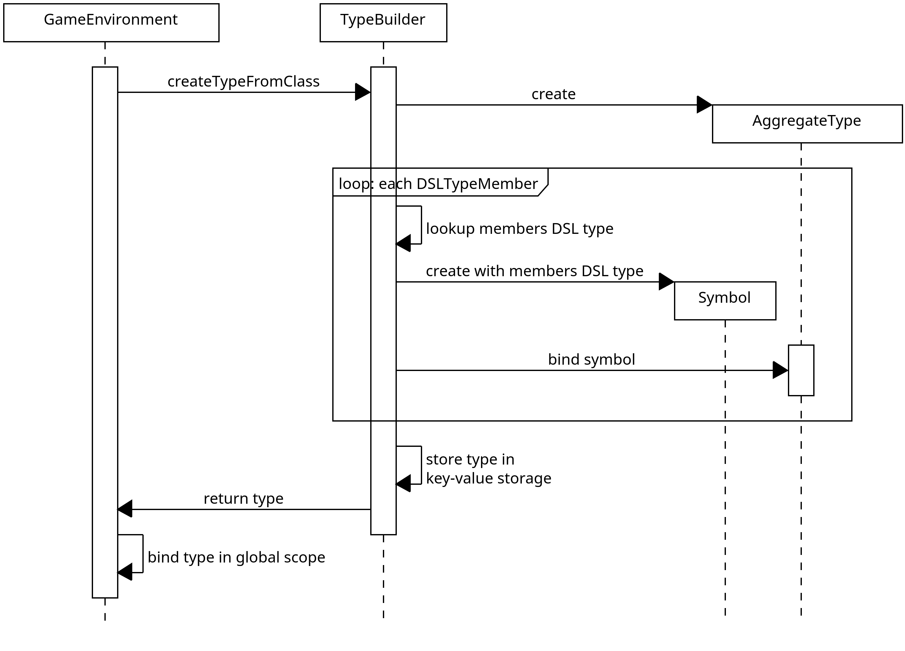
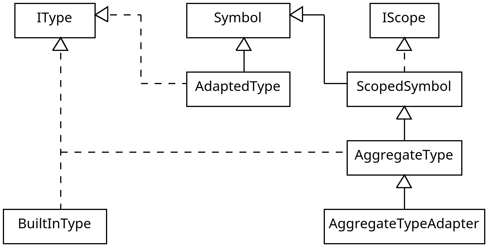

## Was bedeutet Typebuilding im Kontext der DSL?

Das Dungeon Framework verwendet einen komponentenbasierten Ansatz (vgl. [ECS](./../game/ecs.md)), um Entitäten im
Level zu definieren. Die DSL ermöglicht das Definieren von Enitäten in textueller Form (vgl. hierfür [Entitätsdefinition](./sprachkonzepte.md#entitätsdefinition)), indem für einen Entitätstypen festgelegt wird, welche Komponenten in ihm enthalten sein sollen. Hierbei können die Member der Komponenten konfiguriert werden.

Ein Beispiel für einen Entitätstypen names `my_object`, der ein `PositionComponent` und ein `AnimationComponent` hat, könnte so aussehen:

```
game_object my_object {
    position_component {},
    animation_component {
        idle_animation: "path/to/idle/frames"
    }
}
```

Diese Form der Entitätsdefinition erfordert eine Repräsentation der Komponententypen (welche als
Java-Klassen im ECS definiert sind) im DSL Typsystem und eine Verbindung des
DSL Typen mit der Java-Klasse, dessen DSL-Equivalent er ist.
Das folgende Diagramm stellt dar, wie eine Java-Klasse auf der DSL-Seite als `AggregateType`
dargestellt wird.


Um die DSL Typen, die auf diese Weise benötigt werden, nicht manuell implementieren zu müssen, übernimmt der `TypeBuiler` diese Aufgabe automatisch.
Hierzu wird ein Annotation-basierter Ansatz verfolgt.

## Beispiel(e) aus User-Sicht

Die wesentlichen Annotationen sind:
- `DSLType`: Markierung für die Java-Klasse, für die ein DSL Typ erzeugt werden soll
- `DSLTypeMember`: Markierung für die Member der Java-Klasse, welche in dem DSL Typ enthalten sein sollen

Eine Java-Klasse, für die ein DSL Typ generiert werden soll, könnte so aussehen:

```java
@DSLType
public class ComponentClass {
    @DSLTypeMember int member1;
    @DSLTypeMember String member2;
    @DSLTypeMember float member3;
    int member4;
}
```

Aus dieser Klasse kann mit der Methode `TypeBuilder::createTypeFromClass` ein DSL Typ erzeugt werden:

```java
TypeBuilder tp = new TypeBuilder();
AggregateType dslType = tp.createTypeFromClass(Scope.NULL, ComponentClass.class);
```

Der `dslType` enthält drei Symbole, welche `member1`, `member2` und `member3` representieren, die in `ComponentClass` markiert sind.
Die Datentypen sind `BuiltInType.intType`, `BuiltInType.stringType` und `BuiltInType.floatType` respektive.
Der so erzeugte Datentyp kann (nachdem er über ein `IEnvironment` geladen wurde, siehe [Laden von Datentypen](#laden-von-datentypen)) wie folgt in einer Entitätsdefinition verwendet werden:

```
game_ojbect my_obj {
    component_class {
        member1: 42,
        member3: 3.14,
        member2: "Hello, World!"
    }
}
```

### Typ- und Membernamen

Standardmäßig konvertiert der `TypeBuilder` die Namen der Java-Klassen in [snake case](https://en.wikipedia.org//wiki/Snake_case), um ein zu den restlichen DSL Keywords konsistentes Namensschema zu verfolgen. Alternativ akzeptieren `DSLType` und `DSLTypeMember` einen `name`-Parameter, der dieses Standardverhalten überschreibt. Für die oben bereits genutzte `ComponentClass` könnte dies entsprechend verwendet werden:

```java
@DSLType(name="my_component")
public class ComponentClass {
    @DSLTypeMember int member1;
    @DSLTypeMember(name="my_member") String member2;
    @DSLTypeMember float member3;
    int member4;
}
```

Der entsprechende Komponententyp könnte wie folgt in einer Entitätsdefinition verwendet werden:

```
game_ojbect my_obj {
    my_component {
        member1: 42,
        member3: 3.14,
        my_member: "Hello, World!"
    }
}
```

### Laden von Datentypen

Der mit `TypeBuilder::createTypeFromClass` erzeugte Datentyp muss in die [DSL Pipeline](./ueberblick.md#dsl-pipeline) integriert werden.
Hierzu muss der DSL Typ über ein `IEnvironment` Objekt geladen werden. Die Standard `IEnvironment`-Implementierung ist das `GameEnvironment` ([GameEnvironment.java](./../../dsl/src/runtime/GameEnvironment.java)), welches
bereits alle BuiltIn-Datentypen und standardmäßig verfügbaren komplexeren Datentypen (Komponenten-Datentypen) enthält.

```java
// DSL Datentyp erzeugen
TypeBuilder tp = new TypeBuilder();
AggregateType dslType = tp.createTypeFromClass(Scope.NULL, ComponentClass.class);

// DSL Datentyp ins GameEnvironment laden
var env = new GameEnvironment();
env.loadTypes(new IType[] {dslType});

// Vorbereiten des SymbolTableParsers für die semantische Analyse, indem
// das modifiziertei GameEnvironment geladen wird
SymbolTableParser symbolTableParser = new SymbolTableParser();
symbolTableParser.setup(env);

/*
 *  Parsing und AST Erzeugung aus einem DSL Programm (hier ausgelassen)
 */

// Ausführung der semantischen Analyse; die semantischen Informationen werden im
// `IEnvironment` gespeichert, mit dem der `SymbolTableParsers` per `setup`-Methode
// vorbereitet wurde
symbolTableParser.walk(ast);

// Initialisierung der Laufzeitumgebung des DSLInterpreters mit dem `IEnvironment`,
// welches nun die semantischen Informationen des Programms enthält
DSLInterpreter interpreter = new DSLInterpreter();
interpreter.initializeRuntime(env);

// Interpretation des DSL Programms
var questConfig = interpreter.generateQuestConfig(ast);
```

### Einschränkungen

Mit dem oben beschriebenen Mechanismus können DSL Datentypen aus Java-Klassen erstellt werden. Für beide Anwendungsfälle sind folgende Einschränkungen zu beachten:

**Einschränkungen Java-Klasse**

Eine Java-Klasse, die mit `@DSLType` markiert wird, muss folgende Kriterien erfüllen:
- sie muss über einen Default-Konstruktor ohne Parameter verfügen
- falls sie über keinen Default-Konstruktor verfügt, muss sie über einen Konstruktor verfügen, dessen Parameter alle mit `@DSLContextMember` (siehe [Typinstanziierung](interpretation-laufzeit.md#typinstanziierung)) markiert sind
- die Datentypen aller Member, die mit `@DSLTypeMember` markiert sind, müssen entweder Datentypen sein, die mit `@DSLType` markiert oder adaptiert sind, oder sich auf die `BuiltIn`-Datentypen zurückführen lassen (siehe [Typsystem](typsystem.md))

Falls diese Kriterien nicht erfüllt sind, kann der `TypeInstantiator` keine Instanzen der Klasse anlegen. Für weitere Details siehe [Typinstanziierung](interpreation-laufzeit.md#typinstanziierung).

**Einschränkungen Java-Record**

Ein Java-Record, der mit `DSLType` markiert ist, muss folgende Kriterien erfüllen:
- alle Member des Records müssen mit `DSLTypeMember` markiert sein
- die Datentypen aller Member müssen entweder Datentypen sein, die mit `@DSLType` markiert oder adaptiert sind, oder sich auf die `BuiltIn`-Datentypen zurückführen lassen (siehe [Typsystem](typsystem.md))

### Was, wenn eine Klasse nicht ohne Parameter instanziiert werden kann?

Falls es nicht möglich ist, eine Klasse sinnvoll ohne Parameter zu instanziieren,
kann der Kontext-Mechanismus des `TypeBuilder`s genutzt werden. Dies ist beispielsweise für
die `Component`-Klassen des ECS der Fall, da diese zwingend eine Referenz auf
die Entität benötigen, von der die Komponente ein Teil sein soll. Siehe hierzu folgendes
Beispiel aus dem `PositionComponent`:

```java
public PositionComponent(Entity entity) {
    super(entity);
    this.position =
        ECS.currentLevel.getRandomTile(LevelElement.FLOOR).getCoordinate().toPoint();
}
```

**Wichtige Anmerkung: Die Verwendung des `TypeBuilder`-Kontextes setzt (aktuell) zwingend voraus,
dass die Instanziierung einem hierarchischen Muster folgt.**

Ein Beispiel hierfür:
für eine `game_object`-Definition per DSL wird zuerst die entsprechende `Entity`-Instanz erzeugt, bevor
die konfigurierten `Component`-Klassen instanziiert werden. Hierarchisch ist die `Entity`-Instanziierung
also der `Component`-Instanziierung übergeordnet. Nur in diesem Fall kann der im Folgenden beschriebene
Mechanismus verwendet werden. **Das beschriebene Beispiel ist aktuell der einzige Anwendungsfall, in dem
der `TypeBuilder`-Kontext verwendet wird.**

Auf den Kontext des `TypeBuilder`s kann über die Annotationen `DSLContextPush` und `DSLContextMember`
zugegriffen werden. Dies ermöglicht, dass der `TypeBuilder` über alle nötigen Informationen
verfügt, um auch einen Konstruktor mit Parametern aufzurufen (vgl.
hierzu [Einschränkungen Java-Klasse](#einschränkungen)).

Eine mit `DSLType` markierte Klasse (z.B. `Entity`) kann mit `DSLContextPush` markiert werden.
Hierdurch wird bei der Instanziierung einer `Entity`
(vgl. [Typinstanziierung](interpretation-laufzeit.md#typinstanziierung)) die erstellte Instanz
zum Kontext des `TypeBuilder`s hinzugefügt (als "Kontextmember").
Der Name des hinzugefügten Kontextmembers muss über das `name`-Attribut der
`DSLContextPush`-Annotation festgelegt werden. Über diesen Namen kann der `TypeBuilder` auf
die erstellte Instanz zugreifen. Das folgende Beispiel zeigt diese Verwendung in der `Entity`-Klasse:

```java
@DSLType(name = "game_object")
@DSLContextPush(name = "entity")
public class Entity {
    private static int nextId = 0;
    public final int id = nextId++;
    // ...
```

Mit der `DSLContextMember` Annotation kann ein Konstruktorparameter markiert werden, den der
`TypeBuiler` aus dem Kontext lesen soll.
Hierzu muss der `DSLContextMember` der Name des Kontextmembers an das `name`-Attribut übergeben
werden.
Dieser Wert muss dem Wert entsprechen, der auch der `DSLContextPush`-Annotation für
die Erstellung des Kontextmembers übergeben wurde.

```java
public PositionComponent(@DSLContextMember(name = "entity") Entity entity) {
    super(entity);
    this.position =
        ECS.currentLevel.getRandomTile(LevelElement.FLOOR).getCoordinate().toPoint();
}
```

## Typadaptierung

Einige Komponenten des ECS (bspw. `AnimationComponent`) verwenden für ihre Member Datentypen, die außerhalb
des `Dungeon`-Projekts definiert sind (im Folgenden "externe Datentypen"). Ein Beispiel hierfür ist die
im `PM Dungeon` definierte `Animation`-Klasse, die für Member des `AnimationComponent` verwendet werden.

Da die Definition eines externen Datentyps außerhalb des `Dungeon`-Projekts liegt, kann die
entsprechende Klasse nicht mit der `DSLType`-Annotation markiert werden. Das hat zur Folge, dass der bisher
beschriebene Mechanismus des Typebuildings nicht für externe Datentypen genutzt werden kann. Dies verhindert
die direkte Abbildung dieser externen Datentypen im DSL Typsystem. Daraus folgt, dass ein Member einer mit
`@DSLType` markierten Klasse, nicht ohne Weiteres über die DSL konfigurierbar ist, wenn er einen externen
Datentyp verwendet.

Ein Beispiel ist im folgenden Snippet zu sehen. Hier verwendet `member2` einen Datentyp aus einer externen Bibliothek.
```java
import some.external.library.ExternalType;

@DSLType
public class Component {
    @DSLTypeMember int member1;
    @DSLTypeMember ExternalType member2;
}
```

Um diese Member, die einen externen Datentyp verwenden, trotzdem über die DSL konfigurierbar zu machen, kann
ihr Datentyp 'adaptiert' werden.
Hierzu kann eine statische Methode mit `@DSLTypeAdapter` markiert werden. Dabei muss über den `t`-Parameter
definiert werden, welcher Java-Datentyp über die Methode adaptiert werden soll.

Das weitere Vorgehen für die Typadaptierung unterscheidet zwischen zwei Fällen
1. es ist nur ein Parameter nötig, um eine Instanz des zu adaptierenden Datentypen zu erzeugen
2. es sind mehr als ein Parameter nötig, um eine Instanz des zu adaptierenden Datentypen zu erzeugen

### 1. Nur ein Parameter nötig

Beispiel:

```java
public class ExternalTypeBuilder {
    @DSLTypeAdapter(t = ExternalType.class)
    public static ExternalType buildExternalType(String param) {
        return new ExternalType(param, otherParameter);
    }
}
```

Die Klasse, in der die so markierte Builder-Methode definiert ist, muss im `TypeBuilder` über
die `registerTypeAdapter`-Methode registriert werden.

```java
TypeBuilder tb = new TypeBuilder();
tb.registerTypeAdapter(ExternalTypeBuilder.class, Scope.NULL);
```

Für alle standardmäßig verfügbaren adaptierten Datentypen ist dies
bereits im `GameEnvironment` ([GameEnvironment.java](./../../dsl/src/runtime/GameEnvironment.java))
in der Methode `registerDefaultTypeAdapters` implementiert.

Für die Konfiguration des Members wird der Datentyp des Parameters der Builder-Methode verwendet.
Für die oben definierte Methode `buildExternalType` ist das `String`. Die Konfiguration per DSL
würde wie folgt aussehen:

```
game_object my_obj {
    component {
        member1: 42,
        member2: "Parameter"
    }
}
```

### 2. Mehr als ein Parameter nötig

Die Builder-Methode für Datentypen zu deren Instanziierung mehr als ein Parameter nötig ist, wird ähnlich
markiert, wie Builder-Methoden mit einem einzigen Parameter. Allerdings besteht die Möglichkeit, die Parameter
der Builder-Methode mit der `DSLTypeMember`-Annotation zu markieren und so den Namen, der für die
Repräsentation dieses Parameters in der DSL verwendet werden soll, vorzugeben.

```java
public class ExternalTypeBuilder {
    @DSLTypeAdapter(t = ExternalType.class)
    public static ExternalType buildExternalType(@DSLTypeMember(name="number") int n, @DSLTypeMember(name="str") String param) {
        return new ExternalType(n, param);
    }
}
```

Die Konfiguration über die DSL kann wie folgt vorgenommen werden:

```
game_object my_obj {
    component {
        member1: 42,
        member2: external_type {
            number: 123,
            str: "Hallo"
        }
    }
}
```


## Implementierung

### Typebuilding

Der grobe Ablauf des Typebuildings, welches vom GameEnvironment für alle
standardmäßig verfügbaren Datentypen ausgeführt wird, ist im folgenden
Sequenzdiagramm abgebildet:



### Typadaptierung

Der Ablauf der Typadaptierung unterscheidet sich abhängig von der Menge der benötigten Parameter
(analog zu der Beschreibung in [Typadaptierung](#typadaptierung)).

Der Ablauf für den Fall, dass nur ein Parameter zur Instanziierung nötig ist,
kann dem folgenden Sequenzdiagramm entnommen werden:


Für den Fall, dass mehr als ein Parameter zur Instanziierung nötig ist, ähnelt
die Erstellung des `AggregateTypeAdapter` dem normalen [Typebuilding](#typebuilding),
wie im folgenden Sequenzdiagramm zu erkennen:


Das folgende UML Diagramm zeigt, in welcher Beziehung die beiden Adapterklassen
`AdaptedType` und `AggregateTypeAdapter` zum Rest des Typsystems stehen:


