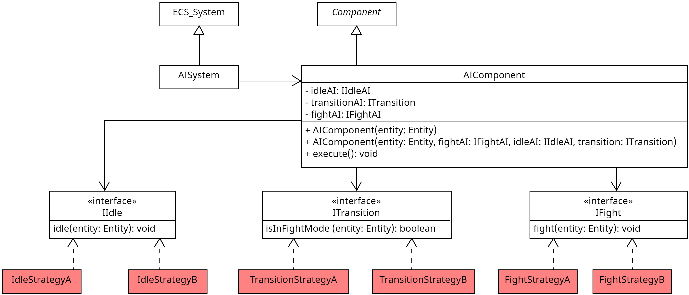

## Wofür

Das `AIComponent` wird verwendet, um eine Entität verhalten zu geben. Dabei gibt es zwei Zustände, `idle` und `fight`,
welche durch die `transitionAI` bestimmt werden.

## Aufbau

## Wie nutzt man es

### Erzeugen - Möglichkeit 1

Erzeugen eines neuen `AIComponent`-Objektes mithilfe des einfachen Konstruktors `AIComponent(entity: Entity)`. Hierbei
wird der Entität das Standardverhalten zugewiesen:
- IdleAI: `RadiusWalk` mit `Radius=5` und `breakTimeInSeconds=2`
- TransitionAI: `RangeTransition` mit `Range=5.0f`
- FightAI: `CollideAI` mit `RushRange=2.0f`

### Erzeugen - Möglichkeit 2

Erzeugen eines neuen `AIComponent`-Objektes mithilfe des Konstruktors `AIComponent(entity: Entity, idleAI: IIdleAI, fightAI: IFightAI, transition: ITransition)`.
Hierbei werden die übergebenen Verhaltensimplementationen verwendet.

### Verhalten

> ## IdleAI
> Die IdleAI wird verwendet, wenn sich eine Entität im Idle-Zustand befindet. Dies kann zum Beispiel das zufällige Herumlaufen
> sein, oder das einfach nur stehen bleiben.

> ## Transition
> Die Transition wird verwendet, um zu bestimmen, wann die Entität sich in welchem, also `idle` oder `fight`, Zustand befindet.
> Eine Implementation wird durch das `ITransition`-Interface definiert. Dabei gibt die Methode `isInFightMode(entity: Entity): boolean` `true` zurück,
> sollte sich die Entität im `fight`-Zustand befinden, ansonsten `false`.

> ## FightAI
> Die FightAI wird verwendet, wenn sich eine Entität im Fight-Zustand befindet. Dies kann zum Beispiel das Verfolgen des Gegners oder das
> Kollidieren mit ihm sein. Eine Implementation wird durch das `IFightAI`-Interface definiert. Dabei gibt die Methode `fight(entity: Entity): void` vor wie
> sich die Entität im `fight`-Zustand verhalten soll.

### Methoden

> ## execute(): void
>
> Führt das Verhalten der Entität aus. Dabei wird zuerst die Transition überprüft, ob sich die Entität im `fight`- oder `idle`-Zustand befindet.
> Anschließend wird das Verhalten der Entität entsprechend ausgeführt.
