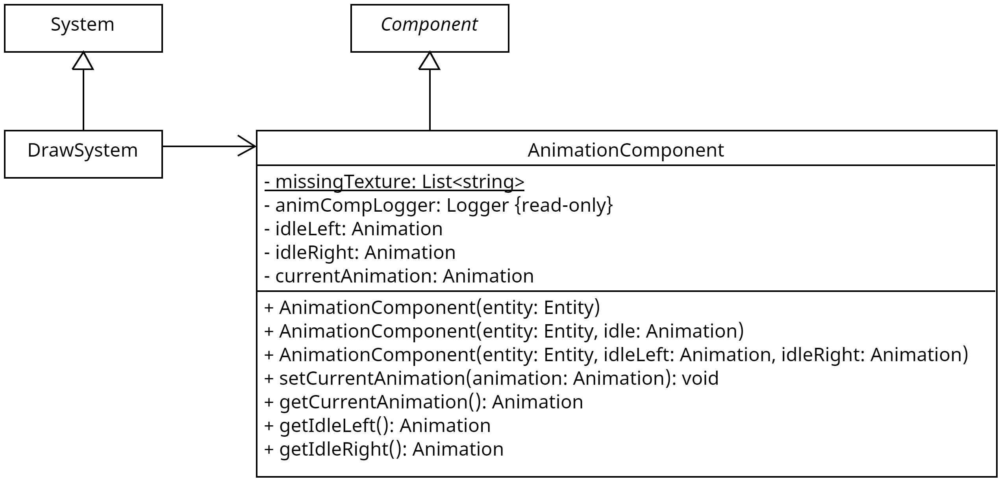

## Wofür

Das `AnimationComponent` ist dafür zuständig, die Animationen einer Entität zu verwalten. Es arbeitet mit dem `DrawSystem`
zusammen, welches im Endeffekt dafür sorgt, dass irgendetwas auf dem Bildschirm angezeigt wird. Es gibt immer eine aktuelle
Animation, die von einer Entität abgespielt wird. Diese Animation kann während der Laufzeit durch die entsprechenden Methodenaufrufe
geändert werden.

## Aufbau

## Wie nutzt man es

### Erzeugen - Möglichkeit 1

Erzeugen eines neuen `AnimationComponent`-Objektes mithilfe des einfachen Konstruktors `AnimationComponent(entity: Entity)`. Hier werden alle Animationen
auf die Standardwerte, daher auf eine "missing texture" Animation gesetzt.

### Erzeugen - Möglichkeit 2

Erzeugen eines neuen `AnimationComponent`-Objektes mithilfe des komplexeren Konstruktors `AnimationComponent(entity: Entity, idleAnimation: Animation)`. Die hier
übergebene Idle-Animation wird für beide Richtungen, daher für `idleLeft` und `idleRight` verwendet.

### Erzeugen - Möglichkeit 3

Erzeugen eines neuen `AnimationComponent`-Objektes mithilfe des komplexeren Konstruktors `AnimationComponent(entity: Entity, idleLeft: Animation, idleRight: Animation)`.
Hier werden die Animationen entsprechend der Parameternamen gesetzt.

### Methoden

> ## setCurrentAnimation(animation: Animation): void
>
> Setzt die aktuelle Animation der Entität. Die hier übergebene Animation muss ***NICHT*** aus dem `AnimationComponent` stammen.
>
> ### Parameter
>
> | Parametername | Typ       | Beschreibung                                 |
> |---------------|-----------|----------------------------------------------|
> | animation     | Animation | Die Animation, welche angezeigt werden soll. |

> ## getCurrentAnimation(): Animation
>
> Gibt die aktuelle Animation zurück.

> ## getIdleLeft(): Animation
>
> Gibt die Idle-Animation für die Links zurück.

> ## getIdleRight(): Animation
>
> Gibt die Idle-Animation für Rechts zurück.
