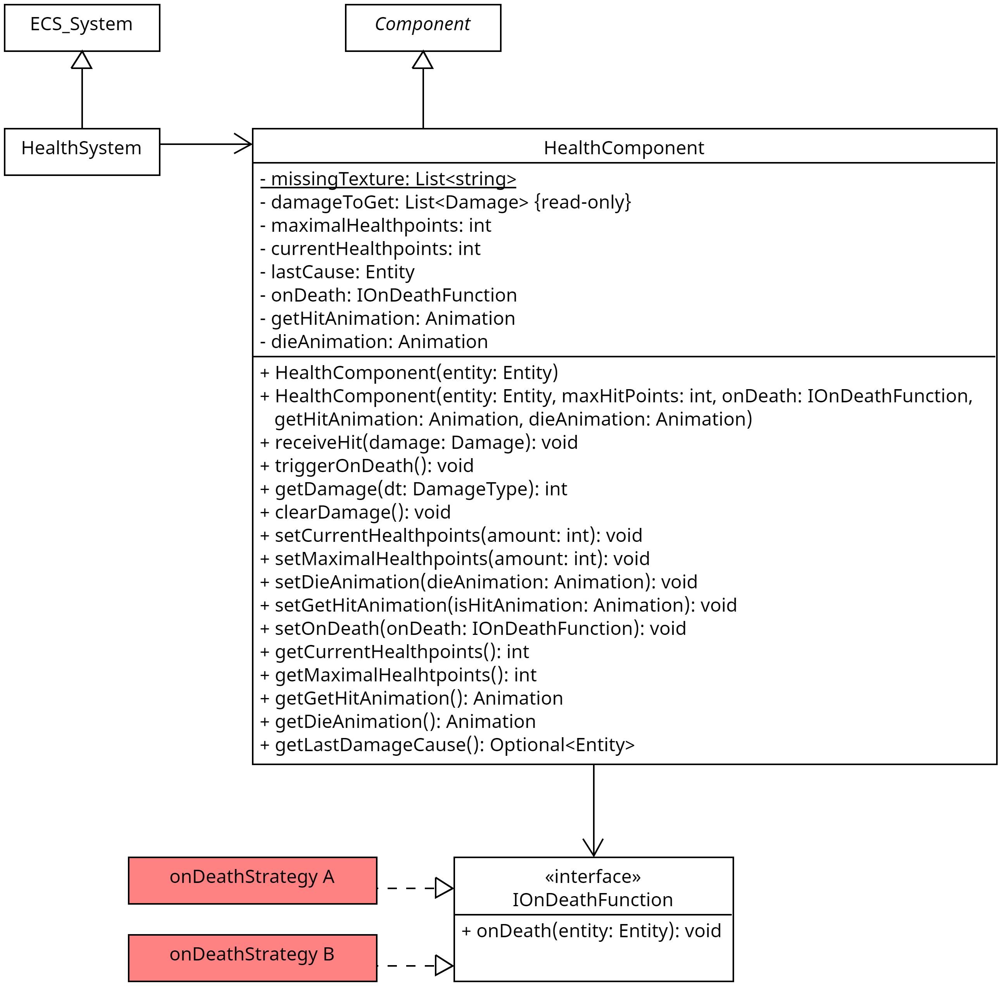

## Wofür

Das `HealthComponent` gibt einer Entität die Möglichkeiten Lebenspunkte zu haben, Schaden zu nehmen und zu sterben.
Zusätzlich gibt es die Möglichkeit eine Sterbeanimation hinzuzufügen, die abgespielt wird, sollte die Entität sterben.
Auch lässt sich via `IOnDeathFunction` bestimmen, was passiert, wenn die Entität stirbt.

## Aufbau

### UML

## Wie nutzt man es

### Erzeugen - Möglichkeit 1

Erzeugen eines neuen `HealthComponent` Objektes mithilfe des einfachen Konstruktors `HealthComponent(entity: Entity)`.
Dieser setzt Standardwerte für die `onDeaht`-Function und die zwei Animationen `dieAnimation` udn `getHitAnimation`.

### Erzeugen - Möglichkeit 2

Erzeugen eines neuen `HealthComponent` Objektes mithilfe des expliziteren
Konstruktors `HealthComponent(entity: Entity, maxHitPoints: int, onDeath: IOnDeathFunction, getHitAnimation: Animation, dieAnimation: Animation)`.

| Parametername   | Typ              | Beschreibung                                                       |
|-----------------|------------------|--------------------------------------------------------------------|
| entity          | Entity           | Die Entity, der das HealthComponent hinzugefügt wird               |
| maxHitPoints    | int              | Die maximalen Lebenspunkte der Entität                             |
| onDeath         | IOnDeathFunction | Die Funktion, die aufgerufen wird, wenn die Entität stirbt         |
| getHitAnimation | Animation        | Die Animation, die abgespielt wird, wenn die Entität Schaden nimmt |
| dieAnimation    | Animation        | Die Animation, die abgespielt wird, wenn die Entität stirbt        |

### Methoden

> ## receiveHit(damage: Damage): void
>
> Füge der zugehörigen Entität Schaden hinzu.
>
> ### Parameter
>
> | Parametername | Typ     | Beschreibung                             |
> |---------------|---------|------------------------------------------|
> | damage        | Damage  | Der Schaden, der hinzugefügt werden soll |

> ## triggerOnDeath(): void
>
> Löst die hinterlegte `onDeath`-Funktion aus.

> ## getDamage(dt: DamageType): int
>
> Gibt den Schaden zurück, den die Entität im nächsten Tick von einem bestimmten `DamageType` erhält
>
> ### Parameter
>
> | Parametername | Typ         | Beschreibung                                              |
> |---------------|-------------|-----------------------------------------------------------|
> | dt            | DamageType  | Der Schadenstyp, dessen Schaden zurückgegeben werden soll |

> ## clearDamage(): void
>
> Setzt den Schaden, den die Entität im nächsten Tick erhält, auf 0 zurück.

> ## setCurrentHealthpoints(amount: int): void
>
> Setzt die aktuellen Lebenspunkte der Entität auf einen bestimmten Wert.
>
> ### Parameter
>
> | Parametername | Typ | Beschreibung                       |
> |---------------|-----|------------------------------------|
> | amount        | int | Der neue Wert für die Lebenspunkte |

> ## setMaximalHealthpoints(amount: int): void
>
> Setzt die maximalen Lebenspunkte der Entität auf einen bestimmten Wert.
>
> ### Parameter
>
> | Parametername | Typ | Beschreibung                                  |
> |---------------|-----|-----------------------------------------------|
> | amount        | int | Der neue Wert für die maximalen Lebenspunkte  |

> ## setDieAnimation(dieAnimation: Animation): void
>
> Setzt die Animation, die abgespielt wird, wenn die Entität stirbt.
>
> ### Parameter
>
> | Parametername | Typ       | Beschreibung                                   |
> |---------------|-----------|------------------------------------------------|
> | dieAnimation  | Animation | Die neue Animation, die abgespielt werden soll |

> ## setGetHitAnimation(getHitAnimation: Animation): void
>
> Setzt die Animation, die abgespielt wird, wenn die Entität Schaden nimmt.
>
> ### Parameter
>
> | Parametername   | Typ       | Beschreibung                                   |
> |-----------------|-----------|------------------------------------------------|
> | getHitAnimation | Animation | Die neue Animation, die abgespielt werden soll |

> ## setOnDeath(onDeath: IOnDeathFunction): void
>
> Setzt die Funktion, die aufgerufen wird, wenn die Entität stirbt.
>
> ### Parameter
>
> | Parametername | Typ              | Beschreibung                                   |
> |---------------|------------------|------------------------------------------------|
> | onDeath       | IOnDeathFunction | Die neue Funktion, die aufgerufen werden soll  |

> ## getCurrentHealthpoints(): int
>
> Gibt die aktuellen Lebenspunkte der Entität zurück.

> ## getMaximalHealthpoints(): int
>
> Gibt die maximalen Lebenspunkte der Entität zurück.

> ## getDieAnimation(): Animation
>
> Gibt die Animation, die abgespielt wird, wenn die Entität stirbt, zurück.

> ## getGetHitAnimation(): Animation
>
> Gibt die Animation, die abgespielt wird, wenn die Entität Schaden nimmt, zurück.

> ## getLastDamageCause(): Optional<Entity>
>
> Gibt die Entität zurück, die den letzten Schaden verursacht hat.
