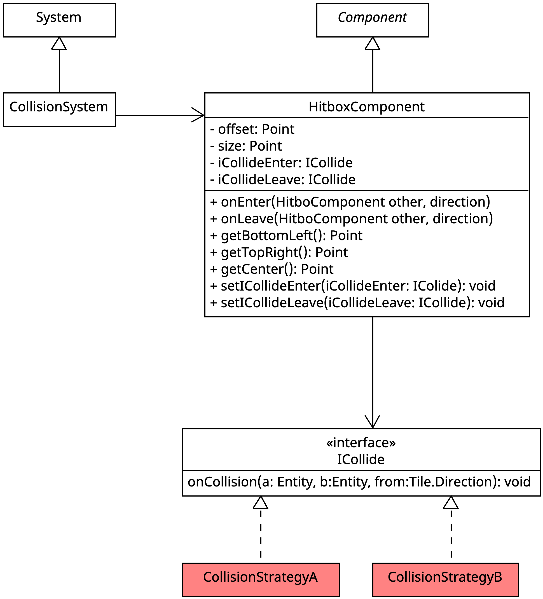

## Wofür
Die Hitboxkomponente ist dafür da eine Entität zu kennzeichnen das sie mit anderen Entitäten die auch diese Komponente besitzen zusammenstoßen kann.
Sowie das Verhalten welches die aktuelle Entität haben soll wenn es zu einer Kollision kommt.

## Aufbau

## Wie nutzt man es

Parameter
entity -> Die Entität welcher diese Komponente hinzugefügt werden soll.
offset -> Das Offset für die Hitbox damit diese z.b Mehr mit der Texture übereinstimmt-
Size -> Die Größe für die Hitbox. 
iCollideEnter -> Die Strategie die ausgeführt werden soll sobald eine Kollision beginnt.
iCollideLeave -> Die Strategie die ausgeführt werden soll sobald eine Kollision endet.

Konstruktoren
Einfachster bekommt nur die Entität und nutzt für alle anderen Paramter die als Default hinterlegten werte.
Der Nächst komplexere bekommt zu der Entität auch noch die Strategien mit gegeben.
Der Komplexeste hat alle Parameter die angegeben wurden.

Wenn eine Strategie nicht angegeben wurde also null dann wird nichts bei der jeweiligen Situation passieren.

## Implentierungen der Strategien
### Strategie Pattern
#### Wofür
Das Verhalten der Einzelnen Entitäten bei einer Kollision soll nicht durch unterschiedliche Hitboxen vererbung erstellt werden sollen sondern individuell angepasst werden.
#### Aufbau
Für die Kollision muss eine strategie hinterlegt werden diese ist im Interfact ICollide definiert. Diese verfügt über drei Parameter: die primäre Entität, die Entität mit der die Kollision passiert und die Richtung aus der die Kollision statt fand. 
#### Nutzen
Da die Kollision ein nicht fest vorgegebene Struktur hat kann unterschiedlichstes Verhalten einer Kollision erstellt werden. z.b. einen Effekt dem Spieler geben, dem Spieler schaden zufügen etc.

## Testabdeckung
100 % abdeckung bei beiden Möglich