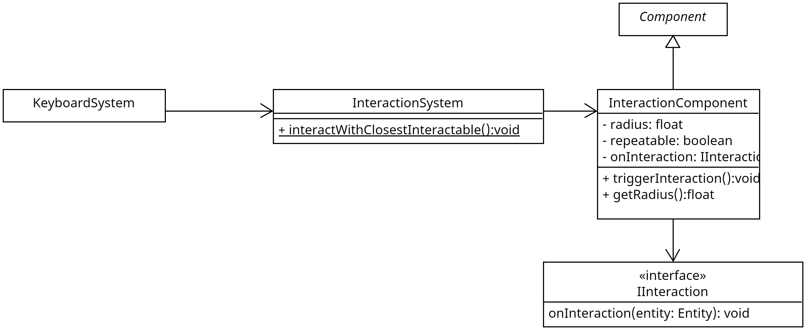

## Wofür

Kennzeichnen, ob der Spieler mit der Komponente interagieren kann.
Stellt eine Interaktionsreichweite bereit sowie ein funktionales Interface für das
Abhandeln des Geschehens.

## Aufbau

To-do: nach Besprechung von Umfang UMLs besprechen.


Die Interaktionskomponente besitzt die grundlegenden Informationen wie und wann interagiert werden darf.
Einmal gibt es den Radius welcher die maximale Entfernung angibt, in welcher eine Interaktion stattfinden darf.
Das Flag `repeatable` ermöglicht es zu bestimmen, ob mit der Entität mehrmals `true` oder nur einmal `false` interagiert werden darf.
Mit dem Interface `IInteraction` kann das verhalten angegeben werden, welches ausgeführt werden soll, wenn der Held mit der Entität interagiert.

## Wie nutzt man es

Der komplexere Konstruktor erlaubt es einen den Radius, ob es wiederholbar ist und die Interaktion direkt zu bestimmen.
Der kleine Konstruktor legt mit den Defaultwerten für Radius, Wiederholbarkeit sowie Interaktion an.

Bei beiden Konstruktoren muss der Entität nicht die Komponente extra hinzugefügt werden.

triggerInteraction erlaubt es eine Interaktion jederzeit auszuführen und wenn die Interaktion einmalig ist, wird die Komponente von der Entität entfernt.


## Testabdeckung

Bis auf die `InteractionComponent#DefaultInteraction` sind für alle Methoden Tests vorhanden. 
Die Defaultinteraktion ist ein ausgeben auf der Konsole und dadurch schwer zu testen bzw. ist das Testen sehr unschön.
```
    @Test
    public void defaultInteraction() {
        final PrintStream originalOut = System.out;
        ByteArrayOutputStream byteArrayOutputStream = new ByteArrayOutputStream();

        System.setOut(new PrintStream(byteArrayOutputStream));

        Entity e = new Entity();


        InteractionComponent.DefaultInteraction(e);

        System.setOut(originalOut);

        assertTrue(byteArrayOutputStream.toString().contains(Integer.toString(e.id)));
    }
```
