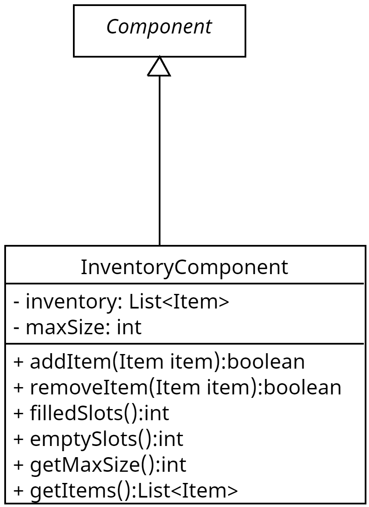

## Wofür

Diese Komponente implementiert ein Inventar und ermöglicht es Entitäten verschiedene Items aufzusammeln,

Es besitzt eine Liste welche mit `Item`s gefüllt werden kann. Außerdem besitzt es eine Kapazität(`maxSize`) (maximale Anzahl an Items) für das
Inventar.

## Aufbau

Die Inventarkomponente benutzt kein System da keine Aktualisierungen zur Laufzeit existiert. Der Aufbau ist simple gehalten und ist aktuell ein Itemanzahl-Prinzip und nicht ein Gewicht bzw. Volumensystem. Das heißt es ist egal, wie groß ein Item ist oder wie schwer es ist. Der Spieler kann also z.b. 10 Schwerter mit sich Tragen oder 10 Zettel.

## Wie nutzt man es

Der Konstruktor nutzt zwei Parameter, der erste ist wie bei jeder Komponente die Entität, an dem die Komponente
angehangen werden soll. Der zweite Parameter ist die Größe des Inventars, hier wird eine positive Ganzzahl erwartet,
welche größer als 0 ist.

Die Methode `addItem` erlaubt es einen ein `Item` zum Inventar hinzuzufügen hier zu muss ein `Item` übergeben werden.
Der Rückgabewert hier ist immer `true`, wenn es erfolgreich war, das `Item` hinzuzufügen. Und es wird ein `false`
zurückgegeben, wenn das `Item` nicht hinzugefügt wurde, Gründe dafür können sein: Es wird versucht ein `Item` hinzuzufügen, welches bereits im Inventar
vorhanden ist oder wenn das `Item` nicht mehr ins Inventar passt.

Die Methode `removeItem` erlaubt es, ein `Item` aus dem Inventar zu entfernen. Der Rückgabewert hier ist immer `true`,
wenn das `Item` entfernt wurde. Wenn das `Item` nicht entfernt werden kann, z.b. da es nicht im Inventar existiert, wird ein `false`
zurückgegeben.

Die 3 Methoden `filledSlots`, `emptySlots` und `getMaxSize` existieren, um den aktuellen Status des Inventars zu
kontrollieren.

## Testabdeckung

Es kann und wird alles getestet. Es gibt hier nur einfach zu testene Elemente.

