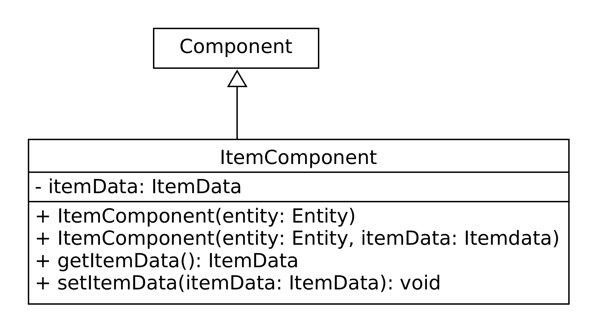

## Wofür

Das `ItemComponent` ist zuständig eine Entity als Item zu kennzeichnen
und dessen Itemeigenschaften zu verwalten.

## Aufbau

## Wie nutzt man es

### Erzeugen - Möglichkeit 1

Erzeugen eines `ItemComponent`-Objektes mithilfe des einfachen Konstruktors
`ItemComponent(entity: Entity)`. Hierbei wird keine ItemData zugewiesen und
muss noch manuell per `setItemData(itemData: ItemData): void` erledigt werden.

### Erzeugen - Möglichkeit 2

Erzeugen enes `ItemComponent`-Objektes mithilfe des komplexeren Konstruktors
`ItemComponent(entity: Entity, itemData: ItemData)`. Die hier mitgegebene ItemData
wird im ItemComponent hinterlegt.

## Methoden

### getItemData(): ItemData

Gibt die aktuelle ItemData zurück

### setItemData(itemData: ItemData): void

Setzt die aktuelle ItemData der Entität

#### Parameter

| Parametername | Typ      | Beschreibung                                                 |
|---------------|----------|--------------------------------------------------------------|
| itemData      | ItemData | Objekttyp der Informationen zu dem spezifischen Item enthält |
