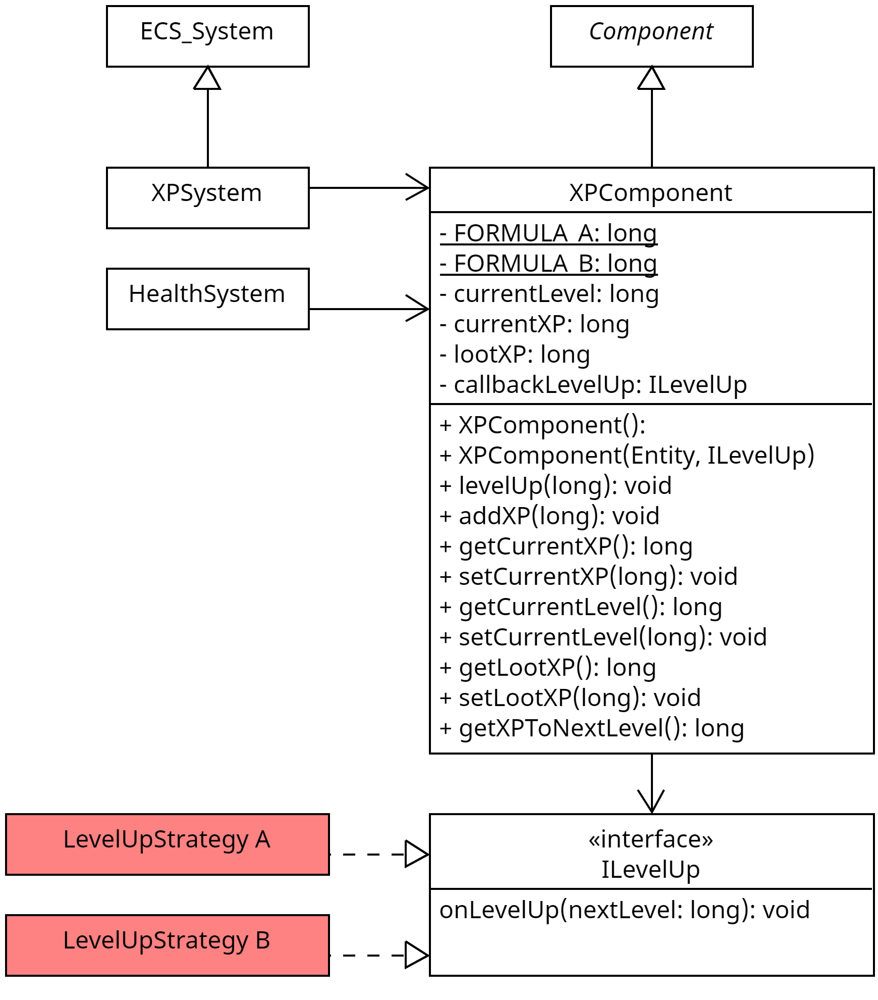

## Wofür
- Einer Entität die Möglichkeit geben XP zu sammeln und Level aufzusteigen.
- Zähl gesammelte XP Punkte und das aktuelle Level.

## Aufbau

- XPSystem prüft, ob ein LevelUp stattfinden muss (`getXPToNextLevel()` gibt `<= 0` zurück) und führt dieses durch
- HealthSystem fügt XP hinzu, wenn ein gegner getötet/zerstört wird

## Wie nutzt man es
- Hinzufügen der Komponente `XPComponent` zu einer Entität durch Erzeugen eines neuen
XP-Component-Objekts, bei dem als Konstruktorparameter die Entität übergeben wird.
- `LEVEL_1_XP` & `FORMULA_SLOPE` sind zwei Parameter zum Anpassen Formel zur Berechnung der benötigten XP pro Level.
  - `LEVEL_1_XP` ist die XP, die für das Erreichen des ersten Levels benötigt wird. (Y-Achsenabschnitt)
  - `FORMULA_SLOPE` ist die Steigung der Funktion, daher wie stark die Anzahl an benötigten XP pro level steigt.
- Implementation einer Aktion bei LevelUp durch Strategy-Pattern via `ILevelUp` Interface
  - Methode `onLevelUp(long level)`, im Interface, wird vom XPSystem aufgerufen, wenn ein LevelUp stattfindet.
  - Interface-Implementation wird in XPComponent-Constructor übergeben

## Testabdeckung
- Es werden alle Methoden der Funktion getestet.
