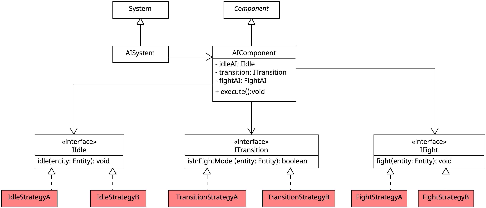

# Strategy Pattern im ECS

Auch wenn es nicht streng im Sinne des ECS-Paradigmas ist, hat sich die Verwendung des Strategy-Pattern als besonders hilfreich herausgestellt. 

## Wofür 

Wir verwenden das Strategy-Pattern vor allem in Komponenten, welche ausnahmsweise kleine eigenen Logiken implementieren (müssen). Beispiel: AI-Verhalten. 

In Zukunft sollen die in der DSL geschriebenen Funktionen als mögliche Strategien repräsentiert werden. 

## Wie

Eine Strategie wird über ein funktionales Interface umgesetzt. 

Eine `Component` speichert eine Referenz auf eine konkrete Implementierung (Lambda-Ausdruck, Methodenreferenz, Instanz einer implementierenden Klasse). 
Über diese Referenz kann dann die konkrete Strategie ausgeführt werden.

Mit der `void execute()`-Methode einer Komponente wird die Referenz die konkrete Strategie aufgerufen. 
Die `#execute`-Methode kann dann vom zuständigen System aufgerufen werden. 

## Bereits implementierte Strategy-Pattern

Bereits implementierte Strategien:

### AIComponent

*Anmerkung*: UML auf die wesentlichen Bestandteile gekürzt.

*Anmerkung*: Die rot hinterlegten Klassen sind konkrete Implementierungen des Interfaces.