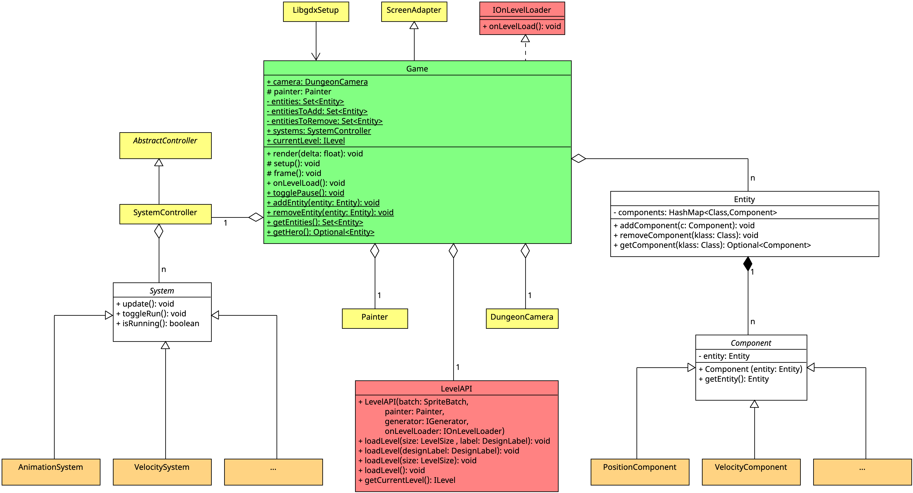

Im Projekt wird das [ECS-Paradigma](https://en.wikipedia.org/wiki/Entity_component_system) angewendet.

## Was ist ein ECS (Kurzform)

**Entität**
Entitäten sind die Objekte im Spiel. Im Code sind sie nur leere Container, dessen Eigenschaften über die zugewiesenen Components bestimmt werden. Entitäten haben neben den Components keine eigenen Attribute oder Funktionen.

**Component**
Components sind die Datensätze der Entitäten und beschreiben dadurch die Eigenschaften der Entitäten. Eine Component-Instanz gehört zu genau einer Entität.

Components speichern im Regelfall nur die Daten/den Zustand einer Entität.
In Ausnahmefällen kann es erforderlich sein, zusätzliche Logik in Components zu implementieren. Der Umfang sollte in diesen Fällen möglichst klein gehalten werden, da die Logik normalerweise in den Systemen realisiert wird.
Siehe auch [Strategy Pattern im ECS](ecs_and_strategy_pattern.md)

**System**
Systeme agieren auf den Components und ändern die Werte in diesen. Sie beschreiben also das Verhalten der Entitäten. Ein System kann auf ein oder mehreren Components agieren.
In Systemen wird die eigentliche Logik implementiert.

Der Zustand einer Entität wird also über ihre Components bestimmt, und ihr Verhalten über die Systeme, die mit der jeweiligen Component-Kombination arbeiten.

## Basisstruktur

*Anmerkung:* Das UML ist für bessere Lesbarkeit auf die wesentlichen Bestandteile gekürzt.

Die in Grün gekennzeichnete Klasse `Game` ist die Basisklasse, von der alles ausgeht. Die Methode `Game#render` ist die Game-Loop. Das ECS wird durch die in weiß gekennzeichneten Klassen `Entity`, `Component` und `ECS_System` implementiert.

Die LevelAPI generiert, zeichnet und speichert das aktuelle [Level](../level/readme.md). Klassen, die rot gekennzeichnet sind, gehören dazu.

Neu erzeugte Entitäten speichern sich automatisch im HashSet `entities` der `Game`-Klasse ab.
`ECS_System`e speichern sich automatisch im `SystemController` `systems` der `Game`-Klasse ab.

Die Systeme iterieren über die in `Game` gespeicherten Entitäten und greifen über die Methode `Entity#getComponent` auf die für die jeweilige Funktionalität benötigten Components zu. Die orangefarbenen `System`s und `Controller` sind in dem UML-Diagramm Beispiele für die bereits bestehenden `System`s und `Controller`.

Die in Gelb hinterlegten Klassen stammen aus dem PM-Dungeon-Framework. Für ein Basisverständnis des Dungeons ist ein Wissen über die Funktionalität dieser Klassen nicht nötig.

## Integration des ECS in die Game-Loop

Um die Systeme in die GameLoop zu integrieren, wird ein Objekt vom Typ `SystemController` genutzt. Er hält die Menge aller vorhandenen Systeme und ruft einmal pro Frame für jedes System die `update`-Methode. Die Registrierung der Systeme beim Controller wird über den Konstruktor der Klasse `ECS_System` erledigt - dadurch müssen abgeleitete Systeme dies nicht selbst machen.
