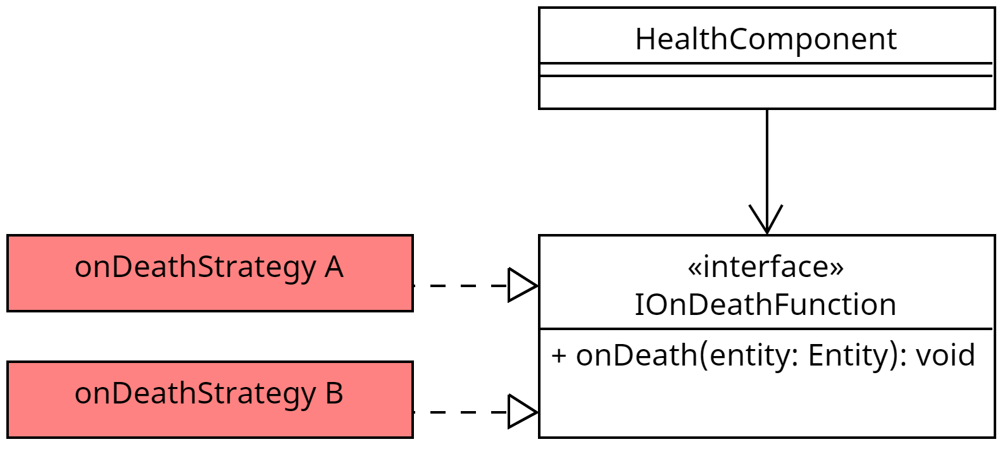

## Wofür

Das `IOnDeathFunction` Interface wird genutzt, um eine Funktion zu definieren, die aufgerufen wird, wenn eine Entität stirbt. Ein Object der Implementation des Interfaces
kann im [`HealthComponent`](../components/health_component.md) hinterlegt werden. Das [`HealthSystem`](../systems/health_system.md) ruft beim Tod einer
Entität die `onDeath` Funktion in diesem Interface auf. 

## Aufbau

## Methoden

### onDeath(entity: Entity): void

Wird aufgerufen, wenn die Entität stirbt.

## Vorhandene Implementationen

- [`OnDeathDropLoot`](../gameelements/on_death_drop_loot.md)