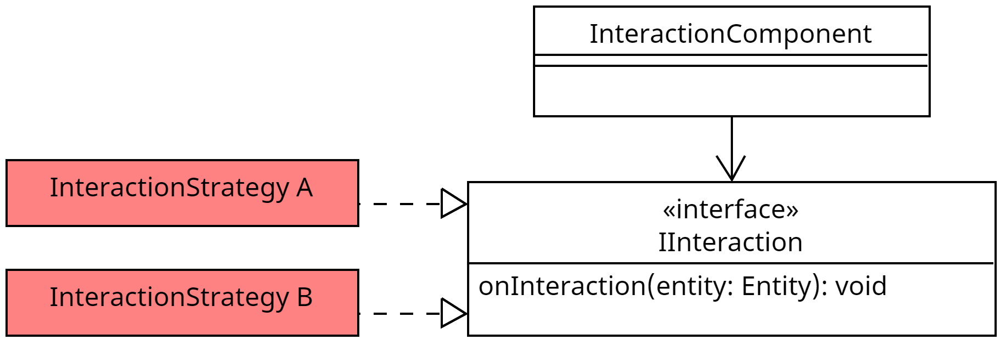

## Wofür

Das `IInteraction` Interface wird genutzt, um eine Funktion zu definieren, die aufgerufen wird, wenn
mit einer Entität interagiert wird. Ein Objekt der Implementation des Interfaces kann
im [`InteractionComponent`](../components/interaction_component.md) hinterlegt werden. Von dort aus wird die
Funktion, wenn mit der Entität interagiert wird, aufgerufen.

## Aufbau

## Methoden

### onInteraction(entity: Entity): void

Wird aufgerufen, wenn mit der Entität interagiert wird.

#### Parameter

| Parameter | Typ    | Beschreibung                            |
|-----------|--------|-----------------------------------------|
| entity    | Entity | Die Entität, mit der interagiert wurde. |

## Vorhandene Implementationen

- [`DropItemsInteraction`](../gameelements/dropItemsInteraction.md)
