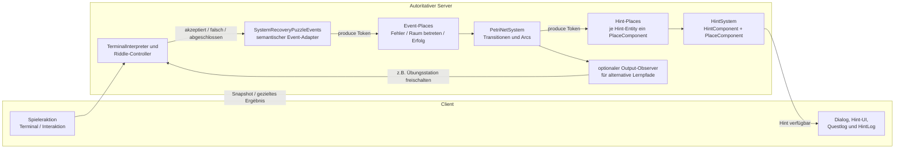

# Petri-Netz-Konzept für System Recovery

> **Überholt:** Dieses Dokument beschreibt den ersten, zu feingranularen serverseitigen POC.
> Für neue Änderungen gilt ausschließlich
> [`system_recovery_progress_hint_rework.md`](system_recovery_progress_hint_rework.md). Insbesondere
> dürfen Tür-, Display-, Item-, Scanner- und Animationszustände nicht erneut als Hint-Places
> eingeführt werden.

Stand: Historische Beschreibung des ersten serverseitigen POC.

## 1. Ziel und Abgrenzung

Das Petri-Netz modelliert in System Recovery den **gemeinsamen Fortschritt des Escape Rooms**. Es ersetzt weder den `TerminalInterpreter` noch die eigentliche Rätsellogik. Ein Token markiert den aktuell freigegebenen Lernschritt; die Hinweise hängen als Payload an diesem Place.

Die Zuständigkeiten bleiben damit klar:

| Aufgabe | Zuständige Stelle |
| --- | --- |
| Prüfen, ob eingegebener Code fachlich passt | `rooms.systemRecovery.modules.interpreter.TerminalInterpreter` |
| Rätselobjekte, Animationen, Türen und Items | jeweiliger Controller in `rooms.systemRecovery.riddles` |
| Story-Dialoge und Questlog | `SystemRecoveryStoryDialogs` und `SystemRecoveryQuestLogUtil` |
| Aktiver Rätsel- und Lernschritt | Petri-Netz plus `SystemRecoveryProgressNet` |
| Gestufte Hinweise auf Anfrage | `HintComponent`, `HintSystem` und `SystemRecoveryHintPhone` |
| Gemeinsamer Hinweisfortschritt | serverseitiger `HintSystem` für den gesamten Raum |
| Autoritative Multiplayer-Entscheidung | Server |

Die Leitidee lautet:

> Ein Token bedeutet nicht „das Rätsel ist gelöst“. Ein Token bedeutet „dieser Rätsel- oder Lernschritt ist jetzt aktiv“.

So vermeiden wir zwei widersprüchliche Wahrheiten über den Rätselzustand.

## 2. Vorhandene Implementierung

### Generisches Petri-Netz

Im Package `feature.petrinet` liegen aktuell:

- `PlaceComponent`: hält ausschließlich einen Token-Zähler.
- `TransitionComponent`: identifiziert eine Transition über Objektidentität.
- `PetriNetSystem`: prüft pro Tick alle Transitionen. Sind alle Eingangsplätze ausreichend markiert, werden Tokens verbraucht und in die Ausgangsplätze gelegt.

Die vorhandene Engine unterstützt bereits:

- mehrere Eingangs- und Ausgangsplätze,
- gewichtete Arcs,
- Ketten von Transitionen,
- konkurrierende Transitionen,
- einfache Schleifen.

Wichtige Einschränkungen für die Planung:

- Transitionen haben noch keinen Namen oder eine Callback-Aktion.
- Es gibt keine Read-Arcs. Ein Eingangstoken wird immer verbraucht.
- Es gibt keine Inhibitor-Arcs, keine Prioritäten und keine Guards.
- Das Netz transportiert nur Mengen von Tokens; ein Token enthält keine Spieler-ID und keinen Payload.
- `PetriNetSystem.clear()` leert nur die Transitionen, nicht die `PlaceComponent`s.

### Vorhandene Hint-Schicht

`HintSystem` sucht Entities mit `HintComponent` und `PlaceComponent`. Die System-Recovery-Places werden serverseitig als ECS-Entities angelegt. Das Telefon liest den aktiven Place und bietet dessen vier gestuften Hinweise an. Der Fortschritt wird im Raum nur einmal geführt und ist damit für alle Spieler identisch. Akzeptierte Hinweise werden in das gemeinsame Questlog geschrieben.

Das bedeutet konkret: Ein Ausgangsplatz des Petri-Netzes ist direkt der `PlaceComponent` eines State-Entities mit `HintComponent`. Für die Verfügbarkeit eines Hinweises braucht es keinen zusätzlichen Spielerzustand.

## 3. Empfohlene Struktur im Projekt

Die generischen Klassen bleiben unverändert in ihren bestehenden Packages. Für System Recovery kommt eine dünne, rätselspezifische Konfiguration hinzu. Die bereits vorhandene Ereignisgrenze `SystemRecoveryPuzzleEvents` ist dabei der einzige Anschluss aus dem laufenden Rätselcode an Tracking und später an das Hint-Netz:

```text
game/src/feature/petrinet/
  PetriNetSystem.java
  PlaceComponent.java
  TransitionComponent.java

game/src/feature/hints/
  HintSystem.java
  HintGiverFactory.java
  HintComponent.java

game/src/rooms/systemRecovery/petrinet/
  SystemRecoveryProgressNet.java
  SystemRecoveryProgressPlace.java
  SystemRecoveryHintCatalog.java

game/src/rooms/systemRecovery/story/
  SystemRecoveryHintPhone.java

game/src/rooms/systemRecovery/util/
  tracking/
    SystemRecoveryPuzzle.java
    SystemRecoveryPuzzleEvents.java  # einziger Progress-/Tracking-Anschluss
    SystemRecoveryTracking.java
```

### Verantwortlichkeiten der implementierten Klassen

**`SystemRecoveryProgressNet`**

- besitzt die System-Recovery-spezifischen Fortschritts- und Event-Places,
- verbindet die Places mit `PetriNetSystem.addInputArc` und `addOutputArc`,
- markiert den Startplatz nach dem Telefonat,
- stellt semantische Methoden für Terminalerfolge, Objektaktionen und Rätsellösungen bereit,
- enthält keine Entity-Effekte, Dialogtexte oder Rätselvalidierung.

**`SystemRecoveryProgressPlace`**

- benennt die spielerrelevanten Places in Rätsel- und Step-Reihenfolge,
- ordnet jeden Place einem Questlog-Tab und einem Lokalisierungsschlüssel zu.

`SystemRecoveryPuzzleEvents` ist die einzige Ereignisgrenze aus den Riddle-Controllern. Es meldet
erfolgreiche Terminal- und Weltaktionen an `SystemRecoveryProgressNet` und bleibt gleichzeitig der
Anschluss an Tracking.

**`SystemRecoveryHintCatalog`**

- baut pro Place vier lokalisierte Hinweise auf: Orientierung, konkreter Ansatz, beinahe Lösung
  und Lösung.

**`SystemRecoveryHintPhone`**

- ist die Telefon-Fassade. Sie fragt den aktiven Place serverseitig ab, zeigt vor jedem Hinweis eine
  Bestätigung und schreibt akzeptierte Hinweise in das gemeinsame Questlog.

## 4. Wo wird das Netz erstellt und gestartet?

### Einmalige Registrierung

Das generische `PetriNetSystem` ist ein serverseitiges ECS-System. Es sollte wie die anderen Simulationssysteme auf der Server-Seite registriert werden, also konzeptionell neben `LeverSystem` in `SystemRecovery.serverSetup()` beziehungsweise in einem room-spezifischen Server-Bootstrap.

Wichtig: Die Registrierung des Systems und die Konfiguration des Netzes sind zwei verschiedene Schritte.

1. **System registrieren:** `PetriNetSystem` läuft auf dem autoritativen Server.
2. **Netz konfigurieren:** `SystemRecoveryProgressNet` legt beim ersten Tick von `SystemRecoveryLevel` die Places, Transitions und Arcs für diesen Raum an.
3. **Hint-Entities anlegen:** Die passenden Hint-Entities werden einmalig mit ihren `PlaceComponent`s und `HintComponent`s erzeugt.
4. **Starttoken erzeugen:** Erst danach wird das Token für den ersten zulässigen Lernschritt erzeugt.

Da `PetriNetSystem.clear()` die Places nicht zurücksetzt, führt `SystemRecoveryProgressNet.reset()` bei einem Level-Neustart einen definierten Reset aus. Für die aktuelle Rauminstanz gilt:

- `SystemRecoveryProgressNet` wird einmal pro autoritativer Rauminstanz aufgebaut.
- `SystemRecoveryLevel.onFirstTick()` setzt vor der Neuinitialisierung das Petri-Netz und den gemeinsamen Hint-Index zurück.

Ohne diesen Reset könnten Tokens aus einer vorherigen Runde in eine neue Runde hineinragen.

## 5. Token-Regeln

### Tokens werden hier erzeugt

Tokens werden ausschließlich auf der autoritativen Seite an semantischen Ereignisgrenzen erzeugt.
Im aktuellen POC sind diese Grenzen:

| Ereignis | Erzeugender Ort | Beispiel-Token |
| --- | --- | --- |
| Opening-Call beendet | `SystemRecoveryLevel.finishOpeningPhoneCall()` | `PHONE_CALL_FINISHED` |
| Terminal-Schritt akzeptiert | `SystemRecoveryPuzzleEvents.terminalAttempt(...)` | passender `R*_..._ACCEPTED`-Event |
| Objektaktion erfolgreich | `SystemRecoveryPuzzleEvents.attempt(...)` oder `progress(...)` | passender Riddle-Event |
| Rätsel komplett gelöst | `SystemRecoveryPuzzleEvents.solved(...)` | passender `R*_..._COMPLETED`-Event |
| Systemzugriff ausgeführt | Terminal-State 15 | `SYSTEM_ACCESS_GRANTED` |

Der generische Interpreter darf die Hint-Konfiguration nicht importieren. Die Verbindung läuft über den bestehenden Callback- beziehungsweise Level-Anker:

```text
TerminalInterpreter
  -> InterpretationCallbacks
  -> SystemRecoveryPuzzleEvents
  -> PlaceComponent.produce()
```

Falsche Eingaben erzeugen im aktuellen POC bewusst kein Petri-Netz-Token. Sie werden weiterhin über
Tracking und die Terminal-Callbacks behandelt. Ein späterer Fehlerpfad muss den konkreten Riddle-
und Step-Kontext mitliefern; ein unqualifiziertes globales „falsch“ darf nicht gleichzeitig mehrere
Rätsel beeinflussen.

### Tokens werden hier verbraucht

Tokens werden nur durch Transitionen des `PetriNetSystem` verbraucht. Ein erfolgreicher Event-Place
und der aktuell aktive State-Place müssen gemeinsam markiert sein, damit die Transition in den
nächsten State schaltet. Der bestätigte Hinweisindex ist davon getrennt und liegt im serverseitigen
`HintSystem`; das Lesen eines Hinweises verbraucht keinen Progress-Token.

`HintSystem` liest das Gate. Die Telefon-Fassade verbraucht den Place-Token beim Anzeigen eines
Hinweises nicht; nur der bestätigte gemeinsame Hinweisindex wird weitergeschaltet. Das ist für
„Hinweis bleibt verfügbar, bis das Rätsel gelöst ist“ passend. Beim Zustandswechsel sorgt das
Petri-Netz dafür, dass der nächste Place aktiv wird.

Für den System-Recovery-POC gibt es einen State-Place mit Hint-Payload pro Lernschritt und persistente Verfügbarkeit bis zum erfolgreichen Zustandswechsel.

### Tokens werden nicht für Folgendes verwendet

Keine Tokens in:

- Türen,
- Kisten, Modulen oder Scannern,
- Shaderzuständen,
- Dialog-Entities,
- einzelnen Terminal-Codezeilen.

Diese Zustände bleiben bei den jeweiligen Riddle-Controllern. Das Petri-Netz schaltet den
gemeinsamen Fortschritt und stellt dem Telefon den passenden Hint-Place zur Verfügung.

## 6. Konkreter Hint-Ablauf für ein Rätsel

Beispiel Rätsel 1, Materialisierungskammer:

```text
P_PHONE_CALL_FINISHED
          |
          v
T_ENABLE_RIDDLE_1_HINTS
          |
          +--> P_R1_HINT_ARRAY_AVAILABLE
          +--> P_R1_FAILURE_BUFFER

R1 falscher Terminalversuch -- Token --> P_R1_FAILURE_BUFFER
                                      |
                                      v
                         T_RELEASE_R1_REMEDIATION
                                      |
                                      v
                         P_R1_HINT_ARRAY_DETAILED

R1 erfolgreich gelöst --> P_R1_SOLVED
                                      |
                                      v
                         T_CLOSE_R1_HINTS
                                      |
                                      v
                         P_R2_HINTS_AVAILABLE
```

Dabei gilt:

1. Der Abschluss des Telefonats erzeugt genau ein Token für den Start des ersten Rätsels.
2. Die Transition legt ein Token auf den `PlaceComponent` des ersten allgemeinen Hinweises.
3. Ein falscher Versuch legt ein Token in den Fehlerpuffer. Eine spätere Transition kann beispielsweise nach zwei Fehlern einen konkreteren Hinweis freischalten.
4. Die korrekte Terminal-Interpretation bleibt vollständig beim `TerminalInterpreter`.
5. Erst der erfolgreiche Riddle-Callback erzeugt `R1_SOLVED` und schaltet den nächsten Lernpfad frei.

## 7. Schaltplan für alle System-Recovery-Rätsel

Die folgenden Namen sind konzeptionelle IDs, keine bereits angelegten Java-Konstanten.

| Rätsel | Erfolgsereignis, das nach außen gemeldet wird | Hint-Place, der danach verfügbar wird | Nächster Lernpfad |
| --- | --- | --- | --- |
| 1 Materialisierung | Energie-Array und Werte korrekt, Batterie eingesetzt | `P_R1_HINT_*` | `P_R2_AVAILABLE` |
| 2 Modulspeicher | Module erstellt, GPU entfernt, Länge gelesen | `P_R2_HINT_*` | `P_R3_AVAILABLE` |
| 3 Inventarscanner | `count` korrekt, Scannerlauf abgeschlossen | `P_R3_HINT_*` | `P_R4_AVAILABLE` |
| 4 Transportlager | Paketarray korrekt, alle Pakete genau einmal gesammelt | `P_R4_HINT_*` | `P_R5_AVAILABLE` |
| 5 Manuelles Sortieren | Alle Vergleiche richtig beantwortet | `P_R5_HINT_*` | `P_R6_AVAILABLE` |
| 6 Bubble-Sort-Maschine | Sortierchip korrekt programmiert und Maschine abgeschlossen | `P_R6_HINT_*` | `P_R7_AVAILABLE` |
| 7 Datenarchiv | Die drei Arrays korrekt erstellt | `P_R7_HINT_*` | `P_R8_AVAILABLE` |
| 8 2D-Speicher | 3×4-Array korrekt erstellt und drei Werte gesetzt | `P_R8_HINT_*` | `P_R9_AVAILABLE` |
| 9 Suchroboter | Locator-Chip programmiert, Matrix vollständig durchsucht | `P_R9_HINT_*` | `P_R10_AVAILABLE` |
| 10 Zentrales Rechenzentrum | Bubble Sort, Modulzählung und Kartensuche korrekt | `P_R10_HINT_*` | `P_SYSTEM_RECOVERY_COMPLETE` |

Die jeweils konkrete Belohnung, Türöffnung, Animation oder Item-Übergabe wird weiterhin vom zuständigen Controller ausgelöst. Der Hint-Netz-Ausgang `P_R6_AVAILABLE` bedeutet zum Beispiel nicht automatisch „USB-Stick spawnen“; der USB-Stick bleibt Teil von `BubbleSortRiddle`.

## 8. Diagramm der geplanten Verknüpfung

Das ausführliche Diagramm in diesem Abschnitt dokumentiert die ursprünglich geplante Erweiterung
mit fehlerabhängigen Hint-Places. Im aktuellen POC sind diese Fehler-Places noch nicht aktiv. Der
implementierte Fortschrittskern besteht aus einem aktiven State-Place, einem Event-Place pro
semantischem Erfolg und dem nächsten State-Place als Ausgang.



### Vollständiges Netz für alle zehn Rätsel

Die folgende Darstellung zeigt den geplanten POC vollständig. Runde Knoten sind Places, Rechtecke sind Transitionen. Die Fehler- und Erfolgs-Places erhalten ihre Tokens von den bestehenden Spielsystemen. Die übrigen Tokens werden durch `PetriNetSystem` verschoben.

```mermaid
flowchart TB
    classDef place fill:#e8f1ff,stroke:#24527a,stroke-width:2px,color:#102a43
    classDef event fill:#fff0d6,stroke:#a35a00,stroke-width:2px,color:#4a2800
    classDef hint fill:#e6f7e8,stroke:#27733a,stroke-width:2px,color:#123d1d
    classDef transition fill:#f0e7ff,stroke:#633b8f,stroke-width:2px,color:#28153d

    P_PHONE_FINISHED((P_PHONE_FINISHED)):::event

    subgraph R1["R1 Materialisierung"]
        direction LR
        T_ENTER_R1[T_ENTER_R1]:::transition
        P_R1_ACTIVE((P_R1_ACTIVE)):::place
        P_R1_FAILURES((P_R1_FAILURES)):::event
        P_R1_DETAIL_LOCK((P_R1_DETAIL_LOCK)):::place
        P_R1_BASIC_HINT((P_R1_BASIC_HINT)):::hint
        P_R1_DETAIL_HINT((P_R1_DETAIL_HINT)):::hint
        P_R1_SUCCESS((P_R1_SUCCESS)):::event
        T_R1_DETAIL[T_R1_RELEASE_DETAIL]:::transition
        T_FINISH_R1[T_FINISH_R1]:::transition
        P_R1_SOLVED((P_R1_SOLVED)):::place
        T_ENTER_R1 --> P_R1_ACTIVE
        T_ENTER_R1 --> P_R1_DETAIL_LOCK
        T_ENTER_R1 --> P_R1_BASIC_HINT
        P_R1_ACTIVE --> T_R1_DETAIL
        P_R1_FAILURES -->|2| T_R1_DETAIL
        P_R1_DETAIL_LOCK --> T_R1_DETAIL
        T_R1_DETAIL --> P_R1_ACTIVE
        T_R1_DETAIL --> P_R1_DETAIL_HINT
        P_R1_ACTIVE --> T_FINISH_R1
        P_R1_SUCCESS --> T_FINISH_R1
        T_FINISH_R1 --> P_R1_SOLVED
    end
    P_PHONE_FINISHED --> T_ENTER_R1

    subgraph R2["R2 Modulspeicher"]
        direction LR
        T_ENTER_R2[T_ENTER_R2]:::transition
        P_R2_ACTIVE((P_R2_ACTIVE)):::place
        P_R2_FAILURES((P_R2_FAILURES)):::event
        P_R2_DETAIL_LOCK((P_R2_DETAIL_LOCK)):::place
        P_R2_BASIC_HINT((P_R2_BASIC_HINT)):::hint
        P_R2_DETAIL_HINT((P_R2_DETAIL_HINT)):::hint
        P_R2_SUCCESS((P_R2_SUCCESS)):::event
        T_R2_DETAIL[T_R2_RELEASE_DETAIL]:::transition
        T_FINISH_R2[T_FINISH_R2]:::transition
        P_R2_SOLVED((P_R2_SOLVED)):::place
        T_ENTER_R2 --> P_R2_ACTIVE
        T_ENTER_R2 --> P_R2_DETAIL_LOCK
        T_ENTER_R2 --> P_R2_BASIC_HINT
        P_R2_ACTIVE --> T_R2_DETAIL
        P_R2_FAILURES -->|2| T_R2_DETAIL
        P_R2_DETAIL_LOCK --> T_R2_DETAIL
        T_R2_DETAIL --> P_R2_ACTIVE
        T_R2_DETAIL --> P_R2_DETAIL_HINT
        P_R2_ACTIVE --> T_FINISH_R2
        P_R2_SUCCESS --> T_FINISH_R2
        T_FINISH_R2 --> P_R2_SOLVED
    end
    P_R1_SOLVED --> T_ENTER_R2

    subgraph R3["R3 Inventarscanner"]
        direction LR
        T_ENTER_R3[T_ENTER_R3]:::transition
        P_R3_ACTIVE((P_R3_ACTIVE)):::place
        P_R3_FAILURES((P_R3_FAILURES)):::event
        P_R3_DETAIL_LOCK((P_R3_DETAIL_LOCK)):::place
        P_R3_BASIC_HINT((P_R3_BASIC_HINT)):::hint
        P_R3_DETAIL_HINT((P_R3_DETAIL_HINT)):::hint
        P_R3_SUCCESS((P_R3_SUCCESS)):::event
        T_R3_DETAIL[T_R3_RELEASE_DETAIL]:::transition
        T_FINISH_R3[T_FINISH_R3]:::transition
        P_R3_SOLVED((P_R3_SOLVED)):::place
        T_ENTER_R3 --> P_R3_ACTIVE
        T_ENTER_R3 --> P_R3_DETAIL_LOCK
        T_ENTER_R3 --> P_R3_BASIC_HINT
        P_R3_ACTIVE --> T_R3_DETAIL
        P_R3_FAILURES -->|2| T_R3_DETAIL
        P_R3_DETAIL_LOCK --> T_R3_DETAIL
        T_R3_DETAIL --> P_R3_ACTIVE
        T_R3_DETAIL --> P_R3_DETAIL_HINT
        P_R3_ACTIVE --> T_FINISH_R3
        P_R3_SUCCESS --> T_FINISH_R3
        T_FINISH_R3 --> P_R3_SOLVED
    end
    P_R2_SOLVED --> T_ENTER_R3

    subgraph R4["R4 Transportlager"]
        direction LR
        T_ENTER_R4[T_ENTER_R4]:::transition
        P_R4_ACTIVE((P_R4_ACTIVE)):::place
        P_R4_FAILURES((P_R4_FAILURES)):::event
        P_R4_DETAIL_LOCK((P_R4_DETAIL_LOCK)):::place
        P_R4_BASIC_HINT((P_R4_BASIC_HINT)):::hint
        P_R4_DETAIL_HINT((P_R4_DETAIL_HINT)):::hint
        P_R4_SUCCESS((P_R4_SUCCESS)):::event
        T_R4_DETAIL[T_R4_RELEASE_DETAIL]:::transition
        T_FINISH_R4[T_FINISH_R4]:::transition
        P_R4_SOLVED((P_R4_SOLVED)):::place
        T_ENTER_R4 --> P_R4_ACTIVE
        T_ENTER_R4 --> P_R4_DETAIL_LOCK
        T_ENTER_R4 --> P_R4_BASIC_HINT
        P_R4_ACTIVE --> T_R4_DETAIL
        P_R4_FAILURES -->|2| T_R4_DETAIL
        P_R4_DETAIL_LOCK --> T_R4_DETAIL
        T_R4_DETAIL --> P_R4_ACTIVE
        T_R4_DETAIL --> P_R4_DETAIL_HINT
        P_R4_ACTIVE --> T_FINISH_R4
        P_R4_SUCCESS --> T_FINISH_R4
        T_FINISH_R4 --> P_R4_SOLVED
    end
    P_R3_SOLVED --> T_ENTER_R4

    subgraph R5["R5 Manuelles Sortieren"]
        direction LR
        T_ENTER_R5[T_ENTER_R5]:::transition
        P_R5_ACTIVE((P_R5_ACTIVE)):::place
        P_R5_FAILURES((P_R5_FAILURES)):::event
        P_R5_DETAIL_LOCK((P_R5_DETAIL_LOCK)):::place
        P_R5_BASIC_HINT((P_R5_BASIC_HINT)):::hint
        P_R5_DETAIL_HINT((P_R5_DETAIL_HINT)):::hint
        P_R5_SUCCESS((P_R5_SUCCESS)):::event
        T_R5_DETAIL[T_R5_RELEASE_DETAIL]:::transition
        T_FINISH_R5[T_FINISH_R5]:::transition
        P_R5_SOLVED((P_R5_SOLVED)):::place
        T_ENTER_R5 --> P_R5_ACTIVE
        T_ENTER_R5 --> P_R5_DETAIL_LOCK
        T_ENTER_R5 --> P_R5_BASIC_HINT
        P_R5_ACTIVE --> T_R5_DETAIL
        P_R5_FAILURES -->|2| T_R5_DETAIL
        P_R5_DETAIL_LOCK --> T_R5_DETAIL
        T_R5_DETAIL --> P_R5_ACTIVE
        T_R5_DETAIL --> P_R5_DETAIL_HINT
        P_R5_ACTIVE --> T_FINISH_R5
        P_R5_SUCCESS --> T_FINISH_R5
        T_FINISH_R5 --> P_R5_SOLVED
    end
    P_R4_SOLVED --> T_ENTER_R5

    subgraph R6["R6 Bubble Sort"]
        direction LR
        T_ENTER_R6[T_ENTER_R6]:::transition
        P_R6_ACTIVE((P_R6_ACTIVE)):::place
        P_R6_FAILURES((P_R6_FAILURES)):::event
        P_R6_DETAIL_LOCK((P_R6_DETAIL_LOCK)):::place
        P_R6_BASIC_HINT((P_R6_BASIC_HINT)):::hint
        P_R6_DETAIL_HINT((P_R6_DETAIL_HINT)):::hint
        P_R6_SUCCESS((P_R6_SUCCESS)):::event
        T_R6_DETAIL[T_R6_RELEASE_DETAIL]:::transition
        T_FINISH_R6[T_FINISH_R6]:::transition
        P_R6_SOLVED((P_R6_SOLVED)):::place
        T_ENTER_R6 --> P_R6_ACTIVE
        T_ENTER_R6 --> P_R6_DETAIL_LOCK
        T_ENTER_R6 --> P_R6_BASIC_HINT
        P_R6_ACTIVE --> T_R6_DETAIL
        P_R6_FAILURES -->|2| T_R6_DETAIL
        P_R6_DETAIL_LOCK --> T_R6_DETAIL
        T_R6_DETAIL --> P_R6_ACTIVE
        T_R6_DETAIL --> P_R6_DETAIL_HINT
        P_R6_ACTIVE --> T_FINISH_R6
        P_R6_SUCCESS --> T_FINISH_R6
        T_FINISH_R6 --> P_R6_SOLVED
    end
    P_R5_SOLVED --> T_ENTER_R6

    subgraph R7["R7 Datenarchiv"]
        direction LR
        T_ENTER_R7[T_ENTER_R7]:::transition
        P_R7_ACTIVE((P_R7_ACTIVE)):::place
        P_R7_FAILURES((P_R7_FAILURES)):::event
        P_R7_DETAIL_LOCK((P_R7_DETAIL_LOCK)):::place
        P_R7_BASIC_HINT((P_R7_BASIC_HINT)):::hint
        P_R7_DETAIL_HINT((P_R7_DETAIL_HINT)):::hint
        P_R7_SUCCESS((P_R7_SUCCESS)):::event
        T_R7_DETAIL[T_R7_RELEASE_DETAIL]:::transition
        T_FINISH_R7[T_FINISH_R7]:::transition
        P_R7_SOLVED((P_R7_SOLVED)):::place
        T_ENTER_R7 --> P_R7_ACTIVE
        T_ENTER_R7 --> P_R7_DETAIL_LOCK
        T_ENTER_R7 --> P_R7_BASIC_HINT
        P_R7_ACTIVE --> T_R7_DETAIL
        P_R7_FAILURES -->|2| T_R7_DETAIL
        P_R7_DETAIL_LOCK --> T_R7_DETAIL
        T_R7_DETAIL --> P_R7_ACTIVE
        T_R7_DETAIL --> P_R7_DETAIL_HINT
        P_R7_ACTIVE --> T_FINISH_R7
        P_R7_SUCCESS --> T_FINISH_R7
        T_FINISH_R7 --> P_R7_SOLVED
    end
    P_R6_SOLVED --> T_ENTER_R7

    subgraph R8["R8 2D-Speicher"]
        direction LR
        T_ENTER_R8[T_ENTER_R8]:::transition
        P_R8_ACTIVE((P_R8_ACTIVE)):::place
        P_R8_FAILURES((P_R8_FAILURES)):::event
        P_R8_DETAIL_LOCK((P_R8_DETAIL_LOCK)):::place
        P_R8_BASIC_HINT((P_R8_BASIC_HINT)):::hint
        P_R8_DETAIL_HINT((P_R8_DETAIL_HINT)):::hint
        P_R8_SUCCESS((P_R8_SUCCESS)):::event
        T_R8_DETAIL[T_R8_RELEASE_DETAIL]:::transition
        T_FINISH_R8[T_FINISH_R8]:::transition
        P_R8_SOLVED((P_R8_SOLVED)):::place
        T_ENTER_R8 --> P_R8_ACTIVE
        T_ENTER_R8 --> P_R8_DETAIL_LOCK
        T_ENTER_R8 --> P_R8_BASIC_HINT
        P_R8_ACTIVE --> T_R8_DETAIL
        P_R8_FAILURES -->|2| T_R8_DETAIL
        P_R8_DETAIL_LOCK --> T_R8_DETAIL
        T_R8_DETAIL --> P_R8_ACTIVE
        T_R8_DETAIL --> P_R8_DETAIL_HINT
        P_R8_ACTIVE --> T_FINISH_R8
        P_R8_SUCCESS --> T_FINISH_R8
        T_FINISH_R8 --> P_R8_SOLVED
    end
    P_R7_SOLVED --> T_ENTER_R8

    subgraph R9["R9 Suchroboter"]
        direction LR
        T_ENTER_R9[T_ENTER_R9]:::transition
        P_R9_ACTIVE((P_R9_ACTIVE)):::place
        P_R9_FAILURES((P_R9_FAILURES)):::event
        P_R9_DETAIL_LOCK((P_R9_DETAIL_LOCK)):::place
        P_R9_BASIC_HINT((P_R9_BASIC_HINT)):::hint
        P_R9_DETAIL_HINT((P_R9_DETAIL_HINT)):::hint
        P_R9_SUCCESS((P_R9_SUCCESS)):::event
        T_R9_DETAIL[T_R9_RELEASE_DETAIL]:::transition
        T_FINISH_R9[T_FINISH_R9]:::transition
        P_R9_SOLVED((P_R9_SOLVED)):::place
        T_ENTER_R9 --> P_R9_ACTIVE
        T_ENTER_R9 --> P_R9_DETAIL_LOCK
        T_ENTER_R9 --> P_R9_BASIC_HINT
        P_R9_ACTIVE --> T_R9_DETAIL
        P_R9_FAILURES -->|2| T_R9_DETAIL
        P_R9_DETAIL_LOCK --> T_R9_DETAIL
        T_R9_DETAIL --> P_R9_ACTIVE
        T_R9_DETAIL --> P_R9_DETAIL_HINT
        P_R9_ACTIVE --> T_FINISH_R9
        P_R9_SUCCESS --> T_FINISH_R9
        T_FINISH_R9 --> P_R9_SOLVED
    end
    P_R8_SOLVED --> T_ENTER_R9

    subgraph R10["R10 Zentrales Rechenzentrum"]
        direction LR
        T_ENTER_R10[T_ENTER_R10]:::transition
        P_R10_ACTIVE((P_R10_ACTIVE)):::place
        P_R10_FAILURES((P_R10_FAILURES)):::event
        P_R10_DETAIL_LOCK((P_R10_DETAIL_LOCK)):::place
        P_R10_BASIC_HINT((P_R10_BASIC_HINT)):::hint
        P_R10_DETAIL_HINT((P_R10_DETAIL_HINT)):::hint
        P_R10_SUCCESS((P_R10_SUCCESS)):::event
        T_R10_DETAIL[T_R10_RELEASE_DETAIL]:::transition
        T_FINISH_R10[T_FINISH_R10]:::transition
        P_SYSTEM_COMPLETE((P_SYSTEM_COMPLETE)):::place
        T_ENTER_R10 --> P_R10_ACTIVE
        T_ENTER_R10 --> P_R10_DETAIL_LOCK
        T_ENTER_R10 --> P_R10_BASIC_HINT
        P_R10_ACTIVE --> T_R10_DETAIL
        P_R10_FAILURES -->|2| T_R10_DETAIL
        P_R10_DETAIL_LOCK --> T_R10_DETAIL
        T_R10_DETAIL --> P_R10_ACTIVE
        T_R10_DETAIL --> P_R10_DETAIL_HINT
        P_R10_ACTIVE --> T_FINISH_R10
        P_R10_SUCCESS --> T_FINISH_R10
        T_FINISH_R10 --> P_SYSTEM_COMPLETE
    end
    P_R9_SOLVED --> T_ENTER_R10
```



### Tokenfluss im Diagramm

- `P_PHONE_FINISHED`, `P_Rn_FAILURES` und `P_Rn_SUCCESS` sind Event-Places. Sie erhalten Tokens von `SystemRecoveryLevel`, `InterpretationCallbacks` oder dem jeweiligen Riddle-Controller.
- `P_Rn_ACTIVE`, `P_Rn_DETAIL_LOCK` und `P_Rn_SOLVED` sind Fortschritts-Places.
- `P_Rn_BASIC_HINT` und `P_Rn_DETAIL_HINT` sind direkt mit den jeweiligen Hint-Entities verbunden. Ein Token macht den Hinweis im `HintSystem` verfügbar.
- `T_Rn_RELEASE_DETAIL` hat einen gewichteten Fehler-Arc mit Gewicht `2`. Der Lock verhindert, dass derselbe Detail-Hinweis mehrfach freigeschaltet wird.
- `T_Rn_RELEASE_DETAIL` führt den aktiven Token als Schleife zurück. Das Rätsel bleibt also aktiv, nachdem ein Detail-Hinweis verfügbar wurde.
- `T_FINISH_Rn` benötigt sowohl den aktiven Rätsel-Token als auch das externe Erfolgstoken. Erst danach wird der nächste Raum freigeschaltet.

Die alten Hint-Places werden beim erfolgreichen Abschluss nicht durch eine generische Transition gelöscht, weil `PetriNetSystem` keine optionalen Eingangsarcs und keine Transition-Callbacks besitzt. Ein kleiner serverseitiger Output-Observer deaktiviert dann die zugehörige Hint-Entity. Das ist bewusst außerhalb des generischen Petri-Netzes.

## 9. Multiplayer-Regeln

1. Das Petri-Netz läuft nur auf dem Server. `PetriNetSystem` verwendet dafür bereits standardmäßig die serverseitige `AuthoritativeSide`.
2. Clients erzeugen niemals Progress- oder Fehler-Tokens.
3. Terminal-Ergebnisse, Objektaktionen und Hint-Anfragen werden serverseitig validiert.
4. Der Raumfortschritt ist für die Gruppe gemeinsam. Ein Spieler kann den Riddle-Schritt auslösen, danach sehen alle den gemeinsamen Weltzustand.
5. Der Hint-Fortschritt und das Questlog sind raumweit geteilt. Nur der Telefon-Dialog selbst wird beim anfragenden Spieler geöffnet.
6. Für sichtbare Folgen werden die vorhandenen Snapshot-Wege weiterverwendet: Entity-Metadaten, Questlog-Zustand, Displaytext, Türlabel und Alarmzustand.
7. Ein erneutes Netzwerkpaket darf kein zweites Token erzeugen. Jeder Event-Adapter braucht deshalb eine idempotente Prüfung, zum Beispiel `if (!alreadyMarked) produce()`.

## 10. Alternative Lernpfade

Die Petri-Netz-Funktion aus dem Dungeon-README passt hier besonders gut für optionale Remediation:

```text
Riddle aktiv
   |
   +-- wenige Fehler --> normaler Hint
   |
   +-- wiederholte Fehler --> konkreterer Hint
                              oder Übungsstation
   |
   +-- Erfolg --> nächstes Riddle
```

Beispiele:

- Wiederholte Fehler beim Array-Setup schalten eine visuelle Erklärung von Datentyp, Namen und Länge frei.
- Fehler beim `for`- beziehungsweise `for-each`-Rätsel schalten eine kurze Schleifen-Übung frei.
- Fehler beim Bubble Sort führen zunächst zu einem Vergleichs-Hint und erst danach zu einem Hinweis auf den Tauschschritt.
- Fehler beim 2D-Array schalten eine Erklärung von `[zeile][spalte]` frei, ohne direkt die drei Zielkoordinaten zu verraten.

Die Übergänge zu solchen Stationen sollten über Output-Observer oder explizite, benannte Room-Events angeschlossen werden. Sie gehören nicht in `PetriNetSystem` selbst.

## 11. Bewusste POC-Grenzen und nächste Erweiterungen

### A. Gemeinsame oder individuelle Hinweise

Der Rätselstatus, der Hinweisfortschritt und das Questlog sind gemeinsam. Jeder Spieler kann das
Telefon bedienen, aber eine akzeptierte Hinweisstufe gilt sofort für die gesamte Gruppe. Der
Dialog wird nur beim anfragenden Spieler geöffnet; der Inhalt landet im gemeinsamen Questlog.

### B. Wann wird ein Hinweis freigeschaltet?

Für den aktuellen POC gilt:

- ein aktiver Place nach dem Opening-Call,
- vier Hinweisstufen pro Place,
- kein automatisches Popup nur wegen eines Tokens,
- Hint wird ausschließlich über die Hint-Interaktion angefordert.

### C. Wie wird ein falscher Versuch zugeordnet?

Falsche Eingaben werden aktuell nur über die vorhandene Feedback- und Tracking-Schicht behandelt.
Für spätere fehlerabhängige Hinweise braucht `onIncorrectTerminalInput()` zusätzlich den
Interpreter-State beziehungsweise das Riddle. Weltinteraktionen können dann über
`SystemRecoveryPuzzleEvents` an einen Fehler-Event-Place melden.

### D. Reset und Testbarkeit

Für eine spätere Erweiterung brauchen wir Tests für:

- Starttoken und erster Hint,
- ein falscher Versuch erzeugt genau ein Fehler-Token,
- gemeinsamer Hinweisfortschritt über mehrere Spieler,
- Erfolg deaktiviert den alten State und aktiviert den nächsten Riddle-Knoten,
- wiederholte Events sind idempotent,
- ein neuer Levelstart enthält keine Tokens aus einer vorherigen Runde,
- zwei Multiplayer-Spieler sehen denselben Fortschritt und dasselbe Questlog.

## 12. Klare Entscheidung

Für System Recovery wird zunächst **kein Petri-Netz als zweiter Rätsel-Interpreter** gebaut. Wir bauen ein serverseitiges, room-scoped Fortschrittsnetz mit Hint-Payload:

```text
Spielereignis
  -> semantischer SystemRecovery-Event-Adapter
  -> Token in Event-Place
  -> Petri-Transition
  -> Token im Hint-Place
  -> HintSystem
  -> Hint-Giver / Dialog / persönlicher HintLog
```

Die Riddle-Controller bleiben die einzige Quelle für Lösungen, Items, Türen und Weltanimationen. Damit ist das Petri-Netz klein, nachvollziehbar und später trotzdem stark genug, um alternative Lernpfade und abgestufte Hinweise abzubilden.
