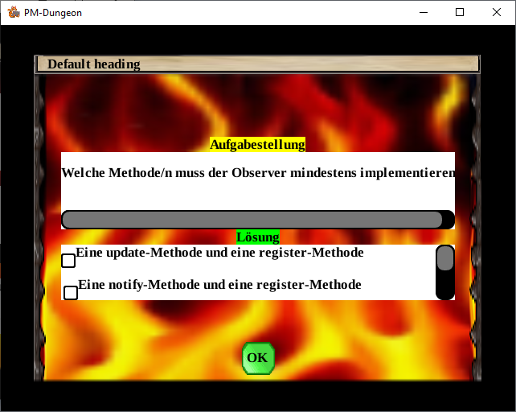
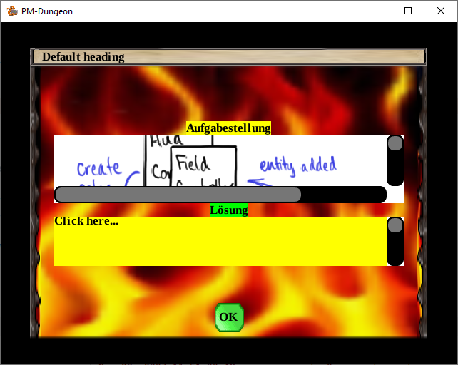
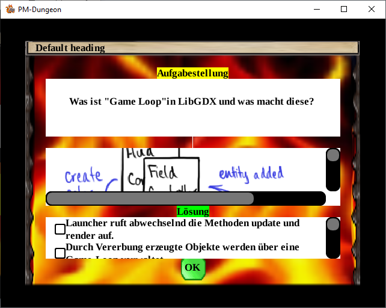

Der Dialog für Quizfragen bietet dem User die Möglichkeit Fragen und Antwortmöglichkeiten in der GUI innerhalb des Spiels über den `Button F` anzeigen zu lassen. Dieser kann als Basis für weitere GUI-Elemente und Erweiterungen genutzt werden.
Da die Inhalte später aus der DSL kommen werden, muss zwischen gewöhnlichem Text sowie Pfaden, die als Strings angegeben werden selektiert werden.
Beim Aufruf des Quiz-Dialoges werden genauso wie beim Aufruf vom Text-Dialog alle Systeme bis auf `DrawSystem` pausiert. <br>
Das UI wird in drei Bereiche gegliedert, den Fragebereich, Antwortbereich sowie den Bereich wo der Button zum verlassen des UI angezeigt wird.
Im Fragebereich werden die Fragen als:
`TEXT`: Darstellung einer Frage oder Antwortmöglichkeit als Text dar.<br>

`IMAGE`:  Darstellung einer Frage als Bild <br>

`TEXT_AND_IMAGE`: Darstellung einer Frage als Bild und Text<br>


Im Antwortbereich werden die Antwortmöglichkeiten als Single-Choice oder Multiple-Choice angezeigt, außerdem hat der User bei manchen Aufgabenstellungen, die per Zufall über die Funktion `getRandomQuestion()` der Klasse `DummyQuizQuestionList` generiert werden die Möglichkeit, die Antwort als Freetext (freie Texteingabe) anzugeben.<br>
Die Antwortmöglichkeiten der Single Choice Fragen sollen mit einem Radiobutton dargestellt werden, womit nur eine Antwort aus der gesamten Auswahl gewählt werden kann. Einmaliges drücken wählt die Antwort aus, eine Neuauswahl hebt die alte Auswahl auf. <br>
Damit die Buttons miteinander verbunden sind wird die Klasse `ButtonGroup` verwendet, welche aus der libGDX-Klasse `VerticalGroup` abgeleitet wird. <br>
Bei den Multiple Choice Aufgaben werden die  Antwortmöglichkeiten als Check boxen dargestellt.
In diesem Bereich können mehrere  Antworten gleichzeitig ausgewählt werden.  Durch einmaliges klicken wird eine Antwort ausgewählt, zweimaliges klicken auf das gleiche Feld, wählt die Antwort wieder ab.
Über den Button `OK`, wird wird der Dialog (UI) beendet und alle Systeme wieder eingeschaltet, sodass das Spiel weiterlaufen kann.<br>
Zum Test des Quiz-Dialoges wird die Klasse 'DummyQuizQuestionList' verwendet.
Diese Klasse enthält eine Liste mit Testfragen welche mit einem frei eingebbaren ASCII-Text oder mit einer begrenzten Anzahl von Antwortmöglichkeiten, aus welcher die zutreffende Antwort gewählt werden kann, beantwortet werden sollen.
Aus der Klasse 'UITools' wird die Klasse 'ResponsiveDialog' aufgerufen, welche die verschiedenen Arten von Textdialogen (Text- Dialog zum anzeigen von Texten z.B Gespräche mit den NPC sowie der Quiz-Dialog zum anzeigen der Fragen und Antworten) mit Hilfe der Klasse `TextDialog` erstellt, formatiert und letztendlich den Dialog an den `AbstractController` übergibt, damit der Dialog auf dem Bildschirm angezeigt werden kann. <br> Die Klasse `TextDialog` hat zwei Konstruktoren, welche separat für die Erstellung eines Text-Dialoges und eines Quiz-Dialoges verwendet werden. Zur Platzierung und Ermittlung der tatsächlichen Maße im Dialog-Fenster durch eine bestimmten Anzahl der UI-Widgets im jeweiligen Dialog, wird die Klasse `DialogDesign` verwendet.<br>
Außerdem hat die Klasse `TextDialog` eine Funktion, welche die Betätigung der Schaltfläche auswertet. Die Klasse `Skin`, welche von den  UI-Widgets verwendet wird speichert Ressourcen  die von UI-Widgets verwendet werden können. Es ist ein praktischer Container für Texturbereiche, Ninepatches, Schriftarten, Farben usw.<br>
Es geht um die folgende Klassen:<br>
`NotEditableText`: Darstellung eines nicht veränderbaren Textinhalt im Dialog (z.B. Quizfrage)
`EditableText`: Darstellung Bereich für die Eingabe von Texten<br>
`Scroller`: ermöglicht das Hinzufügen von Elementen zum Scroller.<br>
Die Klasse `ScreenImage` wird verwendet, um die Bilder in bestimmter Auflösung (Zoomfaktor) im Quiz-Dialog zu verwenden.

## Was ist die  Button-Group?
Die  Button-Group ist dafür da, um  eine Gruppe von Schaltflächen zu verwalten, die dieser hinzugefügt werden, um eine minimale und maximale Anzahl von angekreuzten Schaltflächen zu erzwingen. Damit hat man die Möglichkeit (button, text button, checkbox, etc.) als "Optionsschaltflächen" zu verwenden, wobei ein Button nur immer in einer Gruppe sein kann.

## Relavante Klassen
`UITools`<br>
Formatiert Fenster/ Dialog und steuert die Erstellung eines Dialogobjekts in Abhängigkeit von einem Ereignis.<br>
`DialogDesign`<br>
Erzeugt ein Dialogobjekt, formatiert es und übergibt es an den `ScreenController`, damit der Dialog auf dem Bildschirm angezeigt werden kann. Zur besseren Strukturierung und Trennung der verschiedenen Dialoginhalte.<br>
`TextDialog`<br>
Enthält Konstruktor, der den Dialog mit all seinen Elementen erstellt.<br>

## Hilfsklassen
`ButtonGroup`<br>
Es werden Schaltflächen hinzugefügt, wobei eine Mindest- und eine Höchstzahl von angekreuzten Schaltflächen erzwungen wird. So können Schaltflächen (Button, Textbutton, Kontrollkästchen, etc.) synchron als "Radiobuttons" verwendet werden. Als Basisklasse wird die VerticalGroup verwendet (Vertikale Darstellung aller Button-Elemente). <br>
`EditableText` <br>
Bereich für die Eingabe von Texten <br>
`ScreenImage` <br>
Zur Konfiguration des anzuzeigenden Bildes <br>
`Scroller` <br>
Hinzufügen von Elementen zum Scroller
(zur Darstellung von Objekten mit einer Scroll bar z.B Textfelder, Bidler, etc)<br>
`QuizQuestion`<br>
Darstellung einzelner Quizfrage, einschließlich der Frage, der möglichen Antwortmöglichkeiten und der Art der Frage (Typ)<br>
`QuizQuestionContent` <br>
Darstellung Inhaltes einer Quizfrage
(z. B. Fragentext oder ein mit der Frage verbundenes Bild)<br>
`DummyQuizQuestionList`<br>
Inhalt und Aufbau der Quizfragen
(zum Test der Quiz GUI)<br>

## Programmablaufplan
Die Erstellung des Quiz- Dialoges findet in der Funktion `showQuizDialog(QuizQuestion question)` der Klasse `UITools` statt. Diese Funktion wird in der Klasse `Game` aufgerufen und bekommt als Argument ein zufallsgesteuertes Objekt `question`, welches Fragen als Text, Bild, Text und Bild, Single- oder Multiple-Choice im UI anzeigt.<br>
```java
public class UITools {
    public static void showQuizDialog(QuizQuestion question) {

        if (question != null) {
            String[] contentArray = {question.question().content()};
            formatStringForDialogWindow(contentArray);
            setDialogIndexInController(-1);
            generateQuizDialogue(question, contentArray);
        }
    }
}
```
Der Inhalt der Frage wird aus `question.question().content()` ausgelesen und anschließend in der Funktion `formatStringForDialogWindow()` so formatiert, dass der Inhalt an eine Länge von 40 Zeichen mit Zeilenvorschub angepasst wird. Dies bewirkt, dass der Inhalt nicht horizontal gescrollt werden muss. `setDialogIndexInController ()` setzt einen Vermerk darauf, dass der Dilaog noch nicht im Controller (auch Stage) enthalten ist.<br>
### Wie wird ein Dialog erstellt?
Die Funktion `generateQuizDialogue()` sucht zunächst ob ein Dialog im  Controller schon enthalten ist. Das passiert in der Funktion `searchIndexOfResponsiveDialogInController()`.
```java
public class UITools {
    private static void generateQuizDialogue(QuizQuestion question, String... arrayOfMessages) {
        searchIndexOfResponsiveDialogInController(null);

        if (indexForDialogueInController == -1 && Game.controller != null && Game.systems != null) {
            Game.controller.add(
                    new ResponsiveDialogue(
                            new SpriteBatch(),
                            new Skin(Gdx.files.internal(Constants.SKIN_FOR_DIALOG)),
                            Color.WHITE,
                            question,
                            arrayOfMessages));

            Game.systems.forEach(ECS_System::stop);
        }
    }
}
```
Für die Erstellung eines Text- Dialoges (`generateTextDialogue()`) und eines Quiz-Dialoges (`generateQuizDialogue()`) gibt es zwei getrennte Funktionen, damit man alle Aktivitäten deutlich sehen und schnell finden kann. Die Funktion `generateQuizDialogue()` erzeugt ein Quiz-Dialog, womit die Klasse `ResponsiveDialog` aufgerufen wird.
Ein neuer Dialog wird dann wieder erzeugt, wenn der Controller keinen Dialog beinhaltet.<br>
Für die Erzeugung der Quiz-Dialoges wird der Konstruktor aus der Klasse `ResponsiveDialog` verwendet, welcher als Argument die `question` erhält.
```java
public class ResponsiveDialogue<T extends Actor> extends ScreenController<T> {
    public ResponsiveDialogue(
            SpriteBatch batch,
            Skin skin,
            Color msgColor,
            QuizQuestion question,
            String... arrayOfMessages) {
        super(batch);
        TextDialog dialog = createQuizDialog(skin, question, arrayOfMessages);
        add((T) dialog);
        formatDependingOnGameScreen(dialog, msgColor);
    }
}
```
Die Funktion `createQuizDialog()` ruft den Konstruktor von der Klasse `TextDialog`, welcher den  QuizQuestion-Dialog mit einem Layout entsprechend dem Parameter der Klasse `QuizQuestion` erstellt. Alle Informationen von Layout werden in der Klasse `DialogDesign` ausgewertet, die  erforderlichen UI-Widgets in dem Dialog-Fenster platziert und deren Maße entsprechend angepasst.
Danach wird der Dialog in den `AbstractController` angehängt, damit der Dialog auf dem Bildschirm angezeigt werden kann.
Mithilfe von `formatDependingOnGameScreen()` wird das Dialogfenster im Haupt-Fenster des Spieles positioniet und formatiert.

### Wie wird ein Dialog wieder gelöscht?
Wird im Dialogfeld die einzige Schaltfläche angeklickt, erfolgt der Aufruf der Funktion `result(final Object object)` der Klasse `TextDialog`, welche die Funktion ‚UITools.deleteDialogue(…)‘ ausführt. Controller enthält alle Systeme, andere Elemente und den `ResponsiveDialog`. Jedes Element enthält dabei eine ID mit deren Hilfe sich ermitteln lässt ob ein Dialog bereits vorhanden ist. `ResponsiveDialog` enthält `TextDialog` und fügt diesen zum  `AbstractController` (auch Stage) hinzu. <br>
Soll der TextDialog durch das drücken auf den "OK"-Button gelöscht werden (vom Stage entfernt werden), ist es erforderlich die ID (`indexForDialogueInController`) des
`ResponsiveDialoges` im Controller zu ermitteln, welcher den zu löschenden `TextDialog` enthält.
Die ID markiert das Element welches im Controller angesprochen werden soll.
`searchIndexOfResponsiveDialogInController`: sucht nach der ID im controller `deleteDialogue` und entfernt den Dialog vom Stage.
```java
public class UITools {
    public static void deleteDialogue(Dialog txtDialog) {
        if (txtDialog != null) {
            searchIndexOfResponsiveDialogInController(txtDialog);

            if (indexForDialogueInController >= 0
                    && Game.controller != null
                    && Game.systems != null) {
                Game.controller.remove(indexForDialogueInController);
                Game.systems.forEach(ECS_System::run);
            }
        }
    }
}
```
Zunächst wird geprüft, ob der Controller den Dialog schon enthält (siehe  `earchIndexOfResponsiveDialogInController(txtDialog)`). Nur im Fall, dass die ID des Dialoges im Controller vorhanden ist `indexForDialogueInController > 0`, wird der Dialog aus dem Controller gelöscht `Game.controller.remove()` und alle ESC-Systeme weiter ausgeführt.
