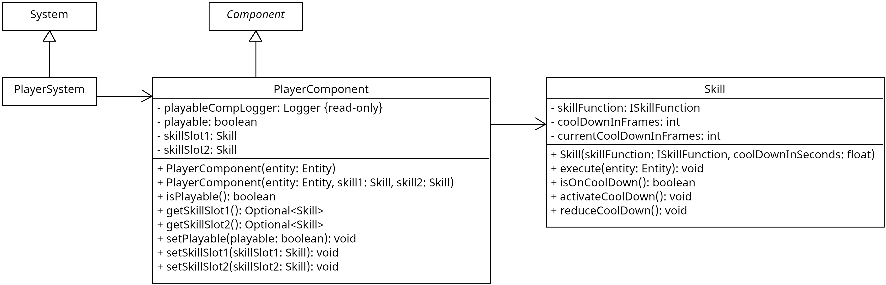

## Wofür
Das `PlayerComponent` wird verwendet um eine Entität als spielbar zu markieren.
Die gespeicherten Skills (`skillSlot1`, `skillSlot2`) werden durch das [`PlayerSystem`](../systems/player_system.md) ausgeführt, wenn die dementsprechenden Hotkeys gedrückt werden.

**Hinweis**: Es sollte nur eine Entität im Spiel dieses Component erhalten, da die Codebasis nicht für mehrere spielbare Entitäten ausgelegt ist.

## Aufbau

## Wie nutzt man es

### Erzeugen - Möglichkeit 1

Erzeugen eines neuen `PlayerComponent`-Objektes mithilfe des einfachen Konstruktors `PlayerComponent(entity: Entity)`. Hierbei wird die angegebene Entität lediglich als spielbar markiert, daher das Attribut `playable` auf `true` gesetzt. Skills müssten nachträglich über die Setter Methoden (`setSkill1`, `setSkill2`) gesetzt werden.

### Erzeugen - Möglichkeit 2

Erzeigen eines neuen `PlayerComponent`-Objektes mithilfe des expliziten Konstruktors `PlayerComponent(entity: Entity, skill1: Skill, skill2: Skill)`. Hierbei wird die angegebene Entität als spielbar markiert. daher das Attribut `playable` auf `true` gesetzt, und die beiden angegebenen Skills werden gesetzt.

## Methoden

### isPlayable(): boolean

Gibt den Wert des Attributs `playable` zurück. Dieser ist `true` wenn die Entität als spielbar markiert ist, ansonsten `false`.

### setPlayable(playable: boolean): void

Setzt den Wert des Attributs `playable` auf den angegebenen Wert.

### getSkillSlot1(): Skill, getSkillSlot2(): Skill

Gibt den Skill des jeweiligen Slots zurück.

### setSkillSlot1(skill: Skill), setSkillSlot2(skill: Skill)

Setzt den Skill des jeweiligen Slots auf den angegebenen Skill.
