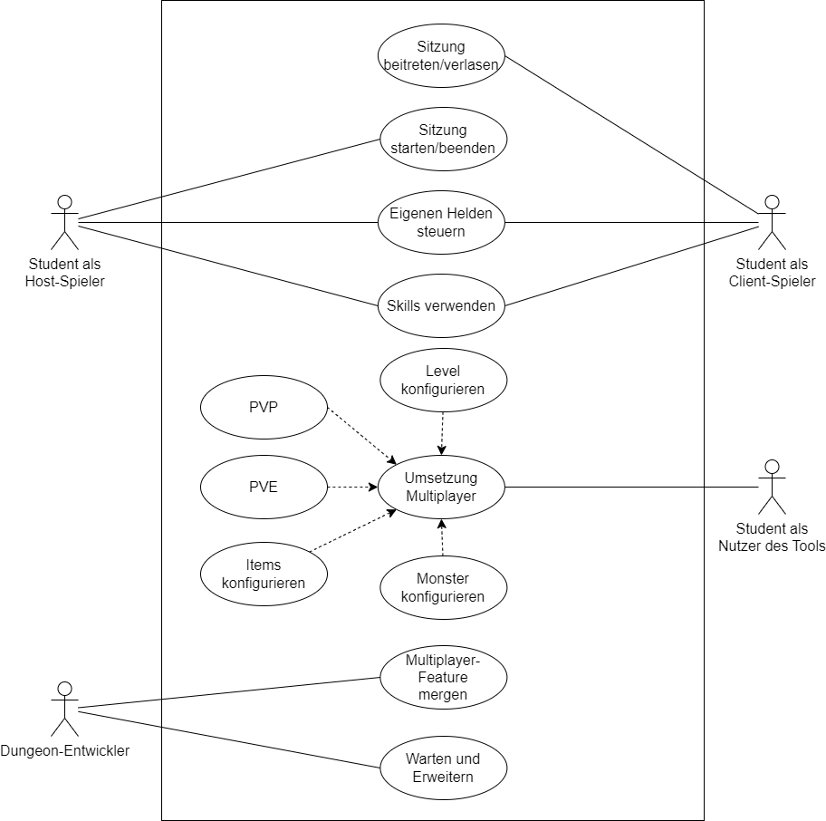
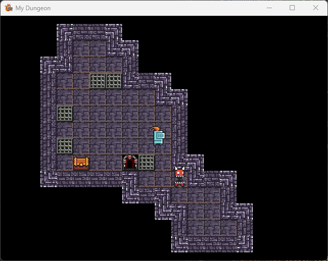
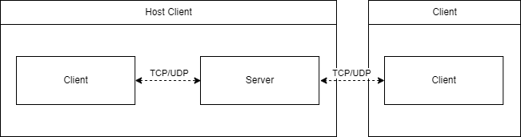
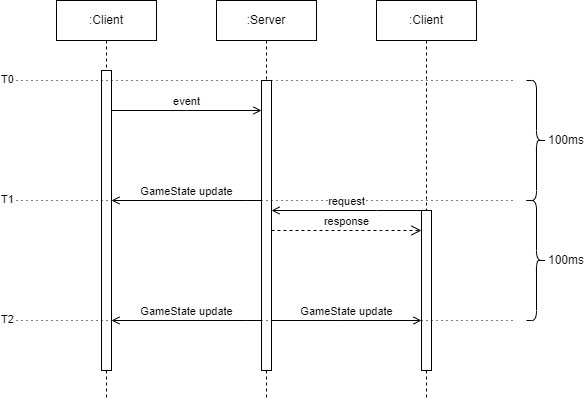

# Einleitung

An der Fachhochschule Bielefeld wird das Modul Programmiermethoden angeboten. Im Rahmen dieses
Moduls erlernen Bachelorstudierende sowohl die Grundlagen der Programmierung als auch fortgeschrittene
Java-Kenntnisse. Dies umfasst unter anderem das Erstellen von Java-Projekten mit dem Build-Tool
*Gradle*, das Erlernen grundlegender Git-Kenntnisse sowie die Anwendung beliebter
Programmier-Design-Patterns. Die Lerninhalte werden mit Hilfe einen Rogue-like Videospiels
(Dungeon) übermittelt. Die Aufgabe der Studierenden besteht darin, das bereitgestellte Spielframework
zu nutzen und mithilfe spezifischer Design-Patterns ein Spiel zu entwickeln, das teilweise eigens
definierte Eigenschaften enthält. Unter Berücksichtigung bestimmter Rahmenbedingungen und Vorgaben
haben die Studierenden die Möglichkeit, kreativ das Spiel mit eigenen Ideen zu gestalten und zu
erweitern.

Das Framework wird innerhalb einer Arbeitsgruppe verwaltet, kontinuierlich weiterentwickelt und
verbessert, um den Studierenden eine optimale Lernumgebung zu bieten. Die aktuelle Version
(Stand 25.05.2023) bietet den Studierenden die Implementierung eines Singleplayer Spiels.
In einer Machbarkeitsstudie soll herausgefunden werden, ob es ebenfalls möglich ist, das Framework
anzupassen, sodass ein Multiplayer-Modus implementiert werden kann. Der Multiplayer soll dabei den
Studierenden Spielspaß bieten und ihnen ermöglichen, ihr eigenes Spiel gemeinsam mit Freunden und Kollegen zu spielen.

Zu Beginn des Dokuments werden die Anforderungen an einen Multiplayer-Modus beschrieben. Anschließend werden mögliche Multiplayer-Topologien beschrieben und deren
Vor- und Nachteile aufgelistet. Nach der Beschreibung des aktuellen Frameworks bzw. Spiels
kann analysiert werden, welche Topologie sich für die Implementierung am besten eignet.
Der konzeptionelle Aufbau wird weitergehend dargestellt und anschließend auf ausgewählte
Implementierungsdetails eingegangen. Die Ergebnisse werden evaluiert und mit den vorher
festgelegten Anforderungen abgeglichen. Es folgt eine Beschreibung der Probleme während der
Implementierung, die eine längere Zeit in Anspruch genommen haben. Abschließend wird das
Projekt zusammengefasst und ein Ausblick für weiteres Vorgehen beschrieben.

# Anforderungen

Zu Beginn der Arbeit muss das vorhandene Problem analysiert und Anforderungen an das
Ergebnis aufgestellt werden. In folgender Abbildung werden die Use-Cases des
Multiplayers dargestellt. Das generelle Ziel besteht darin, dass Studierende in einer Multiplayer
Sitzung sowohl als Host oder Client den eigenen Helden bewegen und Skills verwenden können.
Der Host soll dabei eine Sitzung starten und weitere Clients dieser Sitzung beitreten können.
Studierenden sollte mit dem Framework ermöglicht werden, eine eigene Umsetzung eines Multiplayermodus
implementieren zu können. Das bereitgestellte Framework sollte die Implementierung eigener Spielregeln,
wie Aspekte der Spiellogik (bspw. Player-vs-Player (PvP) oder Player-vs-Environment(PvE))
ermöglichen.
Die Entwickler des Frameworks (Dungeon Entwickler) sollten in der Lage sein, Muliplayer-
Features mergen und das Projekt erweitern und warten zu können.

Da es sich bei dem Forschungsprojekt um eine Machbarkeitsstudie handelt, sind lediglich primäre
Eigenschaften eines Multiplayer-Spiels, wie das Steuern des eigenen Helden, Teil dieses Projekts.
Weitere denkbare Features, wie beispielsweise die Möglichkeit zur Umsetzung eines Chats sind nicht
Teil der Erweiterungen. Auf Basis der dargestellten Verwendungszwecke werden die Anforderungen
an das Projekt wie folgt definiert.

- Mehrere Spieler können in einer einzigen Spielsitzung miteinander spielen.
- Es existiert ein exemplarisches Spiel, das die Funktionalität des Multiplayer-Modus veranschaulichen kann, einschließlich der Bewegung von Entitäten und der Verwendung von Fähigkeiten.
- Eine Schnittstelle existiert, die von Studierenden genutzt werden kann, ohne dass sie über Kenntnisse im Aufbau von Verbindungen und im Senden von Daten verfügen müssen.

# Multiplayer-Topologien

Um einen Multiplayer entwerfen zu können, muss zu Beginn entschieden werden, welche
Multiplayer-Topologie verwendet werden sollte. In den folgenden Kapiteln werden die
gängigsten Topologien beschrieben und anschließend Vor- sowie Nachteile aufgelistet.

## Lokaler Multiplayer

Der lokale Multiplayer, oder auch Couch-Multiplayer genannt, beschreibt einen
Spielmodus, welcher mehrere Spieler auf einem Gerät miteinander spielen lässt.
Abhängig vom Spieldesign kann dies mit einer Kameraperspektive oder mit so genanntem
Splitscreen implementiert werden. Ein Splitscreen-Multiplayer teilt die vorhande
Bildschirmfläche in mehrere Bereiche und bietet die Möglichkeit, für jeden Spieler
eine eigene Kameraperspektive darzustellen.

Die Implementierung eines lokalen Multiplayers ist im Vergleich zu anderen Multiplayer-
Topologien einfacher, da keine Kommunikation zwischen verschiedenen Geräten erforderlich
ist. Die komplette Spiellogik wird auf einem einzelnen Gerät ausgeführt. Es werden lediglich
verschiedene Input-Geräte benötigt.

Eines der ersten Videospiele names "Tennis for Two" wurde im Jahr 1958 für eine
Ausstellung entworfen und ermöglichte Spielern 2D-Tennis, angezeigt auf einem
Oszilloskop, gegeneinander zu spielen. Jeder Spieler konnte mit seinem Controller die
Richtung und Geschwindkgeit mit einem Drehknopf einstellen und mit einem Knopfdruck
den fliegenden Ball schlagen. Diese Demonstration wurde entwickelt, um Besuchern
Computer und deren Fähigkeiten vorzustellen. [@news__video_2008;@glazer_multiplayer_nodate]

Auch viele neue Spiele bieten Spielern einen lokalen Multiplayer an. Spiele wie
beispielsweise *Mario Kart* bieten den Spielern die Möglichkeit auf einem
Bildschirm mit bis zu vier Personen gleichzeitig gegeneiander Rennen zu fahren.

Im Folgenden werden die Vor- und Nachteile des lokalen Multiplayers aufgelistet:

- Vorteile
  - **Einfache Implementierung**: Für die Implementierung eines lokalen Multiplayers, muss der Singleplayer-Modus angepasst werden. Es ist nicht erforderlich, den Austausch von Daten zwischen verschiedenen Geräten zu beachten.
  - **Einfache Einrichtung**: Lokale Multiplayer benötigen grundsätzlich keine kompliziere Einrichtung. Vom Menü kann meist direkt ein Spiel gestartet werden, es müssen lediglich genug Input-Geräte vorhanden und angeschlossen sein.
  - **Geringe Kosten**: Für das gemeinsame lokale Spielen wird nur ein Gerät benötigt, welches das Spiel ausführt. Zusätzlich entfallen Kosten für mögliche Internetverbindungen und Online-Abbonements der Konsolenhersteller.
- Nachteile
  - **Geteilte Bildschirmfläche**: Bei Splitscreen-Spielen verringert sich die Bildschirmgröße jeden Spielers. Dies kann die Sichtbarkeit von Details oder weit entfernter Objekten beeinträchtigen und die Immersion verringern.
  - **Grafikqualität**: Bei Splitscreen-Spielen wird pro Spieler eine eigene Kamera verwendet, welche die Szene rendert. Durch den erhöhten Rechenaufwand, kann es notwendig sein, dass grafische Kompromisse eingegangen werden müssen. Eine Möglichkeit den Rechenaufwand zu minimieren, kann das Senken der Bildrate sein.
  - **Begrenzte Spieleranzahl**: Bei lokalen Multiplayer-Spielen kann die Anzahl der möglichen Mitspieler start begrenzt sein. Dies liegt unter anderem an der Bildschirmgröße, die pro weiteren Spieler verkleinert wird, und an der Leistung der Konsole. Bei zu vielen Spielern kann es zu einer Überlastung kommen oder das Spielerlebnis beeinträchtigt werden.

## Peer-to-Peer

Eine weitere Multiplayer-Topologie ist das "Peer-to-Peer" (P2P). Der Unterschied zu
lokalen Multiplayer-Spielen besteht darin, dass zwei oder mehrere Geräte miteinander
verbunden sind. Im Allgemeinen
beschreibt P2P ein Netzwerkmodell, bei dem alle beteiligten Teilnehmer (Peers)
auf gleicher Ebene agieren. Alle Peers sind dabei gleichberechtigt, übernehmen
teils eigene Aufgaben und kommunizieren direkt mit den weiteren Teilnehmern. Oft
werden Ressourcen wie beispielsweise Speicher, Prozessorleistung und Netzwerkbandweite
zwischen den Teilnehmern des Netzwerkes geteilt. Im Zusammenhang mit Multiplayer-Spielen
bezieht sich P2P darauf, dass Spieler direkt miteinander kommunizieren, ohne dass
ein dedizierter Server verwendet wird. Im Folgenden werden zwei Arten von P2P Varianten
vorgestellt. [@noauthor_heinz_nodate]

### Direktes Peer-to-Peer

Bei dem direkten Peer-to-Peer sind alle Spielergeräte direkt miteinander verbunden.
Bei den ersten P2P Spielen kommunizieren die einzelnen Geräte beispielsweise
über die serielle Schnittstelle oder später über ein **Lokal Area Network** (LAN).
Grundsätzlich senden Geräte zur Kommunikation Informationen an alle Teilnehmer.
Ebenfalls werden Informationen aller anderen Teilnehmer empfangen. [@glazer_multiplayer_nodate]

Oft wird das direkte P2P bei rundenbasierten oder Echtzeit-Strategiespielen verwendet.
Prinzipiell werden die Eingaben aller Teilnehmer miteinander ausgetauscht, auch
Input Sharing genannt. Die jeweiligen Eingaben werden von einem Gerät empfangen und
müssen anschließend simuliert werden, um den Spielstatus zwischen allen Spielern
synchron zu halten. Die Simulation, welche auf allen Geräten ausgeführt wird, muss
garantiert deterministisch sein. Nur so kann sichergestellt werden, dass eine bestimmte
Eingabe eines Teilnehmers auf allen Geräten zu dem gleichen Spielstatus führt. [@noauthor_what_2010]

Das Echtzeit-Strategiespiel *Age of Empires* (1997) verwendet die direkte P2P-Topologie
für den Multiplayer. Mit Hilfe eines Runden-Timers werden alle Eingaben/Kommandos in 200 ms Intervallen
in einem Buffer gespeichert und anschließend an alle Teilnehmer gesendet.
Die erhaltenen Kommandos werden auf allen Teilnehmergeräten ausgeführt um den
Spielstatus synchron zu halten. Damit das komplette System funktioniert muss der Runden-
Timer auf allen Geräten synchronisiert werden. [@glazer_multiplayer_nodate]

- Vorteile
  - **Geringe Latenz**: Da nur eine Kommunikation zwischen den einzelnen Peers stattfindet, kann die Latenz geringer sein, da keine zusätzliche Verzögerung durch einen Spielserver entsteht.
  - **Geringe Netzwerklast**: Da nur Inputs zwischen den Geräten ausgetauscht werden, und das Spiel alle Inputs synchron auf allen Geräten gleich simuliert, kann die Menge an notwendigen zu übertragenden Daten reduziert werden. Beispielsweise reicht es ein Kommando zum Erzeugen von einer bestimmten Anzahl an Einheiten zu senden, statt jede Einheit einzeln mit einem Server zu registrieren.
  - **Skalierbarkeit**: Jeder Peer fungiert als eigene Einheit bzw. sowohl als Server als auch als Client. Diese Eigenschaft ermöglicht eine gute Skalierbarkeit. [@noauthor_heinz_nodate]
  - **Kosteneffizienz**: Ebenso wie der lokale Multiplayer wird kein zusätzlicher Server benötigt. Es entfallen die Kosten für mögliche, teure Serverinfrastruktur und Serverwartung.
- Nachteile
  - **Abhängigkeit von den Peers**: Bei rundenbasierten Spielen muss immer auf den langsamsten Peer gewartet werden, um die Synchronisation zu gewährleisten. Dies kann das Spielergebnis beeinträchtigen. Die Leistungsfähigkeit der einzelnen Peers kann ebenfalls die Skalierbarkeit beeinflussen.
  - **Synchronisationsprobleme**: Das Synchronisieren von Spielzuständen und Aktionen zwischen den einzelnen Spielern kann komplex sein. Die Idee eines Systems zur Synchronisation der Runden ist konzeptionell einfach, die Implementierungdetails können viel komplexer sein. Zusätzlich muss bei der Implementierung sichergestellt werden, dass das Spiel komplett deterministisch ist. Zufallszahlengeneratoren müssen über alle Teilnehmer hinweg synchronisiert werden. [@glazer_multiplayer_nodate]

### Client Hosted Peer to peer (Listen Server)

Bei einem Client-Hosted Peer-to-Peer Multiplayer übernimmt ein Spieler die Rolle des
Servers. Diese Art von Server wird auch Listen Server genannt. Der Host-Client ist
für die Ausführung der Spiellogik, die Verwaltung von Spielwelten und deren Generierung
und für die Kommunikation mit anderen Spielern zuständig. [@noauthor_create_2023]

Alle anderen Spieler agieren als Client und stellen eine Verbindung mit dem Host her.
Sie senden ihre Aktionen und Eingaben an den Host-Client bzw. an den Server, welcher
diese Eingaben empfängt und den Spielstatus entsprechend anpasst. Anschließend sendet
der Server einen aktualisierten Spielstatus an alle verbunden Clients. Meist wird
clientseitig eventbasiert Änderungen, Kommandos und Eingaben an den Server gesendet.
Als Beispiel wird jedes mal wenn ein Client Lebenspunkte verliert diese Information an
den Server gesendet. Der Server passt die hinterlegten Lebenspunkt-Informationen des
passenden Spielers an. Der Server hingegen wird meist mit einem Tick-System implementiert.
In zyklischen Intervallen (Ticks) wird der neue Spielstatus an alle Clients gesendet. [@noauthor_create_2023]

- Vorteile
  - **Kosteneffizienz**: Da ein Spieler die Rolle des Servers übernimmt, entfallen Kosten für mögliche Serverinfrastruktur und deren Wartung.
  - **Einfache Einrichtung**: Diese Art von Multiplayer benötigen keine spezielle Infrastruktur oder eine vorausschauende Planung zur Einrichtung. Spieler können im Idealfall mit einem Tastendruck einen Mehrspieler starten oder mit der Eingabe einer passenden IP einer vorhandenen Sitzung beitreten.
- Nachteile
  - **Abhängigkeit vom Host**: Da der Host nicht nur einen Client, sondern auch den Server ausführen muss, werden mehr Ressourcen wie Speicher und Rechenleistung benötigt. Wenn der Host-Computer Probleme hat oder überlastet ist, kann dies zu einer Beeinträchtigung des Spielflusses und einer verringerten Spielqualität für die anderen Clients führen. Auch die vorhandene Netzwerkleistung des Hosts, kann das Spielerlebnis beeinträchtigen.
  - **Vorteile für den Host**: Da der Host direkten Zugriff auf den Server hat, ohne dass Informationen über ein Netzwerk gesendet werden müssen, hat der Host generell einen großen Latenzvorteil gegenüber den anderen Clients.
  - **Einfacher zu Cheaten**: Der Host hat kompletten Zugriff auf die Informationen der Spielwelt. Dies gibt dem Host eine einfachere Gelegenheit zu betrügen (Cheating) um sich einen Vorteil zu verschaffen.
  - **Spielstop beim Verlassen des Hosts**: Der Server existiert nur so lange wie das Spiel des Hosts aktiv ausgeführt wird. Verlässt dieser das Spiel, hört das Spiel auf zu existieren und alle Clients verlieren ihre Verbindung. Dagegen kann eine Host-Migration helfen, bei der alle Spielsitzungsdaten auf einen anderen Client übertragen werden und dieser anschließend die Rolle des Hosts übernimmt. [@noauthor_create_2023]

## Dedicated Game Server

Ein dedizierter (dedicated) Spielserver wird im Gegensatz zum Client-Host P2P nicht auf
der Hardware eines Spielers sondern auf dedizierter Serverhardware ausgeführt. Jeder
Spieler verbindet sich als Client mit dem Server. Der Server übernimmt dabei die Aufgabe
der Spieler- und Entity-Verwaltung. Zusätzlich kann beispielsweise die Level Rotation/
Generierung, die Bewegung von nichtspielbaren Characteren vom Server und
Bewegungsvalidierung vom Server ausgeführt werden.
Der dedizierte Server übernimmt alle Aufgaben, bei denen der Client keine direkte
Auswirkung haben soll. Dazu zählt ebenfalls die mögliche Überwachung aller
Spieleraktionen, um beispielsweise Betrüger (Cheater) zu identifizieren und eventuelle
Maßnahmen zu ergreifen. [@glazer_multiplayer_nodate]

Durch meist starke Serverhardware sind die dedizierten
Spielserver grundsätzlich für Sitzungen mit mehr als 10 Spieler ausgelegt. Spiele
wie beispielsweise *Battlefield* verwenden dedizierte Server um eine Spieleranzahl
von bis zu 128 zu gewährleisten. Auch Spiele wie *Minecraft* ermöglichen das
Konfigurieren von dedizierten Servern für den Multiplayer.

- Vorteile
  - **Schnelle Hardware**: Meist werden dedizierte Server von den Spieleherstellern bereitgestellt. Die verwendete Hardware verfügt über ausreichende Leistung, um ein reibungsloses Spielerlebnis zu ermöglichen. Im Gegensatz zu dem Client-Host P2P wird sich nicht auf die Hardware eines einzelnen Spielers verlassen.
  - **Geringe Latenz**: Dedizierte Server werden in der Regel in Rechenzentren mit leistungsstarker Netzwerkinfrastruktur ausgeführt. Dadurch minimiert sich die Latenz, was zu einer geringeren Verzögerung zwischen den Spielaktionen der Spieler führt.
  - **Sicherheit und Anti-Cheat**: Durch die Verwendung eines dedizierten Servers behalten Entwickler die volle Kontrolle über die Serverkonfiguration und können Anpassungen vornehmen, um die Spielbalance, Sicherheit und andere Aspekte des Multiplayer-Erlebnisses zu verbessern. Effektive Sicherheitsmaßnahmen können implementiert und Betrug bzw. Cheating besser bekämpft werden.
- Nachteile
  - **Kosten**: Dedizierte Server können mit erhöhten Kosten verbunden sein. Serverhardware und deren Wartung/Konfiguration ist im Vergleich zu anderen Multiplayer-Topologien weit aus teurer. Es wird ebenfalls zusätzliche Entwicklungszeit und Ressourcen benötigt, um die erforderliche Infrastruktur und Netzwerkkommunikation einzurichten.
  - **Technische Komplexität**: Die Einrichtung und Verwaltung eines dedizierten Sielservers erfordert technisches Fachwissen. Es kann mehr Zeit benötigt werden, um den Server ordnungsgemäß konfigurieren und warten zu können. [@glazer_multiplayer_nodate]

# Das aktuelle Spiel

Bevor eine Multiplayer-Topologie ausgewählt werden kann, muss der aktuelle Stand
des vorhandenen Spiels analysiert werden. Es folgt eine kurze Zusammenfassung der Funktionsweise
und Implementierung des vorhandenen Singleplayer-Dungeons.

Vorhanden ist ein 2D-Singleplayer-Dungeon Spiel, welches in Java implementiert ist.
Dieses Spiel wurde entwickelt, um Studierenden Programmiermethoden näherzubringen. Es
besteht aus einem Framework, das von den Studierenden genutzt wird, um bestimmte
vorgegebene Funktionalitäten einzubauen. Um das Spiel zu Testen, existiert eine
schematische Implementierung. Diese Implementierung beinhaltet die Möglichkeit, dass
ein so genannter Held bzw. Spielercharakter bewegt werden kann. Ein Gegner und eine
Kiste wird zufällig im Level plaziert. Der Gegner bewegt sich automatisch im Dungeon.
Der Held kann per Tastendruck gesteuert werden. Wenn die zufällig generierte Treppe
gefunden wird, der Held sich auf die Position dieser Treppe bewegt, wird ein neues
Level generiert. Das neue Level wird angezeigt und erneut ein Gegner und eine Kiste
zufällig auf den Kacheln des Levels platziert. In der nachstehenden Abbildung ist das Spiel mit einem zufällig generiertem Level dargestellt.

Die Implementierung des Dungeons liegt einem Entity-Component-System (ECS) zugrunde.
Ein ECS wird in der Implementierung von Spielen verwendet und dient dem Trennen der
Daten von den eigentlichen Verhalten. Wie der Name sagt, besteht ein ECS aus drei
Hauptkomponenten:

- **Entitäten (Entities)**: Grundsätzlich repräsentiert eine Entität im Spiel ein "Ding", bzw. ein eindeutiges Objekt, welches als Akteur in der simulierten Umgebung dargestellt wird. Diese Entitäten beinhalten keine Daten oder spezifische Verhalten, meist lediglich eine eindeutige ID und Namen. Jede Entität beinhaltet eine Menge an Komponenten.
- **Komponenten (Components)**: Komponenten sind Datentypen, welche ein eindeutiges Verhalten beschreiben. Sie sind wiederverwendbare Module, die den Entities zugewiesen werden können um beispielsweise Verhalten, Funktion und Aussehen bereitzustellen. Die Komponenten formen die Art der Entität.
- **Systeme (Systems)**: Systeme werden zyklisch aufgerufen und iterieren über die Komponenten um low-level Funktionen abzuarbeiten, wie beispielsweise Physikberechnungen oder das Rendern von einer Szene. Systeme bieten Dienste und die Verwaltung für die Komponentenklassen. [@noauthor_entity_2022]

# Auswahl der Multiplayer-Topologie\label{topology}

Im weiteren Verlauf werden die Vor- und Nachteile der verschiedenen Topologien
miteinander verglichen und abgewogen. Anschließend wird eine geeignete Topologie für den Multiplayer-Modus des oben beschriebenen Spiels ausgewählt.

Die Implementierung eines lokalen Multiplayers wird grundsätzlich nicht favourisiert.
Das aktuelle Implementierungsziel für den Multiplayer besteht darin, das Zusammenspiel mehrerer Geräte zu ermöglichen.

Auch die Implementierung eines direkten Peer-to-Peer Muliplayers wird aufgrund mehrerer Aspekte abgelehnt. Die Peer-to-Peer Topologie wird hauptsächlich in Echtzeit-Strategiespielen
eingesetzt, was im Gegensatz zu dem vorhanden Spiel steht. Zudem stellt die
Gewährleistung eines deterministischen Spielablaufs eine Herausforderung dar, da der
eigentliche Spielcode nicht in der eigenen Verantwortung liegt und nicht alle
Implementierungsdetails bekannt sind.

Ein möglicher Ansatz wäre das Teilen von Eingabeinformationen zwischen den beteiligten
Geräten. Hierbei müssen alle Clients synchroner Weise arbeiten und einen vollständig
deterministischen Ablauf gewährleisten. Dies erweist sich ebenfalls als kritisch
aufgrund der Verwendung von Gleitkommazahlen, da diese bei Berechnungen auf
unterschiedlichen Prozessoren variieren bzw. anders gerundet werden können [@noauthor_floating_2010].

Eine umfassende Umgestaltung des Spiels, um einen deterministischen Spielablauf
zu ermöglichen, würde einen erheblichen Aufwand bedeuten. Es müsste unter anderem
sichergestellt werden, dass eine einheitliche Rundung und Genauigkeit von Gleitkommazahlen
auf jedem Gerät gewährleistet werden kann. Dieser Aufwand ist mit potenzieller
Auswirkung auf die Leistung und Komplexität des Spiels verbunden.

In anbetracht dieser Faktoren, wird sich dazu entschieden, eine Topologie zu
wählen, welche einen Server verwendet, welcher mit allen Clients kommuniziert.
Es wird sich für die Umsetzung eines Listen-Servers anstelle eines dedizierten
Spiel-Servers entschieden. Zum einen ermöglicht der Listen-Server eine
kostengünstige Lösung, da keine dedizierten Server-Ressourcen gemietet oder
bereitgestellt werden müssen. Darüber hinaus vereinfacht die Implementierung
eines Listen-Servers den Studierenden die Arbeit, da der Listen-Server zentral
verwaltet wird.

# Konzept

Das grundlegende Konzept besteht darin, die vorhandene Spiellogik um Server- und
Client-Komponenten zu erweitern. Wie zuvor beschrieben, soll
ein Listen-Server hinzugefügt werden. In nachstehender Abbildung wird verdeutlicht,
dass der Host-Client sowohl die Logik eines Clients, als auch die eines Servers
implementiert. Jeder weitere Client hingegen implementiert nur die Clientlogik,
bzw. es wird keine Server-Instanz gestartet. Zusätzlich wird in der Abbildung
gezeigt, dass grundsätzlich über TCP/UDP mit dem Server kommuniziert wird. Auch
der Client des Hosts kommuniziert mit dem Server ausschließlich über TCP/UDP.
Dies hat den Hintergrund, dass der Server in einer Weiterentwicklung einfacher
ausgelagert auf einem seperaten Server laufen könnte.

Clients senden eventbasiert Nachrichten an den Server. Beispielsweise
wird nach Registrierung eines bestimmten Tastendrucks, der spielbare
Character bewegt und die Geschwindigkeit und neue Position direkt an den Server
gesendet, welche die Eingabe bearbeitet.

Der Server hingegen wird tickbasiert implementiert, kann jedoch ebenfalls auf
Events und Requests direkt bei Eingang reagieren. Eine tickbasierte Implementierung
beschreibt einen Server, welcher zyklisch den aktuellen Spielstatus (Gamestate) an
alle verbundenen Clients sendet. Ein Client kann beispielsweise die eigene Position
aktualisieren und diese Information an den Server senden. Der Server aktualisiert
im Gamestate die Position des passenden Clients. Die Veränderung wird jedoch erst
bei dem nächsten Tick an alle anderen Clients gesendet. Dies dient der Reduzierung
der notwendigen Sendungen des Servers.

Die folgende Abbildung zeigt die schematische Funktionsweise eines tickbasierten
Servers. Zum Zeitpunkt T0 wird der Server gestartet. Die Tick-Länge beläuft sich auf
100 ms. Alle 100 ms sendet der Server ein GameState-Update an alle verbundenen Clients.
Clients können immer Events oder Requests senden, bekommen im Fall eines Requests
auch eine Response vom Server zurück.

Das Design der Anwendung umfasst für den Hostclient vier seperat laufende Threads,
die verschiedene Aufgaben übernehmen. Der Hauptspiel-Thread ist für die Ausführung der
Spiellogik zuständig, während der Client-Listener-Tread eingehende Nachrichten von dem
Server empfängt.
Ein Server-Listener-Thread wird in der Serverinstanz gestartet. Dieser ist dafür
zuständig, alle an den Server gerichtete Nachrichten zu empfangen und zu bearbeiten.
Zusätzlich wird in der Serverinstanz ein Scheduler-Thread benötigt, der in festen
zeitlichen Abständen den Spielstatus an alle verbundenen Clients sendet. Reine Client-Instanzen des
Spiels, benötigen zwei Threads, einen Spiel-Thread und einen Client-Thread.
Durch die Verwendung dieser Threads wird eine optimale Aufteilung der Aufgaben und
eine reibungslose Kommunikation zwischen den Clients und dem Server gewährleistet.

# Implementierung

Nach der ausführlichen Beschreibung der Konzeption werden im Folgenden einige
Implementierungsdetails präsentiert. Weitere Implementierungsdetails können der
beigefügten Softwaredokumentation entnommen werden.

Zu Beginn der Implementierung muss eine Java-Bibliothek ausgesucht werden, welche
die Kommunikation über TCP/UDP ermöglicht. Für dieses Projekt wurde *KryoNet* anstelle
von anderen Netzwerkbibliotheken ausgewählt. Der Hauptgrund für diese Entscheidung
lag in der Einfachheit und Benutzerfreundlichkeit von *KryoNet*. Das Projekt wird auch
von Studierenden verwendet, um ihre Programmierkenntnisse zu erweitern. Aus diesem Grund
ist die Benutzerfreundlichkeit der gewählten Netzwerkbibliothek von besonderer
Bedeutung. *KryoNet* bietet eine abstrakte API und integrierte Serialisierung, was
die Implementierung und Übertragung von Datenobjekten wie beispielsweise Enitäten
vereinfacht. Darüber hinaus zeigt *KryoNet* eine gute Leistung bei der Verarbeitung der
Netzwerkkommunikation, was für die Echtzeitkommunikation in einem Mehrspieler-Spiel von
großer Bedeutung ist.

*KryoNet* ist in der Lage, auch benutzerdefinierte Datenobjekte eigenständig zu
serialisieren und zu deserialisieren. Dies hat den Vorteil, dass für einige
eigenimplementierten Objekte keine individuellen Serializer implementiert werden müssen.
Für Objekte mit zyklischen Abhängigkeiten muss ein eigener Serializer implementiert
werden. Dies gilt ebenfalls für Klassen, welche keinen Konstruktor ohne Parameter
(no-arg Constructor) besitzen. Der Aufbau und die Funktionsweise der Serializer
werden in der beigelegten Softwaredokumentation genauer beschrieben.

Zusätzlich zu der eigentlichen Implementierung eines Multiplayers, wird ein
Menü verwendet, das es ermöglicht, zwischen den beiden Spielmodi (Singleplayer und
Multiplayer) zu wählen. Wenn der Multiplayer ausgewählt wird, kann man zwischen
dem Hosten oder Beitreten eines Spiels auswählen. Beim Beitreten eines Spiels wird die
Eingabe einer IP-Adresse mit passendem Port für das Verbinden mit dem Server benötigt.

# Evaluation

Nach der Implementierung und dem Testen des Multiplayer-Modus kann evaluiert werden,
ob die zu Beginn festgelegten Anforderungen erreicht wurden.
Nach erfolgreichen lokalen Tests des Multiplayer-Modus kann bestätigt werden, dass es
möglich ist, mehrere Spieler zu einer Spielinstanz zu verbinden. In einem
exemplarischen Spiel kann gezeigt werden, dass das vom Host-Client
generierte Level erfolgreich mithilfe von *KryoNet* an den Server übermittelt wird. Der
Server leitet das Level an alle verbundenen Clients weiter. Alle im Level vorhandenen
Entitäten werden ebenfalls an den Server gesendet und dort gespeichert.
Die Position von Entitäten wird korrekt zwischen allen Client synchronisiert.
Nicht spielbare Charaktere sowie die Helden werden auf allen Clients mit passender
Position und Animation dargestellt.

Skills sind entgegen der Anforderungen nicht im Multiplayer-Modus eingebaut.
Die passende Struktur, um weitere Spielelemente wie beispielsweise Skills zu
implementieren ist dennoch vorhanden.

Die vorhandene Schnittstelle, welche unter anderem die Server-Client-Kommunikation
kapselt wird in der beigefügten Softwaredokumentation genauer beschrieben.

## Probleme

Im Verlauf des Projekts traten mehrere Implementierungsprobleme auf, die einen
erheblichen Zeitbedarf erforderten. Im Folgenden werden diese Probleme kurz erläutert.

Zu Beginn stellte sich die Integration von *KryoNet* in das bestehende Projekt entgegen
den Erwartungen als problematisch heraus. Der korrekte Einbau von *KryoNet* mithilfe von
Gradle gestaltete sich zeitaufwändiger als ursprünglich angenommen. Nach der
Implementierung einer geeigneten Struktur für die Client und Serverseite konnten
die ersten Events, Requests und Responses gesendet werden. Dennoch traten im weiteren
Verlauf des Projektes die meisten Probleme beim fehlerhaften Senden von Objekten auf.
Passende Serializer mussten für viele benutzerdefinierte Klassen implementiert werden.
Zyklische Abhängigkeiten (Entity und Component) sowie die Verwendung von
Lambda-Ausdrücken im vorgegebenen Spiel erschwerten diesen Prozess.

Da für eine nichtblockierende Kommunikation von Client und Server mehrere Threads
benötigt werden, traten an mehreren Stellen Threading Probleme auf. Da aus mehreren
Threads auf gemeinsame Ressourcen zugegriffen wird, entstanden Fehler, welche nur
schwierig zu finden und zeitaufwendig zu beheben waren.

Die Implementierung des Mulitplayer-Modus basiert auf einem Dungeon-Spiel, welches
auch im Laufe des Projektes weiter entwickelt wurde.
Im Verlauf des Projekts wurden Komponenten teilweise gelöscht, der Code wurde
refaktoriert und es wurden neue Funktionen hinzugefügt. Diese Neuerungen mussten
in die Implementierung des Multiplayer-Modus gemerged werden. Die Verbindung der beiden
Implementierungsstände erwies sich als herausfordernd und erforderte einen erheblichen
Zeitaufwand (>8 Std. pro Merge). Insgesamt musste das Menü zur Auswahl des Spielmodus
beispielsweise drei
Mal neu implementiert werden. Dies wurde notwendig, da bei Änderungen im
Haupt-Repository wichtige Klassen oder Bibliotheken gelöscht wurden, die für das Menü
erforderlich waren. Zusätzlich mussten neue Serializer hinzugefügt oder vorhandene
angepasst werden, um ein fehlerfreies Senden von Entitäten zu gewährleisten.

# Zusammenfassung und Ausblick

Das primäre Ziel des Forschungsprojekts war es, zu Untersuchen, wie der im Modul "Programmiermethoden" eingesetzte Dungeon-Baukasten dahingehend erweitert werden kann, sodass Studierende einen Multiplayer-Modus umsetzen können. Eine konkrete Zielsetzung seitens der Lehrbeauftragten wurde nicht definiert. Daher wurde zunächst auf Grundlage betrachteter Anwendungsfälle entschieden, eine Client-Host P2P Lösung zu entwickeln. Hierbei wurden entwickelte Komponenten so designed, dass zukünftig auch eine Lösung mit dediziertem Server ohne größeren Aufwand denkbar ist. Den Studierenden steht als Ergebnis dieses Projekts einfach zu verwendende Komponenten bereit. Bei der Umsetzung dieser Komponenten wurde berücksichtigt, dass es sich um Studierende der ersten Semester handelt. Kenntnisse über CLient-Server Kommunikationen sind nicht zwingend erforderlich.

Das umgesetzte Projekt bietet Weiterentwicklungsmöglichkeiten. Grundsätzlich wurde nur über lokale Netzwerke der Multiplayer getestet. In einem weiteren Verlauf könnte das Ziel sein, das Spiel über das Internet erreichbar zu machen. Die Serverinstanz könnte zusätzlich auf einen seperaten Server ausgelagert werden. Positionsberechnungen oder die Generierung des Levels könnte ebenfalls auf den Server ausgelagert werden. Damit die Mitspieler ein flüssigeres Erscheinungsbild bei der Bewegung des eigenen Helden bekommen, könnte ebenfall eine Bewegungs-Prediction konzipiert und implementiert werden.

# Quellen
