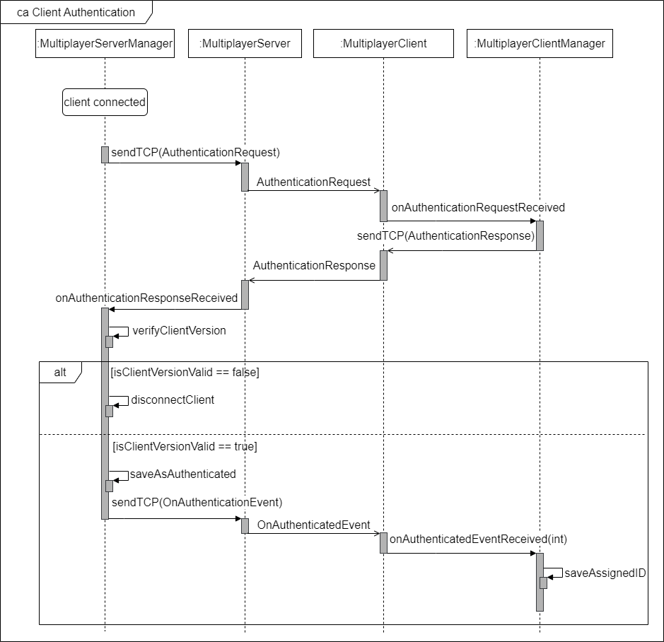
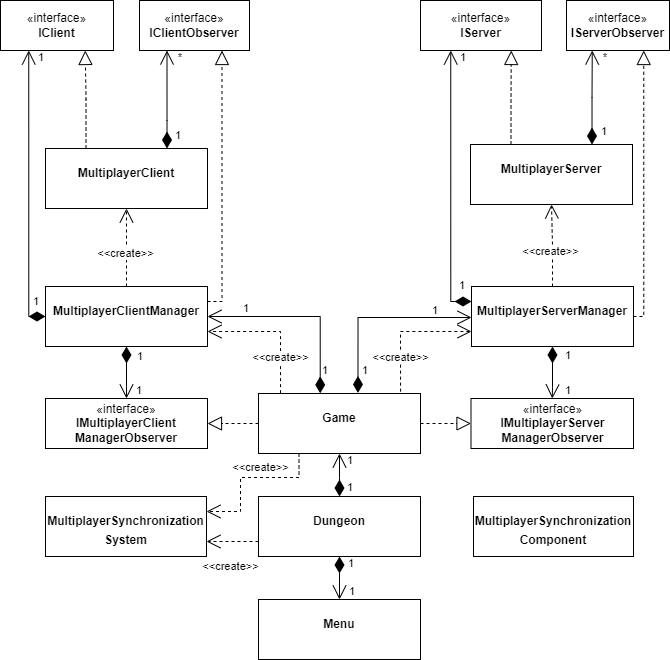

# Einleitung

Studierenden des Bachelorstudiengangs Informatik an der Hochschule Bielefeld werden im Modul _Programmiermethoden_ Grundlagen der Programmierung und fortgeschrittene Java-Kenntnisse vermittelt. Hierbei entwickeln die Studierenden mithilfe eines Baukastens - `Dungeon` genannt - eine eigene Version eines zweidimensionalen Rogue-like Videospiels.

In der aktuellsten Version (stand 25.05.2023) ist lediglich die Umsetzung eines Einzelspieler-Modus möglich. Zur Erweiterung der Implementierungsmöglichkeiten und Bereicherung des Entwickler- und Spielspaß der Studierenden wurde im Rahmen eines Forschungsprojekts beleuchtet, wie der Dungeon-Baukasten dahingehend erweitert werden kann, den Studenten die Umsetzung eines Multiplayer-Modus zu ermöglichen. Die folgende Dokumentation dient Entwicklern des Dungeon-Baukastens zur Übersicht relevanter Anpassungen für eine erleichterte Einbindung und Erweiterbarkeit dessen sowie Studierenden als Leitfaden zur Umsetzung eines Multiplayer-Modus.

Diese Dokumentation beinhaltet wesentliche Aspekte der zur Umsetzung des Multiplayer-Modus bereitgestellten [Komponenten](#übersicht-der-komponenten) und die [Interaktion](#interaktionen) dieser. Zur Umsetzung der Komponenten waren [Anpassungen](#wichtige-anpassungen-bestehender-komponenten) bereits vorhandener Komponenten notwendig. Für eine erleichterte Verwendung der Multiplayer-Komponenten steht eine [Bedienungsanleitung](#verwendung-der-komponenten) zur Verfügung.

_Anmerkung: Diese Dokumentation gibt lediglich Details der umgesetzten Lösung wieder. Während des Projekts erarbeitete Konzepte sind der beiligenden Ausarbeitung zu entnehmen._

# Abhängigkeiten und Einrichtung

Die Client-Server-Kommunikation erfolgt unter Verwendung der Bibliothek `Kryonet`, welche eine effiziente Möglichkeit zur Übertragung von Objekten über TCP-/UDP-Verbindungen bietet. Aufgrund der einfach gehaltenen API wird die Einarbeitung und Verwendung stark erleichtert, was den Einsatz im Rahmen des `Dungeon` bestärkt. Kryonet muss nicht eingerichtet werden, es wurde als Abhängigkeit der `build.gradle` hinzugefügt. Weitere Details zur Verwendung von Kryonet sind dem [Github-Repository von Kryonet](https://github.com/EsotericSoftware/kryonet/tree/master) zu entnehmen.

Die bereitgestellten Komponenten bzw. der Multiplayer-Modus ist in einem lokalen Netzwerk und mithilfe des VPN-Clients [LogMeIn Hamachi](https://vpn.net/) getestet worden. Die Verwendung über verschiedene Netzwerke hinweg wurde jedoch nicht erprobt und sollte daher insbesondere aufgrund sicherheitskritischer Aspekte noch beleuchtet werden.

# Übersicht der Komponenten

Folgende Abbildung zeigt die für den Multiplayer-Modus zur Verfügung stehenden Komponenten.


_Anmerkung: Die Abbildung beschränkt sich auf die wichtigsten Komponenten und umfasst nicht alle umgesetzten Klassen/Interfaces._

Die Interfaces [IClient und IServer](#iclient-und-iclientobserver) sowie die konkreten Implementierungen dieser, [MultiplayerClient](#multiplayerclient) und [MultiplayerServer](#multiplayerserver), beinhalten lediglich Funktionalitäten für das Senden und Empfangen von Nachrichten/Objekten - sie sind von der Spielelogik gelöst. Die Klassen [MultiplayerClientManager](#multiplayerclientmanager-und-imultiplayerclientmanagerobserver) und [MultiplayerServerManager](#multiplayerservermanager-und-imultiplayerservermanagerobserver) realisieren dem entgegen die Spielelogik. Durch die Kapselung beider Logiken wird bspw. der Wechsel von `Kryonet` zu einer anderen Bibliothek erleichtert und allgemein der Aufwand bei Änderungen reduziert. Um den im MultiplayerClientManager gespeicherten Stand der Entitäten mit dem lokalen Spielstand zu synchronisieren, wird das [MultiplayerSynchronizationSystem](#multiplayersynchronizationsystem) bereitgestellt. Die Komponente [MultiplayerSynchronizationComponent](#multiplayersynchronizationcomponent) kann Entitäten hinzugefügt werden, um ihnen eine Flag für das Synchronisieren mit dem globalen Spielstand zu vergeben.

## Kommunikationsspezifische Klassen

Die im Folgenden gelisteten Klassen sind zur Vereinfachung der Übersicht nicht im zuvor dargestellten Diagramm dargestellt worden, sind jedoch für die Umsetzung der Client-Server-Kommunikation notwendig. Diese sind definiert worden, um Client und Server das gleiche Verständnis über die auszutauschenden Daten zu vermitteln.

| Klasse                 | Verwendungszweck                                                                                                             |
|------------------------|------------------------------------------------------------------------------------------------------------------------------|
| AuthenticationRequest  | Serverseitige Aufforderung zur Authentifizierung des Clients                                                                 |
| AuthenticationResponse | Clientseitige Antwort auf AuthenticationRequest                                                                              |
| OnAuthenticatedEvent   | Serverseitig gesendetes Event, welches die Authentifizierung des Clients bestätigt                                           |
| JoinSessionRequest     | Clientseitige Anfrage zum Beitreten eines Spiels                                                                             |
| JoinSessionResponse    | Serverseitige Antwort auf JoinSessionRequest                                                                                 |
| LoadMapRequest         | Clientseitige Anfrage zum Einrichten des Level und Entitäten, die für das Spiel verwendet werden sollen. (Darf nur der Host) |
| LoadMapResponse        | Serverseitige Antwort auf LoadMapRequest                                                                                     |
| ChangeMapRequest       | Clientseitige Anfrage für den Wechsel des Levels - angefragt von Clients, die nicht die Rolle des Hosts übernehmen           |
| ChangeMapResponse      | Clientseitige Antwort auf ChangeMapRequest                                                                                   |
| MovementEvent          | Clienseitig gesendetes Event, dass eine Entität bewegt wurde, sodass serverseitig die Position synchronisiert werden kann    |
| GameStateUpdateEvent   | Serverseitig gesendetes Event, welches über den aktuelle Spielstand informiert                                               |

Darüber hinaus muss Kryonet bzw. den von Kryonet verwendeten Klassen `Client` und `Server` mitgeteilt werden, welche Objekttypen gesendet werden und wie diese Typen serialisiert bzw. deserialisiert werden sollen, wenn diese keinen bzw. Weitere als den Standardkonstruktor aufweisen. Hierfür wurden diverse Serialisierer definiert, wie beispielsweise der `ILevelSerializer`.

```
public class ILevelSerializer extends Serializer<ILevel> {
    @Override
    public void write(Kryo kryo, Output output, ILevel object) {
        Class<? extends ILevel> concreteClass = object.getClass();
        kryo.writeClass(output, concreteClass);
        kryo.writeObject(output, object.layout());
        kryo.writeObject(output, object.startTile());
    }

    @Override
    public ILevel read(Kryo kryo, Input input, Class<ILevel> type) {
        Class<? extends ILevel> concreteClass = kryo.readClass(input).getType();
        Tile[][] layout = kryo.readObject(input, Tile[][].class);
        try {
            Constructor<? extends ILevel> constructor =
                    concreteClass.getConstructor(Tile[][].class);
            ILevel instance = constructor.newInstance(new Object[] {layout});
            instance.startTile(kryo.readObject(input, FloorTile.class));
            return instance;
        } catch (Exception e) {
            e.printStackTrace();
            return null;
        }
    }
}
```

Durch erben der Klasse `Serializer<T>` von Kryonet und Überschreiben der Methoden `write` und `read` wird das Verhalten beim Senden/Empfangen von Instanzen des Typs T vorgegeben.

Definierte Typen und Serialisierer müssen anschließend wie folgt in der dafür vorgesehenen Klasse `NetworkSetup` registriert werden (exemplarisch).

```
public static void registerCommunicationClasses(EndPoint endPoint) {
    final Kryo kryo = endPoint.getKryo();
    kryo.register(ILevel.class, new ILevelSerializer());
}
```

_Hinweis: Serialisierer werden insbesondere für Strukturen benötigt, in denen zyklische Abhängigkeiten vorhanden sind. Dies ist beispielsweise der Fall bei den Klassen `Entity` und `Component`. Entitäten enthalten eine Liste von Komponenten; bei der Initialisierung der Komponenten wird wiederum die zugewiesene Entität als Referenz übergeben/zugeordnet. Ohne Serialisierer könnte Kryonet zyklische Strukturen nicht senden/empfangen. Daher wurde ein `EntitySerializer` und für die unterschiedlichen Komponenten wie PositionComponent spezifische Serialisierer definiert, die dieses Problem umgehen._

Für das Erweitern der Client-Server-Kommunikation hinsichtlich weiterer Telegramme, müssen wie zuvor gezeigt, Request-/Response-/Eventklassen und dazugehörige Serialisierer definiert werden und diese bei den Endpunkten registriert werden.

## IClient und IClientObserver

Das Interface IClient definiert Methoden, die eine Client-Implementierung definieren muss, um mit einem Endpunkt/Server zu interagieren. Dies beinhaltet Methoden zur Verbindung und Trennung mit / von einem Endpunkt / Server und das Senden von TCP und UDP Nachrichten. Damit auf Events des Clients, beispielsweise der Empfang einer Nachricht, spezifisch reagiert werden kann, müssen Implementierungen von IClient das Hinzufügen und Entfernen von Beobachtern des Typs IClientObserver ermöglichen.

## IServer und IServerobserver

Das Interface IServer definiert Methoden, die eine Server-Implementierung definieren muss, um mit anderen Endpunkten/Clients zu interagieren. Dies beinhaltet Methoden für Starten und Stoppen des Servers sowie das Senden von TCP und UDP Nachrichten an ausgewählte Clients oder alle Clients. Damit auf Events des Servers, beispielsweise der Empfang einer Nachricht, spezifisch reagiert werden kann, müssen Implementierungen von IServer das Hinzufügen und Entfernen von Beobachtern des Typs IServerObserver ermöglichen.

## MultiplayerClient

Die Klasse MultiplayerClient ist eine konkrete Implementierung von [IClient](#iclient-und-iclientobserver) und stellt somit die darin definierten Methoden zur Interaktion mit Servern bereit.

- `boolean connectToHost(String address, int port)`: Baut eine Verbindung zu dem, durch eine Adresse und Port definierten, Endpunkt auf und gibt den Erfolg der Aktion zurück.
- `void disconnect()`: Trennt die Verbindung zum Endpunkt, wenn eine besteht.
- `boolean isConnected()`: Gibt an, ob eine Verbindung zum Endpunkt besteht oder nicht.
- `void sendTCP(Object object)`: Sendet das angegebene Objekt an den Endpunkt über TCP.
- `void sendUDP(Object object)`: Sendet das angegebene Objekt an den Endpunkt über UDP.
- `void addObserver(IClientObserver observer)`: Fügt die angegebene Observer-Instanz der intern geführten Observer-Liste hinzu.
- `void removeObserver(IClientObserver observer)`: Entfernt die angegebene Observer-Instanz aus der intern geführten Observer-Liste.

Zur Umsetzung dieser Funktionalitäten wird intern eine Instanz der Klasse `Client` von Kryonet verwendet. Für den Verwender der Klasse ist dies jedoch nicht sichtbar, wodurch keine Kenntnisse darüber benötigt werden. Um auf Events von Kryonet-Client im MultiplayerClient reagieren zu können, erbt MultiplayerClient von der Klasse `Listener` von Kryonet, registriert sich selbst bei der Kryonet-Client Instanz als Listener und überschreibt im Zuge dessen folgende Methoden.

- `connected(Connection connection)`: Wird aufgerufen, wenn Kryonet-Client eine Verbindung zum Endpunkt aufgebaut hat.
- `disconnected(Connection connection)`: Wird aufgerufen, wenn Kryonet-Client die Verbindung zum Endpunkt verloren hat.
- `received(Connection connection, Object object)`: Wird aufgerufen, wenn Kryonet-Client ein Objekt empfangen hat.

Da die Klasse MultiplayerClient lediglich eine Abstraktion der zugrundeliegenden Bibliothek - Kryonet - darstellt, werden die Events für connected, disconnected und received an die Verwender von MultiplayerClient weitergeben. Das received-Event wird hierbei nicht direkt zum Beobachter weitergegeben, sondern entsprechend der zuvor gelisteten [kommunikationsspezifischen Klassen](#kommunikationsspezifische-klassen) separate Events aufgerufen. Es kann somit auf folgende Events reagiert werden.

- `onConnectedToServer()`: Wird aufgerufen, nachdem Kryonet-Client das Event 'connected' gemeldet hat.
- `onDisconnectedFromServer()`: Wird aufgerufen, nachdem Kryonet-Client das Event 'disconnected' gemeldet hat.
- `onAuthenticationRequestReceived()`: Wird aufgerufen, nachdem Kryonet-Client das Event 'received' gemeldet hat und das empfangene Objekt vom Typ AuthenticationRequest ist.
- `onAuthenticatedEventReceived(int clientID)`: Wird aufgerufen, nachdem Kryonet-Client das Event 'received' gemeldet hat und das empfangene Objekt vom Typ OnAuthenticatedEvent ist.
- `onLoadMapResponseReceived(boolean isSucceed, GameState gameState)`: Wird aufgerufen, nachdem Kryonet-Client das Event 'received' gemeldet hat und das empfangene Objekt vom Typ LoadMapResponse ist.
- `onChangeMapRequestReceived()`: Wird aufgerufen, nachdem Kryonet-Client das Event 'received' gemeldet hat und das empfangene Objekt vom Typ ChangeMapRequest ist.
- `onJoinSessionResponseReceived(boolean isSucceed, int clientId, GameState, gameState, initialHeroPosition)`: Wird aufgerufen, nachdem Kryonet-Client das Event 'received' gemeldet hat und das empfangene Objekt vom Typ JoinSessionResponse ist.
- `onGameStateUpdateEventReceived(Set<Entity> entities)`: Wird aufgerufen, nachdem Kryonet-Client das Event 'received' gemeldet hat und das empfangene Objekt vom Typ GameStateUpdateEvent ist.

## MultiplayerServer

Die Klasse MultiplayerServer ist eine konkrete Implementierung von [IServer](#iserver-und-iserverobserver) und stellt somit die darin definierten Methoden zur Interaktion mit Clients bereit.

- `startListening(@Null Integer port) throws IOException`: Startet den Server, sodass Verbindungen über den angegebenen (TCP) Port (UDP-Port ist TCP-Port + 1) aufgebaut und Nachrichten empfangen werden können. Falls kein Port angegeben ist, wird ein default Port verwendet.
- `stopListening()`: Stoppt den Server / Schließt die Ports, sodass alle bestehenden Verbindungen getrennt werden.
- `sendTCP(int clientID, Object object)`: Sendet das angegebene Objekt an einen einzelnen Client über TCP.
- `sendUDP(int clientID, Object object)`: Sendet das angegebene Objekt an einen einzelnen Client über UDP.
- `sendToAllTCP(Object object)`: Sendet das angegebene Objekt an alle verbundenen Clients über TCP.
- `sendToAllUDP(Object object)`: Sendet das angegebene Objekt an alle verbundenen Clients über UDP.
- `sendToAllExceptTCP(int clientID, Object object)`: Sendet das angegebene Objekt an alle, außer an den angegebenen, verbundenen Clients über TCP.
- `sendToAllExceptUDP(int clientID, Object object)`: Sendet das angegebene Objekt an alle, außer an den angegebenen, verbundenen Clients über UDP.
- `disconnectClient(int clientID)`: Trennt die Verbindung zum angegebenen Client.
- `void addObserver(IClientObserver observer)`: Fügt die angegebene Observer-Instanz der intern geführten Observer-Liste hinzu.
- `void removeObserver(IClientObserver observer)`: Entfernt die angegebene Observer-Instanz aus der intern geführten Observer-Liste.

Zur Umsetzung dieser Funktionalitäten wird intern eine Instanz der Klasse `Server` von Kryonet verwendet. Für den Verwender der Klasse ist dies jedoch nicht sichtbar, wodurch keine Kenntnisse darüber benötigt werden. Um auf Events von Kryonet-Server im MultiplayerServer reagieren zu können, erbt MultiplayerServer von der Klasse `Listener` von Kryonet, registriert sich selbst bei der Kryonet-Server Instanz als Listener und überschreibt im Zuge dessen folgende Methoden.

- `connected(Connection connection)`: Wird aufgerufen, wenn Kryonet-Server die Verbindung eines Clients erkannt hat.
- `disconnected(Connection connection)`: Wird aufgerufen, wenn Kryonet-Server die Verbindung zu einem Client verloren hat.
- `received(Connection connection, Object object)`: Wird aufgerufen, wenn Kryonet-Server ein Objekt empfangen hat.

Da die Klasse MultiplayerServer lediglich eine Abstraktion der zugrundeliegenden Bibliothek - Kryonet - darstellt, werden die Events für connected, disconnected und received an die Verwender von MultiplayerServer weitergeben. Das received-Event wird hierbei nicht direkt zum Beobachter weitergegeben, sondern entsprechend der zuvor gelisteten [kommunikationsspezifischen Klassen](#kommunikationsspezifische-klassen) separate Events aufgerufen. Es kann somit auf folgende Events reagiert werden.

- `onClientConnected(int clientID)`: Wird aufgerufen, nachdem Kryonet-Server das Event 'connected' gemeldet hat.
- `onClientDisconnected(int clientID)`: Wird aufgerufen, nachdem Kryonet-Server das Event 'disconnected' gemeldet hat.
- `onAuthenticationResponseReceived(int clientID, AuthenticationResponse request)`: Wird aufgerufen, nachdem Kryonet-Server das Event 'received' gemeldet hat und das empfangene Objekt vom Typ AuthenticationResponse ist.
- `onLoadMapRequestReceived(int clientID, LoadMapRequest request)`: Wird aufgerufen, nachdem Kryonet-Server das Event 'received' gemeldet hat und das empfangene Objekt vom Typ LoadMapRequest ist.
- `onChangeMapRequestReceived(int clientID, ChangeMapRequest request)`: Wird aufgerufen, nachdem Kryonet-Server das Event 'received' gemeldet hat und das empfangene Objekt vom Typ ChangeMapRequest ist.
- `onJoinSessionRequestReceived(int clientID, JoinSessionRequest request)`: Wird aufgerufen, nachdem Kryonet-Server das Event 'received' gemeldet hat und das empfangene Objekt vom Typ JoinSessionRequest ist.
- `onMovementEventReceived(int clientID, MovementEvent event)`: Wird aufgerufen, nachdem Kryonet-Server das Event 'received' gemeldet hat und das empfangene Objekt vom Typ MovementEvent ist.

## MultiplayerClientManager und IMultiplayerClientManagerObserver

Die Klasse MultiplayerClientManager übernimmt die Verwaltung des globalen Spielstands und wird sowohl zum Hosten als auch zum Beitreten von Spielen benötigt. Hierzu wird der globale Spielstand (Entitäten und Level) basierend auf den vom Server erhaltenen/ausgetauschten Nachrichten aktualisiert. Demnach muss der MultiplayerClientManager die Möglichkeit zur Verfügung stellen, mit einem Server zu interagieren. Hierfür wird eine Instanz des Typs IClient benötigt, welche bei der Initialisierung übergeben werden kann (standard IClient ist MultiplayerClient). Durch die Möglichkeit, den zu nutzenden IClient als Abhängigkeit mitzugeben, wird das Testen der Funktionalitäten des MultiplayerClientManager begünstigt, da Mocks verwendet werden können. Darüber hinaus muss bei der Initzialisierung ein Objekt des Typs IMultiplayerClientManagerObserver übergeben werden, wodurch auf Events reagiert und eigene Spielregeln umgesetzt werden können.

Die Verwaltung des globalen Spielstands erfolgt über die Implementierung der bereits vorgestellten Methoden von IClientObserver, die bei den entsprechenden Ereignissen durch die IClient-Instanz ausgeführt werden.

Damit eine Instanz von MultiplayerClientManager dazu verwendet werden kann, anderen Spielen beizutreten, stehen folgende Methoden zur Verfügung.

- `boolean connect(String address, int port)`: Baut eine Verbindung mit dem angegebenen Endpunkt auf und informiert über den Erfolg.
- `boolean disconnect()`: Trennt die Verbindung zum Endpunkt.
- `void joinSession(String address, int port, Entity playable)`: Baut eine Verbindung mit dem angegebenen Endpunkt auf und 'bittet' dem Spiel beizutreten.
- `void loadMap(ILevel level, Set<Entity> currentEntities, Entity hero)`: Informiert den Server, dass die aktuelle Map neu geladen werden soll. (Kann nur der Host).
- `void requestNewLevel()`: 'Bittet' den Server um einen Wechsel der Map. (Wird benötigt für Helden, die nicht die Rolle des Hosts haben.)
- `void sendMovementUpdate(int entityGlobalID, Point newPosition, float xVelocity, float yVelocity)`: Informiert den Endpunkt über die Bewegung einer Entität. _Hinweis: Dies muss bei jeder Bewegung gesendet werden._
- `boolean isConnectedToSession()`: Gibt an, ob eine Verbindung zum Endpunkt besteht.
- `int clientID()`: Gibt die vom Server zugewiesene (einzigartige) ID an.
- `Stream<Entity> entityStream()`: Gibt den globalen Stand der Entitäten zurück.

## MultiplayerServerManager und IMultiplayerServerManagerObserver

Die Klasse MultiplayerServerManager übernimmt die Verwaltung des globalen Spielstands (Entitäten und Level) durch Synchronisation aller von den Clients durchgeführten Aktionen. Demnach muss der MultiplayerServerManager die Möglichkeit zur Verfügung stellen, mit Clients zu interagieren. Hierfür wird eine Instanz des Typs IServer benötigt, welche bei der Initialisierung übergeben werden kann (standard IServer ist MultiplayerServer). Durch die Möglichkeit, den zu nutzenden IServer als Abhängigkeit mitzugeben, wird das Testen der Funktionalitäten des MultiplayerServerManager begünstigt, da Mocks verwendet werden können. Darüber hinaus muss bei der Initzialisierung ein Objekt des Typs IMultiplayerServerManagerObserver übergeben werden, wodurch auf Events reagiert und eigene Spielregeln umgesetzt werden können. (Aktuell definiert das Interface jedoch keine Methoden, da der aktuelle Multiplayer-Modus keine verlangt).

Die Verwaltung des globalen Spielstands erfolgt über die Implementierung der bereits vorgestellten Methoden von IServerObserver, die bei den entsprechenden Ereignissen durch die IServer-Instanz ausgeführt werden.

Verbindungen werden nur für Clients zugelassen, die sich anhand ihrer Version authentifizieren. Die Version muss der gleichen Version entsprechend, die der Server aufweist. Weist ein Client eine andere Version auf, wird die Verbindung zu diesem getrennt. _Es ist denkbar, diesen Authentifizierungsprozess zukünftig zu verbessern, indem beispielsweise mit Token oder Schlüsseln verifiziert wird und man die Git-Version verwendet, anstelle einer im Code verwalteten Version._

Damit eine Instanz von MultiplayerServerManager dazu verwendet werden kann, Spiele zu hosten, stehen folgende Methoden zur Verfügung.

- `boolean start(int port)`: Startet den intern verwendeten IServer / lässt Verbindungen und Nachrichteneingänge über den angegebenen Port zu.
- `void stop()`: Stopt den intern verwendeten IServer, wodurch die Ports geschlossen werden und alle bestehenden Verbindungen getrennt werden.
- `boolean isHost(int clientID)`: Gibt an, ob die angegebene ID jene ID ist, die der Host aufweist.

**Anmerkung: Durch die Entkopplung von IServer-Instanzen zur Umsetzung der Kommunikation, MultiplayerServerManager-Instanzen zur Verwaltung der globalen Spiellogik und der Game-Instanz zur Verwaltung der lokalen Spiellogik, kann der umgesetzte MultiplayerServerManager auch in einer separaten Applikation auf einem dedizierten Server ausgeführt werden, sodass physikalisch Clients und Hosts immer getrennt sind und kein Spieler beide Rollen einnehmen muss. Wie in der Einleitung aber bereits erwähnt, sollten hierfür zunächst noch weitere Untersuchungen vorgenommen werden.**

## MultiplayerSynchronizationSystem

Die Klasse MultiplayerSynchronizationSystem erbt von der Klasse `System` und verhält sich analog zu den bereits bestehenden Systemen hinsichtlich der Ausführungsroutine. Bei jedem Ausführungszyklus synchronisiert das System den globalen und lokalen Spielstand, wobei der globale Zustand als Vorgabe gewertet wird und den lokalen Zustand überschreibt. Hierfür erfragt es von der Klasse Game den lokalen und globalen Stand und führt folgende Aktionen aus.

- `Hinzufügen von Entitäten`: Beinhaltet der **globale** Stand Entitäten, die **lokal** noch nicht vorhanden sind, werden diese dem lokalen Stand mithilfe von `Game.addEntity(Entity entity)` hinzugefügt.
- `Entfernen von Entitäten`: Beihaltet der **lokale** Stand Entitäten, die **global** nicht existieren, werden diese aus dem lokalen Stand mithilfe von `Game.removeEntity(Entity entity)` entfernt.
- `Aktualisierung der Entitätsposition`: Die **lokalen** Positionen aller Entitäten werden durch die Positionen des **globalen** Stands überschrieben.
- `Aktualisierung der Entitätsanimation`: Die lokalen Animationen werden auf Basis der im globalen Stand aktiven Velocity-Eigenschaften aktualisiert.
  Hinweis: Die Animation "eigener" Entitäten (gesteuerter Held aller Clients und Monster/Item des Hosts) werden durch die Systeme `VelocitySystem` und `DrawSystem` zwar bereits aktualisiert, jedoch werden die aktuellen Velocity-Werte nach diesem Vorgang zurückgesetzt, wodurch dies nur für Entitäten funktioniert, deren Velocity-Eigenschaften lokal gesetzt werden, beispielsweise durch Drücken von Bewegungstasten. Daher werden bei jeder Entitätsbewegung die Velocity-Werte zum Server geschickt, der diese wiederum tickweise allen Clients mitteilt.

## MultiplayerSynchronizationComponent

Die Klasse MultiplayerSynchronizationComponent ist vom Typ `Component` und dient als Flag für Entitäten, dessen lokaler Stand über das MultiplayerSynchronizationSystem mit dem globalen Stand synchronisiert werden sollen.

# Interaktionen

Auf Basis der im beiligenden Dokument durchgeführten Anforderungsanalyse und den in diesem Dokument vorgestellten Komponenten, ergeben sich die im folgenden dargestellten Sequenzen. Bei den Sequenzen wurde davon ausgegangen dass der MultiplayerServerManager und MultiplayerClientManager in der Klasse Game verwendet werden.

## Client-Authentifizierung

Folgende Abbildung zeigt den Prozess zur Authentifizierung des Clients, auf Basis der im Code verwalteten Version. Der Server fordert die Authentifizierung an, sobald Clients eine Verbindung aufgebaut haben. Ist die Version invalide, wird die Verbindung getrennt. Ist die Version hingegen valide, wird dem Client eine eindeutige ID zugewiesen und der Client der Liste authentifizierter Clients hinzugefügt sowie ihm ein Bestätigungsevent geschickt.



## Map laden

Folgende Abbildung zeigt den Prozess zum Laden von Maps, welcher für Host-Clients gilt. Der Client, der das Spiel hosten will, gibt hierbei das Level und die darin befindlichen Entities vor, inklusive seines eigenen Heldens. Der Server sendet den Erfolg an alle Clients, welche daraufhin ihren lokalen Spielstand updaten.


## Spiel hosten

Folgende Abbildung zeigt den Prozess zum Hosten eines Spiels. Wie bereits in vorherigen Abschnitten geschildert, wird hierzu sowohl eine Instanz des MultiplayerClientManager als auch MultiplayerServerManager benötigt. Nach erfolgreichem Starten des Servers und Verbinden des Clients (und erfolgreicher Authentifizierung), kann die Map geladen werden.


## Spiel beitreten

Folgende Abbildung zeigt den Prozess zum Beitreten eines Spiels.


## Synchronisation des Spielstands

Da jeder Spieler/Client den Spielzustand durch Aktionen wie beispielsweise Heldenbewegungen verändern kann und eine solche Veränderung unmittelbar den anderen Spielern mitgeteilt werden muss, ist eine Synchronisation beider Spielstände notwendig. Das Handling von Spieleraktionen bleibt unverändert. So werden wie im ausgehenden Stand beispielsweise Bewegungsaktionen durch das `VelocitySystem`-System verarbeitet. Führt ein Spieler/Client eine Bewegungsaktion aus, erfolgt clientseitig eine Berechnung der neuen Position. Darüber hinaus werden die berechnete Position und die bei der Bewegung aktiven Velocity-Eigenschaften an den Server gesendet. Dieser führt auf Grundlage der zuletzt gesicherten Position und der gesendeten Velocity ebenfalls eine Berechnung der neuen Position durch und aktualisiert diese. Die vom Client zusätzlich eigens berechnete neue Position kann für Validierungszwecke/Cheat-Checks genutzt werden (noch nicht implementiert).

Zur Synchronisation des Spielstands, sendet der Server eine GameStateUpdateEvent tickweise an alle verbundenen Clients. Teil dieser Nachrichten sind lediglich, die sich potenziell häufig ändernden Dinge, also die Entitäten mitsamt ihrer Eigenschaften wie Position und Velocity. Das Level des Spiels ist nicht Teil dieser Nachrichten, sondern wird nur beim Neuladen gesendet. Das tickweise Senden geschieht auf einem dafür gesonderten Thread. Wie bereits beschrieben, wird clientseitig der lokale Stand des Spiels dann mit dem zugesendeten Stand durch das System [MultiplayerSynchronizationSystem](#multiplayersynchronizationsystem) synchronisiert.

## Identifizierung der Entitäten

Entitäten werden anhand einer globalen ID eindeutig idientifiziert. Beim Erzeugen von Entitäten lokal, wird zunächst die lokale und globale ID gleich vergeben. Hostet ein Client nun ein Multiplayer-Spiel, sendet er die lokal erzeugten Entitäten an den Server, welche die globalen IDs dieser unverändert übernimmt. Tretet nun ein weiterer Client dem Spiel bei, weist der Server dem Helden eine globale ID zu und sendet diese ID dem beigetretenen Client, der dann die globale ID seines Helden überschreibt.

# Wichtige Anpassungen bestehender Komponenten

**DelayedSet<T>**

Der Zugriff auf Entitäten, die in der ausgehenden Version der Klasse DelayedSet verwaltet wurde, war nicht Thread-sicher. Dies stellte ein Problem dar, da Client und Server auf anderen Threads agieren und ein gleichzeitiger Zugriff mehrerer Threads zu [ConcurrentModificationException](https://www.baeldung.com/java-concurrentmodificationexception)-Ausnahmen führten. Die Klasse wurde daher durch Verwendung synchronisierter Sets dahingehend angepasst.

```
private final Set<T> current = Collections.synchronizedSet(new HashSet<>());
private final Set<T> toAdd = Collections.synchronizedSet(new HashSet<>());
private final Set<T> toRemove = Collections.synchronizedSet(new HashSet<>());
```

```
public Stream<T> stream() {
    synchronized (current) {
        return new ArrayList<>(current).stream();
    }
}
```

**Texturpfade in DrawComponent / Animation**

Damit alle Spieler die aktuell richtige Animation aller Entitäten sehen, wird die DrawComponent beim Senden einer Entität zum Server geschickt bzw. vom Server zu allen Clients. In dem ausgehenden Stand wurden absolute Dateipfade für Animationen in der `animationMap` gespeichert. Diese sind jedoch gerätespezifisch und somit nur auf einem Gerät gültig. Daher wurde DrawComponent / Animation dahingehend angepasst, dass Pfade relativ zum `Asset-Ordner` anstatt absolut gesichert werden. Weitere Anpassungen sind nicht notwendig gewesen, da abhängige Methoden auch relative Pfade verarbeiten können.

```
public static Animation of(List<String> fileNamesRelativeToResources) {
    return Animation.of(fileNamesRelativeToResources, DEFAULT_FRAME_TIME, DEFAULT_IS_LOOP);
}

public static Animation of(
        List<String> fileNamesRelativeToResources,
        int frameTime,
        boolean loop) {
    return new Animation(fileNamesRelativeToResources, frameTime, loop);
}
```

```
public DrawComponent(final Entity entity, final String pathRelativeToAssets)
        throws IOException {
    super(entity);
    // fetch available animations
    try {
        ClassLoader classLoader = getClass().getClassLoader();
        final String directoryPath = classLoader.getResource(pathRelativeToAssets).getFile();

        File directory = new File(directoryPath);
        animationMap = new HashMap<>();
        for (File subdir : directory.listFiles()) {
            final List<String> texturePaths = new ArrayList<>();
            for (File file : subdir.listFiles()) {
                if (file.isFile()) {
                    texturePaths.add(
                            String.format(
                                    "%s/%s/%s",
                                    pathRelativeToAssets, subdir.getName(), file.getName()));
                }
            }
            if (texturePaths.stream().findAny().isPresent()) {
                animationMap.put(subdir.getName(), Animation.of(texturePaths));
            }
        }
        currentAnimation(CoreAnimations.IDLE_LEFT);
    } catch (NullPointerException np) {
        ...
    }
}
```

**Lokale und Globale IDs**

Im ausgehenden Stand haben die Entitäten eine eindeutige ID erhalten. Diese wird nun als lokale ID bezeichnet. Darüber hinaus wurde den Entitäten eine globale ID hinzugefügt, sodass jede Entität global eindeutig zuzuordnen ist. Das Problem bestand darin, dass beispielsweise Client 1 drei Entitäten mit den lokalen IDs 0-2 hatte und Client 2 einen Helden mit der ID 0. Dadurch wären diese nicht global eindeutig zu identifizieren. Der Prozess zur Vergabe der globalen IDs wurde [zuvor](#identifizierung-der-entitäten) beschrieben.

# Verwendung der Komponenten

Folgende Abbildung stellt das zu Beginn dargestellte Klassendiagramm unter Verwendung der bereitgestellten Komponenten und eines hinzugefügten Sreens `Menu` dar.



## Kurzanleitung

Wie hierbei zu sehen, werden zur Umsetzung des Multiplayer-Modus in erster Linie lediglich die Klassen MultiplayerClientManager und MultiplayerServerManager sowie die Interfaces IMultiplayerClientManager und IMultiplayerServerManager benötigt. Die Verwendung dieser kann wie folgt erfolgen.

1. Implementierung von IMultiplayerClientManager und IMultiplayerServerManager in Game.
2. [Definition der in IMultiplayerClientManager und IMultiplayerServerManager definierten Methoden zur Umsetzung der Spiellogik.](#handling-events-von-client--und-servermanager)
3. Initialisierung von Instanzen für MultiplayerClientManager und MultiplayerServerManager.
4. Hinzufügen eines Feldes, welches den aktuellen Spielmodus angibt.
5. [Implementierung von Methoden, mit denen ein Spiel gehostet und beigetreten werden kann.](#multiplayer-starten---hosten-und-beitreten)
6. [(Implementierung einer Methode, mit denen ein Spiel weiterhin im Singleplayer gestartet werden kann.)](#singleplayer-starten)
7. Verhalten anpassen, wenn Held auf dem Ende-Tile des Levels steht.
8. [Hinzufügen einer Methode, die das MultiplayerSynchronizationSystem benötigt, um den lokalen und globalen Spielstand zu Synchronisieren.](#erhalt-des-globalen-spielstands)
9. [Hinzufügen einer Methode zum Senden von Bewegungsereignisse.](#bewegungsereignis-senden)
10. Entitäten und Level lokal initialisieren, bevor ein Spielmodus ausgeführt wird (auch vor dem Start des Multiplayer-Modus).
11. MultiplayerSynchronizationSystem analog zu den bestehenden Systemen erzeugen.

Da unter Verwendung der Komponenten die Möglichkeit bestehen soll, aus dem ausgehenden Singleplayer-Dungeon einen Multiplayer-Dungeon zu machen und denkbar ist, dass Studenten hierfür ein Menu umsetzen wollen, wurde vollständigkeitshalber ein Menu implementiert.


Folgende Abbildung zeigt die hierbei umgesetzten Menuwechsel.


- Zur Umsetzung des Menus wurde ein zusätzlicher Screen `Menu` implementiert, welches folgende Funktionalitäten bietet.
  - Auswahl Singleplayer / Multiplayer
  - Auswahl Spiel hosten / Spiel beitreten
  - Eingabe IP-Adresse + Port des Hostenden Geräts
- Da nun zwei Screens vorhanden sind (Menu und Game) wurde eine Klasse `Dungeon` implementiert
  - Erbt von der Klasse Game (**libGDX**)
  - Übernimmt die Verwaltung der Screens
  - Methoden wie `run()` und Felder zum Starten und Konfigurieren der libGDX-Applikation wurden von Klasse Game entfernt und sind in die Klasse Dungeon gewandert (**=> Empfehlung**)
  - Beobachtet den über das Menu ausgewählten Spielmodus (Singleplayer, Multiplayer-Host, Multiplayer-Join), wechselt zu Game-Screen und ruft aufgrundlage dessen eine der in Game hinzugefügten Methoden auf: runSinglePlayer, openToLan und joinMultiplayerSession

## Codebeispiele

### Handling Events von Client- und Servermanager

```
@Override
public void onMultiplayerSessionJoined(
        final boolean isSucceed,
        final int heroGlobalID,
        final ILevel level,
        final Point initialHeroPosition) {
    if (isSucceed) {
        hero().get().globalID(heroGlobalID);
        PositionComponent heroPositionComponent =
                Game.hero().get().fetch(PositionComponent.class).orElseThrow();
        heroPositionComponent.position(initialHeroPosition);

        try {
            currentLevel(level);
        } catch (Exception ex) {
            final String message = "Session successfully joined but level can not be set.";
            LOGGER.warning(String.format("%s\n%s", message, ex.getMessage()));
            Entity entity = UITools.generateNewTextDialog(message, "Ok", "Process failure");
            entity.fetch(UIComponent.class).ifPresent(y -> y.dialog().setVisible(true));
            stopSystems();
        }
    } else {
        final String message = "Cannot join multiplayer session";
        LOGGER.warning(message);
        Entity entity = UITools.generateNewTextDialog(message, "Ok", "Connection failed.");
        entity.fetch(UIComponent.class).ifPresent(y -> y.dialog().setVisible(true));
        stopSystems();
    }
}
```

```
@Override
public void onMapLoad(ILevel level) {
    if (level == null) {
        final String message = "Level failed to load. Is null.";
        LOGGER.warning(message);
        Entity entity = UITools.generateNewTextDialog(message, "Ok", "No map loaded.");
        entity.fetch(UIComponent.class).ifPresent(y -> y.dialog().setVisible(true));
        stopSystems();
        return;
    }

    /* Only set received level for Not-Hosts, because host has set the level. */
    if (!serverManager.isHost(clientManager.clientID())) {
        levelManager.level(level);
    }
}
```

```
@Override
public void onChangeMapRequest() {
    if (serverManager.isHost(clientManager.clientID())) {
        levelManager.loadLevel(LEVELSIZE);
        // Needed to synchronize toAdd and toRemove entities into currentEntities
        updateSystems();
        clientManager.loadMap(
                currentLevel, ENTITIES.stream().collect(Collectors.toSet()), hero);
    }
}

@Override
public void onMultiplayerSessionConnectionLost() {
    final String message = "Disconnected from multiplayer session.";
    LOGGER.info(message);
    Entity entity = UITools.generateNewTextDialog(message, "Ok", "Connection lost.");
    entity.fetch(UIComponent.class).ifPresent(y -> y.dialog().setVisible(true));
    stopSystems();
}
```

### Multiplayer starten - hosten und beitreten

```
public void openToLan() {
    boolean isFailed = true;
    String errorMessage = "Something failed";
    currentGameMode = Optional.of(GameMode.Multiplayer);
    resumeSystems();
    if (doSetup) onSetup();
    try {
        if (hero == null) {
            hero(EntityFactory.newHero());
        }
        // Check whether which random port is not already in use and listen to this on
        // serverside
        // it's unlikely that no port is free but to not run into infinite loop, limit tries.
        int generatePortTriesMaxCount = 20;
        int generatePortTriesCount = 0;
        boolean isServerStarted = false;
        int serverPort;
        do {
            // Create random 5 digit port
            serverPort = ThreadLocalRandom.current().nextInt(10000, 65535 + 1);
            isServerStarted = serverManager.start(serverPort);
        } while ((generatePortTriesCount < generatePortTriesMaxCount) && !isServerStarted);

        if (isServerStarted) {
            if (!clientManager.connect("127.0.0.1", serverPort)) {
                errorMessage = "Server started but client failed to connect.";
            } else {
                isFailed = false;
                /* Need to synchronize toAdd and toRemove into current entities. */
                updateSystems();
                clientManager.loadMap(
                        currentLevel(), entityStream().collect(Collectors.toSet()), hero);
            }
        } else {
            errorMessage = "Server can not be started.";
        }
    } catch (Exception ex) {
        final String message = "Multiplayer session failed to start.\n" + ex.getMessage();
    }

    if (isFailed) {
        LOGGER.severe(errorMessage);
        Entity entity = UITools.generateNewTextDialog(errorMessage, "Ok", "Error");
        entity.fetch(UIComponent.class).ifPresent(y -> y.dialog().setVisible(true));
        stopSystems();
    }
}
```

```
public void joinMultiplayerSession(
    final String hostAddress,
    final Integer port) {
    currentGameMode = Optional.of(GameMode.Multiplayer);
    resumeSystems();
    if (doSetup) onSetup();
    try {
        if (hero == null) {
            hero(EntityFactory.newHero());
        }
        clientManager.joinSession(hostAddress, port, hero);
    } catch (Exception ex) {
        final String message = "Multiplayer session failed to join.";
        LOGGER.warning(String.format("%s\n%s", message, ex.getMessage()));
        Entity entity = UITools.generateNewTextDialog(message, "Ok", "Error on join.");
        entity.fetch(UIComponent.class).ifPresent(y -> y.dialog().setVisible(true));
        stopSystems();
    }
}
```

### Hero on end tile

```
private void loadNextLevelIfEntityIsOnEndTile(Entity hero) {
    if (!isOnEndTile(hero)) return;

    if (currentGameMode.isPresent()) {
        if (currentGameMode.get() == GameMode.SinglePlayer) {
            levelManager.loadLevel(LEVELSIZE);
        } else {
            if (clientManager.isConnectedToSession()) {
                if (serverManager.isHost(clientManager.clientID())) {
                    // First create new leve locally and then force server to host new map for
                    // all.
                    levelManager.loadLevel(LEVELSIZE);
                    updateSystems();
                    clientManager.loadMap(
                            currentLevel, entityStream().collect(Collectors.toSet()), hero);
                } else {
                    // Only host is allowed to load map, so force host to generate new map
                    clientManager.requestNewLevel();
                }
            } else {
                LOGGER.severe(
                        "Entity on end tile and Multiplayer mode set but disconnected from session.");
            }
        }
    } else {
        LOGGER.severe(
                "Entity on end tile but game mode is not set to determine needed action.");
    }
}
```

### Singleplayer starten

```
public void runSinglePlayer() {
    currentGameMode = Optional.of(GameMode.SinglePlayer);
    resumeSystems();
}
```

### Erhalt des globalen Spielstands

```
public static Stream<Entity> entityStreamGlobal() {
    return clientManager.entityStream();
}
```

### Bewegungsereignis senden

Muss bei Positionsänderungen im VelocitySystem aufgerufen werden.

```
public static void sendMovementUpdate(
        final int entityGlobalID,
        final Point newPosition,
        final float xVelocity,
        final float yVelocity) {
    clientManager.sendMovementUpdate(entityGlobalID, newPosition, xVelocity, yVelocity);
}
```
