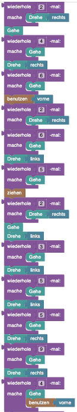

## Blöcke




## Code

### Part 1

```java
for(int i = 1; i <= 4; i++){
    hero.move();
}
hero.rotate(Direction.RIGHT);
for(int i = 1; i <= 5; i++){
    hero.move();
}
hero.rotate(Direction.LEFT);
for(int i = 1; i <= 7; i++){
    hero.move();
}
hero.rotate(Direction.LEFT);
for(int i = 1; i <= 3; i++){
    hero.move();
}
hero.rotate(Direction.LEFT);
hero.move();
for(int i = 1; i <= 2; i++){
    hero.push();
}
for(int i = 1; i <= 2; i++){
    hero.rotate(Direction.LEFT);
}
for(int i = 1; i <= 3; i++){
    hero.move();
}
hero.rotate(Direction.RIGHT);
for(int i = 1; i <= 3; i++){
    hero.move();
}
hero.rotate(Direction.RIGHT);
for(int i = 1; i <= 7; i++){
    hero.move();
}
hero.rotate(Direction.RIGHT);
for(int i = 1; i <= 5; i++){
    hero.move();
}
hero.rotate(Direction.RIGHT);
for(int i = 1; i <= 3; i++){
    hero.move();
}
hero.rotate(Direction.RIGHT);
hero.move();
hero.push();
for(int i = 1; i <= 2; i++){
    hero.rotate(Direction.RIGHT);
}
hero.move();
for(int i = 1; i <= 4; i++){
    hero.move();
}
hero.rotate(Direction.RIGHT);
for(int i = 1; i <= 6; i++){
    hero.move();
}
hero.interact(Direction.INFRONT);
for(int i = 1; i <= 2; i++){
    hero.rotate(Direction.RIGHT);
}
for(int i = 1; i <= 6; i++){
    hero.move();
}
hero.rotate(Direction.LEFT);
for(int i = 1; i <= 5; i++){
    hero.move();
}
hero.pull();
for(int i = 1; i <= 2; i++){
    hero.rotate(Direction.RIGHT);
}
hero.move();
hero.rotate(Direction.LEFT);
for(int i = 1; i <= 3; i++){
    hero.move();
}
hero.rotate(Direction.LEFT);
for(int i = 1; i <= 5; i++){
    hero.move();
}
hero.rotate(Direction.LEFT);
for(int i = 1; i <= 5; i++){
    hero.move();
}
hero.rotate(Direction.RIGHT);
hero.move();
```

## Blockly String

### Part 1

```json
{"blocks":{"languageVersion":0,"blocks":[{"type":"start","id":"={9Mof5xE4x:02,pxjC]","x":-108,"y":-458,"deletable":false,"next":{"block":{"type":"repeat","id":"i?pxNs!AMJN).xkHOv%,","inputs":{"TIMES":{"block":{"type":"repeat_number","id":"e66W{0gY#s$Y%-9/%VpJ","fields":{"REPEAT_NUMBER":4}}},"DO":{"block":{"type":"move","id":"p%)eIfef$pKzo:8}BY|H"}}},"next":{"block":{"type":"rotate","id":"!{8Z|)?,at1#1JR?fmqp","inputs":{"DIRECTION":{"block":{"type":"direction_right","id":"%qW#9-u,GljC1}hDepHR"}}},"next":{"block":{"type":"repeat","id":"MB4|OLdqt,]}3;]~a_HP","inputs":{"TIMES":{"block":{"type":"repeat_number","id":"U,17Wd!Y2tm=b+FhQYV$","fields":{"REPEAT_NUMBER":5}}},"DO":{"block":{"type":"move","id":"n4O2js]WANFjEU.88lKX"}}},"next":{"block":{"type":"rotate","id":"5F*CV?j?R6U?ZYUumb}/","inputs":{"DIRECTION":{"block":{"type":"direction_left","id":"F*RH!)VBHp?jF*D;(#!w"}}},"next":{"block":{"type":"repeat","id":"4?=;hijg@uxB5!rM4]n?","inputs":{"TIMES":{"block":{"type":"repeat_number","id":"VPFr;@^ErkH.bIUG!DXY","fields":{"REPEAT_NUMBER":7}}},"DO":{"block":{"type":"move","id":"Hrm-!vW!mQLv(1qS#+-G"}}},"next":{"block":{"type":"rotate","id":"jRHYvswDc^#+~v=u?7Bc","inputs":{"DIRECTION":{"block":{"type":"direction_left","id":"fma]T.1/Nwk,=y2SA=ym"}}},"next":{"block":{"type":"repeat","id":"tYYCKVRv=zm@sF{lBnQ`","inputs":{"TIMES":{"block":{"type":"repeat_number","id":"sINP:[ivNh|G^j7/X@UC","fields":{"REPEAT_NUMBER":3}}},"DO":{"block":{"type":"move","id":"-im+}JoK,%eJ;0CY[*tT"}}},"next":{"block":{"type":"rotate","id":"_kV(bp,$U!WsgNf|aShk","inputs":{"DIRECTION":{"block":{"type":"direction_left","id":"hdzlUcZ|w_sf39=q[8Rk"}}},"next":{"block":{"type":"move","id":"l97;^zNHRS=sU!H(.vc2","next":{"block":{"type":"repeat","id":"M@E`es_pV0/ce?Xc|#`6","inputs":{"TIMES":{"block":{"type":"repeat_number","id":"ayjR:j@]_v3[`G|u7ZdB","fields":{"REPEAT_NUMBER":2}}},"DO":{"block":{"type":"push","id":"(ZqM9GUpKNyfJ[HxJ9xu"}}},"next":{"block":{"type":"repeat","id":"Tjn(p_;e{?ey6@Xz6kQO","inputs":{"TIMES":{"block":{"type":"repeat_number","id":"Mx2|~EQ^~!u3TK5y?WA[","fields":{"REPEAT_NUMBER":2}}},"DO":{"block":{"type":"rotate","id":"(ar?,*YU]yWjiidn[{Bv","inputs":{"DIRECTION":{"block":{"type":"direction_left","id":"ZW%a24.G(5NIC5qg(O82"}}}}}},"next":{"block":{"type":"repeat","id":"X?^mlO8feeW2-=p~|oo!","inputs":{"TIMES":{"block":{"type":"repeat_number","id":"g!A+PJ,@*wqN}dY$/E{e","fields":{"REPEAT_NUMBER":3}}},"DO":{"block":{"type":"move","id":"aeaEnN$gXDE$2OZX}p(l"}}},"next":{"block":{"type":"rotate","id":"fukLG{fL2rK)#}PUt):r","inputs":{"DIRECTION":{"block":{"type":"direction_right","id":"*|lj1*O[9DZ[bU=fb7F;"}}},"next":{"block":{"type":"repeat","id":"eyQ5iOs4U]@SNSNWk[Zf","inputs":{"TIMES":{"block":{"type":"repeat_number","id":":9:tjMNi(7JS]ODjE4!Y","fields":{"REPEAT_NUMBER":3}}},"DO":{"block":{"type":"move","id":"E$BooNSZ{[l%Lgz[mD?V"}}},"next":{"block":{"type":"rotate","id":"jlwQ8w}5(Iidyu;6lf+L","inputs":{"DIRECTION":{"block":{"type":"direction_right","id":"l3bCgt~Rc*i-+V46f`%-"}}},"next":{"block":{"type":"repeat","id":"AQs0gd(hgr@[q(hOoukO","inputs":{"TIMES":{"block":{"type":"repeat_number","id":"~L3rq3gu{u_![InM3%IY","fields":{"REPEAT_NUMBER":7}}},"DO":{"block":{"type":"move","id":"34!=efI8):W,33+DCz:T"}}},"next":{"block":{"type":"rotate","id":"TZbeT}s_wcKXMX[*HxLD","inputs":{"DIRECTION":{"block":{"type":"direction_right","id":"Lz_7Zq0QC+DeH3YR.U^D"}}},"next":{"block":{"type":"repeat","id":"nMyp?;Yrka:R:`UdaI.p","inputs":{"TIMES":{"block":{"type":"repeat_number","id":"ug5dyrVpAPw6.xxVYEmn","fields":{"REPEAT_NUMBER":5}}},"DO":{"block":{"type":"move","id":"7bC=+)[3S7UQ$XJ859HN"}}},"next":{"block":{"type":"rotate","id":"q~%12bx-Di+crW80WOiA","inputs":{"DIRECTION":{"block":{"type":"direction_right","id":"CEtO%A@]=U3nJ:c@;pn?"}}},"next":{"block":{"type":"repeat","id":"k3sde#()E+l|SQ~Xi4X4","inputs":{"TIMES":{"block":{"type":"repeat_number","id":"Po[~wiSX7jI6Sll$*hrU","fields":{"REPEAT_NUMBER":3}}},"DO":{"block":{"type":"move","id":"+(a6B#A$l.9oo=3i[~()"}}},"next":{"block":{"type":"rotate","id":"=,MsZ+oAXGtLjlVL`E6e","inputs":{"DIRECTION":{"block":{"typ```
```
