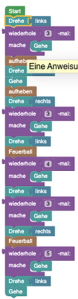

## Blöcke


## Code 

```java
hero.rotate(Direction.LEFT);
for(int i = 1; i <= 3; i++){
    hero.move();
}
hero.pickup();
hero.rotate(Direction.RIGHT);
hero.move();
hero.pickup();
hero.rotate(Direction.RIGHT);
for(int i = 1; i <= 3; i++){
    hero.move();
}
hero.rotate(Direction.LEFT);
hero.shootFireball();
for(int i = 1; i <= 4; i++){
    hero.move();
}
hero.rotate(Direction.LEFT);
for(int i = 1; i <= 3; i++){
    hero.move();
}
hero.rotate(Direction.RIGHT);
hero.shootFireball();
for(int i = 1; i <= 5; i++){
    hero.move();
}
hero.rotate(Direction.LEFT);
hero.move();
```

