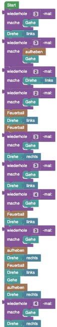
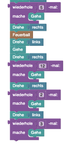
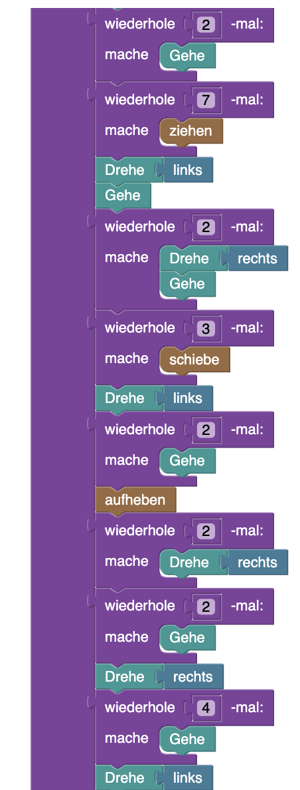

## Blöcke





## Code 

```java
hero.rotate(Direction.RIGHT);
for(int i = 1; i <= 3; i++){
    hero.move();
}
hero.push();
hero.rotate(Direction.LEFT);
for(int i = 1; i <= 3; i++){
    for(int x = 1; x <= 5; x++){
        hero.move();
    }
    hero.rotate(Direction.RIGHT);
}
for(int i = 1; i <= 3; i++){
    hero.move();
}
for(int i = 1; i <= 2; i++){
    hero.push();
}
hero.rotate(Direction.RIGHT);
for(int i = 1; i <= 2; i++){
    hero.move();
}
hero.rotate(Direction.RIGHT);
for(int i = 1; i <= 3; i++){
    hero.move();
}
hero.pickup();
for(int i = 1; i <= 2; i++){
    hero.rotate(Direction.RIGHT);
}
for(int i = 1; i <= 3; i++){
    hero.move();
}
hero.rotate(Direction.LEFT);
for(int i = 1; i <= 2; i++){
    hero.move();
}
hero.rotate(Direction.RIGHT);
for(int i = 1; i <= 6; i++){
    hero.push();
}
hero.rotate(Direction.RIGHT);
for(int i = 1; i <= 2; i++){
    hero.move();
}
hero.interact(Direction.LEFT);
hero.move();
hero.rotate(Direction.LEFT);
for(int i = 1; i <= 5; i++){
    hero.move();
}
hero.rotate(Direction.LEFT);
for(int i = 1; i <= 2; i++){
    hero.move();
}
for(int i = 1; i <= 2; i++){
    hero.rotate(Direction.RIGHT);
}
hero.pickup();
for(int i = 1; i <= 2; i++){
    hero.move();
}
hero.rotate(Direction.RIGHT);
for(int i = 1; i <= 4; i++){
    hero.move();
}
hero.rotate(Direction.RIGHT);
for(int i = 1; i <= 2; i++){
    hero.move();
}
for(int i = 1; i <= 7; i++){
    hero.pull();
}
hero.rotate(Direction.LEFT);
hero.move();
for(int i = 1; i <= 2; i++){
    hero.rotate(Direction.RIGHT);
    hero.move();
}
for(int i = 1; i <= 3; i++){
    hero.push();
}
hero.rotate(Direction.LEFT);
for(int i = 1; i <= 2; i++){
    hero.move();
}
hero.pickup();
for(int i = 1; i <= 2; i++){
    hero.rotate(Direction.RIGHT);
}
for(int i = 1; i <= 2; i++){
    hero.move();
}
hero.rotate(Direction.RIGHT);
for(int i = 1; i <= 4; i++){
    hero.move();
}
hero.rotate(Direction.LEFT);
for(int i = 1; i <= 3; i++){
    hero.shootFireball();
}
for(int i = 1; i <= 4; i++){
    hero.move();
}
```

