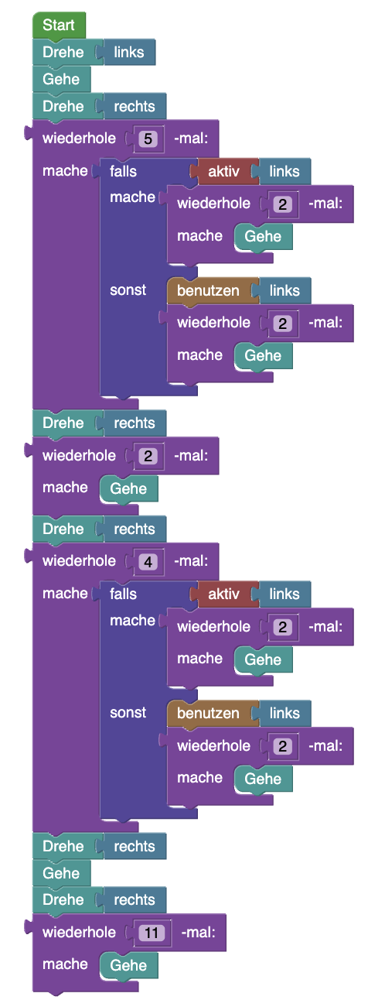

## Blöcke


## Code

```java
while(hero.isNearTile(LevelElement.FLOOR, Direction.HERE)){
    if(hero.isNearTile(LevelElement.WALL, Direction.UP)){
        hero.rotate(Direction.RIGHT);
    }else{
        hero.move();
    }
}

Ohne Direction.HERE:
while(true){
    if(hero.isNearTile(LevelElement.WALL, Direction.UP)){
        hero.rotate(Direction.RIGHT);
    }else{
        hero.move();
    }
}
```

## Blockly String
```json
{"blocks":{"languageVersion":0,"blocks":[{"type":"start","id":"={9Mof5xE4x:02,pxjC]","x":-233,"y":-247,"deletable":false,"next":{"block":{"type":"while_loop","id":"x{oW{NYfz??h_mbj+#:R","inputs":{"CONDITION":{"block":{"type":"logic_boolean","id":"oobLWzpzg7A1(G6Ku^Yv","fields":{"BOOL":"TRUE"}}},"DO":{"block":{"type":"while_loop","id":"u`/6UkHrh-zC]5-nB=Vv","inputs":{"CONDITION":{"block":{"type":"logic_wall_direction","id":"@bQ58MQrZ`pqt_WceQK*","inputs":{"DIRECTION":{"block":{"type":"direction_right","id":"n^D.@(H(Us[R_;m{CL5Q"}}}}},"DO":{"block":{"type":"move","id":"*baMKL,`%6Fw!a$[,kkx"}}},"next":{"block":{"type":"rotate","id":"e+fVJEPu5X4XjV/~?`jr","inputs":{"DIRECTION":{"block":{"type":"direction_right","id":"~cfXnMO:JB{4ZjXmw|,v"}}},"next":{"block":{"type":"move","id":"N*$X3S,Q31o#D9Zw!w[@"}}}}}}}}}}]}}
```
