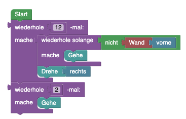

## Blöcke


## Code

```java
while(hero.isNearTile(LevelElement.FLOOR, Direction.HERE)){
    if(hero.isNearTile(LevelElement.WALL, Direction.UP)){
        if(hero.isNearTile(LevelElement.WALL, Direction.RIGHT)){
            hero.rotate(Direction.LEFT);
        }
        if(hero.isNearTile(LevelElement.WALL, Direction.LEFT)){
            hero.rotate(Direction.RIGHT);
        }
    }else{
        hero.move();
    }
}

Ohne Direction.HERE:
while(true){
    if(hero.isNearTile(LevelElement.WALL, Direction.UP)){
        if(hero.isNearTile(LevelElement.WALL, Direction.RIGHT)){
            hero.rotate(Direction.LEFT);
        }
        if(hero.isNearTile(LevelElement.WALL, Direction.LEFT)){
            hero.rotate(Direction.RIGHT);
        }
    }else{
        hero.move();
    }
}
```

## Blockly String
```json
{"blocks":{"languageVersion":0,"blocks":[{"type":"start","id":"={9Mof5xE4x:02,pxjC]","x":-102,"y":-353,"deletable":false,"next":{"block":{"type":"while_loop","id":"#1S)cjV7fWTgeN0X8NVr","inputs":{"CONDITION":{"block":{"type":"logic_boolean","id":"M6C95!HxD;1o{qocw^Gt","fields":{"BOOL":"TRUE"}}},"DO":{"block":{"type":"controls_if","id":"D-}=}gmapPmoT-t*~f7r","inputs":{"IF0":{"block":{"type":"logic_wall_direction","id":"#;-HTAk(Ble1~5$g#~vy","inputs":{"DIRECTION":{"block":{"type":"direction_up","id":"RfWWK])NL_^1j$E~KK%d"}}}}},"DO0":{"block":{"type":"controls_ifelse","id":"Ah#gwCN!i:+E`sE{u8`O","inputs":{"IF0":{"block":{"type":"logic_wall_direction","id":"0ob5(XEJ{2ke3a,1I]C!","inputs":{"DIRECTION":{"block":{"type":"direction_right","id":";ez{kwCG~}rTG#YT4cTj"}}}}},"DO0":{"block":{"type":"rotate","id":"jyuFf*#i:_~oT5?E$M[l","inputs":{"DIRECTION":{"block":{"type":"direction_left","id":"Bi2JK../hn/fnck%LZ0S"}}}}},"ELSE":{"block":{"type":"rotate","id":"QX%ec!rB-F@bUJH6WUy{","inputs":{"DIRECTION":{"block":{"type":"direction_right","id":"n,3m=@/T;dmk@i}`f#PJ"}}}}}}}}},"next":{"block":{"type":"move","id":"fyZe+!IJ6zYE8q@RvBcN"}}}}}}}}]}}
```
