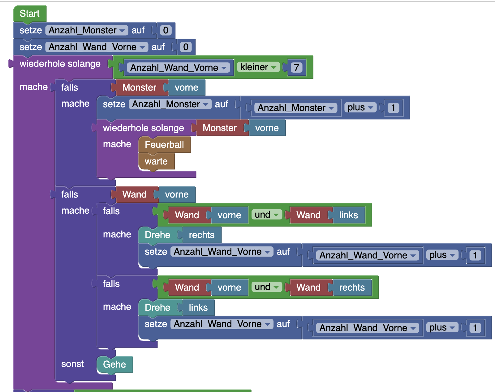
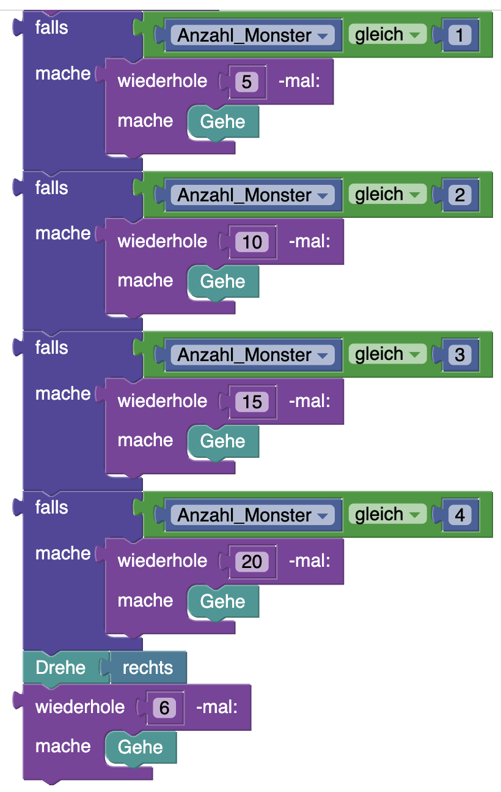

## Blöcke



## Code

```java
int anzahl_Monster = 0;
int anzahl_Wand_Vorne = 0;
while(anzahl_Wand_Vorne < 7){
    if(hero.isNearComponent(AIComponent.class, Direction.UP)){
        anzahl_Monster++;
        while(hero.isNearComponent(AIComponent.class, Direction.UP)){
            hero.shootFireball();
        }
    }
    if(hero.isNearTile(LevelElement.WALL, Direction.UP)){
        if(hero.isNearTile(LevelElement.WALL, Direction.UP) && hero.isNearTile(LevelElement.WALL, Direction.LEFT)){
            hero.rotate(Direction.RIGHT);
            anzahl_Wand_Vorne++;
        }
        if(hero.isNearTile(LevelElement.WALL, Direction.UP) && hero.isNearTile(LevelElement.WALL, Direction.RIGHT)){
            hero.rotate(Direction.LEFT);
            anzahl_Wand_Vorne++;
        }
    }else{
        hero.move();
    }
}
if(anzahl_Monster == 1){
    for(int i = 1; i <= 5; i++){
        hero.move();
    }
}
if(anzahl_Monster == 2){
    for(int i = 1; i <= 10; i++){
        hero.move();
    }
}
if(anzahl_Monster == 3){
    for(int i = 1; i <= 15; i++){
        hero.move();
    }
}
if(anzahl_Monster == 4){
    for(int i = 1; i <= 20; i++){
        hero.move();
    }
}
hero.rotate(Direction.RIGHT);
for(int i = 1; i <= 6; i++){
    hero.move();
}
```

## Blockly String
```json
{"blocks":{"languageVersion":0,"blocks":[{"type":"start","id":"={9Mof5xE4x:02,pxjC]","x":-132,"y":-771,"deletable":false,"next":{"block":{"type":"set_number_expression","id":"!Oa|zdr[x_xjT6N.HffB","fields":{"VAR":{"id":"kYDS%[Ad$-xU)yBo%~i;"}},"inputs":{"VALUE":{"block":{"type":"var_number","id":"7IB$M^uGiI(/{u~n,27:","fields":{"VAR_NUMBER":0}}}},"next":{"block":{"type":"repeat","id":"0B5z:|ju,hKY=4VlZXnG","inputs":{"TIMES":{"block":{"type":"repeat_number","id":"mfW34X2Vc#(r.GYDagd5","fields":{"REPEAT_NUMBER":7}}},"DO":{"block":{"type":"while_loop","id":"0oYuQ#`9wP^]n`K#LPb,","inputs":{"CONDITION":{"block":{"type":"not_condition","id":"E}tRNsB?2M%FCyp%]REz","inputs":{"INPUT_A":{"block":{"type":"logic_wall_direction","id":"4G1XwL_E?^]nG#|xhY3d","inputs":{"DIRECTION":{"block":{"type":"direction_up","id":"Q!mnjQ3Z^fIcv+P?+qX0"}}}}}}}},"DO":{"block":{"type":"controls_if","id":"ydw^ThkV|lkucnniu[FZ","inputs":{"IF0":{"block":{"type":"logic_monster_direction","id":"[C4Gh)]_pF]a8d`C.:_.","inputs":{"DIRECTION":{"block":{"type":"direction_up","id":"k8/JxJ{-dtE+jT)nH$8F"}}}}},"DO0":{"block":{"type":"fireball","id":"j/C[N9#LunRIoQU^5b0y","next":{"block":{"type":"set_number","id":"jv/OWQqQ0ebQl8C[0~|w","fields":{"VAR":{"id":"kYDS%[Ad$-xU)yBo%~i;"}},"inputs":{"VALUE":{"block":{"type":"expression","id":"pDKTE4W3H;`#XN4LCG6%","fields":{"OPERATOR":"+"},"inputs":{"INPUT_A":{"block":{"type":"get_variable","id":"T521XecttO9],(0*[!T/","fields":{"VAR":{"id":"kYDS%[Ad$-xU)yBo%~i;"}}}},"INPUT_B":{"block":{"type":"var_number","id":"~DO?aqCl.]D%x;0TSHNn","fields":{"VAR_NUMBER":1}}}}}}}}}}}},"next":{"block":{"type":"move","id":"58I)q8N4$XHi$:x;vXp:"}}}}},"next":{"block":{"type":"controls_ifelse","id":"G4c@R;zd-u_1,Hi6FNsK","inputs":{"IF0":{"block":{"type":"logic_wall_direction","id":"hMf59IWt95(z!Go5|vpP","inputs":{"DIRECTION":{"block":{"type":"direction_left","id":"F$Lik_k38u4B)yE!=yz6"}}}}},"DO0":{"block":{"type":"rotate","id":"L?D=VGG%pylbKT(a`rQ!","inputs":{"DIRECTION":{"block":{"type":"direction_right","id":"0zh$1}Ts,]fvay71/$q!"}}}}},"ELSE":{"block":{"type":"rotate","id":"18b/yk1}Ikt^PKtTJ!S^","inputs":{"DIRECTION":{"block":{"type":"direction_left","id":"U,]74cPV?:T:UjjGrC_?"}}}}}}}}}}},"next":{"block":{"type":"repeat","id":"p0b.~%!nky`C:7f)V)go","inputs":{"TIMES":{"block":{"type":"get_variable","id":"wQ|:_@b9)zQMZtOKjd6n","fields":{"VAR":{"id":"kYDS%[Ad$-xU)yBo%~i;"}}}},"DO":{"block":{"type":"repeat","id":"1$I/qG^R~J*.^_j.Gi9R","inputs":{"TIMES":{"block":{"type":"repeat_number","id":"=dPa!FFJmLcjIiT^0l,F","fields":{"REPEAT_NUMBER":5}}},"DO":{"block":{"type":"move","id":"fo}IQueluCpRdp9e0{vz"}}}}}},"next":{"block":{"type":"rotate","id":"ecx)#zhOEPz]fBTHZ4F;","inputs":{"DIRECTION":{"block":{"type":"direction_right","id":",)cj~Fo}[8_Y7JTP|ntR"}}},"next":{"block":{"type":"repeat","id":":#MWk+b_fW4tpb33+bgF","inputs":{"TIMES":{"block":{"type":"repeat_number","id":"j#I^9as[^Y#%oM|-M~iZ","fields":{"REPEAT_NUMBER":6}}},"DO":{"block":{"type":"move","id":"r#S+v,TBR56u3[`HNhHx"}}}}}}}}}}}}}}]},"variables":[{"name":"Element","id":"kYDS%[Ad$-xU)yBo%~i;"}]}
```
