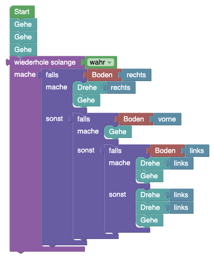

## Blöcke


## Code

```java
while(true){
    if(hero.isNearComponent(AIComponent.class, Direction.UP)){
        if(hero.isNearTile(LevelElement.WALL, Direction.RIGHT) && hero.isNearTile(LevelElement.WALL, Direction.LEFT)){
            hero.shootFireball();
        }else{
            if(hero.isNearTile(LevelElement.WALL, Direction.RIGHT)){
                hero.rotate(Direction.LEFT);
                hero.move();
            }else{
                hero.rotate(Direction.RIGHT);
                hero.move();
            }
        }
    }
    if(hero.isNearTile(LevelElement.WALL, Direction.UP)){
        if(hero.isNearTile(LevelElement.WALL, Direction.RIGHT)){
            hero.rotate(Direction.LEFT);
            hero.move();
        }else{
            hero.rotate(Direction.RIGHT);
            hero.move();
        }
    }else{
        if(!hero.isNearTile(LevelElement.WALL, Direction.RIGHT)){
            hero.rotate(Direction.RIGHT);
        }
        hero.move();
    }
}
```

## Blockly String
```json
{"blocks":{"languageVersion":0,"blocks":[{"type":"start","id":"={9Mof5xE4x:02,pxjC]","x":-66,"y":-602,"deletable":false,"next":{"block":{"type":"while_loop","id":"*q?Jg~l8q%wX{^HQBcy}","inputs":{"CONDITION":{"block":{"type":"logic_boolean","id":"Gisot|S@)IO{WJ;Skceh","fields":{"BOOL":"TRUE"}}},"DO":{"block":{"type":"controls_ifelse","id":"KfPB2rcwJK`;z7Q!KGdk","inputs":{"IF0":{"block":{"type":"logic_wall_direction","id":"bCw0/Q^g$plp8xN{^DTd","inputs":{"DIRECTION":{"block":{"type":"direction_up","id":"Zu*M!,:]Yf]}xjt6aWeT"}}}}},"DO0":{"block":{"type":"controls_ifelse","id":"=PqFEl^An/vFuY6JUJ/K","inputs":{"IF0":{"block":{"type":"logic_wall_direction","id":"R$P)aI}Ouxn]n42DoWgy","inputs":{"DIRECTION":{"block":{"type":"direction_right","id":"^p=o=VxDC=$J|-Gsm#zN"}}}}},"DO0":{"block":{"type":"rotate","id":"Ts;r)VV2O^j%D@k;Ol^`","inputs":{"DIRECTION":{"block":{"type":"direction_left","id":"|SAxEbVo78_bj=UBH6JY"}}}}},"ELSE":{"block":{"type":"rotate","id":"rxT8]bBi;n(PenLh)p*D","inputs":{"DIRECTION":{"block":{"type":"direction_right","id":"ap`!u]U:x+zYT6I,YoK$"}}}}}}}},"ELSE":{"block":{"type":"controls_if","id":"M#b0vRN8h[l*q3:B{*:p","inputs":{"IF0":{"block":{"type":"not_condition","id":"EkO{IUo?kDGLZ|F,TMHw","inputs":{"INPUT_A":{"block":{"type":"logic_wall_direction","id":"xSUCRYwp9Oo_lm;.xw*7","inputs":{"DIRECTION":{"block":{"type":"direction_right","id":"mR85O@j~oUV0B?/.TBq~"}}}}}}}},"DO0":{"block":{"type":"rotate","id":"|qNw~pUND_O5*w)`hB3L","inputs":{"DIRECTION":{"block":{"type":"direction_right","id":"]a^A51IEsj-e.BQgTiBd"}}}}}}}}},"next":{"block":{"type":"controls_if","id":"WYH6D@fW^Ryoe_rTW@Ts","inputs":{"IF0":{"block":{"type":"logic_monster_direction","id":"i.p~s.k6Y+:uSE0scLO=","inputs":{"DIRECTION":{"block":{"type":"direction_up","id":"v9C-Q/]n+F5BO9PRq;*]"}}}}},"DO0":{"block":{"type":"fireball","id":"v!DZ=1y-x~$P*e4!my0W"}}},"next":{"block":{"type":"move","id":"?XkP_#6*WnhLm,bEZmva"}}}}}}}}}}]}}
```
