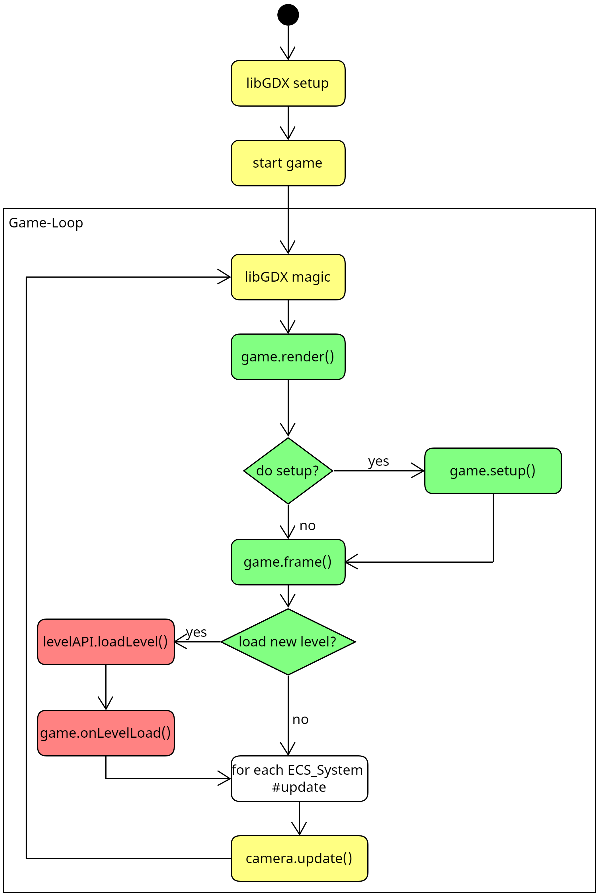
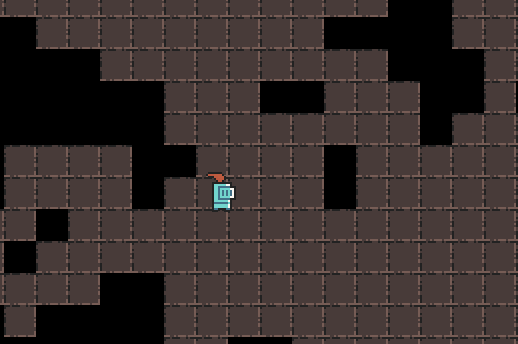
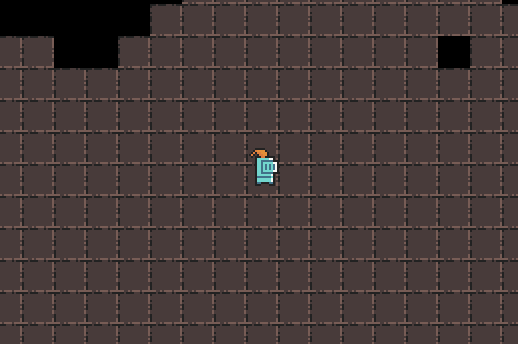
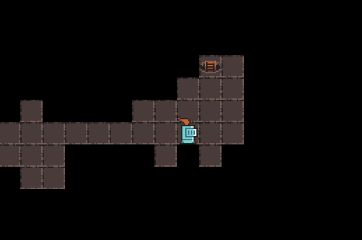

Dieses Dokument liefert einen Einstieg in das Dungeon. Es erläutert die Installation des Spiels und die ersten Schritte,
um eigene Inhalte zum Dungeon hinzuzufügen. Es dient als Grundlage für alle weiteren Praktika. Lesen Sie das Dokument
daher aufmerksam durch und versuchen Sie sich zusätzlich selbst mit dem Aufbau vertraut zu machen. Das Spiel befindet
sich im [Dungeon-Repo](https://github.com/Programmiermethoden/Dungeon).

Sie benötigen nur dieses Projekt für die Aufgaben, die zusätzlichen Abhängigkeiten werden automatisch über Gradle
eingebunden.

*Hinweis:* Achten Sie darauf, Daten nur dann in öffentliche Git-Repos zu laden, wenn Sie die nötigen Rechte an diesen
Daten haben. Dies gilt insbesondere auch für Artefakte wie Bilder, Bitmaps, Musik oder Soundeffekte.

## Installation

Für das Dungeon wird das Java Development Kit 17.x.x (JDK 17) oder höher benötigt, stellen Sie sicher, dass Sie es
installiert haben.

Laden Sie das Projekt herunter und binden Sie es als Gradle-Projekt in Ihre IDE ein. Eine genauere
[Anleitung](https://github.com/Programmiermethoden/Dungeon/wiki/Import-Project) finden Sie in dem Projekt-Wiki.

Sie können über die run-Funktion Ihrer IDE überprüfen, ob die Installation lauffähig ist. Alternativ können Sie per
Konsole in das Dungeon-Verzeichnis wechseln und `./gradlew run` ausführen.

*Hinweis:* Falls Sie Probleme beim Installieren haben, schauen Sie in die
[Kompatibilitätsliste](https://github.com/Programmiermethoden/Dungeon/wiki/JDK-Kompatibilität) und die
[FAQ](https://github.com/Programmiermethoden/Dungeon/wiki/FAQ). Melden Sie sich frühzeitig, falls Ihr Problem damit
nicht behoben werden konnte.

## Grundlagen

Zu Beginn einige grundlegende Prinzipien, die Sie verstanden haben sollten, bevor Sie mit dem Dungeon arbeiten.

Das Dungeon benutzt das Cross-Plattform-Java-Framework [libGDX](https://libgdx.com) als Backend. Dieses ist im
Dungeon-Projekt bereits als Abhängigkeit in die Gradle-Konfiguration integriert, Sie müssen dieses nicht extra
installieren. Die Ihnen zur Verfügung gestellten Vorgaben sind so umgesetzt, dass Sie kein tieferes Verständnis für
libGDX benötigen, um die Aufgaben zu lösen. Sollten Sie allerdings einmal auf Probleme stoßen, kann es unter Umständen
helfen, einen Blick in die [Dokumentation von libGDX](https://libgdx.com/wiki/) zu werfen.

Das Dungeon-Projekt fungiert, ganz vereinfacht gesagt, als eine [Fassade](https://en.wikipedia.org/wiki/Facade_pattern)
zwischen libGDX und Ihrer eigenen Implementierung. Es implementiert ein [Entity-Component-System
(ECS)](https://en.wikipedia.org/wiki/Entity_component_system): - `Entity`: Entitites sind die Elemente (Helden, Monster,
Schatzkisten, etc.) des Spiels - `Component`: Components speichern die Datensätze der Entitäten (z.B. die
Lebenspunkte) - `System`: Systeme beinhalten die eigentliche Logik und agieren auf den Components.

Weiteres dazu erfahren Sie unter [ECS im Dungeon](ecs/ecs_basics.md).

Sie selbst nutzen und erweitern die `Component`s und `System`s der Vorgaben. Sie werden ebenfalls neue Entities,
Components und Systeme konzipieren und implementieren. So erschaffen Sie z.B. Ihre eigenen Monster und fallengespickte
Level.

Sie werden im Laufe der Praktika verschiedene Assets benötigen. Diese liegen per Default im `assets`-Verzeichnis. Sie
können das Standardverzeichnis in der `build.gradle` anpassen.

-   Standardpfad für Texturen: `assets/`
-   Standardpfad für Charaktere: `assets/character/`
-   Standardpfad für Level-Texturen: `assets/textures/dungeon/`

## Wichtige Klassen im Dungeon

In diesem Abschnitt werden Ihnen die wichtigsten Klassen im Dungeon vorgestellt.


*Anmerkung:* Das UML ist für bessere Lesbarkeit auf die wesentlichen Bestandteile gekürzt.

Die in Grün gekennzeichnete Klasse `Game` ist die Basisklasse, von der alles ausgeht. Die Methode `Game#render` ist die
Game-Loop. Das ECS wird durch die in weiß gekennzeichneten Klassen `Entity`, `Component` und `ECS_System` implementiert.
Im weiteren Verlauf wird noch genauer hierauf eingegangen.

Neu erzeugte Entitäten speichern sich automatisch im HashSet `entities` der `Game`-Klasse ab. `ECS_System`e speichern
sich automatisch im `SystemController` `systems` der `Game`-Klasse ab.

Die Systeme iterieren über die in `Game` gespeicherten Entitäten und greifen über die Methode `Entity#getComponent` auf
die für die jeweilige Funktionalität benötigten Components zu. Die orangefarbenen `System`s und `Controller` sind in dem
UML-Diagramm Beispiele für die bereits bestehenden `System`s und `Controller`.

Die LevelAPI generiert, zeichnet und speichert das aktuelle Level. Klassen, die rot gekennzeichnet sind, gehören zur
Implementierung von [Level](level/readme.md).

Die in Gelb hinterlegten Klassen stammen aus dem Framework vor der Umstellung auf ECS. Für ein Basisverständnis des
Dungeons ist ein Wissen über die Funktionalität dieser Klassen nicht nötig.

Zusätzlich existieren noch eine Vielzahl an weiteren Hilfsklassen, mit denen Sie mal mehr oder mal weniger Kontakt haben
werden.

### Klasse *Game*

`Game` ist Ihr Einstiegspunkt in das Dungeon. Die Klasse erstellt die Entitäten, Components und Systeme des ECS und
beinhaltet die **Game-Loop**.

Die **Game-Loop** ist der wichtigste Bestandteil des Spieles. Sie ist eine Endlosschleife, welche einmal pro Frame
aufgerufen wird. Das Spiel läuft in 30 FPS (also 30 frames per seconds), die Game-Loop wird also 30-mal in der Sekunde
aufgerufen. Alle Aktionen, die wiederholt ausgeführt werden müssen, wie zum Beispiel das Bewegen und Zeichnen von
Figuren, müssen innerhalb der Game-Loop stattfinden.



*Hinweis:* Die Farbcodierung ist dieselbe wie beim UML-Klassendiagramm.

*Hinweis:* `Game` erbt von `ScreenAdapter`, eine libGDX-Klasse, wo die Methode `render` vorgegeben wird, die
überschrieben wird. `render` wird von libGDX in jedem Frame aufgerufen. libGDX beinhaltet eine Loop, auf die wir keinen
Zugriff haben, weshalb wir `render` als unseren Game-Loop benutzen.

*Hinweis:* Die Game-Loop wird automatisch ausgeführt, Sie müssen sie nicht aktiv aufrufen.

`Game` implementiert noch weitere wichtige Methoden:

-   `setup` wird zu Beginn der Anwendung aufgerufen. In dieser Methode werden die Objekte (wie die Systeme)
    initialisiert und konfiguriert, welche bereits vor dem Spielstart existieren müssen. In der Vorgabe wird hier
    bereits das erste Level geladen, die Systeme angelegt und der Held initialisiert.
-   `frame` wird in jedem Frame einmal aufgerufen. Dort wird der Kamerafokus gesetzt, Entitäten hinzugefügt und
    entfernt, sowie überprüft, ob ein neues Level geladen werden muss.
-   `onLevelLoad` wird immer dann aufgerufen, wenn ein Level geladen wird. Hier werden später Entitäten erstellt, die
    initial im Level verteilt werden.
-   `getEntities` liefert das HashSet `entities` zurück. `entities` speichert alle Entitäten, welche sich momentan im
    Dungeon befinden.
-   `addEntity` fügt neue Entitäten im nächsten Frame in das Spiel ein.
-   `removeEntity` entfernt Entitäten im nächsten Frame aus dem Spiel.
-   `main` startet das Spiel.

### Entity

Entitäten sind die Objekte im Spiel. Im Code sind sie nur leere Container, dessen Eigenschaften über die zugewiesenen
Components bestimmt werden. Entitäten haben neben den Components keine eigenen Attribute oder Funktionen.

Sie werden nicht durch Ableiten der Klasse `Entity` erzeugt (Ausnahme ist der Held, dazu später mehr). Stattdessen
werden sie durch Erzeugen einer Instanz von `Entity` und Hinzufügen von`Component`s implementiert.

### Component

Die `Component`s sind die Datensätze der Entitäten und beschreiben dessen Eigenschaften. Eine Component-Instanz gehört
zu genau einer Entität-Instanz.

Jedes Component muss von der abstrakten Klasse `Component` abgeleitet werden. Schauen Sie sich auch die [bereits
implementierten Components](ecs/components/readme.md) an.

### ECS_System

Systeme agieren auf den Components und ändern die Werte in diesen. Sie bestimmen also das Verhalten der Entitäten. Ein
System kann auf mehrere Components agieren.

Um ein eigenes System zu erstellen, muss von der abstrakten Klasse `ECS_System` abgeleitet werden. Schauen Sie sich auch
die [bereits implementierten Systeme](ecs/systems/readme.md) an; hier finden Sie auch die Abhängigkeiten der Systeme zu
bestimmten Components.

*Hinweis:* Um mehr darüber zu erfahren, wie Sie eigene Entitäten, Components und Systeme erstellen, werfen Sie einen
Blick in [Eigene Inhalte erstellen](ecs/create_own_content.md).

## Übung: Eigenen Helden erstellen

Zwar gibt es in den Vorlagen bereits einen Helden (den schauen wir uns am Ende dieses Kapitels genauer an), trotzdem
wird Ihnen hier erklärt, wie Sie Ihre erste eigene Entität in das Spiel implementieren.

*Hinweis:* Wenn Sie mitprogrammieren wollen, kommentieren Sie in der
Methode `starter.Game#setup()` die Zeile `hero = new Hero();` aus.

### Held als Entität erstellen

Zu Beginn erstellen Sie sich eine neue Java-Klasse namens `MyHero`. Diese erbt von der Klasse `Entity`.

*Anmerkung:* Wie alle Spielelemente im Dungeon, ist auch der Held eine Entität und kann auch direkt als `Entity`
implementiert werden. Das Erstellen einer eigenen Klasse `MyHero`, welche von `Entity` erbt, dient nur der
Übersichtlichkeit.

``` java
package ecs.entities;

public class MyHero extends Entity{}
```

Der Held ist ein Element im Spiel und daher eine Entität im ECS.

Damit der Held im Level platziert werden kann, braucht er ein `PositionComponent`. Das `PositionComponent` speichert den
`Point` (also die Position) auf dem sich der Held befindet.

*Anmerkung:* Im Dungeon existieren zwei Koordinatensysteme: `Point` und `Coordinate`. Die Level werden als Matrix von
`Tile`s gespeichert. `Tile`s sind die Felder im [Level](level/readme.md) (Boden, Wand, Loch, etc.). Die Position der
`Tile`s werden als `Coordinate`s gespeichert (Index des Tiles in der Matrix). Entitäten können auch zwischen zwei Tiles
stehen. Daher werden ihre Positionen als `Point`s gespeichert.

Im Konstruktor des Helden legen wir das `PositionComponent` an. Dazu erzeugen wir ein neues `PositionComponent` mit der
Startposition `(0|0)`

``` java
package ecs.entities;

import ecs.components.PositionComponent;

public class MyHero extends Entity {

    public MyHero() {
        super();

        //erzeugen der Position für den Helden
        new PositionComponent(this);
    }
}
```

*Hinweis:* Wenn Sie mal ein `Component` einer Entität abfragen wollen, nutzen Sie die Methode `Entity#getComponent` und
übergeben Sie die `class` des gesuchten `Component`s. Beispiel: `hero.getComponent(PositionComponent.class);`

Jetzt muss unser Held noch in das Spiel geladen werden. Dafür gehen wir in die Klasse `starter.Game` und fügen den
Helden an erster Stelle in `Game#setup` hinzu, indem Sie die bereits existierende Referenz `hero` initialisieren.

``` java
    /** Called once at the beginning of the game. */
    protected void setup() {
        hero = new MyHero();
        ...
    }
```

Wenn Sie nun das Spiel starten, sehen Sie zwar das Level im Dungeon, aber Ihren Helden noch nicht.

### Held zeichnen

Damit der Held im Spiel auch angezeigt werden kann, braucht er ein `AnimationComponent`, denn dann wird das `DrawSystem`
den Helden an seiner aktuellen Position zeichnen. Für das `AnimationComponent` benötigen wir zwei `Animation`s. Eine für
`idleRight` und eine für `idleLeft`. `Animation`s sind eine Reihe an Bildern, die abwechselnd angezeigt werden.

Animation können wir mit dem `AnimationBuilder` erzeugen, indem wir `AnimationBuilder.buildAnimation` aufrufen und als
Parameter das Verzeichnis mit den Bildern übergeben, die zu einer Animation zusammengefasst werden sollen. Das
`AnimationComponent` wird im Konstruktor erstellt.

``` java
package ecs.entities;

import dslToGame.AnimationBuilder;
import ecs.components.AnimationComponent;
import ecs.components.PositionComponent;
import graphic.Animation;

public class MyHero extends Entity {

    public MyHero() {
        super();

        //erzeugen der Position für den Helden
        new PositionComponent(this);

        //erstellen der Idle-Animationen
        Animation idleLeft = AnimationBuilder.buildAnimation("character/knight/idleLeft");
        Animation idleRight = AnimationBuilder.buildAnimation("character/knight/idleRight");
        //'zeichnen' des Helden
        new AnimationComponent(this, idleLeft, idleRight);
    }
}
```

Wenn Sie das Spiel jetzt starten, sollten Sie ihren Helden sehen:



### Held bewegen

Damit der Held vom `VelocitySystem` bewegt werden kann, benötigt er das `VelocityComponent`. Das `VelocityComponent`
speichert die Maximalgeschwindigkeit des Helden, sowie die aktuelle Geschwindigkeit des Helden.

Damit wir den Helden auch per Tastatur steuern können, benötigt er das `PlayableComponent`, denn dann wird das
`PlayerSystem` die Werte des Helden auf Knopfdruck aktualisieren.

*Hinweis*: Hier erfahren Sie mehr zur Konfiguration der [Tastenbelegung](configuration/readme.md).

Genau wie die anderen `Component`s fügen wir das `VelocityComponent` und das `PlaybaleComponent` zum Konstruktor hinzu.

``` java
package ecs.entities;

import dslToGame.AnimationBuilder;
import ecs.components.AnimationComponent;
import ecs.components.PlayableComponent;
import ecs.components.PositionComponent;
import ecs.components.VelocityComponent;
import graphic.Animation;

public class MyHero extends Entity {

    public MyHero() {
        super();

        //erzeugen der Position für den Helden
        new PositionComponent(this);

        //erstellen der Idle-Animationen
        Animation idleLeft = AnimationBuilder.buildAnimation("character/knight/idleLeft");
        Animation idleRight = AnimationBuilder.buildAnimation("character/knight/idleRight");
        //'zeichnen' des Helden
        new AnimationComponent(this, idleLeft, idleRight);

        //der Held wir 'steuerbar'
        new PlayableComponent(this);

        //Geschwindigkeit, mit der der Held läuft
        float xSpeed = 0.3f;
        float ySpeed = 0.3f;

        //erzeugen der Lauf-Animationen
        Animation runLeft = AnimationBuilder.buildAnimation("character/knight/runLeft");
        Animation runRight = AnimationBuilder.buildAnimation("character/knight/runRight");

        //der Held läuft mit den Animationen und der Geschwindigkeit
        new VelocityComponent(this, xSpeed, ySpeed, runLeft, runRight);
    }
}
```

Jetzt sollten Sie ihren Helden bewegen können:



## Bestehenden Code analysieren

Da Sie nun einen eigenen Helden erstellt haben und bewegen können, schauen wir uns nun weitere Bestandteile des Dungeons
an.

### Nächstes Level laden

Ihnen ist sicherlich schon aufgefallen, dass ein neues Level geladen wird, wenn Sie die Leiter mit Ihrem Helden
berühren:



Schauen wir einmal in die Methode `Game#frame`, wird dort die Methode `loadNextLevelIfEntityIsOnEndTile` aufgerufen.

``` java
    /** Called at the beginning of each frame. Before the controllers call <code>update</code>. */
    protected void frame() {
        setCameraFocus();
        manageEntitiesSets();
        getHero().ifPresent(this::loadNextLevelIfEntityIsOnEndTile);
        if (Gdx.input.isKeyJustPressed(Input.Keys.P)) togglePause();
    }
```

Diese Methode prüft, ob sich der Held auf der Leiter befindet. Wenn ja, wird über die `LevelAPI` ein neues Level
geladen.

``` java
    private void loadNextLevelIfEntityIsOnEndTile(Entity hero) {
        if (isOnEndTile(hero)) levelAPI.loadLevel(LEVELSIZE);
    }
```

Beim Laden eines neuen Levels wird automatisch die `Game#onLevelLoad`-Methode aufgerufen.

``` java
    @Override
    public void onLevelLoad() {
        currentLevel = levelAPI.getCurrentLevel();
        entities.clear();
        getHero().ifPresent(this::placeOnLevelStart);
    }
```

In der Standardimplementierung werden dabei alle Entitäten entfernt und wenn es einen Helden gibt, wird dieser auf die
Startposition des neuen Levels platziert und wieder in das Spiel geladen.

### Existierenden Helden analysieren

Wenn Sie wollen, können Sie mit Ihrem Helden weiterarbeiten, oder Sie holen sich den bereits existierenden Helden
zurück.

Der vorgefertigte Held hat zwei weitere Besonderheiten, die Sie noch nicht kennen. Zum einen besitzt er einen
Feuerball-[Skill](ecs/skills/readme.md). Dieser wird in `Hero#setupFireballSkill` erstellt.

``` java
    private void setupFireballSkill() {
        firstSkill =
                new Skill(
                        new FireballSkill(SkillTools::getCursorPositionAsPoint), fireballCoolDown);
    }
```

In der Standardkonfiguration können Sie den Feuerball in Richtung Ihres Mauscursors mit der Taste R abfeuern.

Zusätzlich besitzt der Held ein [`HitboxComponent`](ecs/components/hitbox_component.md). Damit kann er mit anderen
Entitäten, die ebenfalls ein `HitboxComponent` haben, kollidieren.

``` java
    private void setupHitboxComponent() {
        new HitboxComponent(
                this,
                (you, other, direction) -> System.out.println("heroCollisionEnter"),
                (you, other, direction) -> System.out.println("heroCollisionLeave"));
    }
```

## Linksammlung

Hier finden Sie noch einige Links um Ihr Verständnis des Dungeons zu vertiefen:

-   [ECS Basics](ecs/ecs_basics.md)
-   [Entitäten, Components und Systeme selbst erstellen](ecs/create_own_content.md)
-   [Übersicht der Systeme](ecs/systems/readme.md)
-   [Übersicht der Components](ecs/components/readme.md)
-   [Übersicht der Spielelemente](ecs/gameelements/)
-   [Level Basics](level/readme.md)
-   [HUD Basics](hud/readme.md)
-   [Config](configuration/readme.md)
-   [Dungeon-Wiki](https://github.com/Programmiermethoden/Dungeon/wiki)
-   [LibGDX Dokumentation](https://libgdx.com/wiki/)
