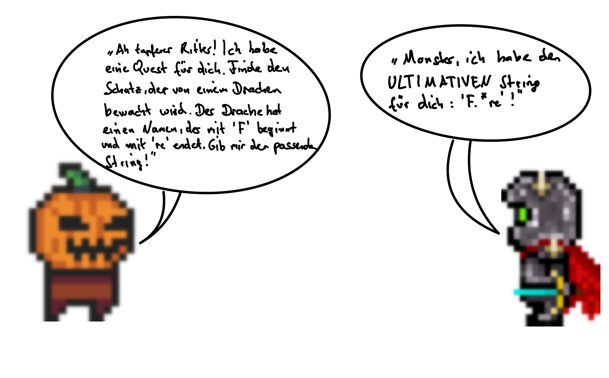
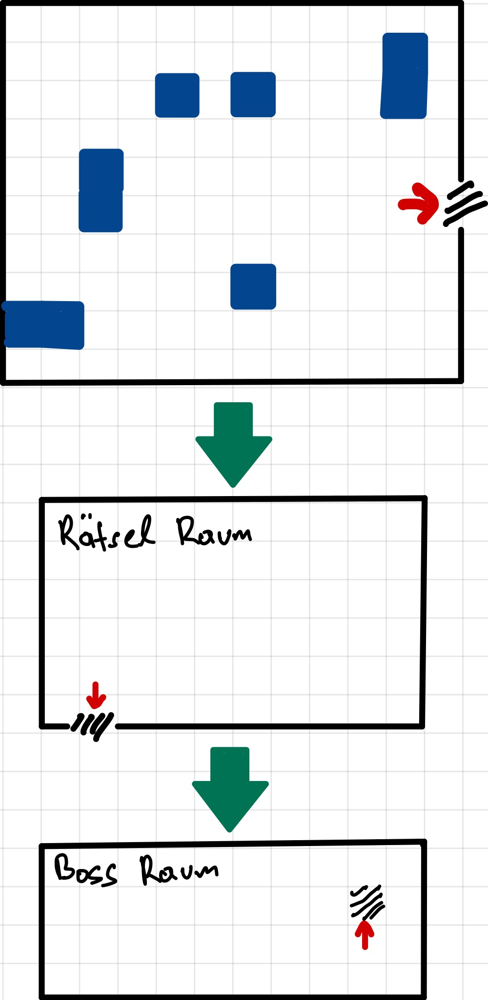

## Einleitung

Das folgende Konzept beschreibt die Ideen und Elemente für ein 2D Dungeon-Spiel mit dem
Titel "Dojo-Dungeon". In diesem Spiel erkundet der Spieler verschiedene Level,
löst Rätsel, besiegt Monster und sammelt Schätze. Hier sind die Details für jedes Level.

## Level 1: "Der Vergessene Wald"

- Umgebung:
    - Ein geheimnisvoller Wald mit dichtem
      Unterholz und moosbedecktem Boden.
    - Der Wald besteht aus drei Räumen.
- Ziele und Aufgaben im ersten Raum:
    - Der Spieler muss den versteckten Schlüssel
      finden, um die Tür zuöffnen. Ein Monster trägt den
      Schlüssel bei sich. Um den Schlüssen zu erhalten, muss
      der Spieler das Monster besiegen.
    - Auf dem Weg begegnet er wilde Imps und
      Goblins.
    - In den Truhen befinden sich zusätzlich
      Heilgegenstände, damit sich der Spieler heilen
      kann.
- Rätsel im zweiten Raum:
    - Dem Spieler wird eine Java-Datei präsentiert, die vier
      Fehler enthält.
    - Der Spieler muss den Fehler identifizieren
      und korrigieren, um voranzukommen.
- Rätsel im dritten Raum:
    - Der Spieler trifft auf einen mysteriösen NPC.
    - Der NPC stellt Fragen zu Lambda-Ausdrücken
      und Funktionsinterfaces.
    - Der Spieler muss die Fragen richtig beantworten, um weiterzukommen.

## Level 2: "Tempel der verlorenen Geheimnisse"

- Umgebung:
    - Ein uralter Tempel mit geheimnisvollen Inschriften.
    - Der Tempel besteht aus drei Räumen.
- Ziele und Aufgaben im ersten Raum:
    - Der Spieler muss den versteckten Saphir
      finden, der von einem bestimmten Monster
      fallengelassen wird. Sobald der Saphir im
      Besitz des Spielers ist, öffnet sich die Tür.
    - Ork-Krieger und Ork-Schamanen wollen es
      verhindern.
    - Zusätzlich befinden sich Truhen im Raum,
      die Heilgegenstände beinhalten.
- Rätsel im zweiten Raum:
    - Der blaue Ritter tritt vor dem Spieler und stellt
      ihm eine Aufgabe. Der Spieler muss ein Monster erstellen.
      Um weiterzukommen, muss der Spieler nicht nur das Monster
      erschaffen, sondern auch besiegen.
- Bosskampf "Skelettdoktor der Code Refactorer" im dritten Raum:
    - Der Skelettdoktor ist verzweifelt, weil der
      Quellcode miserabel, unvollständig und ineffizient ist und
      bittet den Spieler um Hilfe.
      Der Spieler soll eine Klasse auf Anti-Pattern untersuchen und
      "refactoren". Das Ziel dabei ist, den Code zu optimieren und die
      Lesbarkeit zu verbessern. Diese überarbeitete Klasse soll er im
      Praktikum von einem Tutor überprüfen lassen. Falls die Lösung
      zufriedenstellend ist, kann er in den nächsten Raum weitergehen.

## Level 3: "Kerker des Grauens"

- Umgebung:
    - Ein düsterer, verfallener Kerker mit steinernen
      Wänden und alten Türen.
    - Der Kerker besteht aus drei Räumen.
- Ziele und Aufgaben im ersten Raum:
    - Der Spieler muss Schriftrollen, die verschiedene Programming
      Patterns und Software Development Principles repräsentieren,
      den entsprechenden Truhen zuordnen. Die Truhen sind mit den
      Kategorien der Programming Patterns und Software Development
      Principles beschriftet. Erst wenn alle Schriftrollen korrekt
      zugeordnet sind, kann der Spieler in den nächsten Raum
      weitergehen.
    - Unterwegs trifft der Spieler auf Zombies, die ihn angreifen.
- Rätsel im zweiten Raum:
    - Ein friedlicher Imp stellt dem Spieler eine Herausforderung:
      Er soll eine Klasse mit mathematischen Funktionen verbessern.
      Der Spieler hat jedoch nur eine  begrenzte Anzahl an Versuchen,
      symbolisiert durch seine Lebenspunkte. Wenn der Spieler die
      Klasse richtig verbessert hat, gilt der Imp als besiegt und
      der Spieler kann in den nächsten Raum weitergehen.
- Bosskampf "OgreX" im dritten Raum:
    - OgreX stellt verschiedene Fragen, die auf regulären Ausdrücken
      basieren. Der Spieler muss daraufhin einen String eingeben, der zum
      regulären Ausdruck passt. Wenn der Spieler die passenden Strings
      eingegeben hat, lässt OgreX den Spieler zur nächsten Ebene
      weitergehen.

## Level 4: "Die Vulkanhöhle"

- Umgebung:
    - Eine unterirdische Höhle mit fließender Lava
      und glühenden Steinen.
    - Die Vulkanhöhle besteht aus drei Räumen.
- Ziele und Aufgaben im ersten Raum:
    - Der Spieler muss alle Monster erledigen um
      weiterzukommen.
    - Folgende Monster sind anzutreffen: "Imps"
      und "kleine Dämonen".
- Bosskampf "Zauberer von Patternson" im zweiten Raum:
    - Der "Zauberer von Patternson" stellt dem Spieler eine neue
      Herausforderung: Er muss verschiedene Design Patterns anhand
      eines UML-Klassendiagramms erkennen. Der Spieler muss dann
      die erkannten Design Patterns dem Zauberer mitteilen.
      Wenn die Lösung korrekt ist, kann der Spieler in die nächste
      Ebene weitergehen.
- Bosskampf "Der Artefakt Dämon" im dritten Raum:
    - Der Dämon stellt dem Spieler eine neue Herausforderung:
      In diesem Raum erhält man eine Beschreibung des erwarteten Verhaltens,
      die implementiert werden muss. Der Spieler muss dann die
      implementierten Methoden dem Dämon vorlegen.
      Wenn die Implementierung korrekt ist, muss der Dämon angegriffen
      werden und der Spieler kann in die nächste Ebene weitergehen.

## Level 5: "Spezial-Welt Bielefeld" (Nicht realisiert!)

- Umgebung:
    - Die Stadt Bielefeld mit ihren Sehenswürdigkeiten.
- Ziele und Aufgaben im ersten Raum:
    - Der Spieler muss verhindern, dass der Zustand der Gebäude
      nicht unter 50 % fällt.
    - Der Spieler muss alle Monster erledigen um
      weiterzukommen.
- Rätsel "Java-Quiz":
    - Der Spieler trifft auf einen weisen alten Zauberer.
    - Der Zauberer stellt ihm Fragen zu Java-Konzepten
      und -Syntax.
    - Der Spieler muss sein Java Wissen unter Beweis stellen, um den Zauberer
      zu beeindrucken.
- Bosskampf "Mr. Unbekannt":
    - Der Boss stellt ihm eine Reihe von Fragen zu
      Java-Programmierung.
    - Der Spieler muss die Fragen richtig beantworten, um den Boss zu besiegen.

## Allgemeine Struktur der Level

## Ziele

Die Studenten sollen spielerisch lernen, indem sie die im Spiel eingebauten fachlichen Aufgaben
lösen. Dabei werden gezielt Themen aus den Vorlesungen eingesetzt, um den Fortschritt
im Spiel zu ermöglichen. Gleichzeitig ist es wichtig, dass der Spaß nicht zu kurz kommt und
die Level herausfordernd, aber machbar sind.
