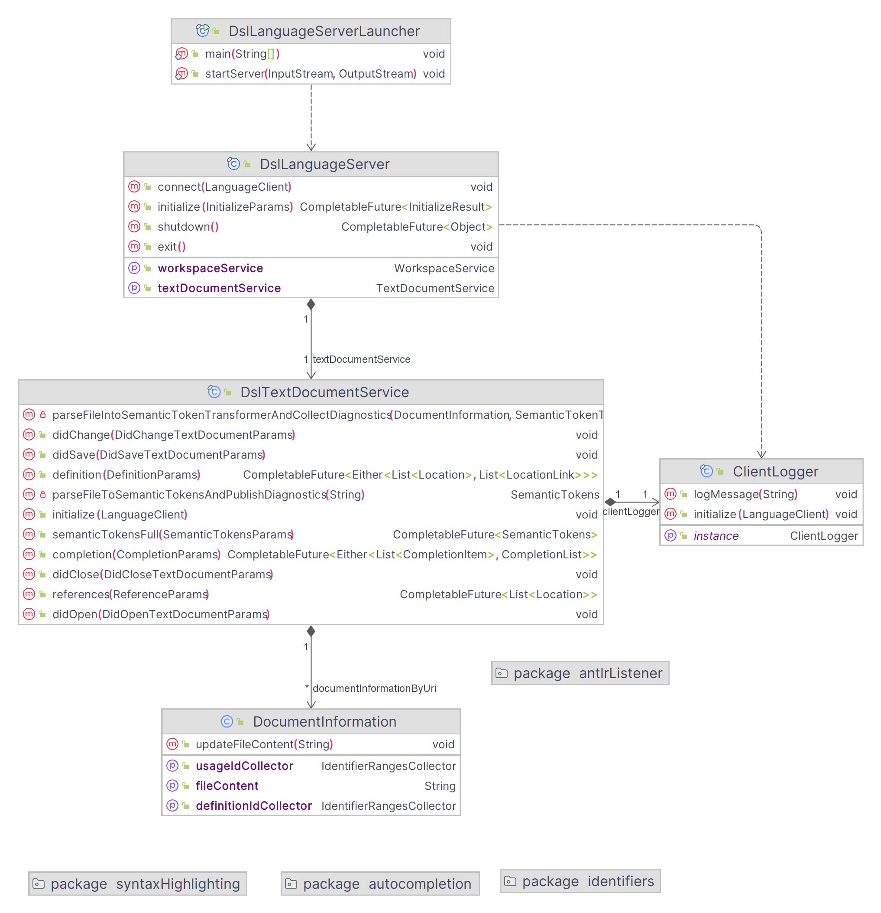

# Überblick

Das Dungeon Projekt gibt Lehrenden die Möglichkeit eigene Aufgaben in der Domain Specific Language (DSL) des Dungeons zu beschreiben, welcher dann ein Computerspiel generiert, in welchem Lernende die Aufgaben lösen müssen.
Die Formulierung der Aufgaben mit der DSL soll möglichst einfach sein, auch fachfremde Lehrende gehören zur Zielgruppe des Dungeon Projekts.
Das Ziel dieses Projekts ist deshalb das Beschreiben von Aufgaben mit der DSL zu vereinfachen, indem die Entwicklungsumgebung (IDE) dabei unterstützt.
Unterstützungen sind zum Beispiel das farbliche Markieren der Bestandteile der DSL (Syntax Highlighting), das Bereitstellen von Autovervollständigung und das Markieren von sprachlichen Fehlern.

Es gibt viele verschiedene Entwicklungsumgebungen, in welcher die Unterstützungen implementiert werden könnten.
Die EntwicklerInnen des Dungeons nutzen meist die IntelliJ IDEA, da der Dungeon in Java implementiert ist.
Fachfremde Nutzende würde eine solche komplexe IDE eher abschrecken.
Für sie könnte eine leichtgewichtigere IDE wie Visual Studio Code sinnvoller sein.

Es ist also wünschenswert, dass die Sprachunterstützung möglichst einfach auf verschiedenen IDEs umgesetzt werden kann.
Eine verbreitete Lösung für diese Anforderung ist die Implementierung der sprachabhängigen Funktionen in einem Server nach dem [Language Server Protocol (LSP)](https://microsoft.github.io/language-server-protocol/overviews/lsp/overview/).
Grundlage des Protokolls ist die Definition von [JSON-RPC (JavaScrip Object Notation Remote Procedure Call)](https://de.wikipedia.org/wiki/JSON-RPC) Schnittstellen über welche der Server und eine beliebige IDE als Client kommunizieren.


Bildquelle: Microsoft. Extern eingebunden und nicht Teil der Projektlizenz. Erreichbar unter https://microsoft.github.io/language-server-protocol/overviews/lsp/overview

Wie die Kommunikation zwischen Client und Server für ein Textdokument verläuft, ist im oberen Bild sichtbar.
Der Client sendet dem Server zuerst eine Benachrichtigung, dass ein Dokument geöffnet wurde.
Wird das Dokument geändert, sendet der Client die Änderungen.
Der Server kann darauf reagieren, indem er beispielsweise Diagnosen von Syntaxfehlern an den Client sendet.
Während das Dokument geöffnet ist, können Nutzende verschiedene Funktionen wie 'Goto definition' im Client nutzen.
Zur Umsetzung dieser Funktion benötigt der Client Informationen, welche von der Sprache des Dokuments abhängig sind.
Der Client sendet eine Anfrage für diese an den Server und erhält die Informationen als Antwort.
Sobald das Dokument geschlossen wird informiert der Client den Server.

Der Dungeon ist in Java implementiert, weshalb es vorteilhaft ist, wenn auch der LSP-Server in Java implementiert wird.
Für Java gibt es das Paket [Eclipse LSP4J](https://github.com/eclipse-lsp4j/lsp4j?tab=readme-ov-file), welches die Kommunikation mit dem Client bereits implementiert und Schnittstelle definiert, um die verschiedenen IDE Funktionen für eine neue Sprache umzusetzen.
Als Clients wurden eine Visual Studio Code Extension und ein IntelliJ IDEA Plugin umgesetzt.
Für weitere Informationen siehe [Konzept und Umsetzung](#konzept-und-umsetzung).

# Bauen und Installieren der Visual Studio Code Extension (.vsix)

Voraussetzung:
- [NodeJS (getestet v20.12.0 mit npm 10.5.0)](https://nodejs.org/en/download/prebuilt-installer)
- Umgebungsvariable `JAVA_HOME` zeigt auf den Installationsordner eines [JDK (getestet OpenJDK 21.0.2)](https://openjdk.org)

1. Dieses Repository klonen
2. In einer Shell im Root-Folder des Repositories folgendes ausführen:
    ```
    cd lsp-server
    ./gradlew jar
    cd ../vscode-extension
    npm install
    npm install -g vsce
    vsce package
    ```
3. Visual Studio Code (vscode) öffnen. Dort Steuerung + Shift + P drücken und nach dem Kommando 'Extension: Install from VSIX...' suchen und es ausführen. Dann im Auswahldialog die im Ordner vscode-extension erstellte .vsix Datei auswählen.

# Bauen und Installieren des IntelliJ Plugins (.zip)

Voraussetzung:
- Umgebungsvariable `JAVA_HOME` zeigt auf den Installationsordner eines [JDK (getestet OpenJDK 21.0.2)](https://openjdk.org)

1. Dieses Repository klonen
2. In einer Shell im Root-Folder des Repositories folgendes ausführen:
    ```
    cd lsp-server
    ./gradlew jar
    cd ../intellij-plugin
    ./gradlew buildPlugin
    ```
3. IntelliJ IDEA öffnen. Dort in den Settings (Steuerung + Shift + S) unter Plugins auf das Zahnrad gehen und "Install Plugin from Disk..." auswählen und die .zip unter `intellij-plugin/build/distributions/intellij-plugin-1.0-SNAPSHOT.zip` auswählen.

# Benutzen der Visual Studio Code Extension

Um die Extension zu benutzen, kann man eine Datei mit der Endung `.dng` in vscode öffnen und warten bis unten rechts 'Extension initialized successfully!' auftaucht.
Jetzt wird Syntax Highlighting dargestellt und Fehler werden markiert.

Mit der Tastenkombination Steuerung + Leerzeichen kann man an einer beliebigen Position Vorschläge zur Autovervollständigung anzeigen lassen.
Außerhalb von anderen Definitionen werden beispielsweise Vorlagen für Aufgabendefinitionen angeboten.

Als weitere Funktion kann per Rechtsklick auf Definitionen von Bezeichnern die Funktion 'Go to References' ausgeführt werden.
Ebenso kann per Rechtsklick auf Nutzungen von Bezeichnern die Funktion 'Go to Definition' genutzt werden.

Im Output Fenster von Visual Studio Code kann der Filter 'Dungeon-DSL-Extension' gewählt werden, sodass Log Ausgaben des Servers angezeigt werden.

# Benutzen des IntelliJ IDEA Plugins

Um die Extension zu benutzen, kann man eine Datei mit der Endung `.dng` in IntelliJ öffnen.
Jetzt wird Syntax Highlighting dargestellt und Fehler werden markiert.

Mit der Tastenkombination Steuerung + Leerzeichen kann man an einer beliebigen Position Vorschläge zur Autovervollständigung anzeigen lassen.
Außerhalb von anderen Definitionen werden beispielsweise Vorlagen für Aufgabendefinitionen angeboten.

Als weitere Funktion kann per Rechtsklick auf Definitionen von Bezeichnern 'Find Usages' ausgeführt werden.
Ebenso kann per Steuerung und Klick auf Nutzungen von Bezeichnern zur Definition gesprungen werden, was auch per Rechtsklick im Untermenü 'Go To' als Funktion 'Go to' verfügbar ist.

Im ToolWindow `Language Servers` kann man unter `Dungeon DSL Language Server` im Tab Logs die Ausgabe des Servers sehen.

# VSCode Client debuggen

1. (bei erstem Start) Im Ordner `vscode-extension` den Befehl `npm install` ausführen.
2. Den Ordner `vscode-extension` in Visual Studio Code öffnen und links das "Run and Debug" Fenster öffnen (Steuerung + Shift + D). Dort 'Run Extension' wählen und den grünen Run Pfeil anklicken. Breakpoints innerhalb der Implementierungen des Clients in Typescript sind nun möglich.

# IntelliJ IDEA Plugin debuggen

1. LSP Server bauen mit:
   ```
   cd lsp-server
   ./gradlew jar
   ```
2. Den Ordner `intellij-plugin` in der IntelliJ IDEA öffnen und im Gradle Tool Window (Elefant als Icon) die Task intellij-plugin->intellij->runIde im Debug Modus ausführen.

# Language Server debuggen

1.  (bei erstem Start) Im Ordner `vscode-extension` den Befehl `npm install` ausführen.
2. Den Ordner `vscode-extension` in Visual Studio Code öffnen und links das "Run and Debug" Fenster öffnen (Steuerung + Shift + D). Dort 'Debug Server & Run Extension' wählen und den grünen Run Pfeil anklicken. Breakpoints innerhalb der Implementierungen des Clients in Typescript sind nun möglich
3. Den Ordner `lsp-server` in der IntelliJ IDEA öffnen und Run → "Attach to Process" (Ctrl + Alt + P) ausführen. Im sich öffnenden Dialog 'lsp.DslLanguageServerLauncher' auswählen. Breakpoints im Java Code sind nun möglich.

# Konzept und Umsetzung

## VSCode Extension als Client

Zur Unterstützung der Dungeon DSL in Visual Studio Code muss eine Extension entwickelt werden, welche den LSP-Server startet und nutzt.
Dazu wird das npm Paket [vscode-languageclient](https://www.npmjs.com/package/vscode-languageclient) verwendet.
Die DSL wird damit als Sprache in der [package.json](vscode-extension/package.json) für Dateien mit der Endung '.dng' definiert und dort als `activationEvent` eingetragen.
Dadurch wird die Visual Studio Code Extension aktiviert, sobald eine '.dng' Datei geöffnet wird.
In der [extension.ts](vscode-extension/src/extension.ts) des clients wird dann die `acivate` Funktion aufgerufen, welche den Server startet und die Verbindung konfiguriert.
Dort wird davon ausgegangen, dass die Umgebungsvariable `JAVA_HOME` gesetzt ist, sodass die in der Extension enthaltene Server-jar mit Java gestartet werden kann.
Den Aufbau der Kommunikation und die Verknüpfung von LSP-Server und Visual Studio Code werden anschließend komplett durch das npm Paket [vscode-languageclient](https://www.npmjs.com/package/vscode-languageclient) implementiert.

## IntelliJ IDEA Plugin als Client

Zur Unterstützung der Dungeon DSL in IntelliJ IDEA muss ein Plugin entwickelt werden, welches den LSP-Server startet und nutzt.
[Jetbrains bietet selbst Unterstützung für die Entwicklung eines LSP Client Plugins an](https://plugins.jetbrains.com/docs/intellij/language-server-protocol.html),
diese ist jedoch nur für die Premium IDE IntelliJ Ultimate möglich und beinhaltet keine Unterstützung von Syntax Highlighting mit semantischen Token.
Als Alternative wurde deshalb das Open-Source-Projekt [LSP4IJ](https://github.com/redhat-developer/lsp4ij) genutzt.
Damit kann ein Plugin entwickelt werden, welches einen LSP Client in der Community Edition von IntelliJ IDEA realisiert.
In der neusten Version 0.3.0 wurde außerdem Syntax Highlighting mit semantischen Token hinzugefügt.
Die Umsetzung des Plugins mit LSP4IJ wird im folgenden Absatz kurz beschrieben.

Innerhalb der [build.gradle.kts](intellij-plugin/build.gradle.kts) des IntelliJ Plugins wird unter `intellij` den genutzten Plugins `com.redhat.devtools.lsp4ij:0.3.0` hinzugefügt, um LSP4IJ einzubinden.
Dort wird auch die unterstützte IntelliJ Version definiert und die Auslieferung der lsp-server JAR-Datei mit dem Plugin konfiguriert.
Zur Umsetzung des LSP Clients muss in der [plugin.xml](intellij-plugin/src/main/resources/META-INF/plugin.xml) ebenfalls die Nutzung von LSP4IJ mit `<depends>com.redhat.devtools.lsp4ij</depends>` angegeben werden.
Dort wird auch die Dungeon Sprache mit einem Dateityp definiert, welche in [DngDslFileType](intellij-plugin/src/main/java/org/hsbi/dungeon/intellijplugin/DngDslFileType.java) und [DngDslLanguage](intellij-plugin/src/main/java/org/hsbi/dungeon/intellijplugin/DngDslLanguage.java) konfiguriert werden.
So erkennt IntelliJ Dateien mit der Endung .dng als Dateien der Dungeon DSL und gibt ihnen ein eigenes Icon.
Die Sprache kann für LSP4IJ dann in der [plugin.xml](intellij-plugin/src/main/resources/META-INF/plugin.xml) mit der [DngDslLanguageServerFactory](intellij-plugin/src/main/java/org/hsbi/dungeon/intellijplugin/DngDslLanguageServerFactory.java) verknüpft werden.
Das sorgt dafür, dass für .dng Dateien der LSP Server durch die Klasse [DngDslLanguageServer](intellij-plugin/src/main/java/org/hsbi/dungeon/intellijplugin/DngDslLanguageServer.java) gestartet und genutzt wird.
Dazu wird dort der Installationsordner des Plugins gesucht und die beinhaltete Server Jar-Datei mit der, in der Umgebungsvariable `JAVA_HOME` definierten, Java Version gestartet.
Die Kommunikation und Umsetzung der Client Funktionalitäten in IntelliJ übernimmt anschließend LSP4IJ.

## Übersicht über den LSP Server



Der LSP-Server ist in Java implementiert und basiert auf dem Paket [Eclipse LSP4J](https://github.com/eclipse-lsp4j/lsp4j?tab=readme-ov-file), welches die Verbindung zum Client bereits verwaltet und Schnittstellen für die Umsetzung der Features des LSP-Servers definiert.
Einstiegspunkt des LSP-Servers ist die `main` Methode im [DslLanguageServerLauncher](lsp-server/src/main/java/lsp/DslLanguageServerLauncher.java).
Dort wird ein Objekt des [DslLanguageServer](lsp-server/src/main/java/lsp/DslLanguageServer.java) erstellt und mit den Daten über die Verbindung zum Client gestartet.

Verbindet sich ein Client, wird die `initialize` Methode des `DslLanguageServer` aufgerufen. In dieser werden Provider definiert, welche dem Client mitteilen, welche Features (in LSP als Capabilities gruppiert) der Server unterstützt.
Die Implementierung der angemeldeten Provider findet in Methoden des [DslTextDocumentService](lsp-server/src/main/java/lsp/DslTextDocumentService.java) statt, welcher in der ebenfalls aufgerufenen `connect` Methode des `DslLanguageServer` erstellt wird.

Der aktuelle Server meldet vier Provider für die entsprechenden Features/Capabilities an (in Klammern die implementierende Methode des `DslTextDocumentService`):
* SemanticTokensProvider (`semanticTokensFull`)
  * signalisiert, dass der Server semantische Token für ein Dokument liefern kann, mit welchen der Client ein Syntax Highlighting vornimmt
* CompletionProvider (`completion`)
  * der Server kann für eine Position im Dokument Vorschläge für die Autovervollständigung ermitteln 
* DefinitionProvider (`definition`)
  * der Server gibt dem Client die Möglichkeit die Funktion 'Goto Definition' anzubieten, da der Server für ein Sprachelement die Position der Definition ermitteln kann
* ReferenceProvider (`references`)
  * beschreibt, dass der Server dem Client auch die Position der Referenzen eines Sprachelements für die Funktion 'Goto References' bereitstellt 

Neben den Provider-Methoden sind im `DslTextDocumentService ` auch Methoden implementiert, die aufgerufen werden, wenn ein Dokument geöffnet, geändert, gespeichert oder geschlossen wird.
Da im Client Dateien bearbeitet werden, ohne dass dieser sie direkt auf die Festplatte schreibt, sendet der Client bei einer Änderung den Inhalt des Dokuments (`didChange`) an den Server (das gesamte Dokument, da `TextDocumentSyncKind.Full` im [DslLanguageServer](lsp-server/src/main/java/lsp/DslLanguageServer.java) konfiguriert ist).
Der `DslTextDocumentService` besitzt für jede geöffnete Datei ein [DocumentInformation](lsp-server/src/main/java/lsp/DocumentInformation.java) Element, in welchem der aktuelle Inhalt des Dokuments und weitere im nächsten Absatz beschriebene ermittelte Informationen gespeichert werden.

Nachdem eine Datei geöffnet oder geändert wurde, ruft der Client `semanticTokensFull` auf, dabei werden folgende Informationen aus dem Dokument der Dungeon DSL mithilfe einer ANTLR Grammatik (siehe [ANTLR Grammatik als Grundlage des LSP-Servers](#antlr-grammatik-als-grundlage-des-lsp-servers)) extrahiert:
* die semantischen Token für das Highlighting, welche direkt zurückgegeben werden
* Syntaxfehler und Fehler bei der Verwendung von Bezeichnern, welche der Server mit `publishDiagnostics` sendet (siehe [Fehlerdiagnosen](#fehlerdiagnosen))
* Die Namen von definierten Bezeichnern
* Bereiche von Bezeichner-Definitionen und Nutzungen
 
Die Informationen werden gespeichert und verwendet, sobald der Client `completion`, `definition` und `references` aufruft.
Im Abschnitt [Implementierung der Serverfunktionen](#implementierung-der-serverfunktionen) werden die Funktionen genauer beschrieben.

## ANTLR Grammatik als Grundlage des LSP-Servers

Um die notwendigen Informationen aus einem Dokument der Dungeon DSL zu extrahieren wird eine ANTLR Grammatik genutzt.
Zentrale Bestandteile der Dungeon DSL sind die Definitionen von Aufgaben und die Beschreibung von Abhängigkeiten zwischen diesen Aufgaben als Graph.
Der Graph wird dann in einem Element `dungeon_config` referenziert. Weitere Sprachkonzepte werden von der LSP Implementierung vorerst nicht unterstützt.

Eine Aufgabendefinition besteht aus einem Aufgabentypen (Single Choice, Multiple Choice oder Zuordnung), einem Bezeichner und einer Reihe vom Typen abhängiger Parameter.
Genauer beschrieben sind die [Aufgabendefinitionen im Dungeon](https://github.com/Dungeon-CampusMinden/Dungeon/blob/master/dungeon/doc/dsl/task_definition.md).

Die Abhängigkeiten zwischen den Aufgaben werden als Petri-Netze im Format der Sprache [DOT](https://graphviz.org/doc/info/lang.html) definiert.
Dazu werden die Namen der Aufgaben mit Pfeilen verknüpft und der Verknüpfung ein Typ wie `sequence` gegeben, was beschreibt, dass die Aufgaben nacheinander abgearbeitet werden müssen.
Genauer erklärt ist die [Beschreibung von Abhängigkeiten zwischen Aufgaben im Dungeon](https://github.com/Dungeon-CampusMinden/Dungeon/blob/master/dungeon/doc/control_mechanisms/petri_nets.md).

Um die Sprachelemente eines Dokuments zu erhalten wird eine ANTLR Grammatik definiert. Folgende wichtige Entscheidungen wurden dabei getroffen.

Schlüsselwörter wie die Aufgabentypen und ihre Parameter sind im Gegensatz zur im Dungeon verwendeten Grammatik direkt als Token in die Grammatik eingearbeitet. 
Das hat den Vorteil, dass direkt in der Grammatik definiert ist, welche Parameter in welchem Aufgabentypen benutzt werden können.
So kann die Grammatik später genutzt werden, um herauszufinden, welche typabhängigen Schlüsselwörter innerhalb einer Aufgabendefinition als Vorschläge zur Autovervollständigung möglich sind.
Mehr dazu im Abschnitt [Autovervollständigung](#autovervollständigung)

Außerdem werden verschiedene Parser-Regeln für Bezeichner genutzt, abhängig davon, ob Bezeichner eine Definition oder eine Nutzung darstellen.
Das erleichtert es Definitionen und Nutzungen für Sprungbefehle zu sammeln und Diagnosen für die fehlerhafte Nutzung von Bezeichnern an den Client zu senden. Mehr dazu im Abschnitt [GoTo](#goto-und-bezeichner-diagnosen)

## Implementierung der Serverfunktionen

### Syntax Highlighting

Um im Dokument ein Syntax Highlighting vorzunehmen, sendet der Client eine Anfrage für semantische Token an den Server.
Die semantischen Token, die der Client vom Server als Antwort bekommt, beschreiben einen Textbereich, haben einen [Typen](lsp-server/src/main/java/syntaxHighlighting/SemanticTokenType.java) (z.B. string, keyword oder variable) und gegebenenfalls mehrere [Modifier](lsp-server/src/main/java/syntaxHighlighting/SemanticTokenModifier.java) wie Definition.
Ein Farbschema im Client weist den Textbereichen anhand dieser Informationen Farben zu, in welchen der Text dann dargestellt wird.

Welche Typen und Modifier genutzt werden gibt der Server beim Anmelden des SemanticTokenProviders mithilfe der [SemanticTokenProviderOptionsFactory](lsp-server/src/main/java/syntaxHighlighting/SemanticTokenProviderOptionsFactory.java) an (siehe `initialize` Methode im [DslLanguageServer](lsp-server/src/main/java/lsp/DslLanguageServer.java)).
Die Typen und Modifier erhalten durch die Reihenfolge der Angabe eine eindeutige Nummer, mit welcher sie referenziert werden.
Ebenso wird angegeben, dass der Server bei jeder Änderung die Token des gesamten Dokuments neu berechnet und zurückgibt, somit muss die Methode `semanticTokensFull` im `DslTextDocumentService` implementiert werden.
Da die Aktualisierungsgeschwindigkeit in Tests kein Problem dargestellt hat, wurden performantere aber komplexeren Schnittstellen, welche nur geänderte Bereiche der Datei neu berechnen nicht implementiert.

Um die Token aus einem Dokument zu erhalten wird bei einem Aufruf der `semanticTokensFull` Methode im `DslLanguageServer` das Dokument mithilfe der ANTLR Grammatik geparst.
Anschließend wird der ParseTree traversiert und der [AntlrListener](lsp-server/src/main/java/antlrListener/AntlrListener.java) sammelt die Informationen über farblich hervorzuhebenden Knoten des ParseTrees in der [SemanticTokenTransformer](lsp-server/src/main/java/syntaxHighlighting/SemanticTokenTransformer.java) Klasse.
Der `SemanticTokenTransformer` ermittelt aus den Informationen die Zahlenfolge, welche die Token im LSP-Format beschreibt. Dabei wird die Position jedes Tokens relativ zur Position des vorherigen Tokens angegeben. Die Zahlenfolge wird dem Client zurückgegeben und er kann damit das Syntax Highlighting vornehmen.

Statt das Parsen in der `semanticTokensFull` Methode umzusetzen, könnte es auch aufgerufen werden, wenn ein Dokument geöffnet oder geändert wird.
Vorteil der gewählten Lösung ist, dass der Server die semantischen Token nicht speichern muss, da er sie direkt an den Client sendet.
Nachteil ist, dass es Entwickler überraschen könnte, dass innerhalb der `semanticTokensFull` Methode auch Fehlerdiagnosen ermittelt und Positionen von Bezeichner-Definitionen und Nutzungen gesammelt werden.
Dies ist zwar nicht Teil des Syntax Highlighting, aber ein mehrfaches Parsen und Traversieren wird so vermieden.

### Fehlerdiagnosen

Während der Berechnung der semantischen Token in der Methode `semanticTokensFull` wird das Dokument mit ANTLR geparst und traversiert.
Sollte das Dokument nicht der Grammatik entsprechen, meldet ANTLR dies dem mitgegebenen ErrorListener oder wirft eine `RecognitionException`.
Dabei wird das unerwartete Symbol direkt oder an der Exception mitgegeben.
Durch das Symbol kann die Position ermittelt werden, an der ANTLR in einen Fehler gelaufen ist und zusammen mit der Fehlernachricht kann eine Diagnose erstellt werden.
Weitere Diagnosen, wenn eine Bezeichner mehrfach definiert, beziehungsweise nicht oder ohne Definition genutzt wird, werden wie im nächsten Abschnitt erklärt erlangt und der Liste der Diagnosen nach dem Parsen hinzugefügt.
Anschließend schickt der Server dem Client die gesammelten Diagnosen, sodass dieser sie als Error im Dokument markiert.

Jedes Senden von Diagnosen überschreibt vorher gesendete Diagnosen.
Ein Speichern der gesendeten Diagnosen wird vermieden, da bei einem Aufruf der `semanticTokensFull` Methode für ein geändertes Dokument alle Diagnosen neu gesammelt und gesendet werden müssen.

Die mit ANTLR ermittelten Fehlerdiagnosen sind in vielen Fällen hilfreich, aber sie haben auch Grenzen.
Beispielsweise wird bei einem nicht durch ein `"` Zeichen beendeter String erst ein Fehler bemerkt, wenn der Text nach einem späteren `"` nicht zur Grammatik passt.

### GoTo und Bezeichner-Diagnosen

Implementiert sind im `DslLanguageServer` auch die Methoden `definition` und `references`, welche das Springen zur Definition oder Nutzungen von Variablen ermöglichen.
Das Konzept um dies zu Unterstützen ist, die Bereiche der Definitionen und Nutzungen innerhalb eines Dokuments während des Traversieren des ParseTree zu speichern.
So kann einer angefragten Position später ein Bereich und somit eine Nutzung/Definition zugeordnet werden.
Für den zugeordneten Bezeichner kann/können die Position(en) des Sprungziels ermittelt werden. Das genaue Verfahren wird im Folgenden erklärt.

Der [AntlrListener](lsp-server/src/main/java/antlrListener/AntlrListener.java) erkennt und unterscheidet bei der Traversierung des ParseTrees Nutzung und Definition von Bezeichnern anhand zwei verschiedene Parser-Regeln der Grammatik.
Die so gefundenen definierten und genutzten Bezeichner fügt er dem entsprechenden [IdentifierRangesCollector](lsp-server/src/main/java/identifiers/IdentifierRangesCollector.java) des `DocumentInformation` Object hinzu.

Eine dritte Bezeichner-Parser-Regel ist für die Bezeichner der Dungeon-Config-Elemente umgesetzt. Diese werden im .dng Dokument nicht referenziert, sondern dem Dungeon mitgegeben.
Da die Namen der Dungeon-Config Elemente nicht vervollständigt oder verwendet werden sollen, wird die Parser-Regel im `AntlrListener` ignoriert und die Bezeichner werden nicht gespeichert. 

Nach dem Parsen wird die Klasse [IdentifierDiagnosticsQuery](lsp-server/src/main/java/identifiers/IdentifierDiagnosticsQuery.java) genutzt, um für die gesammelten Bezeichner Fehlerdiagnosen zu ermitteln.
Werden Bezeichner an mehreren Positionen definiert, werden Diagnosen für die Positionen aller Neudefinitionen hinzugefügt.
Außerdem werden Diagnosen für die Positionen hinzugefügt, an denen nicht definierte Bezeichner genutzt werden.
Auch die Definitionen von Bezeichnern, welche nicht verwendet werden, werden per Diagnose angemerkt.

Sendet der Client eine Anfrage `definition`, liefert er eine Position mit, für die Nutzende zur Definition springen möchten.
Mithilfe eines [GoToResolver](lsp-server/src/main/java/identifiers/GoToResolver.java) werden die Nutzungen von Bezeichnern durchgegangen.
Falls die angefragte Position im Bereich einer Nutzung liegt, wird der Name des dort genutzten Bezeichners gefunden. Für diesen kann die Position der Definition gefunden und als Sprungziel zurückgegeben werden.

Anfragen des Clients nach `reference` werden ähnlich umgesetzt. Die Definitionen werden nach einem Bereich durchsucht, der die gegebene Position enthält. Anhand des Namens der gefundenen Definition werden die Bereiche gefunden, wo der Bezeichner genutzt wird und als Sprungziele zurückgegeben.

### Autovervollständigung

Wenn der Client über die `completion` Nachricht für eine Cursorposition in einem Dokument um eine Autovervollständigung bittet, wird die entsprechende Methode im `DslLanguageServer` aufgerufen.
Zurückgegeben werden sollten kontextsensitiv die Elemente, die laut der Grammatik nach der Cursorposition erlaubt sind.
Das verfolgte Konzept zur Umsetzung der kontextsensitiven Vorschlage ist die Statusmaschine, die ANTLR zum Parsen eines Dokuments erstellt, für den Text vor dem Cursor zu durchlaufen und ausgehend vom erreichten Status die möglichen Folgeelemente zu ermitteln.
Diese Idee entstammt der Blog-Reihe [Building an Autocomplete Library for ANTLR4](https://www.abstractsyntaxseed.com/blog/antlr4-autocomplete-library/introduction).

Zuerst wird der Text des Dokumentes bis zu der Position ermittelt, für welche der Client die Autovervollständigung anfragt (siehe [CompletionItemQuery](lsp-server/src/main/java/autocompletion/CompletionItemQuery.java)).
Der ermittelte Text wird mithilfe des Lexers in eine Liste von Token umgewandelt und geparst.
Über den Parser kann auf die interne Statusmaschine von ANTLR, genannt Augmented Transition Network (ATN), zugegriffen werden (siehe [AutocompletionUsingAntlrStateMachine](lsp-server/src/main/java/autocompletion/AutocompletionUsingAntlrStateMachine.java)).
Für die gefundenen Token vor dem Cursor kann das ATN wie im nächsten Absatz beschrieben abgelaufen werden.
Anschließend kann vom erreichten Zustand ausgehend ermittelt werden, welche Token-Typen folgen können.

Es gibt drei für die implementierte Grammatik relevante Arten von Übergängen des ATN.
Wird ein Übergang gewählt, wird der Folgezustand auf den Stack der nächsten zu prüfenden Zustände gelegt.

Die erste Art zeichnet aus, dass Zeichen gematcht werden. Die Übergänge sind `AtomTransition` für einzelne Token und `SetTransition` für mehrere alternative Token.
Diese Übergänge können bei passenden Token ausgeführt werden, indem als nächstes der auf den Übergang folgende Zustand mit den verbleibenden Token geprüft wird.

Die zweite Art von Übergängen sind spontane Epsilon-Übergänge.
Für diese wird immer ein Übergang in den Folgezustand ausgeführt, außer der Folgezustand wurde bereits vorher erreicht.
In dem Fall kann daraus kein neuer Vorschlag zur Autovervollständigung entstehen und der Pfad muss nicht weiter verfolgt werden.

Die dritte Art von Übergängen sind Regelübergänge. Man kann sich die Regeln des Parsers wie kleine Unter-ATN vorstellen.
Eine Regel wird über eine `RuleTransition` betreten.
Dort muss sich gemerkt werden, mit welchem Zustand es nach der Regel weitergeht, da diese an mehreren Stellen genutzt werden kann.
Wird die Regel komplett angewendet gelangt das ATN in einen `RuleStopState`.
Von dort wird in den beim Betreten der Regel gemerkten Zustand gesprungen.

Wenn die Statusmaschine bis zum Cursor durchlaufen wurde, werden die möglichen Folge-Token als Ergebnis gesammelt.
In der `CompletionItemQuery` werden die ermittelten Token-Typen in Vorschläge umgewandelt, welche zur Erhöhung des Nutzerkomforts zum Teil über den gefundenen Typen hinaus erweitert werden.
Zum Beispiel werden Typen wie `STRING` und `INT` in Vorschläge von Standardwerten umgewandelt.
Den Vorschlägen von Schlüsselworten für Aufgabeneigenschaften wird zusätzlich ein Vorschlag hinzugefügt, der Default-Wert beinhaltet.
Statt nur das Schlüsselwort für einen Aufgabentypen vorzuschlagen, wird eine ganze Vorlage einer Aufgabendefinition angeboten.
Die gesammelten Vorschläge werden anschließend an den Client zurückgeliefert, welcher sie in einer Liste anzeigt.

In den folgenden drei Abschnitten werden besonders behandelte Probleme bei der Ermittlung von Vorschlägen gesondert betrachtet.

#### Aufgaben Property Schlüsselwörter nicht erneut vorschlagen

Innerhalb einer Aufgabendefinition sollte jedes Property nur einmal genutzt werden.
Deshalb muss die Autovervollständigung ermitteln, welche Schlüsselworte für Properties im aktuellen Block bereits genutzt wurden.
Dazu werden die Token ausgehend vom Cursor rückwärts bis zu einer Block-Klammer (´}´ oder ´{`) nach den Property-Schlüsselworten durchsucht.
Gefundene Schlüsselworte wurden bereits verwendet und werden aus der Vorschlagsliste entfernt.

#### Definierte Bezeichner vorschlagen

Das Konzept um Bezeichner zu vervollständigen ist, zu erkennen, wenn nach dem Cursor eine Bezeichner-Nutzung erwartet wird.
Dazu wird die Statusmaschine bis zum Cursor durchlaufen.
Wenn die Nutzung eines Bezeichners folgen kann, ist der nächste Status der Beginn der Parser-Regel für eine Nutzung eines Bezeichner.
In diesem Fall wird den vorgeschlagenen Token-Typen in `AutocompletionUsingAntlrStateMachine` ein selbst definierter Platzhalter-Token-Typ hinzugefügt.
Bei der Umwandlung von Token-Typen zu Vorschlägen in der `CompletionItemQuery` werden für diesen Typen alle definierten Bezeichner vorgeschlagen.

#### Unvollständige Schlüsselwörter und Bezeichner vor dem Cursor

Unvollständige Bezeichner und Schlüsselworte vor dem Cursor stellen bereits ein Bezeichner-Token dar.
Bei einem unvollständigen Schlüsselwort läuft die Traversierung dann in einen falschen Zustand oder es gibt keinen passenden Folgezustand.
Bei begonnenen Bezeichnern wird die Parser-Regel zur Bezeichner-Nutzung zu früh beendet und die Möglichkeit eines unvollständigen Bezeichners ausgeschlossen.
Um trotzdem Vorschläge zur Vervollständigung unvollständiger Bezeichner und Schlüsselworte zu erlangen, muss die Erkennung deshalb erweitert werden.

Die Idee der Erweiterung ist ein Bezeichner-Token vor dem Cursor zu erkennen und entsprechend zu behandeln.
Dies funktioniert, indem geprüft wird, ob auf den aktuell geprüften Status ein Bezeichner-Token folgt und dieses das letzte Token vor dem Cursor ist.
Somit wurde der Status vor dem möglicherweise unvollständigen Bezeichner gefunden.
Von dort können wie gewohnt die möglichen Folgeelemente ermittelt werden, zwei Fälle sind dabei denkbar.

Wenn auf den geprüften Status der Beginn der Parser-Regel für eine Nutzung von Bezeichnern folgt, wurde ein begonnener Bezeichner gefunden.
Es wird wie gewohnt der Platzhalter-Token-Typ als Vorschlag hinzugefügt, welcher in der `CompletionItemQuery` in Vorschläge für alle definierten Bezeichner umgewandelt wird.

Als zweiter Fall werden den Vorschlägen Token-Typen, die folgen können, hinzugefügt. Darunter wäre beispielsweise auch ein begonnenes Schlüsselwort.

Durch das Vorgehen werden jedoch auch bereits vollständig ausgeschriebene Schlüsselworte und Bezeichner vorgeschlagen.
In der `CompletionItemQuery` wird deshalb das letzte Wort vor dem Cursor ermittelt, indem die Zeichen vor dem Cursor rückwärts bis zum ersten Whitespace gesammelt werden.
Vorschläge, die identisch mit dem Wort sind, werden entfernt.
Vorschläge, welche mit dem Wort beginnen, werden an den Anfang der Vorschlagsliste verschoben.
Wird im Client ein Vorschlag ausgewählt, dessen Text bereits begonnen wurde, wird nur der vervollständigende Teil eingefügt.

## Debugging

Standardmäßig sind Client und Server über stdio verbunden, weshalb der Server keine Debugging-Verbindungen annehmen kann. Wird in vscode die Run-Konfiguration 'Debug Server & Run Client' ausgeführt, wird die Umgebungsvariable LSDebug auf `true` gesetzt.
Dann wird die Verbindung zwischen Client und Server in TCP umgesetzt und die .jar des Servers mit Debug-Parametern gestartet. Das Durchführen des Debuggings ist in [Language Server debuggen](#language-server-debuggen) beschrieben.

## Logging

Da der Server keine eigene Konsole für `System.out.print` besitzt, startet der Client einen Output Kanal, der in Visual Studio Code ausgewählt werden kann.
Der Server greift auf diesen mit einer Instanz der Klasse [ClientLogger](lsp-server/src/main/java/lsp/ClientLogger.java) zu, welche bei Herstellung der Verbindung erlangt wird.

# Einschränkungen und Verbesserungsideen

* Bisher wird beim Vorschlagen von Bezeichnern nicht darauf geachtet, welchen Typ ein Bezeichner hat. Man könnte dies ändern, indem verschiedene Parser-Regeln für verschiedene Typen benutzt werden. Die Autovervollständigung könnte den vorzuschlagenden Typ anhand der Regel erkennen, die nach dem Cursor angewendet werden kann. Nachteil wäre, dass jeder Typ als Parser-Regel definiert sein müsste und dynamische Typisierung damit nicht möglich wäre. Dazu müsste eine semantische Analyse entwickelt werden, welche auch für die Autovervollständigung funktioniert.

# Externe Abhängigkeiten

## NodeJS & npm  (getestet v20.12.0 mit npm 10.5.0)

[NodeJS](https://nodejs.org) ist eine JavaScript-Laufzeitumgebung (Runtime) um JavaScript und TypeScript Programme zu schreiben und auszuführen. Zusätzlich enthält es [npm](https://www.npmjs.com), eine Paketverwaltung zur Einbindung von Abhängigkeiten. Dieses Projekt nutzt NodeJS und npm um eine Visual Studio Code Extension zu bauen, die als Client des LSP fungiert.

## npm Pakete

### vscode-languageclient

Das npm Paket [vscode-languageclient](https://www.npmjs.com/package/vscode-languageclient) bietet die Möglichkeit eine Visual Studio Code Extension zu entwickeln, welche einen Client nach dem LSP implementiert.

## JDK (getestet OpenJDK 21.0.2)

Ein [JDK (Java Development Kit)](https://openjdk.org) ist ein SDK (Software Development Kit) um Java Programme zu entwickeln. Es wird gebraucht, um den LSP Server in Java umzusetzen.

## Gradle

[Gradle](https://gradle.org) ist ein Tool zur Build Automatisierung, welches auch eine Paketverwaltung ermöglicht. Der LSP Server wird mit Gradle gebaut.

## Gradle Dependencies

### LSP4J

[Eclipse LSP4J](https://github.com/eclipse-lsp4j/lsp4j?tab=readme-ov-file) bietet Schnittstellen und Basisimplementierungen des LSP in Java. Der entwickelte LSP Server baut auf LSP4J auf, um das LSP umzusetzen.

### Antlr

[ANTLR (ANother Tool for Language Recognition)](https://www.antlr.org) ist ein Parser Generator, welcher genutzt wird, um die Dungeon DSL als Grammatik zu definieren, zu parsen und anhand der gefundenen Token und des ParseTrees Funktionalitäten des Language Servers umzusetzen.

### Junit

[JUnit](https://junit.org) ist ein Test Framework zur Automatisierung von Unit-Tests. Es wird im Server genutzt, um Snapshot Tests der Antlr Grammatik durchzuführen, welche sicherstellen, dass Testdateien der DSL durch die Grammatik in die erwarteten ParseTrees überführt werden. Ebenso sind Tests der Autovervollständigung implementiert, welche auf kleinen Beispielgrammatiken prüfen, ob die erwarteten Vorschläge geliefert werden.

### LSP4IJ

[LSP4IJ](https://github.com/redhat-developer/lsp4ij) bietet Schnittstellen und Implementierungen eines LSP Clients für IntelliJ Plugins.

# Ressourcen

- [LSP](https://microsoft.github.io/language-server-protocol/overviews/lsp/overview/)
- [VSCode: Language Server Extension Guide](https://code.visualstudio.com/api/language-extensions/language-server-extension-guide)
- [Malintha Ranasinghe: Understanding the Language Server Protocol](https://medium.com/@malintha1996/understanding-the-language-server-protocol-5c0ba3ac83d2)
- [Malintha Ranasinghe: A Practical Guide for Language Server Protocol](https://medium.com/ballerina-techblog/practical-guide-for-the-language-server-protocol-3091a122b750)
- [Malintha Ranasinghe: Develop and Publish Your Own VSCode Extension](https://medium.com/@malintha1996/develop-and-publish-your-own-vscode-extension-dafd9729148a)
- [Language Server Implementation](https://github.com/lsp-and-implementation/language-server)
- [Building an Autocomplete Library for ANTLR4](https://www.abstractsyntaxseed.com/blog/antlr4-autocomplete-library/introduction)
- [IntelliJ Platform Plugin SDK -> Language Server Protocol (LSP)](https://plugins.jetbrains.com/docs/intellij/language-server-protocol.html)
  [IntelliJ Platform Plugin SDK -> Language and File Type](https://plugins.jetbrains.com/docs/intellij/language-and-filetype.html)
- [LSP4IJ](https://github.com/redhat-developer/lsp4ij)