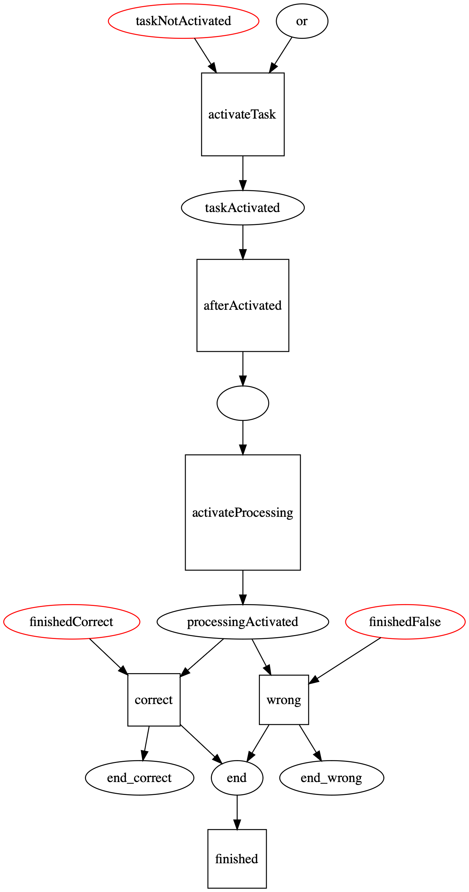
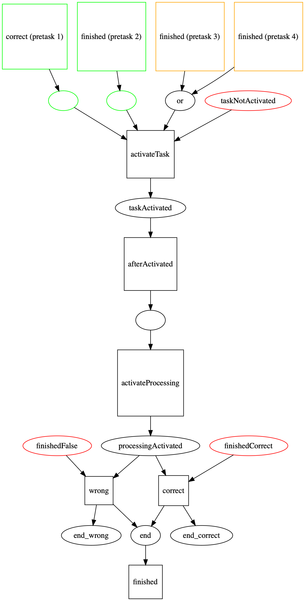
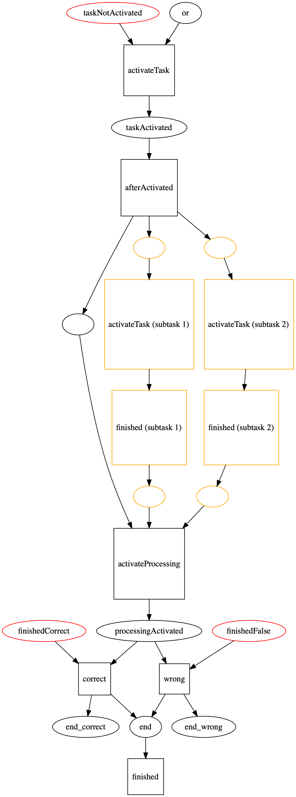
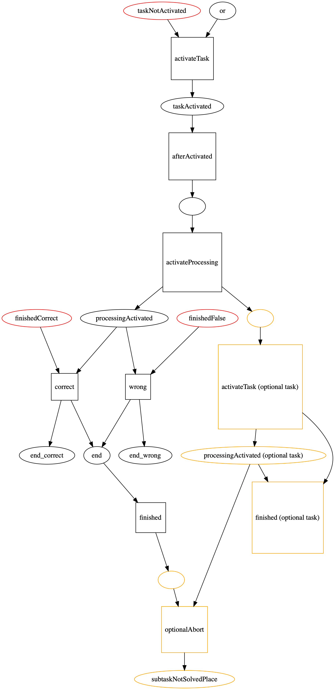

## Grundkonzept 
[Grundlagen: Konzept der Petri Netze](petri_nets.md)

Der Aufgabenabhängigkeitsgraph muss in ein Petri-Netz umgewandelt werden. Dafür wurde eine Petri-Netz Schablone entworfen, mit der die Logik jedes Tasks abgebildet werden kann. Jeder Task wird in ein eigenes "kleines" Petri-Netz übersetzt, und dann werden die einzelnen Petri-Netze anhand der Abhängigkeiten untereinander miteinander verbunden.

## Basis Schablone

Diese Schablone dient als Basis für jedes Petri-Netz.

Die rot markierten Stellen im Petri-Netz werden von außen (z.B. über die DSL-Callbacks) mit Token versehen.

Dieses Petri-Netz bildet den gesamten Ablauf von der Aktivierung bis zum Beenden eines Tasks ab.

Die verschiedenen Transitionen und Places werden später genutzt, um andere Petri-Netze anzuschließen.

Der Place "taskNotActivated" wird initial mit einem Token belegt und dient dazu, eine eventuelle doppelte Aktivierung eines Tasks zu verhindern.

Der Place "or" wird initial mit einem Token belegt. Wird ein anderes Petri-Netz per OR verknüpft, wird dieses Token entfernt."
## Abhängigkeit Sequenz

*Anmerkung:* In den folgenden Abbildungen werden nur Ausschnitte des kombinierten Petri-Netzes angezeigt. Es ist immer zu beachten, dass jeder Task durch die Basis-Schablone abgebildet wird. Im Folgenden werden jedoch nur die Anbindgspunkte mit anderen Petri-Netzen betrachtet.

Im Dungeon unterscheiden wir zwischen AND (in der Abbildung grün) und OR Sequenzen (in der Abbildung orange).

Alle Tasks, die Teil der AND-Sequenz sind, **müssen** vor dem Aktivieren des nächsten Tasks beendet werden. Dafür werden die "Beendet" (für bedingte Folgeaufgaben könnten hier auch "Richtig Beendet" oder "Falsch Beendet" verwendet werden) Transitionen dieser Tasks mithilfe eines Helper-Place an die Transition "Activate Task" des folgenden Tasks verbunden.

Bei einer OR-Sequenz muss nur einer der beteiligten Vortasks erfüllt werden (beendet, richtig beendet, falsch beendet). In diesem Fall werden alle OR-Tasks mit einem "OR-Place" des Folgetasks verbunden. Wird eine der End-Transitionen der Vortasks ausgelöst, platziert dieser ein Token im Place.
Der initial platzierte Token im or-place wird entfernt.

## Teilaufgaben

*Anmerkung:* In den folgenden Abbildungen werden nur Ausschnitte des kombinierten Petri-Netzes angezeigt. Es ist immer zu beachten, dass jeder Task durch die Basis-Schablone abgebildet wird. Im Folgenden werden jedoch nur die Anbindungen mit anderen Petri-Netzen betrachtet.

In Orange sind die Änderungen zur Standardschablone zu sehen.
Teilaufgaben müssen vor der Aktivierung des Haupttasks bearbeitet werden. Daher werden ihre "activateTask"-Transitionen so mit dem Petri-Netz verbunden, dass sie durch einen Helper-Place, der an der "afterActivated"-Transition des Haupttasks angeschlossen ist, gesteuert werden. Wenn die Aufgaben beendet sind, legen die "finished"-Transitionen der Teilaufgaben ein Token in jeweils einen Helper-Place, der mit der "activateProcessing"-Transition des Haupttasks verbunden ist.

## Optionale Teilaufgaben

*Anmerkung:* In den folgenden Abbildungen werden nur Ausschnitte des kombinierten Petri-Netzes angezeigt. Es ist immer zu beachten, dass jeder Task durch die Basis-Schablone abgebildet wird. Im Folgenden werden jedoch nur die Anbindungen mit anderen Petri-Netzen betrachtet.

Optionale Teilaufgaben bleiben so lange aktiv, bis sie bearbeitet wurden oder der Haupttask abgeschlossen wurde. Die Aktivierung von optionalen Teilaufgaben erfolgt parallel zur Aktivierung der Bearbeitung des Haupttasks. Daher wird die Transition "activateTask" über einen Helper-Place mit der Transition "activateProcessing" des Haupttasks verbunden.

Zusätzlich wird der Platz "processingActivated" der Teilaufgabe und die Transition "finished" des Hauptaufgaben (über einen Helper-Place) mit einer neuen Transition "optionalAbort" verbunden. Diese Transition feuert dann, wenn die Hauptaufgabe gelöst ist, aber die optionale Teilaufgabe noch in Bearbeitung ist, und legt dann ein Token in den Platz "subtaskNotSolved", welcher den optionalen Task-Status auf "inactive" setzt.

## Kombination

Alle gezeigten Verbindungen können miteinander kombiniert werden. Das Konzept ist so aufgebaut, dass die einzelnen Verbindungen zwischen zwei Petri-Netzen (Tasks) keine Abhängigkeit von den anderen Verbindungen im Petri-Netz haben.