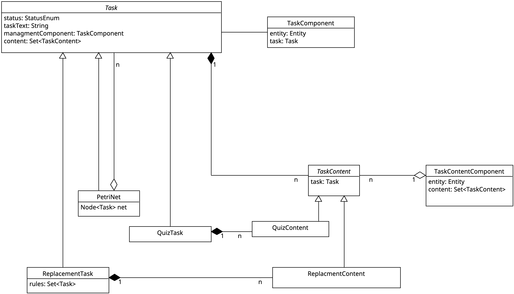

## Ziel

Die in der DSL definierten Aufgaben müssen durch konkrete Java-Objekte (`Task`s) dargestellt werden.
Mithilfe der `Task`s und Callback-Methoden können in der DSL Methoden definiert werden, die beim Auftreten bestimmter Events im Spiel ausgelöst werden.
Diese Event-Handler-Methoden sollen genutzt werden, um beispielsweise die vom Spieler abgegebene Lösung für eine Quest aus dem Spiel zurück an die DSL zu übergeben. Dort kann die Lösung bewertet werden und gegebenenfalls über native Funktionen im Dungeon spielerische Konsequenzen auslösen.

## Grundstruktur `Tasks`

Ein `Task` kann in unterschiedlichen Ausführungen existieren. Die einfache Form eines `Task` ist genau eine Aufgabe, zum Beispiel eine Single-Choice-Frage oder eine Replacement-Aufgabe.
Sequenzen von `Task` können als `PetriNet` implementiert werden (mehr dazu unter [PetriNets](petri_nets.md)).
In den Stellen des `PetriNet` werden konkrete `Task` abgelegt.
Dabei ist ein `PetriNet` wiederum selbst ein `Task` und kann daher als Stelle eines übergeordneten `PetriNet` dienen.



Jeder `Task` speichert eine Aufgabenbeschreibung (`taskText`) sowie einen Status (`state`). Dieser gibt an, ob ein Task (a) aktuell bearbeitet werden kann (`ACTIVE`), (b) aktuell nicht bearbeitet werden kann (`INACTIVE`) oder (c) bereits gelöst wurde und nicht mehr bearbeitet werden muss (`FINISHED`).

Zu jedem `Task` gehört zusätzlich ein `TaskComponent`, das als Manager-Instanz verwendet wird und ausgewählten Entitäten hinzugefügt wird.
Entitäten mit einem `TaskComponent` verwalten den Task. Sie können zum Beispiel den Status ändern, stellen jedoch kein Lösungselement dar.
Beispiel: Ein Zauberer gibt dem Spieler die Aufgabe, etwas zu tun, und stellt den entsprechenden `Task` auf `ACTIVE`.

Die verschiedenen Inhalte eines `Task`, wie Antwortmöglichkeiten oder Ersetzungsregeln, werden als `TaskContent`-Objekte im `Task` gespeichert.
Ein `TaskContent` kann durch das `TaskContentComponent` mit einer Entität im Spiel verknüpft werden, sodass diese Entität den Inhalt repräsentiert.
Beispiel: Ein Apfel-Item im Spiel kann mit der Antwort "D" einer Quizfrage verknüpft werden, was bedeutet, dass der Apfel die Antwort "D" ist.
Was genau ein `TaskContent` speichern und darstellen muss, hängt von der Art der Aufgabe ab. Zu diesem Zeitpunkt kann davon ausgegangen werden, dass für jede konkrete Ableitung eines `Task` auch eine eigene Ableitung von `TaskContent` benötigt wird.

Eine in der DSL definierte Aufgabenstellung erzeugt beim Laden ein entsprechendes `Task`-Objekt mit zugehörigen `TaskContent`-Objekten, Entitäten etc.

## Event-Handler und DSL-Callbacks

Im Dungeon kann durch verschiedene Aktionen ein Event-Handler ausgelöst werden, zum Beispiel wenn eine Interaktion stattfindet.
Die Event-Handler werden in den entsprechenden Komponenten gespeichert und sind in der Regel als `Consumer<Entity>` implementiert. Dabei ist die übergebene Entität immer die Entität, zu der die Komponente gehört.
Über die Entität kann die Event-Handler-Methode dann auf die verschiedenen Komponenten der Entität zugreifen.

Beispiel:
```java
Consumer<Entity> sayHello = entity-> {
    String task = entity.fetch(TaskComponent.class).get().task().taskText();
    System.out.println("Hello my name is "+entity+". I have a quest for you "+task);
    };

Entity wizzard = new Entity();
wizzard.add(new InteractionComponent(wizzard, sayHello));
```

Mithilfe des `TaskComponent` und `TaskContentComponent` können Callback-Methoden zur Bewertung von Aufgabenlösungen in der DSL definiert und im Spiel als Event-Handler ausgelöst werden.
Die Callback-Methoden können in den Event-Handlern der einzelnen Komponenten implementiert werden, z.B. als Interaktions-Event.

Damit die Callback-Methoden für die Aufgabenbwertung in der DSL wissen, zu welchem Task eine Entität gehört, wird ein Weg von der `Entity` zum `Task` benötigt.
Für Events, die von einer Entität ausgelöst werden, die ein `TaskContentComponent` besitzt, sieht der Weg wie folgt aus:
`Entity` -> `TaskContentComponent` -> `TaskContent` -> `Task`.
Für Events, die von einer Entität ausgelöst werden, die ein `TaskComponent` besitzt, sieht der Weg wie folgt aus:
`Entity` -> `TaskComponent` -> `Task` (und falls erforderlich) -> `TaskContent` -> `TaskContentComponent` -> `Entity` -> `other Components`.

