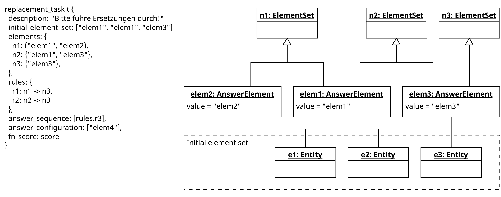

## Aufgabendefinition

Im Aufgabenkonzept werden [Aufgabentypen](../task_concept.md#aufgabentypen) definiert.
Welche Daten zur Definition einer Aufgabe nötig sind, ist vom Aufgabentyp abhängig. Ziel
dieses Dokuments ist, die erforderlichen Datenstrukturen für alle Aufgabentypen zu
definieren.

## Aufgabentyp “Single Choice”

```
single_choice_task task {
  description: "Bitte wähle die richtige Antwort aus!"
  answers: ["a", "b", "c"],
  correct_answer_index: 0,
  fn_score: score
}
```

Member:

- `description`: Die textuelle Aufgabenbeschreibung
- `answers`: Die Liste der Antwortmöglichkeiten, aus denen ein Element ausgewählt werden
  muss
- `correct_answer_index`: Der Index aus `answers`, er die korrekte Antwort angibt
- `fn_score`: Die [Scoring-Funktion](../control_mechanisms/reporting.md#scoring-funktion)

## Aufgabentyp “Multiple Choice”

```
multiple_choice_task task {
  description: "Bitte wähle die richtigen Antworten aus!"
  answers: ["a", "b", "c", "d"],
  correct_answer_indices: [0, 2], // kann auch leer bleiben
  fn_score: score
}
```

Member:

- `description`: Die textuelle Aufgabenbeschreibung
- `answers`: Die Liste der Antwortmöglichkeiten, aus denen mehrere Elemente ausgewählt
  werden müssen
- `correct_answer_indices`: Die Indizes aus `answers`, welche die korrekten Antworten
  angeben; falls `correct_answer_indices` nicht explizit definiert wird (also ein leeres
  Array bleibt), gilt keine der Antwortmöglichkeiten in `answers` als korrekt
- `fn_score`: Die [Scoring-Funktion](../control_mechanisms/reporting.md#scoring-funktion)

## Aufgabentyp "Ersetzen"

```
replacement_task t {
  description: "Bitte führe Ersetzungen durch!"
  initial_element_set: ["elem1", "elem2", "elem6"]
  elements: {
    n1: ("elem1", "elem2),
    n2: {"elem1", "elem3"},
    n3: {"elem4"},
    n4: {"elem5"},
    n5: {"elem1", "elem2", "elem6"},
    n6: {"verwirrungselement"}
  },
  rules: {
    r1: n1 -> n3,
    r2: n2 -> n4,
    r3: n5 -> n3
  },
  answer_sequence: [rules.r3], // Reihenfolge könnte auch egal sein, alternativen zulassen
  answer_configuration: ["elem4"], // hier auch Alternativen zulassen
  fn_score: score
}
```

Member:

- `description`: Die textuelle Aufgabenbeschreibung
- `initial_element_set`: Eine Liste, welche die initiale Menge der Aufgabenelemente angibt.
- `elements`: Definition der Element-Mengen: definiert, welche Elemente Mengen bilden, die
  durch Anwendung einer Ersetzungsregel durch eine andere Menge ersetzt werden können; runde
  Klammern `(` `)` geben an, dass die Element-Reihenfolge **relevant** ist, geschweifte
  Klammern `{` `}` geben an, dass die Element-Reihenfolge **irrelevant** ist
- `rules`: Definition der Ersetzungsregeln: Definition, welche Element-Mengen durch welche
  anderen Element-Mengen ersetzt werden dürfen; `n1 -> n2` bedeutet, dass die Menge `n1`
  durch `n2` ersetzt, werden kann, allerdings nicht andersherum
- `answer_sequence`: Liste der Ersetzungsregeln aus `rules`, die der Reihe nach ausgeführt
  werden müssen; alternative Lösungen anzugeben ist möglich
- `answer_configuration`: Liste der Elemente, welche nach Fertigstellung der Aufgabe
  vorhanden sein müssen; alternative Lösungen anzugeben ist möglich
- `fn_score`: Die [Scoring-Funktion](../control_mechanisms/reporting.md#scoring-funktion)

Note: Für die Definition der Element-Mengen in `elements` muss sichergestellt werden, dass
sich zwei gleiche Werte intern während der Interpretation auf das gleiche Element beziehen.
Für die Definition von `initial_element_set` muss jeder Wert als einzelne Entität übersetzt
werden, wobei sichergestellt werden muss, dass die in `initial_element_set` enthaltenen
Werte auch in den Element-Mengen definiert sind. Anschließend muss sichergestellt werden,
dass jede der Entitäten, die für den gleichen Wert aus `initial_element_set` erzeugt wurden,
auch an die Stelle des dem Wert entsprechenden Element aus den Element-Mengen eingesetzt
werden kann. Siehe hierzu folgendes Diagram:



## Aufgabentyp "Zuordnen"

```
mapping_task t {
  description: "Bitte ordne Elemente einander zu!"
  mapping: {
    // Definition Zuordnung - (<term>, <definition>)
    ("a", "b"),
    ("x", "y"),
    ("z", "y"),

    // Hinzufügen von zusätzlichem Term
    ("c", _),

    // Hinzufügen von zusätzlicher Definition
    (_, "w")
  },
  fn_score: score
}
```

Member:

- `description`: Die textuelle Aufgabenbeschreibung
- `mapping`: Definition der geforderten Zuordnung als Menge von Tupeln aus Termen (links)
  und Definitionen (rechts) (analog zur ILIAS-Terminologie)
  - Aus den Tupeln wird die gesamte Menge der Definitionen und Terme berechnet, falls
    zusätzliche Elemente, die an keiner Zuordnung beteiligt sind, hinzugefügt werden sollen,
    kann die über die Definition eines Tupels mit einer leeren Seite erfolgen: `("c", _)`
    fügt der Menge der Terme das Element `"c"` hinzu
- `fn_score`: Die [Scoring-Funktion](../control_mechanisms/reporting.md#scoring-funktion)

## Aufgabentyp “Lücken füllen”

```
gap_task task {
  description: "Bitte fülle die Lücken!"
  gaps: {
    // Definition der Lücken
    ("regexp1", "gapname1"),
    ("regexp2", "gapname2"),
    ("regexp3", "gapname3"),
    ("regexp4", "gapname4")
  },
  fn_score: score
}
```

Member:

- `description`: Die textuelle Aufgabenbeschreibung
- `gaps`: Die Definition der Lücken, ähnlich der Definition der Zuordnungen in
  [Zuordnen](#aufgabentyp-zuordnen),
  - linke Seite: Regulärer Ausdruck, der zur Überprüfung einer Antwort genutzt wird
  - rechte Seite: “Name” der Lücke
- `fn_score`: Die [Scoring-Funktion](../control_mechanisms/reporting.md#scoring-funktion)
