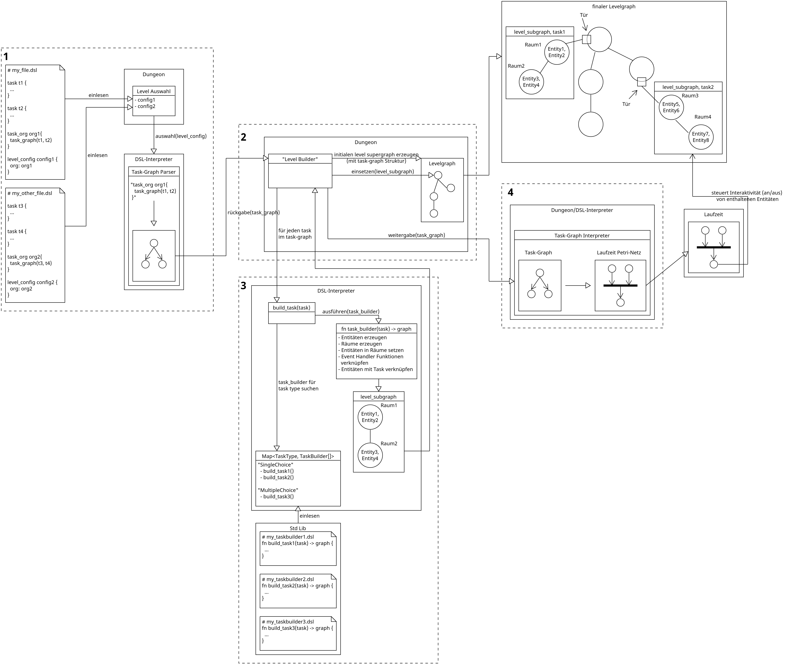

## Erzeugung eines konkreten Dungeon-Levels aus einer DSL-Definition

Das folgende Diagram zeigt den Ablauf der Erstellung eines konkreten Dungeon-Levels aus
einer DSL-Definition und die Schnittstellen zwischen Dungeon und DSL-Interpreter die dabei
beteiligt sind.

### Kasten 1 - Einlesen und Auswahl einer `level_config`

Die verfügbaren DSL-Dateien (in einem definierten Ordner) werden vom Dungeon gesammelt. In
den DSL-Dateien werden die `level_config`-Definitionen gesucht. Für jede
`level_config`-Definition kann ein Level im Dungeon erzeugt werden. Eine
`level_config`-Definition kann eine `task_org` Struktur referenzieren, welche mehrere
`task`-Definition miteinander in Verbindung setzt, hierfür wird ein Ansatz basierend auf
[Petri-Netzen](../control_mechanisms/petri_nets.md) genutzt, wobei die Nutzereingabe als
dot-graph erfolgt (“Task-Graph”). Falls nur eine Aufgabe im Level realisiert werden soll,
kann auch der Zwischenschritt der Task-Organisation übersprungen werden, sodass die
`task`-Definition direkt in der `level_config` referenziert werden kann.

Alle verfügbaren `level_config`s werden im Dungeon dargestellt und eine kann von
Studierenden ausgewählt werden (GUI, etc.). Zu dem Zeitpunkt wurde der Rest der DSL-Datei
noch nicht vom DSL-Interpreter eingelesen. Daher übergibt der Dungeon die ausgewählte
`level_config` (effektiv wahrscheinlich als Pfad der Datei, in der sie definiert ist) an den
DSL-Interpreter.

Der DSL-Interpreter parst die textuelle `task`- und `task_org`-Definition und erzeugt einen
Task-Graph, der wieder an den Dungeon übergeben wird.

### Kasten 2 - Erzeugung des Levels

Aus dem übergebenen Task-Graph muss ein konkretes Level erstellt werden. Für jede
(Unter-)Aufgabe, die im Task-Graph referenziert wird, müssen entsprechende Entitäten erzeugt
und im Level verteilt werden.

Folgende Idee dafür als Grundlage: Der Dungeon baut für das gesamte Level einen
Levelgraphen. Die Knoten der Levelgraphen sind Räume, die Kanten geben die Verbindung der
Räume an. Aktuell hat ein Levelgraph die Restriktion, dass jeder Knoten nur vier
Nachbarknoten haben kann. Initial erzeugt der Dungeon einen “Superlevelgraph”, der als
Skelett für das Level genutzt wird. Für jede (Unter-)Aufgabe wird ein Subgraph erstellt,
welcher in den Supergraph integriert wird. Das passiert so, dass ein Subgraph durch eine Tür
an einen Knoten des Supergraphen angeschlossen wird. Die Erzeugung der Supergraphen muss
daher in Abhängigkeit des Petri-Netzes geschehen, sodass auch genug Anschlussmöglichkeiten
für die Subgraphen der Unteraufgaben zur Verfügung stehen.

Auch ***die Struktur*** des Taskgraphs ***kann*** Einfluss auf die Struktur des Supergraphen
haben, sodass sich Abhängigkeiten der Aufgaben auch in der Struktur des Supergraphen
wiederspiegeln, dies ist allerdings aktuell **noch nicht geplant.**

### Kasten 3 - Übersetzung einer Task-Definition ins Level

Für jede `task`-Definition einer Aufgabe, die im Task-Graph referenziert ist, wird vom
DSL-Interpreter ein Subgraph erstellt, der die nötigen Räume für die Aufgabe enthält. In den
Räumen sind die nötigen Entitäten zur Realisierung der Aufgabe im Dungeon enthalten.

Um unterschiedliche Szenarien für den gleichen Aufgabentyp zu realisieren, können per DSL
`task_builder`-Methoden definiert werden (**TODO** [Issue #197 - Einlesen und Verwenden von
Task-Builder-Methoden](https://github.com/Dungeon-CampusMinden/Dungeon/issues/197)). Diese
können auch durch DSL-Nutzende definiert werden. Vereinfachend wird hier angenommen, das
`task_builder`-Methoden nur aus fest definierten Verzeichnissen aus DSL-Dateien eingelesen
werden. Die `task_builder`-Methoden werden in einer map gespeichert, sodass sie nach den
Aufgabentypen organisiert sind, für die sie eingesetzt werden können.

Für eine übergebene `task`-Definition sucht sich der DSL-Interpreter eine
`task_builder`-Methode aus dieser Map heraus. Optional kann auch pro `task`-Definition eine
konkrete Methode angegeben werden.

Die ausgewählte `task_builder`-Methode wird vom DSL-Interpreter ausgeführt. Die generelle
Operation einer `task_builder`-Methode sollte folgende Schritte abdecken:

- nötige Entitäten erzeugen
- Entitäten mit den Elementen der `task`-Definition verknüpfen
- nötige Räume erzeugen
- Entitäten in Räume platzieren
- Event-Handler Funktionen mit Entitäten verknüpfen

Hier ist zwar die Rede von “Räumen”, ob es sich dabei allerdings direkt um physische Räume
in Dungeon-Level handelt, ist noch nicht klar. Wahrscheinlich wird das erstmal nur eine
abstrakte Definition sein, die losgelöst von tatsächlichen Level-Tiles im Level ist (**TODO**:
[Issue #196 - Aufgabe in mehreren Räumen
verteilen](https://github.com/Dungeon-CampusMinden/Dungeon/issues/196)).

Der für die `task`-Definition erzeugte Subgraph mit erzeugten Entitäten wird an den Dungeon
zurückgegeben und dann wie oben beschrieben in den Supergraphen eingebaut.

***TODO: Wie, was, wann instanziiert wird und zu konkreten Entitäten und Level-Tiles wird,
ist aktuell noch nicht klar definiert.***

### Kasten 4 - Übersetzung des Task-Graph in ein Laufzeit Petri-Netz

Das “Laufzeit” Petri-Netz soll genutzt werden, um den Zustand der Aufgaben zu modellieren
und zu steuern. Dafür muss aus dem Task-Graph ein Petri-Netz erstellt werden. Die Struktur
des erzeugten [Petri-Netzes](../control_mechanisms/petri_nets.md) ist von den Relationen der
Aufgaben untereinander abhängig. Die Markierung der Stellen im Petri-Netz soll bspw. dafür
genutzt werden, die Interaktion mit den Entitäten, welche für die Realisierung einer
bestimmten Aufgabe nötig sind, zu blockieren. So könnte abgebildet werden, dass eine Aufgabe
“aktiv” ist, also bearbeitet werden kann.
