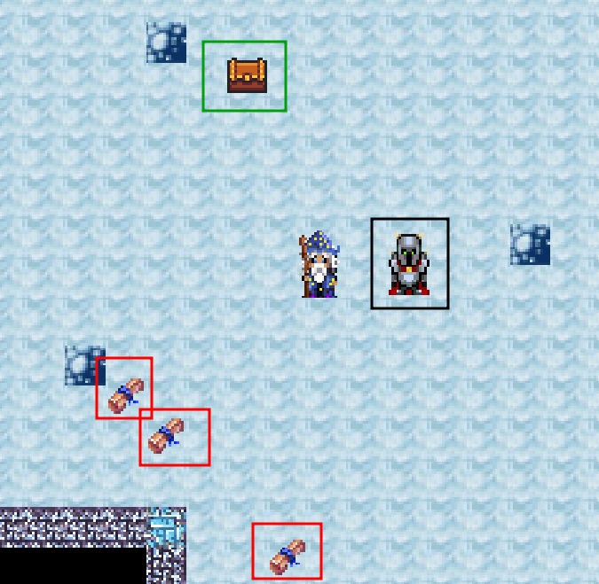
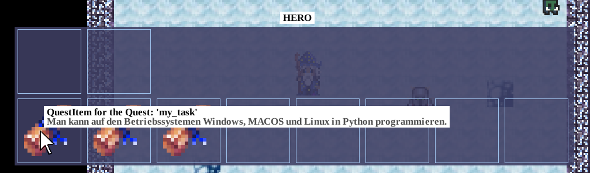
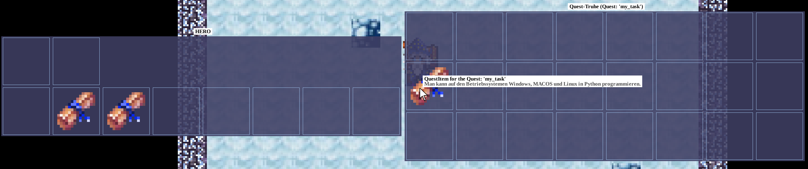
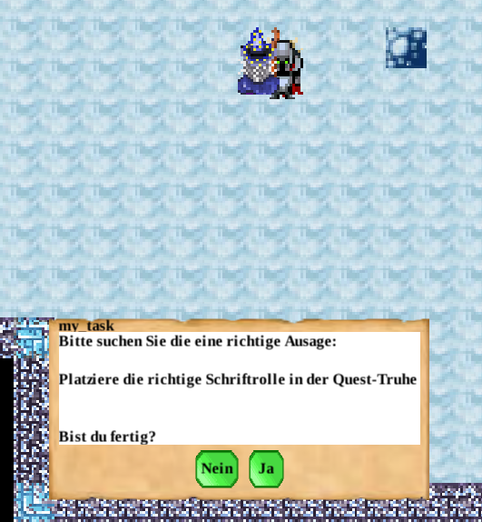
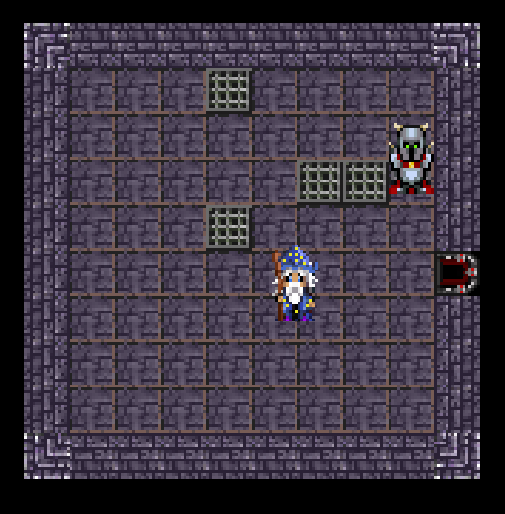
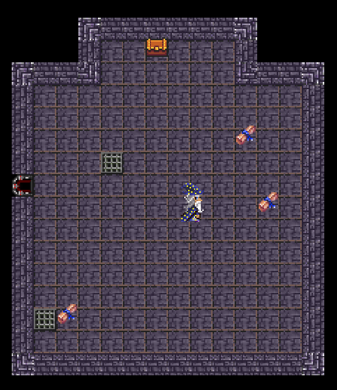
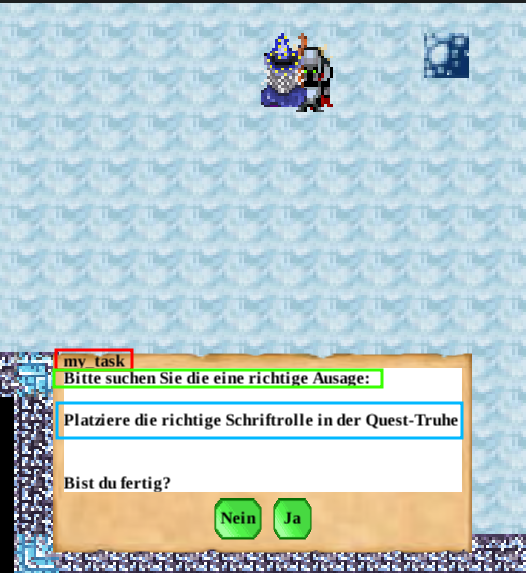

## Was ist das Ziel von Szenario-Buildern?

Szenario-Builder-Funktionen sind dafür zuständig, eine abstrakte [Aufgabendefinition](task_definition.md)
in ein konkretes Spielszenario zu übersetzen. Konkret bedeutet dies, die Spielelemente zu erzeugen, welche
die Aufgabe im Spiel abbilden. Zu diesen Elementen zählen bspw. die Spielfigur, welche die Frage stellt,
und Spielelemente, welche Lösungsmöglichkeiten für eine Aufgabe darstellen.

Für jeden Aufgabentyp ist bereits eine default Szenario-Builder-Funktion definiert, sodass
diese **Funktionen nicht zwingend durch Nutzende definiert werden müssen**.

Für genauere Informationen zu den syntaktischen und semantischen Konzepten, die Funktionsdefinitionen
betreffen, siehe die [Dokumentation zu den Sprachkonzepten der DungeonDSL](sprachkonzepte.md).

### Beispiel

Gegeben sei als Beispiel folgende Aufgabendefinition:

```
single_choice_task my_task {
  description: "Bitte suchen Sie die eine richtige Ausage:",
  answers: [
  "Man kann auf den Betriebssystemen Windows, MACOS und Linux in Python programmieren.",
  "Man kann auf externen Datenträgern schnell sortieren.",
  "Schlüsselfelder eignen sich nicht zum Indizieren von Daten."
  ],
  correct_answer_index: 0
}
```

**Eine** mögliche Abbildung dieser Aufgabe in ein Spielszenario wäre die folgende:

- Die Aufgabe wird von einem "Ritter" gestellt
- Die Antwortmöglichkeiten aus `answers` werden als "Schriftrollen" abgebildet, die von
  Spielenden eingesammelt werden müssen
- Die Schriftrolle, welche der korrekten Antwort entspricht, muss in eine "Truhe" gelegt werden

Dies könnte im Spiel wie folgt aussehen:



Die Schriftrollen sind rot umrandet, die Truhe ist grün umrandet und der Ritter ist schwarz umrandet.

Die Schriftrollen können aufgesammelt werden und im Inventar des Spielcharakters inspiziert werden.
Beim Hovern der Maus über eine Schriftrolle wird angezeigt, welche Antwort die Schriftrolle abbildet:



Anschließend können die Schriftrollen in die Truhe gelegt werden:



Abschließend können Spielende mit dem Ritter agieren, um die Aufgabe abzugeben:




## Einbettung in das Gesamtsystem

Das Dungeon-System führt zur Übersetzung einer `.dng`-Datei in ein spielbares Level folgende Schritte durch:
1. Suchen nach `dungeon_config`-Definitionen in der übergebenen `.dng`-Datei
2. Laden der Aufgabenabhängigkeiten aus dem `dependency_graph` der `dungeon_config`-Definitionen
3. Für jede im `dependency_graph` referenzierte Aufgabendefinition wird eine **Szenario-Builder-Funktion**
   ausgeführt, die Räume erstellt und Spielelemente darin platziert
4. Die erstellten Räume werden basierend auf den Abhängigkeiten im `dependency_graph` miteinander verbunden,
   sodass ein zusammenhängendes Level entsteht

## Definition von Szenario-Builder-Funktionen

Als Szenario-Builder-Funktion werden alle Funktionen behandelt, denen als Parameter eine Aufgabendefinition
übergeben werden kann. Aktuell stehen hierfür die Datentypen `single_choice_task`, `multiple_choice_task` und
`assign_task` zur Verfügung (vergleiche hierzu die [Dokumentation zu Aufgabendefinitionen](task_definition.md)).
Der Rückgabetyp für Szenario-Builder-Funktionen muss eine Menge aus Entitätsmengen sein, also `entity<><>`.

Ein Beispiel für die Definition einer Szenario-Builder-Funktion könnte wie folgt aussehen:

```
fn build_scenario(single_choice_task task) -> entity<><> {
    // Code...
}
```

### Rückgabewert

Der Rückgabewert einer Szenario-Builder-Funktion ist eine Menge aus Entitätsmengen.
Jede *Entitätsmenge*, die in der *Gesamtmenge* enthalten ist, wird als ein Raum vom Dungeon-System interpretiert.
Die Entitäten die in den jeweiligen *Entitätsmengen* enthalten sind, werden in den entsprechenden Räumen im Spiellevel
platziert.
Alle Räume, die von einer Szenario-Builder-Funktion für **die gleiche Aufgabendefinition** zurückgegeben
werden, werden anschließend vom Dungeon-System miteinander verbunden.

Hierzu ein Beispiel:

```
fn build_scenario(single_choice_task task) -> entity<><> {
    // Deklaration der leeren Gesamtmenge
    var return_set : entity<><>;

    // Deklaration der leeren Entitätsmengen
    var room_1 : entity<>;
    var room_2 : entity<>;

    /*
     * Entitäten in Entätsmengen hinzufügen (Code abstrahiert)
     *
     * - einen Ritter zu room_1 hinzufügen
     * - eine Truhe zu room_2 hinzufügen
     * - Schriftrollen zu room_2 hinzufügen
     */

    // Hinzufügen der Entitätsmengen zur Gesamtmenge
    return_set.add(room_1);
    return_set.add(room_2);

    // Rückgabe der Gesamtmenge als Rückgabewert der Funktion
    return return_set;
}
```

Die Menge `return_set` ist die *Gesamtmenge*, die Mengen `room_1` und `room_2` sind die *Entitätsmengen*.
Der Kommentarblock in der Mitte symbolisiert das Füllen der *Entitätsmengen* mit Entitäten (eine genaue Erklärung
dazu folgt in [Entitäten erstellen](#entitäten-erstellen)).

Aus jeder der *Entitätsmengen* wird im Anschluss an die Ausführung der Szenario-Builder-Funktion ein Raum erstellt und
die enthaltenen Entitäten werden platziert. Die folgenden Bilder zeigen die so erstellten Räume:



Oben ist der Raum abgebildet, der für `room_1` erstellt wird und nur den Ritter enthält.



Im Raum, der für `room_2` erstellt wird, sind eine Truhe und Schriftrollen enthalten.

## Entitäten erstellen

Wie zuvor angedeutet, können innerhalb von Szenario-Builder-Funktionen Entitäten erstellt werden.
Vereinfacht ausgedrü: jedes sichtbare Spielelement, mit dem Spielende in irgendeiner Weise interagieren können,
ist eine Entität. Für technische Details sei hier auf die Dokumentation
zum [Entity-Component-System](../../../game/doc/ecs_basics.md) verwiesen.

Entitäten enthalten Komponenten, welche das Verhalten und das Aussehen einer Entität im Spiel beeinflussen.
Komponenten verfügen über Eigenschaften, welche über die DungeonDSL konfiguriert werden können.
Alle Komponenten, die in der DSL verfügbar sind, sind in der [Komponenten Dokumentation](datatypes.md)
aufgelistet.
In einer `.dng`-Datei können Komponenten mit konfigurierten Eigenschaften als ein Entitätstyp definiert werden.
Aus diesen Entitätstypen kann mit der nativen `instantiate`-Funktion eine Entität erstellt werden. Diese Entität
kann anschließend in einem Raum platziert werden (wie bereits oben unter [Rückgabewert](#rückgabewert) beschrieben).

Das folgende Snippet zeigt die Definition eines Entitätstyps, aus dem eine "Ritter"-Entität erzeugt werden kann.
```
// Definition eines Entitätstyp
entity_type ritter_typ {
    draw_component {
        path: "character/blue_knight"
    },
    position_component {},
    interaction_component{
        radius: 1.5
    }
}
```

Die `draw_component`-Komponente bestimmt die grafische Darstellung der Entität im Spiel. Durch die Konfiguration
der `path`-Eigenschaft wird ein Verzeichnis angegeben, welches Animationstexturen enthält.
Für weiter Informationen bzgl. des Animations-Systems und der benötigten
Ordnerstrukturen siehe [Animationsdokumentation](../../../game/doc/animation.md#ordnerstruktur-und-pfade).

Die `position_component`-Komponente ermöglicht der Entität, eine Position im Level zu haben und ist zwingend nötig,
damit das Dungeon-System die Entität auch tatsächlich im Level platzieren kann.

Die `interaction_component`-Komponente ermöglicht dem Spielcharakter, mit dem Ritter zu interagieren,
indem in dessen Nähe die Taste "E" gedrückt wird. Die `radius`-Eigenschaft bestimmt, in welchem Radius um
den Ritter dies möglich ist.

Es ist wichtig zu erwähnen, dass durch die Erstellung eines `entity_type` noch keine Entität selbst im
Spiel erzeugt wird. Ein `entity_type` stellt eine *Vorlage* dar, *aus der* anschließend eine Entität
erzeugt werden kann. Der Vorgang, aus so einer Vorlage eine tatsächliche Entität zu erstellen, wird
*Instanziierung* genannt, die erstellte Entität ist die *Instanz* eines *Entitätstyps*.
Die im `entity_type` konfigurierten Eigenschaften werden dabei an die neue Instanz übertragen.

Die Instanziierung eines Entitätstyps wird über die native `instantiate`-Funktion realisiert, wie
im folgenden Beispiel:

```
fn build_scenario(single_choice_task task) -> entity<><> {
    var return_set : entity<><>;
    var room_1 : entity<>;

    /*
     * Instanziierung der Ritter-Entität
     */
    var knight : entity;
    knight = instantiate(ritter_typ)
    room_1.add(knight);

    return_set.add(room_1);
    return return_set;
}
```

## Items erstellen

Items sind Spielelemente, die vom Spielcharakter aufgenommen und im Inventar transportiert werden können.
In der DungeonDSL können `quest_item`s erstellt werden, die mit einer Aufgabe in Verbindung stehen (siehe
[Verknüpfung Spielelemente mit der Aufgabedefinition](#verknüpfung-der-spielelement-mit-der-aufgabendefinition)).

Analog zu Entitätstyp-Definitionen (siehe [Entitäten erstellen](#entitäten-erstellen)) können auch Itemtyp-Definitionen
in der DungeonDSL erstellt werden:

```
item_type scroll_type {
    texture_path: "items/book/wisdom_scroll.png"
}
```

Die wesentliche Eigenschaft eines `item_type` ist der `texture_path`, dem der relative Pfad zu einer Textur zugewiesen werden
muss, welche genutzt wird, um das Item darzustellen.

Aus einem `item_type` wird wie folgt ein Item erstellt (die Bedeutung von `content` wird in
[Antwortmöglichkeit als Item](#abbildung-antwortmöglichkeit-als-item) erklärt):

```
fn build_scenario(single_choice_task task) -> entity<><> {
    var return_set : entity<><>;
    var room_1 : entity<>;

    /*
     * Instanziierung einer Schriftrolle
     */
    var scroll : quest_item;
    scroll = build_quest_item(scroll_type, content);
    place_quest_item(scroll, room_1);

    return_set.add(room_1);
    return return_set;
}
```

Ein Item ist keine Entität. Die Platzierung von `quest_item`s in einem Raum setzt daher die Verwendung der nativen
`place_quest_item`-Funktion voraus, mit der ein `quest_item` in eine Entitätsmenge integriert wird. Intern erstellt
diese Funktion eine neue Entität, die das `quest_item` kapselt. Diese neue Entität wird anschließend wie jede andere
Entität im Raum platziert. Die Entität liegt dann dort "auf dem Boden". Ein Beispiel dafür in folgender Abbildung,
in der drei auf diese Art platzierte Schriftrollen zu sehen sind:


## Items in einem Inventar platzieren

Falls das `quest_item` nicht wie oben beschrieben in einem Raum platziert werden soll, kann es auch einem
`inventory_component` hinzugefügt werden.

Gegeben sei folgender `entity_type`, der eine Truhe beschreibt:

```
entity_type chest_type {
    inventory_component {},
    draw_component {
        path: "objects/treasurechest"
    },
    position_component{},
    interaction_component{
        radius: 1.5,
        on_interaction: open_container
    }
}
```

Die wesentliche Komponente ist `inventory_component`. Dem `inventory_component` einer Entität können wie folgt
`quest_item`s hinzugefügt werden:

```
    // Erstellen von quest_item
    var scroll : quest_item;
    scroll = build_quest_item(mushroom_type, content);

    // Instanziieren der Truhe
    var chest : entity:
    chest = instantiate(chest);

    // Hinzufügen des quest_items zum inventory_component der Truhe
    chest.inventory_component.add(scroll);
```


## Verknüpfung der Spielelemente mit Aufgabendefinitionen

Ziel der Szenario-Builder-Methoden ist es, abstrakte Aufgabendefinitionen in ein konkretes Spielszenario abzubilden.
Dafür müssen aus der Aufgabedefinition Spielelemente erstellt werden, wie in den oberen Kapiteln gezeigt.
In den bisherigen Erklärungen wurde noch keine Verbindung zwischen den Spielelementen und der Aufgabendefinition hergestellt.
Diese Verbindung ist wichtig für die Bearbeitung einer Aufgabe im Dungeon-Kontext, da Spielende z. B. verstehen müssen,
welches Spielelemente welche Antwortmöglichkeit einer Single-Choice-Frage darstellt.
Diese Verknüpfung ist auch für die Bewertung einer Aufgabe wichtig, da aus dem Spielzustand Rückschlüsse über gegebene
Antworten etc. gezogen werden müssen.

Das gesamte, im Folgenden erarbeitete Beispiel ist unter [example_scenario.dng](examplescripts/example_scenario.dng) zu
finden.

### Szenario-spezifische Aufgabenbeschreibung

Für eine Aufgabendefinition kann eine Szenario-spezifische Aufgabenbeschreibung gesetzt werden.
Diese soll Spielenden dabei helfen, zu verstehen, welche konkreten Aktionen sie im Spiellevel mit welchen
Entitäten/Items durchführen müssen, um die Aufgabe zu bearbeiten.
Da diese Beschreibung für jedes Szenario unterschiedlich ist, empfiehlt es sich, diese Beschreibung in der
Szenario-Builder-Funktion zu setzen:

```
fn build_task(single_choice_task t) -> entity<><> {
    // ...

    t.set_scenario_text("Platziere die richtige Schriftrolle in der Quest-Truhe");

    // ...
}
```

### Manager-Entität

Jeder Aufgabe muss eine Manager-Entität haben, welche das zentrale Interaktionselement für die Bearbeitung einer Aufgabe
darstellt. Über diese Manager-Entität kann der Aufgabentext angezeigt werden und eine Antwort auf eine Aufgabe abgegeben
werden. In folgender Abbildung ist zu sehen, wie die Interaktion mit einer Manager-Entität, die als Ritter dargestellt ist,
aussieht:



Im abgebildeten Beispiel wird die Aufgabe (aus dem [Beispiel](#beispiel)) gestellt. Der
Aufgabenname ist rot umrandet, der Aufgabentext (der Wert der
[`description`-Eigenschaft](task_definition.md#beschreibung-der-eigenschaften)) und ein Szenario-spezifischer
Text (blau umrandet).

```
fn build_task(single_choice_task t) -> entity<><> {
    // Erstellung der Aufgaben-Manager-Entität
    var knight : entity;
    knight = instantiate_named(knight_type, "Aufgabengeber");

    // Verknüpfung der Aufgabe mit der Manager-Entität
    knight.task_component.task = t;

    room_set.add(knight);
}
```
Der Entitätstyp, aus dem eine Manager-Entität erstellt wird, benötigt ein `task_component`, dessen
`task`-Eigenschaft auf die zu verwaltende Aufgabe gesetzt werden muss.

### Antwort-Auswahl-Funktion

Die Antwort-Auswahl-Funktion ("Answerpicker-Function") ist dafür zuständig, die gegebene
Antwort auf eine Aufgabe aus dem Spielszenario zu ziehen. Zum aktuellen Stand können drei
**native Funktionen** als Antwort-Auswahl-Funktionen verwendet werden. Wie auch die
[Szenario-spezifische Beschreibung](#szenario-spezifische-aufgabenbeschreibung) sollte diese
Funktion in der Szenario-Builder-Funktion gesetzt werden:

```
fn build_task(single_choice_task t) -> entity<><> {
    // ...
    t.set_answer_picker_function(answer_picker_single_chest);
    // ...
}
```

Für eine genaue Auflistung der verschiedenen Antwort-Auswahl-Funktionen und ihren Funktionsweisen
siehe [Dokumentation: native Funktionen](TODO).

### Event-Handler-Funktionen

Einige Komponenten (z.B. `interaction_component`) erlauben die Reaktion auf ein Ereignis aus dem Dungeon-Kontext.
An die Eigenschaft `on_interaction` dieser Komponente kann eine Funktion übergeben werden, die aufgerufen wird,
sobald der Spielcharakter mit der Entität, in welcher die Komponente enthalten ist, interagiert.

Ein Beispiel:

```
entity_type knight_type {
    interaction_component{
        on_interacton: interact
    },
    draw_component {
        path: "character/blue_knight"
    },
    position_component{}
}

fn interact(entity knight, entity who) {
    print("Es wurde mit dem Ritter interagiert");
}
```

Im obigen Snippet wird die Funktion `interact` als Event-Handler-Funktion auf das `on_interact`-Event registiert.
Für die genauen Signatur-Informationen für solche Event-Handler-Funktionen und Informationen, welche Komponenten
dies zulassen sei hier auf die [Dokumentation für Datentypen](datatypes.md) verwiesen.


## Beispiel-Abbildung: Antwortmöglichkeit als Schriftrollenitem

Um eine Antwortmöglichkeit (bspw. einer Single-Choice-Aufgabe) als Item im Dungeon abzubilden, muss die
entsprechende Antwortmöglichkeit (als `task_content`) bei dem Aufruf von `build_quest_item` übergeben werden.
Wie auf die Antwortmöglichkeiten einer Aufgabe zugegriffen werden kann, unterscheidet sich je nach Aufgabentyp,
siehe dazu die [Dokumentation zu Datentypen](datatypes.md).
Im folgenden Snippet ist ein Beispiel für eine Multiple-Choice-Aufgabe dargestellt:

```
fn build_task(multiple_choice_task t) -> entity<><> {
    // ...
    var room_set : entity<>;

    // Items aus Antwortmöglichkeiten erstellen
    for task_content content in t.get_content() {
        var scroll : quest_item;
        scroll = build_quest_item(scroll_type, content);
        place_quest_item(scroll, room_set);
    }

    // ...
}
```

Dieses Snippet verteilt alle Antwortmöglichkeiten als "Schriftrolle" auf dem Boden des Spiellevels.
Eine Möglichkeit, die Antwort vom Spielenden "einzusammeln" wäre, eine Truhen-Entität zu instanziieren,
in deren Inventar die Spielenden die Schriftrollen, welche die richtigen Antwortmöglichkeiten repräsentieren,
ablegen muss.

Hierzu muss eine Truhe instanziiert werden. Da die Truhe als "Aufgabentruhe" verwendet werden soll, benötigt
der entsprechende Entitätstyp ein `task_content_component`:

```
entity_type chest_type {
    inventory_component {},
    draw_component {
        path: "objects/treasurechest"
    },
    position_component{},
    interaction_component{
        radius: 1.5,
        on_interaction: open_container
    },
    task_content_component{}
}
```

Die Instanziierung der Truhe als Entität sieht wie folgt aus (die native Funktion `mark_as_task_container`
markiert die Truhe als "Container" für die Aufgabe):

```
fn build_task(multiple_choice_task t) -> entity<><> {
    // ...
    var chest : entity;
    chest = instantiate(chest_type);
    chest.mark_as_task_container(t, "Quest-Truhe");

    t.set_answer_picker_function(answer_picker_single_chest);
    // ...
}
```

Als Antwort-Auswahl-Funktion muss `answer_picker_single_chest` festgelegt werden, da nur eine Truhe
an der Aufgabe beteiligt ist.

Die letzten Bausteine, die noch für ein funktionierendes Szenario fehlt, sind Event-Handler-Funktionen.

Die `open_container`-Funktion, die weiter oben in der Definition der `chest_type` referenziert wird, öffnet
die grafische Bedienoberfläche, über die Items zwische dem Spielerinventar und dem Truheninventar
getauscht werden können:

```
fn open_container(entity chest, entity who) {
    chest.inventory_component.open(who);
}
```

Die `ask_task_finished`-Funktion realisiert den Frage-Dialog, über den die Aufgabe gestellt wird.
Falls die Aufgabe schon bearbeitet wurde, wird ein entsprechender Info-Dialog angezeigt:

```
fn ask_task_finished(entity manager_entity, entity who) {
    var my_task : task;
    my_task =  knight.task_component.task;

    // Überprüfung, ob die Aufgabe noch aktiv ist oder schon bearbeitet wurde
    if my_task.is_active() {
        ask_task_yes_no(my_task);
    } else {
        show_info("Du hast die Aufgabe schon bearbeitet.");
    }
}
```

