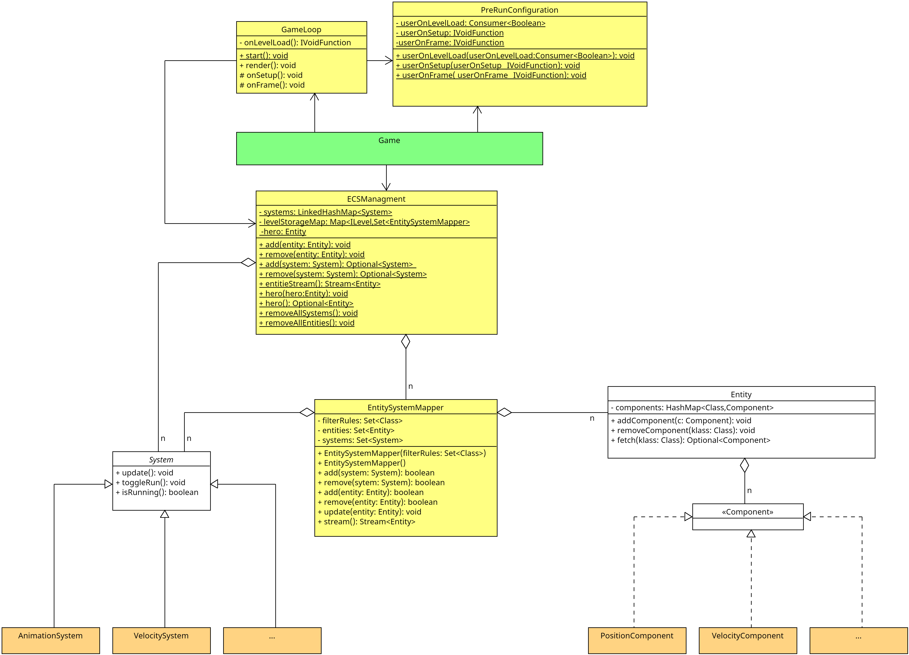

Im Projekt wird das [ECS-Paradigma](https://en.wikipedia.org/wiki/Entity_component_system) angewendet.

## Was ist ein ECS (Kurzform)

**Entität**
Entitäten sind die Objekte im Spiel. Im Code sind sie nur leere Container, dessen Eigenschaften über die zugewiesenen Components bestimmt werden. Entitäten haben neben den Components keine eigenen Attribute oder Funktionen.

**Component**
Components sind die Datensätze der Entitäten und beschreiben dadurch die Eigenschaften der Entitäten.

Components speichern im Regelfall nur die Daten/den Zustand einer Entität. In Ausnahmefällen kann es erforderlich sein, zusätzliche Logik in Components zu implementieren. Der Umfang sollte in diesen Fällen möglichst klein gehalten werden, da die Logik normalerweise in den Systemen realisiert wird. Wir verwenden hierfür Funktionale-Interfaces wie `Consumer` oder `Function`.

**System**
Systeme agieren auf den Components und ändern die Werte in diesen. Sie beschreiben also das Verhalten der Entitäten. Ein System kann auf ein oder mehreren Components agieren. In Systemen wird die eigentliche Logik implementiert.

Der Zustand einer Entität wird also über ihre Components bestimmt, und ihr Verhalten über die Systeme, die mit der jeweiligen Component-Kombination arbeiten.

## Basisstruktur



*Anmerkung:* Das UML ist für bessere Lesbarkeit auf die wesentlichen Bestandteile gekürzt und stellenweise vereinfacht. Beachten Sie die JavaDoc.

Die in Grün gekennzeichnete Klasse `Game` ist die operative Hauptklasse, von der alles ausgeht.

*Anmerkung*: In der Realität ist die Klasse `Game` nur ein Sammelpunkt und implementiert selbst kaum Logik. Die Klasse dient als zentraler Steuerungspunkt für das Framework, leitet die Anfragen aber nur an die jeweiligen zuständigen Klassen (die Klassen in Gelb) weiter. Für eine bessere Verständlichkeit sprechen wir dennoch von der Klasse `Game` als operative Klasse. `Game` implementiert **alle** public Methoden der gelben Hilfsklassen.

Mit der Methode `Game#run` wird das Spiel gestartet.

Die Methode `GameLoop#render` ist die Game-Loop. Das ECS wird durch die in Weiß gekennzeichneten Klassen `Entity`, `Component` und `System` implementiert.

Neu erzeugte Entitäten werden im Game registriert und im [`EntitySystemMapper`](./entity_system_mapper.md) hinterlegt.

Die Systeme registrieren sich in `Game` und geben dabei an, auf welche Entitäten sie agieren wollen, heißt: Welche Components eine Entität implementieren muss, um vom System bearbeitet zu werden. Die Systeme iterieren über die in `Game` gespeicherten Entitäten und greifen über die Methode `Entity#fetch` auf die für die jeweilige Funktionalität benötigten Components zu. Die orangefarbenen `System`s und `Components` sind in dem UML-Diagramm Beispiele für die bereits bestehenden `System`s und `Components`. Systemlogiken werden einmal pro Frame ausgeführt.

## Prerun Konfiguration

Einige Aspekte des Spiels lassen sich vor dem Start konfigurieren. Dafür können in der eigenen Main-Methode verschiedene Konfigurationsmethoden verwendet werden.

```java
public static void main(String[] args) {
    Game.frameRate(60);
    Game.disableAudio(true);
    Game.fullScreen(true);
}
```

Die weiteren Konfigurationsoperationen können der Javadoc entnommen werden.

## Usercontent in der GameLoop integrieren

Damit auch eigene Logik in die GameLoop (abseits der Systeme) eingebunden werden kann, gibt es drei verschiedene Anschlusspunkte.

1. `onUserSetup`
Mit `Game#onUserSetup` kann eine Methode hinterlegt werden, welche einmalig ausgeführt wird. Diese Methode wird nach dem internen Setup ausgeführt aber bevor dem Start des eigentlichen Spiels. Hier lassen sich vor allem neue Systeme im Spiel registrieren.

2. `Game#onUserFrame`
Mit `Game#onUserFrame` kann eine Methode hinterlegt werden, welche jeden Frame nach der Ausführung der Systeme aufgerufen wird.

3. `Game#onUserLevelLoad`
Mit `Game#onUserLevelLoad` kann eine Methode hinterlegt werden, welche dann ausgeführt wird, wenn ein neues Level geladen wurde. Die Methode wird mit einem Boolean aufgerufen, welcher angibt, ob das Level schon einmal geladen wurde oder nicht. Diese Methode kann gut genutzt werden, um neue Entitäten im Level zu erzeugen.
