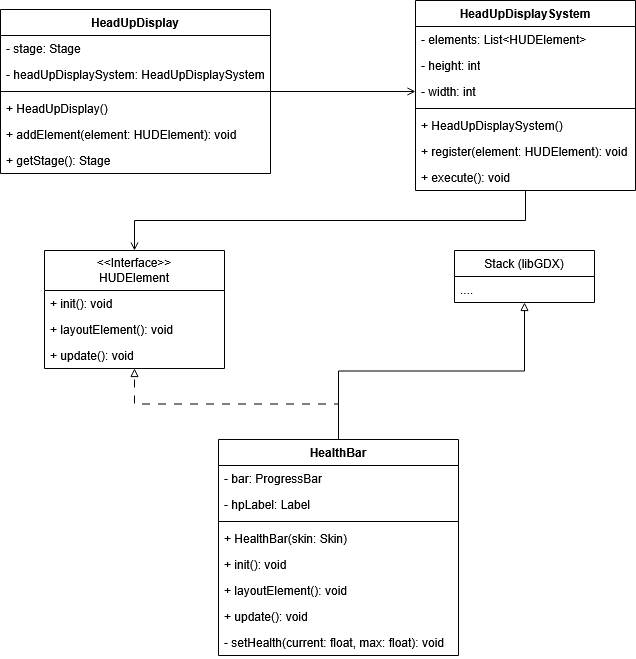

In diesem Dokument wird erläutert, wie das neue HUD-System aufgebaut ist.

## Kernkomponenten

- `HeadUpDisplay` nimmt alle HUD-Elemente entgegen und fügt sie der Stage hinzu und registriert sie im `HeadUpDisplaySystem`.

- `HeadUpDisplaySystem` ist verantwortlich für Initialisierungs, Updates und Layout Aufrufe aller `HUDELemente`.

- Das `HUDElement`-Interface definiert den Vertrag für alle HUD-Elemente mit den folgenden Methoden:
    - `init()` - Initialisierungslogik des HUD-Elements
    - `layoutElement()` - Layoutlogik des HUD-Elements, z.B. Position auf dem Bildschirm
    - `update()` - Updatelogik des HUD-Elements pro Frame


- Folgende HUD-Elemente stehen aktuell zur verfügung:
  - `AbilityBar`
  - `EnemyCounter`
  - `HealthBar`
  - `ManaBar`
  - `StaminaBar`
  - `QuickAccessInventory`
  - `HeroIcon`
  - `NavigationBar`
  - `SystemChatLog`
  - `StatusEffectBar`

## UML-Diagramm


Die HealthBar dient als Beispiel in diesem Diagramm. Jedes andere HUD-Element stünde an gleicher Stelle.
Jedes HUD-Element erweitert für gewöhnlich ein libGDX-UI-Element (z.B. `Stack` oder `Table`) und implementiert das
Interace `HUDElement`.

## Hinweise
- jedes HUD-Element ist eigenständig und muss dem `HeadUpDisplay` hinzugefügt werden, damit es im `HeadUpDisplaySystem` registriert wird.
- die Updatelogik ist elementspezifisch und wird pro Frame ausgeführt.
- die Layoutlogik bestimmt die Position auf dem Bildschirm und wird bei Änderung der Fenstergröße neu aufgerufen.

## HUD dem Spiel hinzufügen
Idealerweise kann einem Starter eine neue Methode `createHUD()` hinzugefügt werden, die folgendermaßen aussehen könnte:

````java
private static void creatHUD() {

    Skin skin = new Skin(Gdx.files.absolute("dungeon/assets/skin/uiskin.json"));
    HeadUpDisplay hud = new HeadUpDisplay();

    HealthBar healthBar = new HealthBar(skin);
    hud.addElement(healthBar);

    ManaBar manaBar = new ManaBar(skin);
    hud.addElement(manaBar);

    StaminaBar staminaBar = new StaminaBar(skin);
    hud.addElement(staminaBar);

    AbilityBar abilityBar = new AbilityBar(skin);
    hud.addElement(abilityBar);

    HeroIcon heroIcon = new HeroIcon(skin);
    hud.addElement(heroIcon);

    QuickAccessInventory quickAccessInventory = new QuickAccessInventory(skin);
    hud.addElement(quickAccessInventory);

    EnemyCounter enemyCounter = new EnemyCounter(skin);
    hud.addElement(enemyCounter);

    NavigationBar navigationBar = new NavigationBar(skin);
    hud.addElement(navigationBar);

    StatusEffectBar statusEffectBar = new StatusEffectBar(skin);
    hud.addElement(statusEffectBar);

    SystemChatLog systemChatLog = new SystemChatLog(skin);
    hud.addElement(systemChatLog);

    Game.stage().ifPresent(stage -> stage.addActor(hud.getStage().getRoot()));
  }
````
Die gewünschten HUD-Elemente können je nach Bedarf frei gewählt werden.

## Sonstiges
Für alle Fähigkeiten/Skills (`AbilityBar`), Status Effekte (`StatusEffectBar`), Character Klassen (`HeroIcon`) oder
Unterpunkten der `NavigationBar` sind eigene Icons/Texturen erforderlich, die in den zugehörigen HUD-Element-Klassen
hinterlegt und zugeordnet werden müssen. Aktuell sind bereits einige Beispiele hinterlegt.
Es sollte auf eine einheitliche Designsprache geachtet werden, weshalb vorhandene Icons zur Orientierung berücksichtigt
werden sollten.

Weitere Informationen zu den HUD-Elementen sind in der jeweiligen JavaDoc zu finden.
